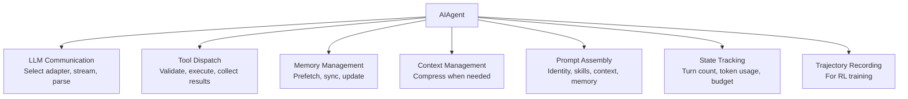
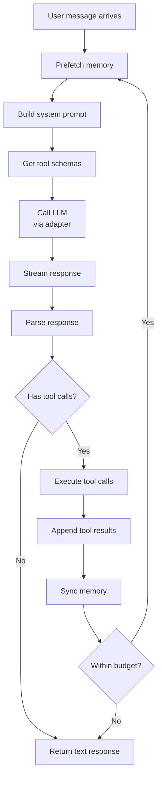
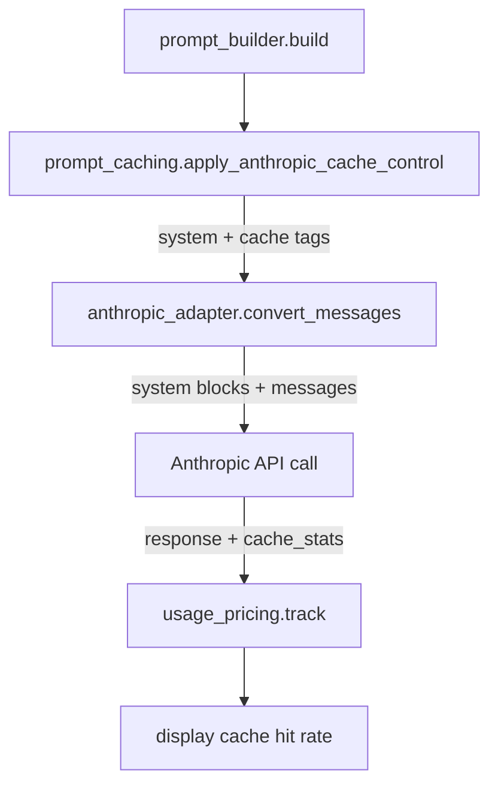
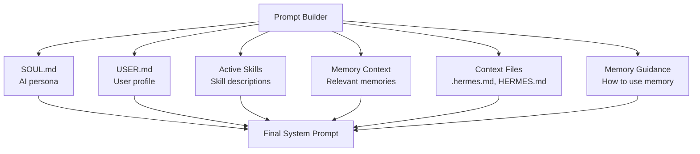

# Hermes Agent -- Agent Core

## The AIAgent Class

`run_agent.py` contains the `AIAgent` class -- the central orchestrator at 3,600+ lines. Every interaction with Hermes flows through this class.

## Responsibilities



## Message Loop

The core of AIAgent is the message loop -- a `while` loop that calls the LLM, executes tool calls, and repeats until the LLM stops calling tools or the budget is exhausted.

```python
# Simplified from run_agent.py
class AIAgent:
    async def run(self, user_message: str) -> str:
        self.messages.append({"role": "user", "content": user_message})

        while True:
            # 1. Prefetch memory
            await self.memory_manager.prefetch(self.messages)

            # 2. Build system prompt
            system = self.prompt_builder.build(
                identity=self.soul,
                skills=self.active_skills,
                memory=self.memory_manager.get_context(),
                context_files=self.context_files,
            )

            # 3. Get available tools
            tools = self.model_tools.get_tool_schemas()

            # 4. Call LLM
            response = await self.call_llm(system, self.messages, tools)

            # 5. Append assistant message
            self.messages.append(response.message)

            # 6. Check for tool calls
            if not response.tool_calls:
                break  # LLM is done

            # 7. Execute each tool call
            for tool_call in response.tool_calls:
                result = await self.execute_tool(tool_call)
                self.messages.append({
                    "role": "tool",
                    "tool_use_id": tool_call.id,
                    "content": result,
                })

            # 8. Sync memory
            await self.memory_manager.sync(self.messages)

            # 9. Check budget
            if self.turns >= self.max_turns:
                break

        return response.message["content"]
```

### Loop Detail



## LLM Adapter Selection

AIAgent selects the appropriate adapter based on the configured model:

```python
def get_adapter(self, model_name: str):
    if "claude" in model_name or "anthropic" in model_name:
        return AnthropicAdapter(self.api_key)
    elif "gemini" in model_name:
        return GeminiNativeAdapter(self.api_key)
    elif model_name.startswith("bedrock/"):
        return BedrockAdapter(self.aws_config)
    elif "codex" in model_name:
        return CodexResponsesAdapter(self.api_key)
    else:
        # Default: OpenAI-compatible
        return None  # Uses OpenAI SDK directly
```

### Anthropic Adapter and Prompt Caching Deep Dive

The Anthropic adapter (`agent/anthropic_adapter.py`) is Hermes's most complex provider adapter. It handles message format conversion, thinking block management, tool call translation, and **Anthropic prompt caching** -- a critical cost optimization.

#### How the System Prompt is Built

Before the LLM call, Hermes assembles the system prompt from multiple sources via `prompt_builder.py`:

```python
# agent/prompt_builder.py
def build(self, identity, user, skills, memory, context_files, guidance):
    sections = []
    sections.append(identity)       # SOUL.md -- AI persona definition
    if user:
        sections.append(f"## User Profile\n{user}")
    if skills:
        sections.append("## Available Skills\n" + format_skills(skills))
    if guidance:
        sections.append(guidance)   # How to use memory
    if memory:
        sections.append(f"## Relevant Context\n{memory}")
    for ctx in context_files:
        sections.append(f"## Project Context: {ctx.name}\n{ctx.content}")
    return "\n\n".join(sections)
```

The system prompt can be **megabytes long** in complex sessions with many skills and context files. This is where Anthropic prompt caching becomes essential.

#### Anthropic Prompt Caching: The system_and_3 Strategy

Hermes implements the **system_and_3** caching strategy (`agent/prompt_caching.py`). Anthropic allows up to **4 cache_control breakpoints** per request. Hermes uses them strategically:

```python
# agent/prompt_caching.py -- Pure functions, no AIAgent dependency
def apply_anthropic_cache_control(
    api_messages: List[Dict[str, Any]],
    cache_ttl: str = "5m",
    native_anthropic: bool = False,
) -> List[Dict[str, Any]]:
    """Apply system_and_3 caching strategy.

    Places up to 4 cache_control breakpoints:
      1. System prompt (stable across ALL turns)
      2-4. Last 3 non-system messages (rolling window)
    """
    messages = copy.deepcopy(api_messages)
    marker = {"type": "ephemeral"}
    if cache_ttl == "1h":
        marker["ttl"] = "1h"

    breakpoints_used = 0

    # Breakpoint 1: Always cache the system prompt
    if messages[0].get("role") == "system":
        _apply_cache_marker(messages[0], marker, native_anthropic=native_anthropic)
        breakpoints_used += 1

    # Breakpoints 2-4: Last 3 non-system messages (rolling window)
    remaining = 4 - breakpoints_used
    non_sys = [i for i in range(len(messages)) if messages[i].get("role") != "system"]
    for idx in non_sys[-remaining:]:
        _apply_cache_marker(messages[idx], marker, native_anthropic=native_anthropic)

    return messages
```

**Aha moment:** The system prompt is **always** the first breakpoint because it's the most stable part of the conversation -- it never changes between turns (unless skills are loaded/unloaded). By caching it, every subsequent API call gets a ~75% discount on the system prompt tokens. The rolling window of the last 3 messages captures the immediate conversation context, creating a sliding cache that moves with the conversation.

#### How cache_control Tags Work

The `_apply_cache_marker` function handles multiple content formats:

```python
def _apply_cache_marker(msg: dict, cache_marker: dict, native_anthropic: bool = False):
    role = msg.get("role", "")
    content = msg.get("content")

    if role == "tool":
        # Tool results can be cached too -- important for chain continuity
        if native_anthropic:
            msg["cache_control"] = cache_marker
        return

    if content is None or content == "":
        # Empty message: mark at message level
        msg["cache_control"] = cache_marker
        return

    if isinstance(content, str):
        # Convert string to content block array with cache marker
        msg["content"] = [
            {"type": "text", "text": content, "cache_control": cache_marker}
        ]
        return

    if isinstance(content, list) and content:
        # Mark the last content block (where the cache boundary falls)
        last = content[-1]
        if isinstance(last, dict):
            last["cache_control"] = cache_marker
```

**What the cache_control tag looks like in the API request:**

```json
{
  "role": "system",
  "content": [
    {"type": "text", "text": "You are a function calling AI model..."},
    {"type": "text", "text": "## Available Skills\n...", "cache_control": {"type": "ephemeral"}}
  ]
}
```

The `{"type": "ephemeral"}` marker tells Anthropic's API to cache everything up to and including that block. The cache persists for **5 minutes** by default, or **1 hour** if `cache_ttl="1h"` is set.

#### TTL: 5m vs 1h

```python
marker = {"type": "ephemeral"}
if cache_ttl == "1h":
    marker["ttl"] = "1h"
```

- **5m (default):** For rapid-fire multi-turn conversations where turns happen within minutes. The cache is likely still warm for the next turn.
- **1h:** For Anthropic-only deployments where the conversation may have gaps (user steps away, comes back). The cache survives up to 1 hour, saving costs even after long pauses.

**Aha moment:** The 1h TTL is only supported by Anthropic's API. Third-party Anthropic-compatible endpoints may not support it, so Hermes only applies it when `native_anthropic=True`.

#### Message Conversion to Anthropic Format

The `convert_messages_to_anthropic` function (`anthropic_adapter.py` line 1195+) transforms OpenAI-format messages:

```python
def convert_messages_to_anthropic(messages, base_url=None):
    """Convert OpenAI-format messages to Anthropic format.

    Returns (system_prompt, anthropic_messages).
    System messages are extracted since Anthropic takes them as a separate param.
    system_prompt is a string or list of content blocks (when cache_control present).
    """
    system = None
    result = []

    for m in messages:
        role = m.get("role", "system")
        content = m.get("content", "")

        if role == "system":
            if isinstance(content, list):
                # Preserve cache_control markers on content blocks
                has_cache = any(
                    p.get("cache_control") for p in content if isinstance(p, dict)
                )
                if has_cache:
                    system = [p for p in content if isinstance(p, dict)]
                else:
                    system = "\n".join(
                        p["text"] for p in content if p.get("type") == "text"
                    )
            else:
                system = content
            continue
```

**Key detail:** When the system message has cache_control markers (from `apply_anthropic_cache_control`), it's passed as a **list of content blocks** to preserve the markers. Without caching, it's passed as a simple string.

#### Thinking Block and Cache Interaction

The adapter also handles thinking blocks carefully with cache control:

```python
# anthropic_adapter.py line 1433
# Strip cache_control from thinking/redacted_thinking blocks --
# thinking blocks should NOT be cached as they change every turn
# and caching them would cause incorrect context on cache hits
```

And during message normalization:

```python
# anthropic_adapter.py line 1500-1504
# Strip cache_control from any remaining thinking/redacted_thinking blocks
for block in blocks:
    if isinstance(block, dict) and block.get("type") in ("thinking", "redacted_thinking"):
        block.pop("cache_control", None)
```

**Aha moment:** Thinking blocks must NOT be cached because they contain the model's reasoning for the current turn. If cached, a cache hit would replay old reasoning from a different turn, causing the model to see irrelevant thinking from previous conversations. Hermes explicitly strips cache_control from thinking blocks to prevent this.

#### Tool Result Cache Preservation

Tool results can also carry cache_control markers:

```python
# anthropic_adapter.py line 1299-1300
if isinstance(m.get("cache_control"), dict):
    tool_result["cache_control"] = dict(m["cache_control"])
```

This is important for the rolling window -- when a tool result is one of the last 3 non-system messages, it gets cached. This preserves the tool call/result chain in the cache, saving costs on multi-step tool sequences.

#### Cost Impact

With the system_and_3 strategy on a typical multi-turn conversation:

- **System prompt (20K tokens):** Cached after first turn. Subsequent turns pay only cache_read (75% discount).
- **Last 3 messages (~5K tokens):** Cached and reused for the next turn.
- **Per-turn savings:** On a 50-turn session with a 20K system prompt, caching saves approximately 75% on 980K input tokens = roughly $2.20 saved on a $8.80 session.

#### Where Caching is Applied in the Flow

```python
# In run_conversation(), per API call:
# 1. Build system prompt from prompt_builder
# 2. Apply prompt_caching.apply_anthropic_cache_control()
# 3. Convert messages via anthropic_adapter.convert_messages_to_anthropic()
# 4. Call Anthropic API with cached system + messages
# 5. Anthropic returns cache_usage stats in the response
# 6. Track cache hit rates for cost analysis
```

The adapter selection and caching flow:



### Related Files

```
agent/anthropic_adapter.py    -- Message conversion, thinking block handling
agent/prompt_caching.py       -- system_and_3 cache_control strategy
agent/prompt_builder.py       -- System prompt assembly from multiple sources
agent/usage_pricing.py        -- Cache hit rate tracking and cost estimation
```

## Tool Execution

### The Bridge: model_tools.py

`model_tools.py` bridges between `AIAgent` and the tool registry:

```python
# model_tools.py (simplified)
class ModelTools:
    def __init__(self, registry, toolsets):
        self.registry = registry
        self.toolsets = toolsets

    def get_tool_schemas(self) -> list[dict]:
        """Get JSON schemas for all active tools (sent to LLM)."""
        active_tools = self.toolsets.get_active_tools()
        return [self.registry.get_schema(name) for name in active_tools]

    async def execute(self, tool_call) -> str:
        """Execute a tool call and return the result."""
        handler = self.registry.get_handler(tool_call.name)
        return await handler(tool_call.arguments, self.context)
```

### Toolsets

Toolsets define which tools are available for different scenarios:

```python
# toolsets.py (simplified)
TOOLSETS = {
    "default": ["terminal", "file_tools", "web_search", "memory"],
    "coding": ["terminal", "file_tools", "search_files", "code_execution"],
    "research": ["web_search", "web_extract", "web_vision", "memory"],
    "full": [...]  # All tools
}
```

The active toolset is configured per-session. The LLM only sees tools from the active set.

## Prompt Assembly

The prompt builder constructs the system prompt from multiple sources:



### Assembly Order

```python
# agent/prompt_builder.py (simplified)
def build(self, identity, user, skills, memory, context_files, guidance):
    sections = []

    # 1. Identity (who the agent is)
    sections.append(identity)  # SOUL.md contents

    # 2. User profile (who they're talking to)
    if user:
        sections.append(f"## User Profile\n{user}")

    # 3. Skills (what the agent can do procedurally)
    if skills:
        sections.append("## Available Skills\n" + format_skills(skills))

    # 4. Memory guidance (how to use memory tools)
    if guidance:
        sections.append(guidance)

    # 5. Relevant memories (prefetched)
    if memory:
        sections.append(f"## Relevant Context\n{memory}")

    # 6. Project context files
    for ctx in context_files:
        sections.append(f"## Project Context: {ctx.name}\n{ctx.content}")

    return "\n\n".join(sections)
```

## State Management

`hermes_state.py` persists session state to disk:

```python
# State tracks:
{
    "session_id": "uuid",
    "model": "claude-sonnet-4-6",
    "messages": [...],           # Full conversation history
    "turn_count": 15,
    "total_tokens": 45000,
    "total_cost": 0.35,
    "active_toolset": "default",
    "skills": ["check-ci", "deploy"],
    "memory_provider": "honcho",
    "context_files": [".hermes.md"],
}
```

State is saved after each turn and restored on session resume.

## Error Handling and Failover

### Error Classification

`agent/error_classifier.py` classifies API errors to decide recovery strategy:

| Error Class | Example | Action |
|------------|---------|--------|
| `rate_limit` | 429 Too Many Requests | Exponential backoff with jitter |
| `overloaded` | 529 API Overloaded | Wait and retry |
| `context_too_long` | Context exceeds limit | Trigger compaction, retry |
| `auth_error` | 401 Unauthorized | Switch credentials from pool |
| `transient` | 500 Server Error | Retry up to 3 times |
| `permanent` | 400 Bad Request | Report error, stop |

### Credential Pool

For high-availability deployments, Hermes supports multiple API keys per provider. If one key is rate-limited, it rotates to the next:

```python
# agent/credential_pool.py (simplified)
class CredentialPool:
    def get_key(self, provider: str) -> str:
        keys = self.keys[provider]
        # Round-robin with rate-limit awareness
        for key in keys:
            if not self.is_rate_limited(key):
                return key
        # All rate-limited -- return least-recently-limited
        return min(keys, key=lambda k: self.rate_limit_until[k])
```

## Trajectory Recording

For RL training, AIAgent can record full conversation trajectories:

```python
# agent/trajectory.py
class TrajectoryRecorder:
    def record_turn(self, messages, tool_calls, tool_results, response):
        self.trajectory.append({
            "input": messages,
            "tool_calls": tool_calls,
            "tool_results": tool_results,
            "output": response,
            "metadata": {
                "model": self.model,
                "tokens": self.token_count,
                "timestamp": datetime.now().isoformat(),
            }
        })

    def save(self, path: str):
        # ShareGPT-compatible format
        write_json(path, {"conversations": self.trajectory})
```

Trajectories are used by `batch_runner.py` to generate training data at scale.

## Key Files

```
run_agent.py                      AIAgent class (3,600+ lines)
model_tools.py                    Tool dispatch bridge
toolsets.py                       Toolset definitions
hermes_state.py                   Session state persistence
agent/
  ├── anthropic_adapter.py        Anthropic adapter
  ├── bedrock_adapter.py          Bedrock adapter
  ├── gemini_native_adapter.py    Gemini adapter
  ├── codex_responses_adapter.py  Codex adapter
  ├── copilot_acp_client.py       Copilot adapter
  ├── prompt_builder.py           System prompt assembly
  ├── prompt_caching.py           Cache control tags
  ├── model_metadata.py           Token limits, pricing
  ├── error_classifier.py         Error classification
  ├── credential_pool.py          API key rotation
  ├── retry_utils.py              Backoff strategies
  ├── usage_pricing.py            Cost estimation
  └── trajectory.py               RL trajectory recording
```
