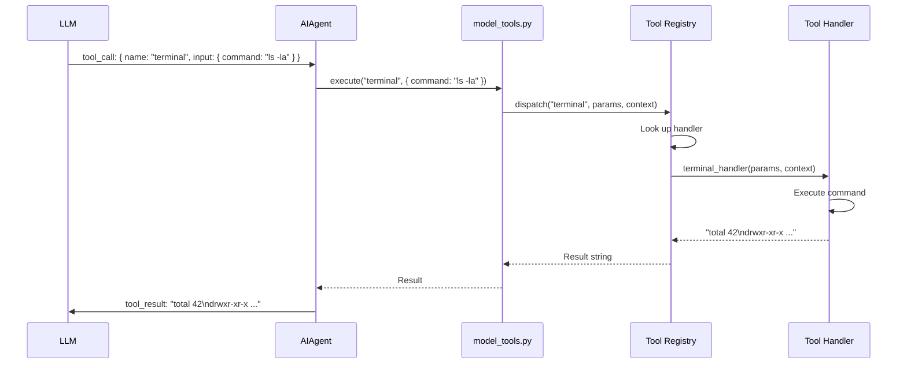
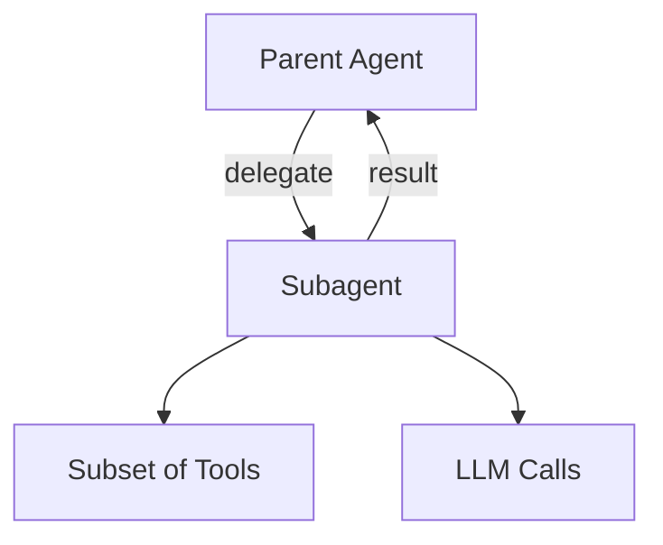
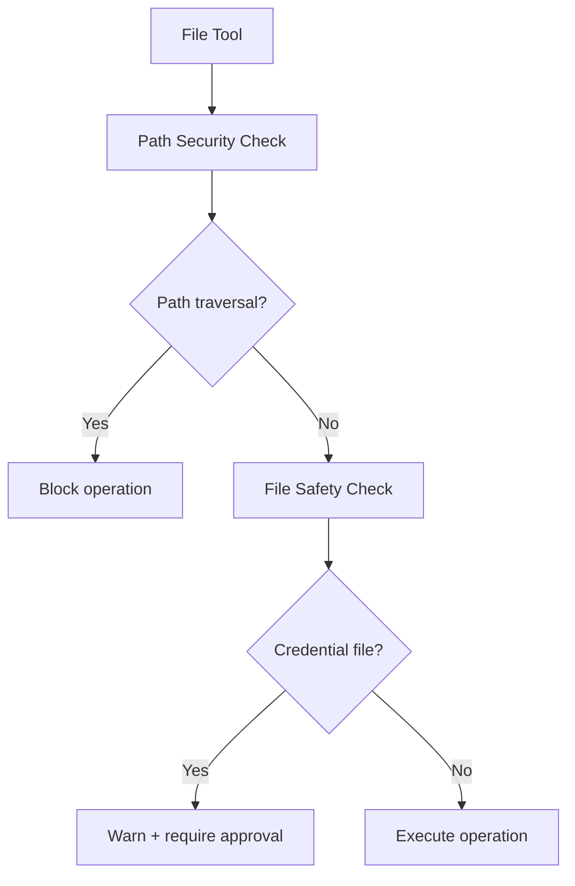

# Hermes Agent -- Tool System

## Overview

Hermes ships with 40+ tools organized by category. Tools self-register with a central registry. The LLM sees JSON schemas and returns tool calls. The registry dispatches execution to the correct handler.

## Tool Registry

```python
# tools/registry.py (simplified)
class ToolRegistry:
    _tools: dict[str, ToolDef] = {}

    @classmethod
    def register(cls, name, description, input_schema, handler):
        cls._tools[name] = ToolDef(
            name=name,
            description=description,
            input_schema=input_schema,
            handler=handler,
        )

    @classmethod
    def get_schemas(cls) -> list[dict]:
        """Return JSON schemas for all registered tools (sent to LLM)."""
        return [
            {
                "name": t.name,
                "description": t.description,
                "input_schema": t.input_schema,
            }
            for t in cls._tools.values()
        ]

    @classmethod
    async def dispatch(cls, name: str, params: dict, context) -> str:
        tool = cls._tools[name]
        return await tool.handler(params, context)
```

### Self-Registration Pattern

Each tool module registers itself when imported:

```python
# tools/terminal_tool.py
from tools.registry import ToolRegistry

async def terminal_handler(params, context):
    command = params["command"]
    # Execute command, capture output
    result = await run_command(command, cwd=context.cwd, timeout=params.get("timeout", 120))
    return result.stdout + result.stderr

ToolRegistry.register(
    name="terminal",
    description="Execute a shell command and return its output",
    input_schema={
        "type": "object",
        "properties": {
            "command": {"type": "string", "description": "The shell command to execute"},
            "timeout": {"type": "integer", "description": "Timeout in seconds", "default": 120},
        },
        "required": ["command"],
    },
    handler=terminal_handler,
)
```

`tools/__init__.py` imports all tool modules, which triggers registration for all tools.

## Tool Categories

### Terminal & Code Execution

| Tool | Purpose |
|------|---------|
| `terminal` | Execute shell commands |
| `code_execution` | Run code in sandboxed environment |
| `process` | Manage long-running processes |

### File Operations

| Tool | Purpose |
|------|---------|
| `file_tools` | Read, write, create, delete files |
| `file_operations` | Move, copy, rename files |
| `search_files` | Search files by name or content |
| `patch_parser` | Apply unified diff patches |

### Browser Automation

| Tool | Purpose |
|------|---------|
| `browser` | Navigate, click, type in browser |
| `browser_cdp` | Chrome DevTools Protocol (low-level) |
| `browser_supervisor` | Manage browser lifecycle |
| `browser_camofox` | Stealth browser (anti-detection) |
| `browser_dialog` | Handle browser dialogs/alerts |

### Web

| Tool | Purpose |
|------|---------|
| `web_search` | Search the web (multiple engines) |
| `web_extract` | Extract content from URLs |
| `web_vision` | Screenshot and analyze web pages |

### Memory & Knowledge

| Tool | Purpose |
|------|---------|
| `memory` | Read/write MEMORY.md files |
| `session_search` | Search past conversation history |

### Media

| Tool | Purpose |
|------|---------|
| `image_generation` | Generate images (DALL-E, Grok, etc.) |
| `vision` | Analyze images |
| `text_to_speech` | Convert text to audio |

### APIs & Integrations

| Tool | Purpose |
|------|---------|
| `mcp` | Model Context Protocol server calls |
| `discord` | Discord API operations |
| `homeassistant` | Home automation control |
| `feishu_doc` | Feishu document operations |

### Agent Operations

| Tool | Purpose |
|------|---------|
| `delegate` | Spawn isolated subagents for complex tasks |
| `cronjob` | Create/manage scheduled jobs |
| `clarify` | Ask user for clarification |
| `interrupt` | Signal that the agent needs user input |

### Safety & Control

| Tool | Purpose |
|------|---------|
| `approval` | Request user approval for dangerous operations |
| `checkpoint_manager` | Create/restore file system checkpoints |

## Tool Execution Flow



## Delegate Tool: Subagents

The `delegate` tool spawns an isolated subagent for complex subtasks:

```python
# tools/delegate_tool.py (simplified)
async def delegate_handler(params, context):
    task = params["task"]
    tools = params.get("tools", ["terminal", "file_tools"])

    # Create isolated subagent
    subagent = AIAgent(
        model=context.model,
        tools=tools,
        system_prompt=f"Complete this task: {task}",
        max_turns=params.get("max_turns", 10),
    )

    # Run subagent
    result = await subagent.run(task)

    return result
```

Subagents:
- Have their own message history (no context leakage)
- Can use a subset of tools
- Have a separate turn budget
- Return their final result to the parent agent



## File Safety System



Two layers:
1. **path_security.py** -- Prevents directory traversal attacks (`../../etc/passwd`)
2. **file_safety.py** -- Warns before modifying credential files, config files, etc.

## Tool Result Storage

Large tool results are stored on disk and referenced by ID:

```python
# tools/tool_result_storage.py
class ToolResultStorage:
    def store(self, tool_name: str, result: str) -> str:
        if len(result) > MAX_INLINE_SIZE:
            result_id = uuid4().hex
            write_file(f"results/{result_id}.txt", result)
            return f"[Result stored: {result_id}] (truncated preview: {result[:500]}...)"
        return result
```

This prevents massive tool outputs (e.g., large file contents) from bloating the message history.

## Adding Custom Tools

### Direct Registration

```python
from tools.registry import ToolRegistry

async def my_tool_handler(params, context):
    # Your tool logic
    return "result"

ToolRegistry.register(
    name="my_tool",
    description="Does something useful",
    input_schema={
        "type": "object",
        "properties": {
            "input": {"type": "string", "description": "Input value"},
        },
        "required": ["input"],
    },
    handler=my_tool_handler,
)
```

### Via MCP (Model Context Protocol)

Hermes supports MCP servers, which expose tools over a standard protocol:

```yaml
# config.yaml
mcp_servers:
  - name: "github"
    command: "npx @modelcontextprotocol/server-github"
    env:
      GITHUB_TOKEN: "ghp_..."
```

MCP tools appear in the registry alongside built-in tools. The LLM doesn't know the difference.

## Key Files

```
tools/
  ├── registry.py              Central registry (register, get_schemas, dispatch)
  ├── __init__.py              Imports all tools (triggers registration)
  ├── terminal_tool.py         Shell execution
  ├── code_execution_tool.py   Sandboxed code runner
  ├── process_tool.py          Process management
  ├── browser_tool.py          Browser automation
  ├── browser_cdp_tool.py      Chrome DevTools Protocol
  ├── browser_supervisor.py    Browser lifecycle
  ├── file_tools.py            File read/write/create
  ├── file_operations.py       File move/copy/rename
  ├── search_files_tool.py     File search
  ├── patch_parser.py          Diff patch application
  ├── web_search_tool.py       Web search
  ├── web_extract_tool.py      URL content extraction
  ├── web_vision_tool.py       Web page screenshots
  ├── memory_tool.py           MEMORY.md operations
  ├── session_search_tool.py   Past conversation search
  ├── image_generation_tool.py Image generation
  ├── vision_tool.py           Image analysis
  ├── text_to_speech_tool.py   TTS
  ├── mcp_tool.py              MCP server integration
  ├── delegate_tool.py         Subagent spawning
  ├── cronjob_tools.py         Cron job management
  ├── approval.py              User approval system
  ├── clarify_tool.py          Ask for clarification
  ├── interrupt.py             Interrupt handling
  ├── checkpoint_manager.py    Filesystem checkpoints
  ├── path_security.py         Path traversal prevention
  ├── file_safety.py           Credential file protection
  ├── tool_result_storage.py   Large result storage
  ├── file_state.py            File modification tracking
  └── budget_config.py         Turn budget config
```
