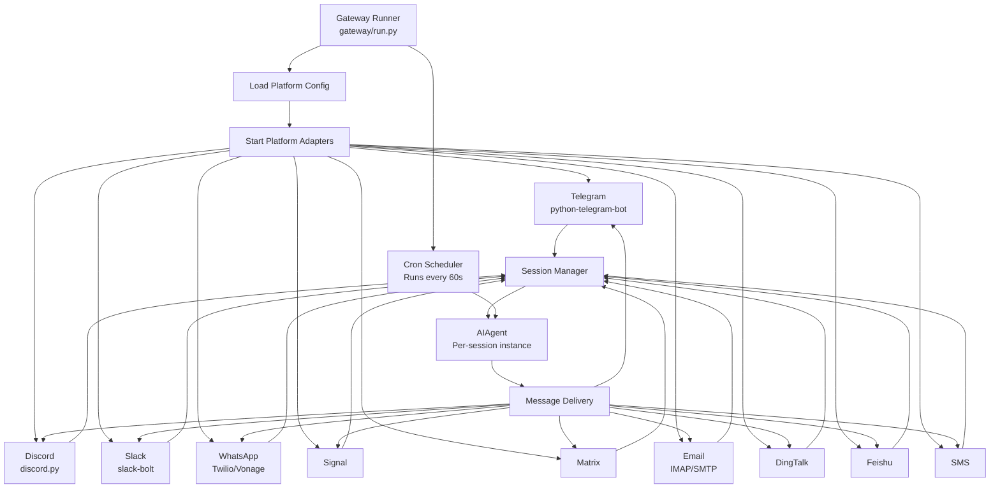
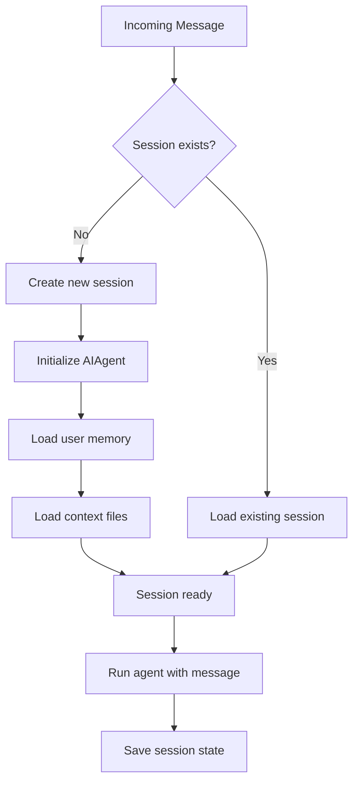
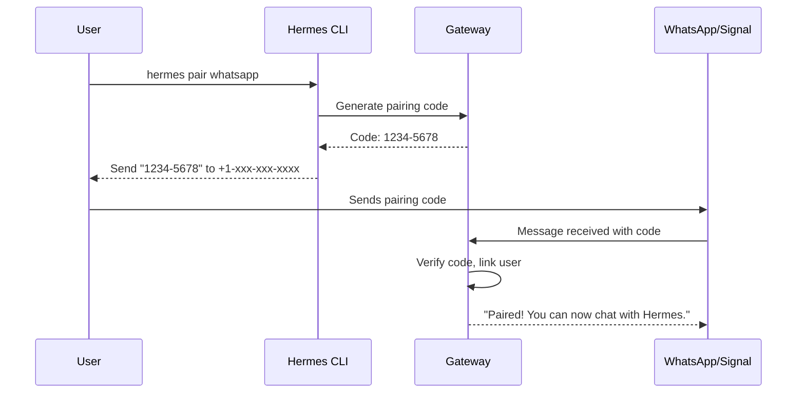

# Hermes Agent -- Multi-Platform Gateway

## Purpose

The gateway is what makes Hermes a persistent agent rather than just a CLI tool. It connects to 10+ messaging platforms simultaneously, routes incoming messages to per-user agent sessions, and delivers responses back to the originating platform.

## Architecture



## Gateway Runner

`gateway/run.py` orchestrates the entire multi-platform system:

```python
# gateway/run.py (simplified)
class GatewayRunner:
    def __init__(self, config):
        self.config = config
        self.platforms = {}
        self.sessions = SessionManager()
        self.cron = CronScheduler()

    async def start(self):
        # 1. Load platform configs
        for platform_config in self.config.platforms:
            adapter = self.create_adapter(platform_config)
            self.platforms[platform_config.name] = adapter

        # 2. Start all platform adapters
        for name, adapter in self.platforms.items():
            await adapter.start(on_message=self.handle_message)

        # 3. Start cron scheduler
        self.cron.start(tick_interval=60)

        # 4. Keep running
        await asyncio.Event().wait()

    async def handle_message(self, platform, user_id, channel_id, text, attachments):
        # Get or create session for this user/channel
        session = self.sessions.get_or_create(
            platform=platform,
            user_id=user_id,
            channel_id=channel_id,
        )

        # Run agent
        response = await session.agent.run(text)

        # Deliver response back to platform
        await self.deliver(platform, channel_id, response)
```

## Session Management

Each user-channel combination gets its own session:



```python
# gateway/session.py (simplified)
class Session:
    def __init__(self, platform, user_id, channel_id):
        self.platform = platform
        self.user_id = user_id
        self.channel_id = channel_id
        self.agent = AIAgent(model=config.model)
        self.history = []

    def load(self):
        """Load conversation history and memory from disk."""
        history_path = f"sessions/{self.platform}/{self.channel_id}/history.jsonl"
        if os.path.exists(history_path):
            self.history = read_jsonl(history_path)
            self.agent.messages = self.history

    def save(self):
        """Persist conversation state."""
        history_path = f"sessions/{self.platform}/{self.channel_id}/history.jsonl"
        write_jsonl(history_path, self.agent.messages)
```

## Message Delivery

`gateway/delivery.py` handles sending responses back to the correct platform with proper formatting:

```python
# gateway/delivery.py (simplified)
class MessageDelivery:
    async def deliver(self, platform, channel_id, content, attachments=None):
        adapter = self.platforms[platform]

        # Split long messages if needed (platform-specific limits)
        chunks = self.split_for_platform(platform, content)

        for chunk in chunks:
            # Format for platform (Markdown → platform-specific)
            formatted = self.format_for_platform(platform, chunk)
            await adapter.send_message(channel_id, formatted)

        # Send attachments (images, files)
        if attachments:
            for attachment in attachments:
                await adapter.send_attachment(channel_id, attachment)
```

### Platform Message Limits

| Platform | Max Length | Formatting |
|----------|----------|-----------|
| Telegram | 4096 chars | Markdown (MarkdownV2) |
| Discord | 2000 chars | Markdown |
| Slack | 40000 chars | mrkdwn |
| WhatsApp | 65536 chars | Limited formatting |
| Signal | 65536 chars | Plain text |
| Matrix | No limit | HTML/Markdown |
| Email | No limit | HTML |

Messages exceeding platform limits are split into multiple messages.

## Pairing System

For platforms that require user identity (WhatsApp, Signal), Hermes uses a pairing flow:



## Channel Features

### Channel Directory

```python
# gateway/channel_directory.py
class ChannelDirectory:
    def list_channels(self, platform) -> list[Channel]:
        """List all channels the gateway has access to."""

    def get_channel_config(self, platform, channel_id) -> ChannelConfig:
        """Get per-channel configuration (allowed tools, model, etc.)."""
```

### Message Mirroring

`gateway/mirror.py` can mirror messages between platforms:

```yaml
# config.yaml
mirrors:
  - from: { platform: "telegram", channel: "123456" }
    to: { platform: "discord", channel: "789012" }
```

### Hooks

`gateway/hooks.py` provides event hooks for custom logic:

```python
# Hooks fire on gateway events
hooks = {
    "on_auth": validate_user,           # Before processing message
    "on_message_received": log_message,  # After receiving, before agent
    "on_response_ready": filter_content, # Before sending response
}
```

## SSL/TLS

The gateway can terminate TLS for webhook-based platforms:

```python
# gateway/run.py
if config.ssl:
    ssl_context = ssl.create_default_context(ssl.Purpose.CLIENT_AUTH)
    ssl_context.load_cert_chain(config.ssl_cert, config.ssl_key)
```

## Display Configuration

Per-platform display preferences control how the agent formats its responses:

```python
# gateway/display_config.py
DISPLAY_CONFIGS = {
    "telegram": {
        "code_blocks": True,
        "markdown": True,
        "max_images_per_message": 10,
        "inline_links": True,
    },
    "sms": {
        "code_blocks": False,
        "markdown": False,
        "max_images_per_message": 1,
        "inline_links": False,
    },
}
```

## Key Files

```
gateway/
  ├── run.py                Gateway runner (main entry point)
  ├── session.py            Per-user session management
  ├── session_context.py    Session context injection
  ├── config.py             Platform configuration loading
  ├── delivery.py           Message delivery to platforms
  ├── pairing.py            User pairing (phone, QR code)
  ├── status.py             Gateway health reporting
  ├── stream_consumer.py    Async message consumption
  ├── channel_directory.py  Channel/group management
  ├── mirror.py             Cross-platform message mirroring
  ├── hooks.py              Event hooks
  ├── restart.py            Graceful restart
  ├── sticker_cache.py      Media caching
  ├── whatsapp_identity.py  WhatsApp identity verification
  ├── display_config.py     Per-platform display preferences
  └── platforms/            Platform adapter implementations
      ├── telegram.py
      ├── discord.py
      ├── slack.py
      ├── whatsapp.py
      ├── signal.py
      ├── matrix.py
      ├── email.py
      ├── dingtalk.py
      ├── feishu.py
      └── sms.py
```
