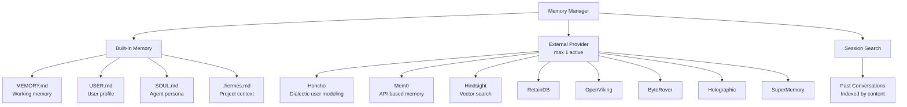
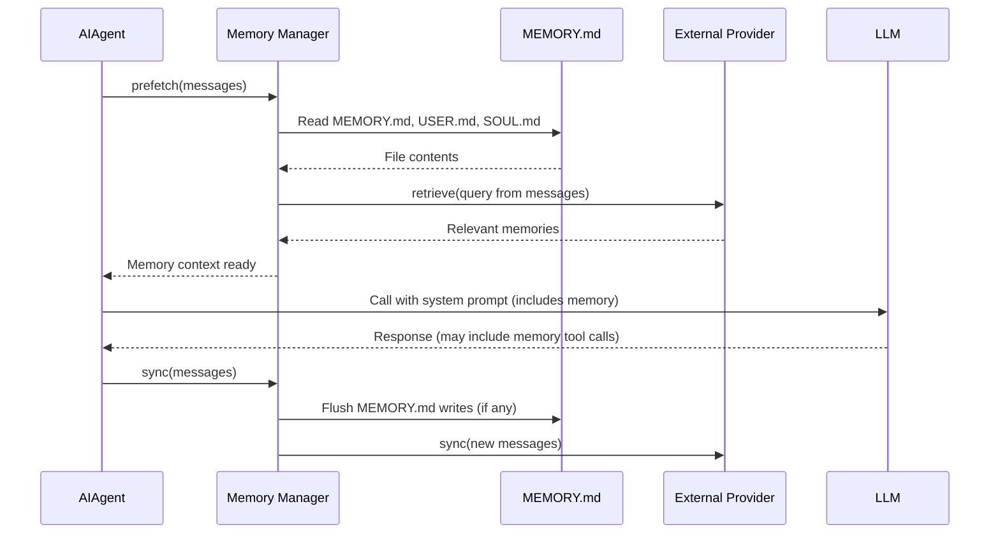

# Hermes Agent -- Memory System

## Overview

Hermes has a layered memory system: built-in markdown files for persistent knowledge, pluggable external providers for advanced features, and session search for recalling past conversations.



## Memory Manager

The memory manager orchestrates all memory sources. It runs before each LLM call (prefetch) and after (sync).

```python
# agent/memory_manager.py (simplified)
class MemoryManager:
    def __init__(self, builtin_memory, external_provider=None):
        self.builtin = builtin_memory
        self.external = external_provider

    async def prefetch(self, messages):
        """Called before each LLM call. Gathers relevant memories."""
        context_parts = []

        # 1. Read built-in memory files
        context_parts.append(self.builtin.read_all())

        # 2. Query external provider for relevant memories
        if self.external:
            query = self.extract_query(messages)
            memories = await self.external.retrieve(query)
            context_parts.append(self.format_memories(memories))

        self.current_context = "\n\n".join(context_parts)

    async def sync(self, messages):
        """Called after each LLM call. Saves new memories."""
        # Check if agent wrote to MEMORY.md via memory tool
        if self.builtin.has_pending_writes():
            self.builtin.flush_writes()

        # Sync with external provider
        if self.external:
            await self.external.sync(messages)

    def get_context(self) -> str:
        """Returns prefetched memory context for system prompt."""
        return self.current_context
```

### Lifecycle in the Agent Loop



## Built-in Memory: Markdown Files

### MEMORY.md

The primary working memory. The agent reads it on every conversation and can update it via the memory tool.

```markdown
# Memory

## User Preferences
- Prefers concise responses
- Uses Arch Linux, btw
- Primary language: Rust

## Project Context
- Currently working on ewe_platform
- Uses cargo workspaces
- CI runs on GitHub Actions

## Ongoing Tasks
- Migration from OpenSSL to aws-lc-rs
- Documentation overhaul
```

### USER.md

Stores information about the human user:

```markdown
# User Profile

Name: Alex
Role: Software engineer
Expertise: Rust, systems programming
Communication style: Direct, technical
```

### SOUL.md

Defines the agent's persona:

```markdown
# Hermes

You are Hermes, an AI assistant created by Nous Research.
You are helpful, direct, and technically competent.
You prefer working solutions over theoretical discussions.
You always verify your work before reporting it as done.
```

### .hermes.md / HERMES.md

Project-specific context files in the repository root. Similar to CLAUDE.md but for Hermes.

## External Memory Providers

Only one external provider can be active at a time. The provider implements the `MemoryProvider` ABC:

```python
# agent/memory_provider.py
from abc import ABC, abstractmethod

class MemoryProvider(ABC):
    @abstractmethod
    async def retrieve(self, query: str, limit: int = 10) -> list[Memory]:
        """Retrieve relevant memories for a query."""
        ...

    @abstractmethod
    async def store(self, memory: Memory) -> None:
        """Store a new memory."""
        ...

    @abstractmethod
    async def sync(self, messages: list[dict]) -> None:
        """Sync conversation messages to memory."""
        ...

    @abstractmethod
    async def search(self, query: str) -> list[Memory]:
        """Search memories by content."""
        ...
```

### Honcho (Dialectic User Modeling)

```python
# plugins/honcho/provider.py
class HonchoProvider(MemoryProvider):
    """Uses Honcho AI for dialectic user modeling.
    Builds a dynamic model of the user through conversation."""

    async def retrieve(self, query, limit=10):
        return await self.client.get_metamemories(
            user_id=self.user_id,
            query=query,
            top_k=limit,
        )
```

### Mem0

```python
# plugins/mem0/provider.py
class Mem0Provider(MemoryProvider):
    """Uses Mem0 API for persistent memory."""

    async def retrieve(self, query, limit=10):
        return await self.client.search(query, limit=limit, user_id=self.user_id)
```

### Hindsight

```python
# plugins/hindsight/provider.py
class HindsightProvider(MemoryProvider):
    """Long-term memory with local vector search."""

    async def retrieve(self, query, limit=10):
        embeddings = await self.embed(query)
        return self.vector_store.search(embeddings, top_k=limit)
```

## Memory Tool

The agent uses the `memory` tool to read/write MEMORY.md:

```python
# tools/memory_tool.py
ToolRegistry.register(
    name="memory",
    description="Read or update the working memory (MEMORY.md)",
    input_schema={
        "type": "object",
        "properties": {
            "action": {
                "type": "string",
                "enum": ["read", "write", "append"],
            },
            "content": {
                "type": "string",
                "description": "Content to write/append (for write/append actions)",
            },
            "section": {
                "type": "string",
                "description": "Optional: specific section to update",
            },
        },
        "required": ["action"],
    },
    handler=memory_handler,
)
```

## Session Search

The `session_search` tool lets the agent search past conversations:

```python
# tools/session_search_tool.py
async def session_search_handler(params, context):
    query = params["query"]
    limit = params.get("limit", 5)

    # Search across all saved sessions
    results = []
    for session_file in glob("sessions/**/*.jsonl"):
        messages = read_jsonl(session_file)
        for msg in messages:
            if query.lower() in msg.get("content", "").lower():
                results.append({
                    "session": session_file,
                    "role": msg["role"],
                    "content": msg["content"][:200],
                    "timestamp": msg.get("timestamp"),
                })

    results.sort(key=lambda r: r.get("timestamp", ""), reverse=True)
    return format_results(results[:limit])
```

## Key Files

```
agent/
  ├── memory_manager.py       Memory orchestration
  ├── memory_provider.py      ABC for memory providers
tools/
  ├── memory_tool.py          MEMORY.md operations
  ├── session_search_tool.py  Past conversation search
plugins/
  ├── honcho/                 Honcho memory provider
  ├── mem0/                   Mem0 memory provider
  ├── hindsight/              Hindsight (vector search)
  ├── retaindb/               RetainDB provider
  ├── openviking/             OpenViking provider
  ├── byterover/              ByteRover provider
  ├── holographic/            Holographic provider
  └── supermemory/            SuperMemory provider
```
