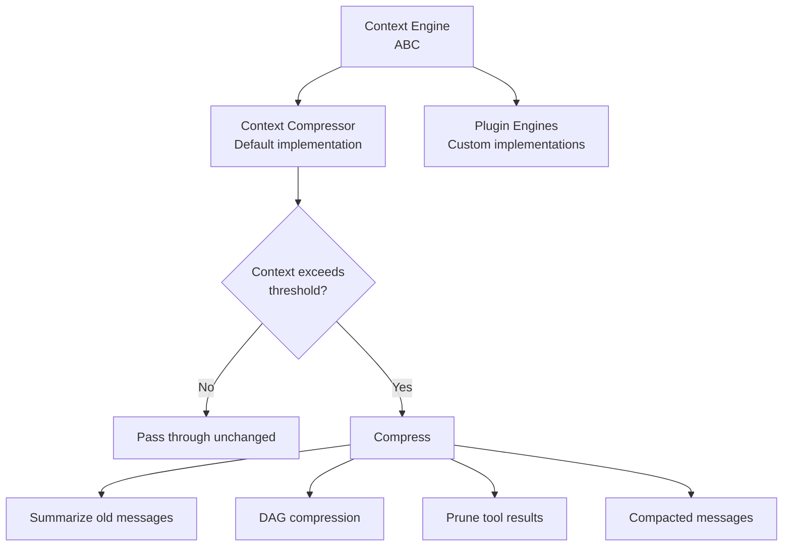
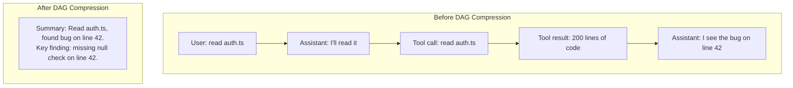
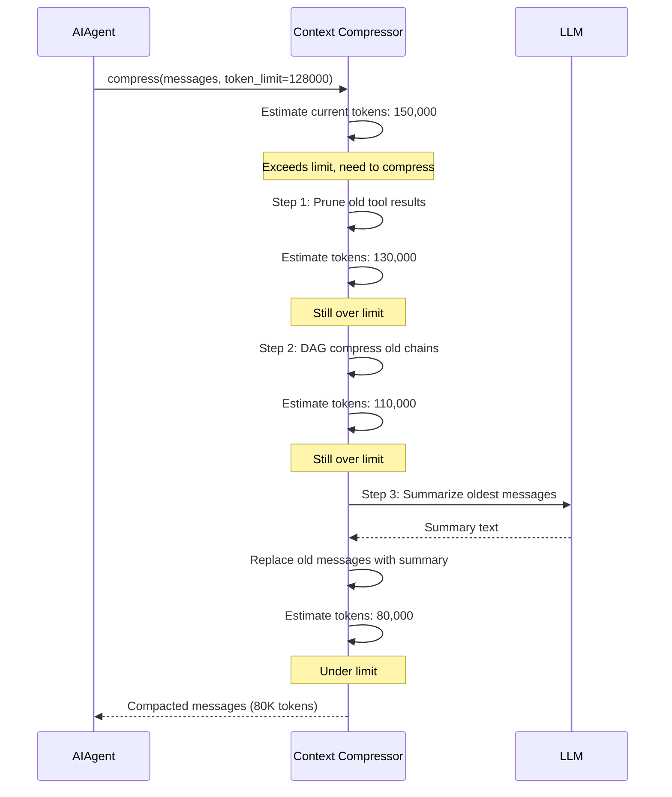

# Hermes Agent -- Context Engine

## The Problem

LLMs have finite context windows. A long conversation with many tool calls can exceed the limit. The context engine compresses conversation history to fit within the window while preserving the information the agent needs.

## Architecture



## Abstract Base Class

```python
# agent/context_engine.py
from abc import ABC, abstractmethod

class ContextEngine(ABC):
    @abstractmethod
    async def compress(
        self,
        messages: list[dict],
        token_limit: int,
        model: str,
    ) -> list[dict]:
        """Compress messages to fit within token_limit.

        Returns a new message list that:
        - Fits within the token budget
        - Preserves recent messages verbatim
        - Preserves critical information from older messages
        """
        ...

    @abstractmethod
    def estimate_tokens(self, messages: list[dict]) -> int:
        """Estimate token count for a message list."""
        ...
```

## Default Implementation: Context Compressor

The built-in compressor uses three strategies in order:

### Strategy 1: Tool Result Pruning

Tool results (especially file contents) can be huge. The compressor truncates old tool results first:

```python
# agent/context_compressor.py (simplified)
def prune_tool_results(self, messages, max_result_tokens=500):
    """Truncate old tool results to max_result_tokens each."""
    recent_cutoff = len(messages) - self.recent_count

    for i, msg in enumerate(messages):
        if i >= recent_cutoff:
            break  # Don't touch recent messages

        if msg["role"] == "tool":
            tokens = self.count_tokens(msg["content"])
            if tokens > max_result_tokens:
                msg["content"] = (
                    msg["content"][:max_result_tokens * 4]  # ~4 chars per token
                    + "\n\n[... truncated ...]"
                )

    return messages
```

### Strategy 2: DAG Compression

Messages that form chains (user → assistant → tool_call → tool_result → assistant) are compressed into summary nodes:



The compressor identifies message chains that form complete actions (ask → investigate → find) and replaces them with summaries.

### Strategy 3: LLM Summarization

For messages that can't be structurally compressed, the compressor calls the LLM to summarize:

```python
async def summarize_messages(self, messages, model):
    """Ask the LLM to summarize a block of messages."""
    conversation_text = format_messages_as_text(messages)

    summary = await self.llm.complete(
        model=model,
        messages=[{
            "role": "user",
            "content": f"""Summarize this conversation segment concisely.
Preserve:
- Key decisions made
- Files modified and how
- Errors encountered and resolutions
- Current task state

Conversation:
{conversation_text}""",
        }],
        max_tokens=1000,
    )

    return {
        "role": "system",
        "content": f"[Previous conversation summary]\n{summary}",
    }
```

## Compression Flow



## Token Estimation

```python
# agent/context_compressor.py
def estimate_tokens(self, messages):
    """Fast token estimation without calling the tokenizer API."""
    total = 0
    for msg in messages:
        content = msg.get("content", "")
        if isinstance(content, str):
            # Rough estimate: 1 token ≈ 4 characters for English
            total += len(content) // 4
        elif isinstance(content, list):
            for part in content:
                if part["type"] == "text":
                    total += len(part["text"]) // 4
                elif part["type"] == "image":
                    total += 1000  # Images cost ~1K tokens
    # Add overhead for message structure
    total += len(messages) * 4
    return total
```

For precise counts, the compressor can call the provider's tokenizer API, but the fast estimate is used for the initial check.

## Model Metadata Integration

The context engine reads model limits from `agent/model_metadata.py`:

```python
# agent/model_metadata.py (simplified)
MODEL_METADATA = {
    "claude-sonnet-4-6": {
        "context_window": 200000,
        "max_output": 64000,
        "supports_thinking": True,
    },
    "gpt-4o": {
        "context_window": 128000,
        "max_output": 16384,
        "supports_thinking": False,
    },
    "gemini-2.5-pro": {
        "context_window": 1048576,
        "max_output": 65536,
        "supports_thinking": True,
    },
}
```

The compression threshold is typically 80% of the context window, leaving room for the next response.

## Pluggable Context Engines

Custom context engines implement the `ContextEngine` ABC:

```python
# plugins/context_engine/my_engine.py
class MyContextEngine(ContextEngine):
    async def compress(self, messages, token_limit, model):
        # Custom compression logic
        # Could use embeddings, clustering, importance scoring, etc.
        ...
```

Configured in `config.yaml`:

```yaml
context_engine: "my_engine"
```

## Key Files

```
agent/
  ├── context_engine.py      ABC for context engines
  ├── context_compressor.py  Default implementation (summarize, DAG, prune)
  ├── model_metadata.py      Token limits and model capabilities
plugins/
  └── context_engine/        Pluggable context engine plugins
```
