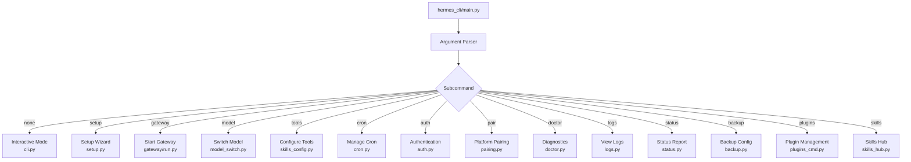
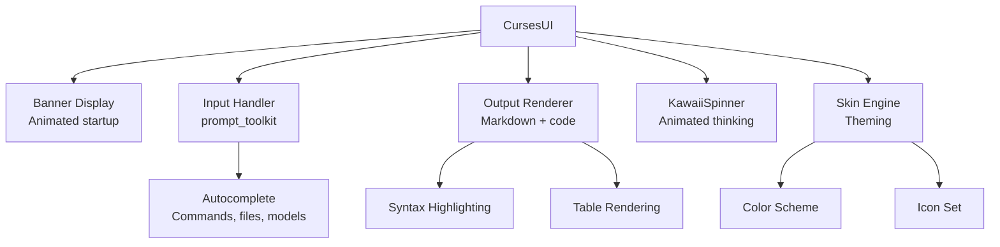
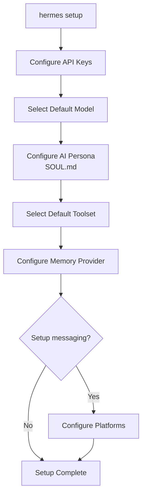

# Hermes Agent -- CLI & TUI

## Entry Points

Hermes has multiple entry points for different usage patterns:

| Entry | Module | Purpose |
|-------|--------|---------|
| `hermes` | `hermes_cli/main.py` | Interactive CLI with subcommands |
| `hermes-agent` | `run_agent.py` | Direct agent invocation (scripting) |
| `hermes-acp` | `acp_adapter/entry.py` | ACP server for editors |

## CLI Architecture



## Interactive Mode

When run without a subcommand, `hermes` starts the interactive TUI:

```python
# cli.py (simplified)
async def interactive_mode():
    # 1. Load configuration
    config = load_config()

    # 2. Initialize agent
    agent = AIAgent(
        model=config.model,
        tools=config.toolset,
        memory_provider=config.memory_provider,
    )

    # 3. Start TUI
    tui = CursesUI(config.skin)

    # 4. Message loop
    while True:
        user_input = await tui.get_input()

        if user_input.startswith("/"):
            await handle_command(user_input, agent, tui)
            continue

        # Stream response with display
        async for event in agent.stream(user_input):
            tui.render_event(event)

        tui.finalize_response()
```

### Slash Commands

| Command | Purpose |
|---------|---------|
| `/model` | Switch LLM model |
| `/tools` | List/toggle active tools |
| `/memory` | View/edit MEMORY.md |
| `/skills` | List/manage skills |
| `/save` | Save conversation |
| `/load` | Load previous conversation |
| `/clear` | Clear conversation history |
| `/compact` | Force context compression |
| `/export` | Export conversation |
| `/help` | Show available commands |

## TUI (Terminal UI)

`hermes_cli/curses_ui.py` provides the terminal interface:



### KawaiiSpinner

A distinctive UI element -- animated spinner with cute messages while the LLM thinks:

```python
# agent/display.py
class KawaiiSpinner:
    frames = ["⠋", "⠙", "⠹", "⠸", "⠼", "⠴", "⠦", "⠧", "⠇", "⠏"]
    messages = [
        "thinking...",
        "pondering...",
        "contemplating...",
        "reasoning...",
    ]
```

### Skin Engine

Themes for the TUI:

```python
# hermes_cli/skin_engine.py
class SkinEngine:
    def __init__(self, skin_name):
        self.skin = SKINS[skin_name]

    def style(self, element, text):
        color = self.skin.get(element, "default")
        return f"\033[{color}m{text}\033[0m"
```

## Setup Wizard

`hermes setup` runs an interactive configuration wizard:



## Configuration

### config.yaml Structure

```yaml
# ~/.hermes/config.yaml
model: "claude-sonnet-4-6"
provider: "anthropic"
api_keys:
  anthropic: "sk-ant-..."
  openai: "sk-..."

toolset: "default"
memory_provider: null

gateway:
  platforms:
    telegram:
      token: "bot-token"
      enabled: true
    discord:
      token: "bot-token"
      enabled: false

cron:
  enabled: true

skin: "default"
log_level: "info"
```

### Environment Variables

```bash
HERMES_HOME=~/.hermes          # Config directory
HERMES_MODEL=claude-sonnet-4-6 # Default model
ANTHROPIC_API_KEY=sk-ant-...   # Provider key
OPENAI_API_KEY=sk-...          # Provider key
HERMES_LOG_LEVEL=info          # Logging
```

`hermes_cli/env_loader.py` loads env vars from `.env` files and the shell environment.

## Authentication

```python
# hermes_cli/auth.py
class AuthManager:
    """Manages API key storage and OAuth flows."""

    def store_key(self, provider, key):
        """Securely store an API key."""

    def get_key(self, provider) -> str:
        """Retrieve stored API key."""

    async def oauth_flow(self, provider):
        """Run OAuth flow for providers that support it."""
```

### Copilot Authentication

```python
# hermes_cli/copilot_auth.py
async def copilot_auth():
    """GitHub Copilot device code flow."""
    # 1. Request device code
    # 2. Show user URL + code
    # 3. Poll for token
    # 4. Store token
```

## Model Switching

```python
# hermes_cli/model_switch.py
def switch_model(model_name):
    """Switch the active LLM model."""
    # Validate model exists
    metadata = get_model_metadata(model_name)
    if not metadata:
        print(f"Unknown model: {model_name}")
        return

    # Update config
    config = load_config()
    config["model"] = model_name
    save_config(config)

    print(f"Switched to {model_name} ({metadata['context_window']} tokens)")
```

## Doctor (Diagnostics)

```bash
$ hermes doctor

Checking Hermes installation...
  ✓ Config directory exists (~/.hermes/)
  ✓ Config file valid
  ✓ Anthropic API key set
  ✗ OpenAI API key not set
  ✓ Model accessible: claude-sonnet-4-6
  ✓ Memory provider: built-in
  ✗ Gateway: not configured
  ✓ Cron: enabled, 3 jobs
  ✓ Skills: 5 installed
```

## Key Files

```
hermes_cli/
  ├── main.py              CLI entry point, argument parsing
  ├── commands.py           Interactive mode commands
  ├── callbacks.py          Event callbacks for TUI
  ├── completion.py         Autocomplete providers
  ├── config.py             Configuration loading
  ├── env_loader.py         Environment variable handling
  ├── auth.py               API key management
  ├── auth_commands.py       Auth CLI subcommands
  ├── copilot_auth.py       GitHub Copilot OAuth
  ├── setup.py              Setup wizard
  ├── model_switch.py       Model switching
  ├── model_normalize.py    Model name normalization
  ├── models.py             Model listing
  ├── providers.py          Provider listing
  ├── curses_ui.py          Terminal UI
  ├── skin_engine.py        TUI theming
  ├── colors.py             Color utilities
  ├── cli_output.py         Output formatting
  ├── skills_config.py      Skills management
  ├── skills_hub.py         Skills marketplace
  ├── memory_setup.py       Memory provider setup
  ├── mcp_config.py         MCP server configuration
  ├── cron.py               Cron management
  ├── plugins_cmd.py        Plugin management
  ├── doctor.py             Diagnostics
  ├── status.py             Status reporting
  ├── backup.py             Config backup
  ├── logs.py               Log viewing
  ├── debug.py              Debug utilities
  ├── banner.py             Startup banner
  ├── tips.py               Usage tips
  └── hooks.py              CLI event hooks
cli.py                      Interactive conversation loop
```
