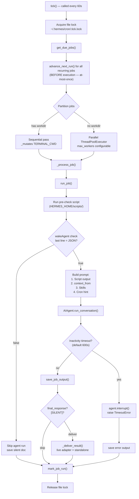
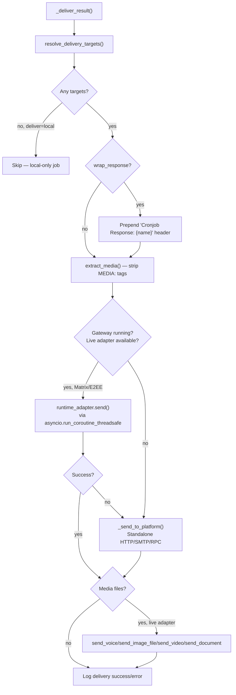
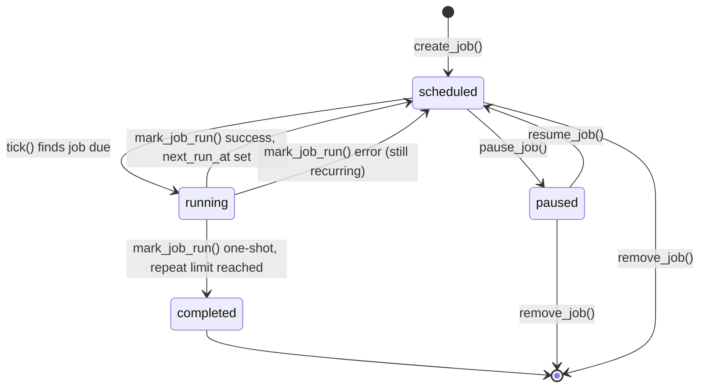

# Hermes Agent -- Cron & Scheduling: Implementation Deep Dive

## Purpose

The cron scheduler (`cron/scheduler.py`, 1325 lines) turns Hermes from a reactive chatbot into an autonomous agent that can monitor, report, and act on a schedule. Jobs trigger full agent runs with tool access, and results are delivered to configured platforms. The scheduler supports parallel execution, pre-run data collection scripts, skill loading, wake gates, job chaining, and per-job working directories.

Source: `hermes-agent/cron/scheduler.py` — tick loop, job execution, delivery
Source: `hermes-agent/cron/jobs.py` — job CRUD, schedule parsing, storage

## Aha Moments

**Aha: The scheduler advances `next_run_at` BEFORE execution, not after.** This converts the scheduler from at-least-once to at-most-once semantics for recurring jobs (`jobs.py:714-740`). If the process crashes mid-execution, the job won't re-fire on the next gateway restart — missing one run is far better than firing dozens of times in a crash loop.

**Aha: Jobs with per-job workdirs MUST run sequentially, not in parallel.** The `run_job()` function mutates `os.environ["TERMINAL_CWD"]` for workdir jobs, which is process-global. The tick loop partitions due jobs into `workdir_jobs` (sequential) and `parallel_jobs` (thread pool) to avoid corrupting each other's working directories (`scheduler.py:1292-1309`).

**Aha: Wake gates let scripts decide whether to run the agent at all.** A pre-run script can output `{"wakeAgent": false}` as its last line, and the entire agent run is skipped — no LLM call, no token cost, no delivery (`scheduler.py:605-628`). This is critical for monitoring jobs that only need to report when something changed.

**Aha: Jobs can chain output from other jobs via `context_from`.** A job can reference another job's ID, and the scheduler injects the most recent output file (truncated to 8K chars) into the prompt before each run (`scheduler.py:675-713`). This enables multi-stage pipelines: job A collects data, job B analyzes it, job C summarizes and delivers.

**Aha: `[SILENT]` suppresses delivery when there's nothing new to report.** When the agent's response starts with `[SILENT]`, the scheduler skips delivery entirely — but the output is still saved locally for audit (`scheduler.py:1261`). This prevents "no changes detected" spam from reaching the user.

**Aha: Cron uses inactivity-based timeouts, not wall-clock timeouts.** A job can run for hours if it's actively calling tools and receiving tokens, but a hung API call with no activity for the configured duration (default 600s) is caught and killed (`scheduler.py:1021-1096`). This prevents false positives on long-running legitimate jobs while catching real hangs.

**Aha: Live adapter delivery supports E2EE rooms where HTTP fallback cannot.** When the gateway is running, cron prefers the live adapter for delivery (e.g., Matrix E2EE rooms where the standalone HTTP path cannot encrypt). Only if the live adapter fails does it fall back to the standalone `_send_to_platform` path (`scheduler.py:407-444`).

**Aha: Toolset resolution has three-tier precedence.** Per-job `enabled_toolsets` > per-platform cron tool config > full default set. The `_DEFAULT_OFF_TOOLSETS` (`{moa, homeassistant, rl}`) are removed by `_get_platform_tools` for unconfigured platforms, preventing surprise costs from unused toolsets (`scheduler.py:44-72`).

**Aha: Cron sessions are isolated with ContextVars, not environment variables.** `set_session_vars` uses `contextvars` for per-job platform/chat_id state so parallel jobs don't clobber each other's delivery targets — `os.environ` is process-global and would corrupt under parallel execution (`scheduler.py:831-837`).

## Architecture: The Tick Loop



Source: `scheduler.py:1174-1321`

## Job Storage

Jobs are stored as JSON in `~/.hermes/cron/jobs.json` (not JSONL — the entire file is read, modified, and atomically rewritten on every change). Output files are saved to `~/.hermes/cron/output/{job_id}/{timestamp}.md`.

```python
# jobs.py:36-44
CRON_DIR = HERMES_DIR / "cron"
JOBS_FILE = CRON_DIR / "jobs.json"
OUTPUT_DIR = CRON_DIR / "output"
ONESHOT_GRACE_SECONDS = 120
```

Storage uses atomic write (write to temp file → `os.replace`) with `0o600` permissions:

```python
# jobs.py:355-371
def save_jobs(jobs):
    fd, tmp_path = tempfile.mkstemp(dir=..., suffix='.tmp', prefix='.jobs_')
    with os.fdopen(fd, 'w', encoding='utf-8') as f:
        json.dump({"jobs": jobs, "updated_at": ...}, f, indent=2)
        os.fsync(f.fileno())
    os.replace(tmp_path, JOBS_FILE)  # atomic rename
    _secure_file(JOBS_FILE)
```

## Schedule Parsing

Three schedule types, parsed by `parse_schedule()` (`jobs.py:123-209`):

| Type | Example | Behavior |
|------|---------|----------|
| One-shot | `"30m"`, `"2026-04-26T15:00:00"` | Runs once, auto-sets `repeat=1` |
| Interval | `"every 30m"`, `"every 2h"` | Recurring, computes next from `last_run + interval` |
| Cron | `"0 9 * * 1-5"` | Standard cron via `croniter` library |

### Missed Job Recovery: Grace Periods

When the gateway restarts after being down, recurring jobs that missed their scheduled time are fast-forwarded instead of firing immediately. The grace period is half the schedule interval, clamped between 120s and 2h:

```python
# jobs.py:258-287
def _compute_grace_seconds(schedule: dict) -> int:
    MIN_GRACE = 120   # 2 minutes
    MAX_GRACE = 7200  # 2 hours
    grace = period_seconds // 2
    return max(MIN_GRACE, min(grace, MAX_GRACE))
```

| Schedule | Grace Period |
|----------|-------------|
| Every 5 min | 2 min |
| Every 30 min | 15 min |
| Hourly | 30 min |
| Daily | 2 hours |

One-shot jobs get a 120-second grace window so jobs created a few seconds after their requested minute still run on the next tick:

```python
# jobs.py:231-255
def _recoverable_oneshot_run_at(schedule, now, *, last_run_at=None):
    if schedule.get("kind") != "once":
        return None
    if last_run_at:
        return None  # already ran
    run_at_dt = _ensure_aware(datetime.fromisoformat(run_at))
    if run_at_dt >= now - timedelta(seconds=ONESHOT_GRACE_SECONDS):
        return run_at  # still eligible
    return None  # missed, skip
```

## Job Execution: `run_job()`

The `run_job()` function (`scheduler.py:774-1171`) orchestrates the full agent lifecycle:

### 1. Pre-Run Script + Wake Gate

```python
# scheduler.py:799-815
prerun_script = None
script_path = job.get("script")
if script_path:
    prerun_script = _run_job_script(script_path)
    _ran_ok, _script_output = prerun_script
    if _ran_ok and not _parse_wake_gate(_script_output):
        # Skip the agent run entirely
        return True, silent_doc, SILENT_MARKER, None
```

Script execution validates the path stays within `HERMES_HOME/scripts/` (path traversal guard), runs with a configurable timeout (default 120s), and redacts secrets from stdout/stderr:

```python
# scheduler.py:543-561
path = (scripts_dir / raw).resolve()
path.relative_to(scripts_dir_resolved)  # raises ValueError if outside
```

### 2. Prompt Construction

The prompt is built in layers:

```python
# scheduler.py:631-771
def _build_job_prompt(job, prerun_script=None) -> str:
    # Layer 1: Script output (pre-run data collection)
    if script_output:
        prompt = "## Script Output\n" + script_output + "\n\n" + prompt

    # Layer 2: context_from (output from preceding jobs)
    for source_job_id in context_from:
        latest_output = read_latest_output(source_job_id)
        prompt = f"## Output from job '{source_job_id}'\n" + latest + "\n\n" + prompt

    # Layer 3: Cron execution guidance (always prepended)
    cron_hint = "[SYSTEM: You are running as a scheduled cron job. DELIVERY: " \
                "Your final response will be automatically delivered ...]"
    prompt = cron_hint + prompt

    # Layer 4: Skills (loaded from skills tool)
    for skill_name in skill_names:
        content = skill_view(skill_name)
        prompt += f"[SYSTEM: skill '{skill_name}' invoked] {content}"
```

### 3. Agent Configuration

The agent is configured with per-job overrides for model, provider, reasoning effort, prefill messages, and toolsets:

```python
# scheduler.py:879-1018
agent = AIAgent(
    model=model,                              # Per-job override > config.yaml > env
    api_key=runtime.get("api_key"),
    provider=runtime.get("provider"),
    enabled_toolsets=_resolve_cron_enabled_toolsets(job, _cfg),
    disabled_toolsets=["cronjob", "messaging", "clarify"],  # Prevent self-modification
    quiet_mode=True,
    skip_context_files=not bool(_job_workdir),
    skip_memory=True,  # Cron prompts would corrupt user representations
    platform="cron",
    session_id=_cron_session_id,
)
```

Key decisions:
- **`disabled_toolsets=["cronjob", "messaging", "clarify"]`**: Cron jobs cannot create/modify other cron jobs, send messages (delivery is automatic), or ask clarification questions (they must be self-contained).
- **`skip_memory=True`**: Cron jobs shouldn't load user memory representations — their prompts are system-level tasks, not user conversations.
- **`skip_context_files`**: Without a workdir, no `AGENTS.md`/`CLAUDE.md` injection (preserves old behavior).

### 4. Inactivity Timeout

The agent runs in a thread pool with inactivity monitoring:

```python
# scheduler.py:1029-1096
_cron_timeout = float(os.getenv("HERMES_CRON_TIMEOUT", 600))  # default 10 min
while True:
    done, _ = concurrent.futures.wait({_cron_future}, timeout=5.0)
    if done:
        result = _cron_future.result()
        break
    # Check inactivity
    _act = agent.get_activity_summary()
    _idle_secs = _act.get("seconds_since_activity", 0.0)
    if _idle_secs >= _cron_inactivity_limit:
        agent.interrupt("Cron job timed out (inactivity)")
        raise TimeoutError(...)
```

The activity tracker is updated by `_touch_activity()` on every tool call, API call, and stream delta. This means a job making tool calls every 30 seconds can run indefinitely, but a hung API call with no activity for 600 seconds is killed.

## Delivery System: `_deliver_result()`

Delivery has three paths, tried in order:



Source: `scheduler.py:300-483`

### Delivery Target Resolution

The `deliver` field supports multiple targets (comma-separated) and several formats:

| Value | Behavior |
|-------|----------|
| `"local"` | No delivery — output saved locally only |
| `"origin"` | Deliver to the chat where the job was created |
| `"telegram"` | Deliver to the Telegram home channel |
| `"telegram:-1001234567890:17585"` | Explicit platform + chat_id + thread_id |
| `"telegram:#my-channel,discord"` | Multiple targets (comma-separated) |

For `"origin"` delivery, if the origin is missing (job created via API/script), it falls back to each platform's home channel env var:

```python
# scheduler.py:158-179
if deliver_value == "origin":
    if origin:
        return {"platform": origin["platform"], "chat_id": str(origin["chat_id"]), ...}
    # Origin missing — try each platform's home channel
    for platform_name in _HOME_TARGET_ENV_VARS:
        chat_id = _get_home_target_chat_id(platform_name)
        if chat_id:
            return {"platform": platform_name, "chat_id": chat_id, ...}
```

### Live Adapter vs Standalone Delivery

When the gateway is running, cron prefers the live adapter for platforms that need it (Matrix E2EE):

```python
# scheduler.py:407-444
runtime_adapter = (adapters or {}).get(platform)
if runtime_adapter is not None and loop is not None:
    try:
        send_result = future.result(timeout=60)
        if send_result.success:
            delivered = True
            # Send media via the live adapter too
            if media_files:
                _send_media_via_adapter(runtime_adapter, chat_id, media_files, ...)
    except Exception:
        # Fall through to standalone
        pass

if not delivered:
    # Standalone path: _send_to_platform with fresh event loop
    result = asyncio.run(coro)
```

## Cron Duplicate Detection in `send_message_tool`

When `send_message` is called from within a cron job, the code detects and skips redundant sends to the same target that the scheduler will auto-deliver to:

```python
# send_message_tool.py:373-401
def _maybe_skip_cron_duplicate_send(platform_name, chat_id, thread_id):
    auto_target = _get_cron_auto_delivery_target()
    if not auto_target:
        return None
    same_target = (
        auto_target["platform"] == platform_name
        and str(auto_target["chat_id"]) == str(chat_id)
        and auto_target.get("thread_id") == thread_id
    )
    if not same_target:
        return None
    return {"success": True, "skipped": True, "reason": "cron_auto_delivery_duplicate_target", ...}
```

The auto-delivery target is set via ContextVars in `run_job()`:

```python
# scheduler.py:872-877
if delivery_target:
    _VAR_MAP["HERMES_CRON_AUTO_DELIVER_PLATFORM"].set(delivery_target["platform"])
    _VAR_MAP["HERMES_CRON_AUTO_DELIVER_CHAT_ID"].set(str(delivery_target["chat_id"]))
    if delivery_target.get("thread_id") is not None:
        _VAR_MAP["HERMES_CRON_AUTO_DELIVER_THREAD_ID"].set(str(delivery_target["thread_id"]))
```

This allows the agent to explicitly send to a different target (e.g., `send_message(target="discord:#alerts", message="...")`) while skipping sends to the auto-delivery target (since the scheduler will deliver the final response there anyway).

## Process Lifecycle: How Cron Stays Alive

The cron ticker is **not** a system cron job or a standalone systemd service. It runs as a **daemon thread inside the Hermes gateway process**, which means its availability depends entirely on how the gateway itself is deployed and supervised.

### Gateway Integration

In `gateway/run.py`, inside `start_gateway()` (around line 11179), the gateway spawns the cron ticker as a background thread before blocking on shutdown:

```python
# gateway/run.py ~11179
# Start background cron ticker so scheduled jobs fire automatically.
cron_stop = threading.Event()
cron_thread = threading.Thread(
    target=_start_cron_ticker,
    args=(cron_stop,),
    kwargs={"adapters": runner.adapters, "loop": asyncio.get_running_loop()},
    daemon=True,
    name="cron-ticker",
)
cron_thread.start()

# Wait for shutdown
await runner.wait_for_shutdown()

# Stop cron ticker cleanly
cron_stop.set()
cron_thread.join(timeout=5)
```

The `_start_cron_ticker` function (`gateway/run.py:10857`) is a simple loop that calls `cron.scheduler.tick()` every 60 seconds:

```python
def _start_cron_ticker(stop_event, adapters=None, loop=None, interval=60):
    from cron.scheduler import tick as cron_tick
    tick_count = 0
    while not stop_event.is_set():
        try:
            cron_tick(verbose=False, adapters=adapters, loop=loop)
        except Exception as e:
            logger.debug("Cron tick error: %s", e)
        tick_count += 1
        # Also refreshes channel directory every 5 min, prunes cache every hour
        stop_event.wait(timeout=interval)  # default 60 seconds
```

Each tick acquires the file lock, finds due jobs, advances `next_run_at` before execution, partitions jobs by workdir requirement, and runs them — all inside the gateway process.

### Deployment Methods and Keep-Alive

| Method | Start Command | Keep-alive Mechanism |
|--------|--------------|---------------------|
| **Docker Compose** (production default) | `docker compose up` (runs `gateway run`) | `restart: unless-stopped` in docker-compose.yml |
| **systemd** (user scope) | `hermes gateway install` | `Restart=on-failure`, `RestartSec=30`, `WantedBy=default.target` |
| **systemd** (system scope) | `hermes gateway install --system` | Same + `User=hermes`, `After=network-online.target`, `StartLimitBurst=5`/`StartLimitIntervalSec=600` |
| **macOS launchd** | `hermes gateway install --launchd` | `KeepAlive` with `SuccessfulExit=false` |
| **Manual foreground** | `hermes gateway run` | Nothing — runs until Ctrl-C |

### Docker Deployment

The `docker-compose.yml` at the hermes-agent root defines two services:

- **gateway**: runs `command: ["gateway", "run"]` with `restart: unless-stopped` and `network_mode: host`. Mounts `~/.hermes:/opt/data`.
- **dashboard**: runs `command: ["dashboard", "--host", "127.0.0.1", "--no-open"]`

The Dockerfile uses `tianon/gosu` for privilege dropping and `tini` as PID 1 init (to reap orphaned subprocesses):

```
ENTRYPOINT ["/usr/bin/tini", "-g", "--", "/opt/hermes/docker/entrypoint.sh"]
```

The entrypoint (`docker/entrypoint.sh`) bootstraps config files into the mounted volume, then `exec hermes "$@"` (which resolves to `hermes gateway run` via docker-compose command).

### systemd Service

The CLI can generate and install a systemd unit via `hermes gateway install`. The generated unit (`generate_systemd_unit` at `hermes_cli/gateway.py:1510`) produces:

- **ExecStart**: `python -m hermes_cli.main gateway run --replace`
- **Restart**: `on-failure` with `RestartForceExitStatus=75` (exit code 75 triggers restart for graceful drain exits)
- **KillMode**: `mixed`, **KillSignal**: `SIGTERM`
- **TimeoutStopSec**: `drain_timeout + 30s` (minimum 60s)
- **ExecReload**: `/bin/kill -USR1 $MAINPID` for graceful reload
- **StartLimitIntervalSec**: `600`, **StartLimitBurst**: `5` (prevents restart loops)

### Tick Lock: Safety Net for Overlapping Triggers

The file-based tick lock (`~/.hermes/cron/.tick.lock`) exists as a safety net — if someone *also* runs a systemd timer pointing at the cron scheduler, or starts a standalone daemon alongside the gateway, the lock prevents double-firing. But the primary production path is just the gateway process itself, supervised by Docker or systemd.

```python
# scheduler.py:1191-1203
lock_fd = open(_LOCK_FILE, "w")
if fcntl:
    fcntl.flock(lock_fd, fcntl.LOCK_EX | fcntl.LOCK_NB)  # Unix
elif msvcrt:
    msvcrt.locking(lock_fd.fileno(), msvcrt.LK_NBLCK, 1)  # Windows
except (OSError, IOError):
    return 0  # Another instance holds the lock — skip this tick
```

## Tick Lock: Preventing Concurrent Execution

The tick loop uses a file-based lock so only one tick runs at a time, even if the gateway's in-process ticker, a standalone daemon, and a systemd timer overlap:

```python
# scheduler.py:1191-1203
lock_fd = open(_LOCK_FILE, "w")
if fcntl:
    fcntl.flock(lock_fd, fcntl.LOCK_EX | fcntl.LOCK_NB)  # Unix
elif msvcrt:
    msvcrt.locking(lock_fd.fileno(), msvcrt.LK_NBLCK, 1)  # Windows
except (OSError, IOError):
    return 0  # Another instance holds the lock — skip this tick
```

## Job Lifecycle States



## Job Configuration Fields

| Field | Type | Purpose |
|-------|------|---------|
| `id` | 12-char hex | Unique identifier (uuid4[:12]) |
| `name` | string | Friendly name (auto-truncated from prompt[:50]) |
| `prompt` | string | The task instruction for the agent |
| `skills` | list[str] | Skills to load before running the prompt |
| `schedule` | dict | `{kind, expr/minutes/run_at, display}` |
| `repeat` | dict | `{times: None|int, completed: int}` |
| `deliver` | string | Target(s): `"local"`, `"origin"`, `"telegram"`, etc. |
| `origin` | dict | `{platform, chat_id, thread_id, chat_name}` |
| `script` | string | Path to pre-run data collection script |
| `context_from` | list[str] | Job IDs whose output to inject as context |
| `model` | string | Per-job model override |
| `provider` | string | Per-job provider override |
| `enabled_toolsets` | list[str] | Restrict agent to specific toolsets |
| `workdir` | string | Absolute path for project context injection |
| `enabled` | bool | Whether the job is active |
| `state` | string | `"scheduled"`, `"paused"`, `"completed"` |
| `next_run_at` | ISO timestamp | When the job is next due |
| `last_run_at` | ISO timestamp | When the job last ran |
| `last_status` | string | `"ok"`, `"error"`, `"delivery_error"` |

## Key Files

```
cron/
  ├── __init__.py           ← Public API exports
  ├── scheduler.py          ← tick() loop, run_job(), _deliver_result() (1325 lines)
  └── jobs.py               ← Job CRUD, schedule parsing, storage (848 lines)

hermes_cli/
  ├── main.py               ← CLI entry point (hermes gateway run, install)
  ├── gateway.py            ← generate_systemd_unit() (line 1510), install command
  └── cron.py               ← CLI subcommands (list, add, pause, trigger, delete)

tools/
  ├── cronjob_tools.py      ← Agent tool for creating/managing cron jobs
  └── send_message_tool.py  ← _maybe_skip_cron_duplicate_send() (lines 373-401)

gateway/
  ├── run.py                ← Gateway ticker: _start_cron_ticker() (line 10857),
  │                           start_gateway() spawns cron-ticker thread (line 11179)
  └── session_context.py    ← set_session_vars, clear_session_vars (ContextVar isolation)

docker/
  ├── Dockerfile            ← tini init, gosu privilege dropping
  ├── entrypoint.sh         ← Bootstrap config, exec hermes "$@"
  └── docker-compose.yml    ← gateway (restart: unless-stopped) + dashboard
```

[See platform adapters for delivery mechanics → 10-platform-adapters.md](10-platform-adapters.md)
[See data flow end-to-end → 11-data-flow.md](11-data-flow.md)
