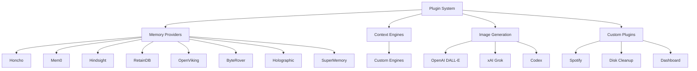
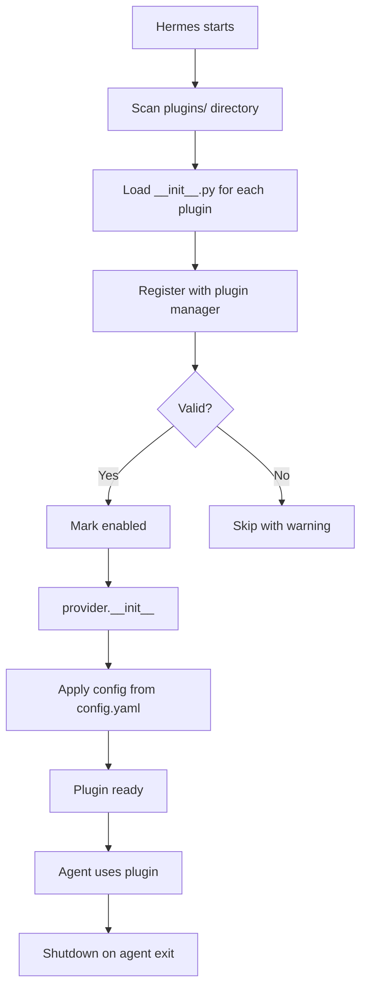

# Hermes Agent -- Plugin System

## Overview

Hermes is extensible through plugins that implement abstract base classes. Plugins can provide memory backends, context engines, image generators, and custom features.

## Plugin Categories



## Plugin Structure

Each plugin is a Python package under `plugins/`:

```
plugins/
  ├── honcho/
  │   ├── __init__.py       Plugin entry point
  │   ├── provider.py       MemoryProvider implementation
  │   └── requirements.txt  Plugin-specific dependencies
  ├── hindsight/
  │   ├── __init__.py
  │   ├── provider.py
  │   └── requirements.txt
  └── image_gen/
      ├── openai/
      │   ├── __init__.py
      │   └── provider.py
      └── xai/
          ├── __init__.py
          └── provider.py
```

## Plugin Registration and Lifecycle



## Memory Provider Plugins

All memory providers implement the `MemoryProvider` ABC (see [05-memory-system.md](./05-memory-system.md)):

### Honcho (Dialectic User Modeling)

```python
# plugins/honcho/provider.py
from agent.memory_provider import MemoryProvider

class HonchoProvider(MemoryProvider):
    """Builds a dynamic model of the user through conversation.
    Uses Honcho AI's dialectic approach -- the agent's understanding
    of the user evolves with each interaction."""

    def __init__(self, api_key, app_id):
        self.client = HonchoClient(api_key=api_key, app_id=app_id)

    async def retrieve(self, query, limit=10):
        metamemories = await self.client.get_metamemories(
            user_id=self.user_id,
            query=query,
            top_k=limit,
        )
        return [Memory(content=m.content, score=m.score) for m in metamemories]

    async def store(self, memory):
        await self.client.add_memory(
            user_id=self.user_id,
            content=memory.content,
            metadata=memory.metadata,
        )

    async def sync(self, messages):
        # Honcho auto-extracts memories from conversation
        await self.client.process_conversation(
            user_id=self.user_id,
            messages=messages,
        )

    async def search(self, query):
        return await self.retrieve(query, limit=20)
```

### Hindsight (Local Vector Search)

```python
# plugins/hindsight/provider.py
class HindsightProvider(MemoryProvider):
    """Long-term memory with local vector search.
    Stores memories as embeddings and retrieves by semantic similarity."""

    def __init__(self, db_path, embedding_model="all-MiniLM-L6-v2"):
        self.db = VectorDB(db_path)
        self.embedder = SentenceTransformer(embedding_model)

    async def retrieve(self, query, limit=10):
        embedding = self.embedder.encode(query)
        results = self.db.search(embedding, top_k=limit)
        return [Memory(content=r.text, score=r.score) for r in results]

    async def store(self, memory):
        embedding = self.embedder.encode(memory.content)
        self.db.insert(text=memory.content, embedding=embedding, metadata=memory.metadata)

    async def sync(self, messages):
        # Extract and store key information from new messages
        for msg in messages:
            if msg["role"] == "assistant":
                embedding = self.embedder.encode(msg["content"])
                self.db.insert(text=msg["content"], embedding=embedding)
```

### Mem0 (API-Based)

```python
# plugins/mem0/provider.py
class Mem0Provider(MemoryProvider):
    """Uses Mem0's hosted API for persistent memory."""

    def __init__(self, api_key):
        self.client = MemClient(api_key=api_key)

    async def retrieve(self, query, limit=10):
        results = await self.client.search(query, limit=limit, user_id=self.user_id)
        return [Memory(content=r["memory"], score=r.get("score", 0)) for r in results]

    async def store(self, memory):
        await self.client.add(memory.content, user_id=self.user_id)

    async def sync(self, messages):
        await self.client.add_messages(messages, user_id=self.user_id)
```

## Image Generation Plugins

```python
# Base interface (implicit, not a formal ABC)
class ImageGenProvider:
    async def generate(self, prompt: str, size: str = "1024x1024") -> bytes:
        """Generate an image from a text prompt."""
        ...
```

### OpenAI DALL-E

```python
# plugins/image_gen/openai/provider.py
class DalleProvider:
    async def generate(self, prompt, size="1024x1024"):
        response = await self.client.images.generate(
            model="dall-e-3",
            prompt=prompt,
            size=size,
            n=1,
        )
        image_url = response.data[0].url
        return await download(image_url)
```

### xAI Grok Image

```python
# plugins/image_gen/xai/provider.py
class GrokImageProvider:
    async def generate(self, prompt, size="1024x1024"):
        response = await self.client.post("/v1/images/generations", json={
            "model": "grok-2-image",
            "prompt": prompt,
        })
        return await download(response.json()["data"][0]["url"])
```

## Custom Plugins

### Spotify Integration

```python
# plugins/spotify/
# Adds tools for controlling Spotify playback:
# - play/pause/skip
# - search tracks
# - create playlists
# - get currently playing
```

### Disk Cleanup

```python
# plugins/disk-cleanup/
# Scheduled disk cleanup:
# - Finds large temp files
# - Clears old caches
# - Reports disk usage
```

### Dashboard (Strike Freedom Cockpit)

```python
# plugins/strike-freedom-cockpit/
# Web dashboard for monitoring Hermes:
# - Active sessions
# - API usage
# - Cron job status
# - Memory statistics
```

## Plugin Configuration

Plugins are configured in `config.yaml`:

```yaml
# Memory provider
memory_provider: "honcho"
memory_config:
  honcho:
    api_key: "..."
    app_id: "..."
  hindsight:
    db_path: "~/.hermes/hindsight.db"
  mem0:
    api_key: "..."

# Image generation
image_provider: "openai"
image_config:
  openai:
    api_key: "..."
    model: "dall-e-3"

# Custom plugins
plugins:
  - name: "spotify"
    enabled: true
    config:
      client_id: "..."
      client_secret: "..."
```

## Plugin Management CLI

```bash
# List installed plugins
hermes plugins list

# Install a plugin
hermes plugins install honcho

# Remove a plugin
hermes plugins remove hindsight

# Show plugin info
hermes plugins info honcho
```

## Creating a Custom Plugin

### 1. Create the directory

```
plugins/my-plugin/
  ├── __init__.py
  ├── provider.py
  └── requirements.txt
```

### 2. Implement the interface

```python
# plugins/my-plugin/provider.py
from agent.memory_provider import MemoryProvider

class MyProvider(MemoryProvider):
    async def retrieve(self, query, limit=10):
        # Your retrieval logic
        ...

    async def store(self, memory):
        # Your storage logic
        ...

    async def sync(self, messages):
        # Your sync logic
        ...

    async def search(self, query):
        return await self.retrieve(query, limit=20)
```

### 3. Register in `__init__.py`

```python
# plugins/my-plugin/__init__.py
from .provider import MyProvider

PLUGIN_TYPE = "memory"
PLUGIN_CLASS = MyProvider
```

### 4. Add dependencies

```
# plugins/my-plugin/requirements.txt
my-special-library>=1.0.0
```

## Key Files

```
plugins/
  ├── honcho/               Honcho memory provider
  ├── hindsight/            Hindsight (local vector search)
  ├── mem0/                 Mem0 API memory
  ├── retaindb/             RetainDB provider
  ├── openviking/           OpenViking provider
  ├── byterover/            ByteRover provider
  ├── holographic/          Holographic provider
  ├── supermemory/          SuperMemory provider
  ├── context_engine/       Custom context engines
  ├── image_gen/
  │   ├── openai/           DALL-E image generation
  │   ├── xai/              Grok image generation
  │   └── openai-codex/     Codex image integration
  ├── spotify/              Spotify integration
  ├── disk-cleanup/         Scheduled disk cleanup
  ├── strike-freedom-cockpit/ Web dashboard
  └── example-dashboard/    Plugin template
hermes_cli/
  ├── plugins_cmd.py        Plugin management CLI
  └── plugins.py            Plugin loading/discovery
```
