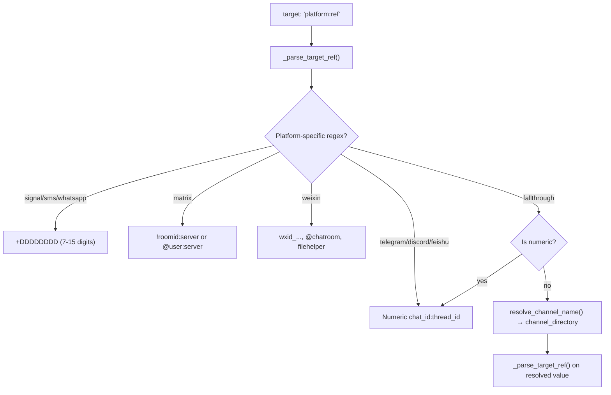

# Hermes Platform Adapters

## Purpose

The `send_message_tool.py` module (1523 lines) routes messages to **18 platforms** from a single unified interface. All platforms share the same target resolution pipeline, smart message chunking, media extraction, and error sanitization — but each connects differently.

## Aha Moments

**Aha: Telegram measures length in UTF-16 code units, not Unicode codepoints.** Python's `len()` counts codepoints (`"😀"` = 1), but Telegram's 4096 limit counts UTF-16 code units (`"😀"` = 2). Characters outside the Basic Multilingual Plane (emoji, CJK Extension B) are surrogate pairs. The `utf16_len()` function at `base.py:27` computes `len(s.encode("utf-16-le")) // 2`.

**Aha: Discord forum channels (type 15) reject POST `/messages` — a thread is created automatically.** When sending to a forum, the code detects it and creates a thread via `POST /channels/{id}/threads` with the message as a starter post. Three-layer detection: directory cache → process-local probe cache → live API probe (memoized).

**Aha: Media files are only attached to the LAST chunk of a multi-chunk message.** When `truncate_message` splits a long response, media files are passed only to the final chunk (`media_files if is_last else []`). This prevents duplicating attachments across every message.

**Aha: Message mirroring lets the agent see its own outputs.** After a successful send, the text is mirrored back into the target's gateway session via `mirror_to_session()`. The agent's own responses become conversation history for follow-up messages.

**Aha: Cron duplicate-send detection prevents redundant deliveries.** When `send_message` is called from within a cron job targeting the same destination the scheduler will auto-deliver to, `_maybe_skip_cron_duplicate_send()` returns `{"skipped": True}` instead.

## Target Resolution Pipeline



Source: `send_message_tool.py:307-336`

## Smart Message Chunking

```python
# send_message_tool.py:440-456
# Limits read from adapter class attributes, not hardcoded literals
_MAX_LENGTHS = {
    Platform.TELEGRAM: TelegramAdapter.MAX_MESSAGE_LENGTH,   # 4096 (UTF-16 code units)
    Platform.DISCORD:  DiscordAdapter.MAX_MESSAGE_LENGTH,    # 2000  (Unicode codepoints)
    Platform.SLACK:    SlackAdapter.MAX_MESSAGE_LENGTH,      # 40000 (Unicode codepoints)
}
if _feishu_available:
    _MAX_LENGTHS[Platform.FEISHU] = FeishuAdapter.MAX_MESSAGE_LENGTH  # 20000

_len_fn = utf16_len if platform == Platform.TELEGRAM else None
chunks = BasePlatformAdapter.truncate_message(message, max_len, len_fn=_len_fn)
```

The `truncate_message()` method (`base.py:2594-2723`) splits at natural boundaries (newlines > spaces), preserves code-block fences (closes/reopens with language tag), avoids splitting inline code spans, and appends `(N/M)` indicators.

## Media Extraction

The agent embeds media paths in responses using `MEDIA:` tags:

```python
# base.py:1434-1473
def extract_media(content: str) -> Tuple[List[Tuple[str, bool]], str]:
    """Extract MEDIA:<path> tags and [[audio_as_voice]] directives."""
```

Supported extensions: images (`.jpg`, `.png`, `.webp`, `.gif`), video (`.mp4`, `.mov`, `.avi`, `.mkv`), audio (`.ogg`, `.opus`, `.mp3`, `.wav`, `.m4a`), documents (`.pdf`, `.zip`, `.docx`, `.xlsx`, `.csv`, etc.).

## Adapter Types

Each platform connects differently. The subpages below cover each adapter type in depth:

| Type | Platforms | Connection Method |
|------|-----------|-------------------|
| **Bot API** | Telegram | `python-telegram-bot` Bot class (one-shot, no polling) |
| **REST API** | Discord, Slack, Mattermost, Home Assistant, DingTalk, QQBot | `aiohttp`/`httpx` direct HTTP calls |
| **Bridge/Daemon** | WhatsApp, Signal | Local bridge HTTP / JSON-RPC to signal-cli |
| **SMTP** | Email | `smtplib.SMTP` one-shot with STARTTLS |
| **Native SDK** | Feishu/Lark, Weixin, WeCom, BlueBubbles | Platform-specific SDK or adapter class |
| **Matrix Client-Server** | Matrix | REST API + full `MatrixAdapter` for media |

## Media Support by Platform

| Platform | Text | Media | Threads | Formatting |
|----------|------|-------|---------|------------|
| Telegram | Yes | Photo/video/voice/audio/doc | Topics | MarkdownV2/HTML |
| Discord | Yes | Multipart uploads | Threads + Forums | Auto-markdown |
| Signal | Yes | Attachments array | Groups | Plain text |
| Matrix | Yes | Image/video/voice/doc | Threads | HTML from markdown |
| Feishu | Yes | Image/video/voice/doc | Threads | Rich text |
| Weixin | Yes | Image/video/doc | No | Rich text |
| All others | Yes | Warning only | Varies | Platform-specific |

## Error Sanitization

All error messages pass through `_sanitize_error_text()` which redacts API keys, tokens, and webhook URLs before surfacing to users or LLMs:

```python
_URL_SECRET_QUERY_RE = re.compile(r"([?&](?:access_token|api[_-]?key|auth[_-]?token|token|signature|sig)=)([^&#\s]+)")
_GENERIC_SECRET_ASSIGN_RE = re.compile(r"\b(access_token|api[_-]?key|auth[_-]?token|signature|sig)\s*=\s*([^\s,;]+)")
```

## Subpages

| Document | Covers |
|----------|--------|
| [10a-bot-api-adapter.md](10a-bot-api-adapter.md) | Telegram — Bot API, MarkdownV2, retry logic, media |
| [10b-rest-api-adapters.md](10b-rest-api-adapters.md) | Discord (forum detection), Slack, Mattermost, Home Assistant, DingTalk, QQBot |
| [10c-bridge-daemon-adapters.md](10c-bridge-daemon-adapters.md) | WhatsApp (local bridge), Signal (JSON-RPC daemon) |
| [10d-smtp-adapter.md](10d-smtp-adapter.md) | Email — SMTP one-shot, STARTTLS |
| [10e-matrix-adapter.md](10e-matrix-adapter.md) | Matrix — Client-Server API, E2EE, full media adapter |
| [10f-native-sdk-adapters.md](10f-native-sdk-adapters.md) | Feishu/Lark, Weixin, WeCom, BlueBubbles |

[See cron scheduler for automated delivery → 08-cron.md](08-cron.md)
[See data flow end-to-end → 11-data-flow.md](11-data-flow.md)
