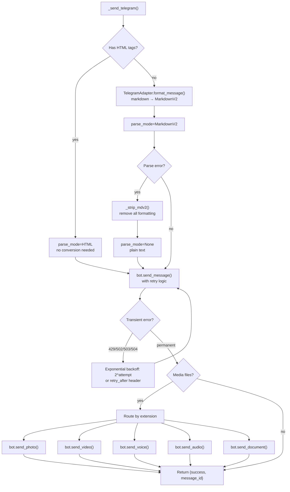

# Hermes Platform Adapters -- Bot API: Telegram

## Purpose

The Telegram adapter (`_send_telegram`, lines 588-714 of `send_message_tool.py`) connects via the Telegram Bot API using a one-shot `Bot` instance — no polling, no websocket. It handles MarkdownV2 formatting, auto-detects HTML content, retries transient failures with exponential backoff, and sends media as separate API calls.

Source: `hermes-agent/tools/send_message_tool.py:588-714`
Source: `hermes-agent/gateway/platforms/base.py:27-39` — `utf16_len()`

## Aha Moments

**Aha: Telegram measures length in UTF-16 code units, not Unicode codepoints.** Python's `len()` counts codepoints (`"😀"` = 1). Telegram's 4096-character limit counts UTF-16 code units (`"😀"` = 2). Characters outside the Basic Multilingual Plane (emoji, CJK Extension B, musical symbols) are surrogate pairs. The `utf16_len()` function:

```python
# base.py:27-39
def utf16_len(s: str) -> int:
    """Count UTF-16 code units in s."""
    return len(s.encode("utf-16-le")) // 2
```

Slicing respects surrogate-pair boundaries via binary search in `_prefix_within_utf16_limit()` (`base.py:42-58`).

**Aha: Telegram MarkdownV2 parsing falls back to plain text automatically.** If `send_message` with `parse_mode=MarkdownV2` fails (unescaped special characters), the catch block strips all MarkdownV2 formatting via `_strip_mdv2()` and retries with `parse_mode=None`. Malformed MarkdownV2 never causes a hard send failure.

**Aha: The adapter uses a one-shot Bot instance — no polling needed.** `send_message_tool.py` creates a `Bot(token)` instance, sends the message, and lets it garbage collect. This is different from the gateway adapter which uses `run_polling()` or webhooks to listen for incoming messages. For outbound delivery, only the Bot API token is needed.

## Architecture



## Implementation: Full Function Walkthrough

### 1. Format Detection (lines 600-616)

```python
# Auto-detect HTML tags — if present, skip MarkdownV2 and send as HTML
_has_html = bool(re.search(r'<[a-zA-Z/][^>]*>', message))

if _has_html:
    formatted = message
    send_parse_mode = ParseMode.HTML
else:
    from gateway.platforms.telegram import TelegramAdapter
    _adapter = TelegramAdapter.__new__(TelegramAdapter)
    formatted = _adapter.format_message(message)
    send_parse_mode = ParseMode.MARKDOWN_V2
```

The HTML detection regex `r'<[a-zA-Z/][^>]*>'` matches any HTML tag (`<b>`, `</i>`, `<a href="...">`, `<code>`). This lets the agent send raw HTML when it needs precise control (e.g., `<tg-spoiler>` for spoilers).

### 2. Retry Logic (lines 60-100, 631-659)

The retry handler distinguishes between recoverable and non-recoverable errors:

```python
def _telegram_retry_delay(exc: Exception, attempt: int) -> float | None:
    # Priority 1: retry_after header from Telegram (rate limit)
    retry_after = getattr(exc, "retry_after", None)
    if retry_after is not None:
        return max(float(retry_after), 0.0)

    text = str(exc).lower()
    # Timeouts — don't retry, give up immediately
    if "timed out" in text or "timeout" in text:
        return None

    # Server errors — exponential backoff
    if "bad gateway" in text or "502" in text or "too many requests" in text \
       or "429" in text or "service unavailable" in text or "503" in text \
       or "gateway timeout" in text or "504" in text:
        return float(2 ** attempt)  # 1s, 2s, 4s

    return None  # All other errors — fail immediately
```

Usage in `_send_telegram_message_with_retry`:

```python
async def _send_telegram_message_with_retry(bot, *, attempts=3, **kwargs):
    for attempt in range(attempts):
        try:
            return await bot.send_message(**kwargs)
        except Exception as exc:
            delay = _telegram_retry_delay(exc, attempt)
            if delay is None or attempt >= attempts - 1:
                raise
            await asyncio.sleep(delay)
```

### 3. MarkdownV2 Fallback (lines 637-659)

```python
try:
    last_msg = await _send_telegram_message_with_retry(
        bot, chat_id=int_chat_id, text=formatted,
        parse_mode=send_parse_mode, **thread_kwargs
    )
except Exception as md_error:
    if "parse" in str(md_error).lower() or "markdown" in str(md_error).lower() \
       or "html" in str(md_error).lower():
        # Parse failed — strip formatting and retry as plain text
        if not _has_html:
            from gateway.platforms.telegram import _strip_mdv2
            plain = _strip_mdv2(formatted)
        else:
            plain = message
        last_msg = await _send_telegram_message_with_retry(
            bot, chat_id=int_chat_id, text=plain,
            parse_mode=None, **thread_kwargs
        )
    else:
        raise  # Non-parse error — propagate
```

### 4. Thread/Topic Support (lines 621-625)

```python
thread_kwargs = {}
if thread_id is not None:
    thread_kwargs["message_thread_id"] = int(thread_id)
if disable_link_previews:
    thread_kwargs["disable_web_page_preview"] = True
```

Telegram supergroup topics (forum threads) are addressed by `message_thread_id`. Link preview suppression is configured per-platform via `pconfig.extra.get("disable_link_previews")`.

### 5. Media Routing (lines 661-694)

Each media file is sent as a separate API call, routed by file extension:

```python
for media_path, is_voice in media_files:
    if not os.path.exists(media_path):
        warnings.append(f"Media file not found, skipping: {media_path}")
        continue

    ext = os.path.splitext(media_path)[1].lower()
    with open(media_path, "rb") as f:
        if ext in _IMAGE_EXTS:        # .jpg, .jpeg, .png, .webp, .gif
            last_msg = await bot.send_photo(chat_id=int_chat_id, photo=f, **thread_kwargs)
        elif ext in _VIDEO_EXTS:      # .mp4, .mov, .avi, .mkv, .3gp
            last_msg = await bot.send_video(chat_id=int_chat_id, video=f, **thread_kwargs)
        elif ext in _VOICE_EXTS and is_voice:  # .ogg, .opus
            last_msg = await bot.send_voice(chat_id=int_chat_id, voice=f, **thread_kwargs)
        elif ext in _AUDIO_EXTS:      # .ogg, .opus, .mp3, .wav, .m4a
            last_msg = await bot.send_audio(chat_id=int_chat_id, audio=f, **thread_kwargs)
        else:                         # Everything else
            last_msg = await bot.send_document(chat_id=int_chat_id, document=f, **thread_kwargs)
```

Media failures are collected as warnings and don't abort the send. Only if no text AND no media succeed does the function return an error.

## Configuration

| Setting | Source | Purpose |
|---------|--------|---------|
| Token | `pconfig.token` | Bot API token from BotFather |
| Home channel | `TELEGRAM_HOME_CHANNEL` env | Default target for bare `"telegram"` sends |
| Link previews | `pconfig.extra.disable_link_previews` | Suppress URL previews |
| Proxy | `HTTPS_PROXY` env (SDK default) | `python-telegram-bot` respects standard proxy env |

## Building Your Own Bot API Adapter

The Telegram adapter pattern applies to any platform with a Python SDK that supports one-shot usage:

```python
async def _send_your_platform(token, chat_id, message, media_files=None, thread_id=None):
    # 1. Detect content type (HTML vs markdown vs plain)
    # 2. Format via your gateway adapter's format_message()
    # 3. Create one-shot client from SDK
    client = YourSDK(token=token)

    # 4. Send text with retry logic
    try:
        result = await client.send_message(
            chat_id=chat_id, text=formatted,
            parse_mode=your_format, **thread_kwargs
        )
    except ParseError:
        # 5. Fall back to plain text on format errors
        result = await client.send_message(
            chat_id=chat_id, text=plain, parse_mode=None
        )

    # 6. Route media files by extension
    for media_path, is_voice in media_files:
        ext = os.path.splitext(media_path)[1].lower()
        if ext in IMAGE_EXTS:
            await client.send_photo(chat_id=chat_id, photo=open(media_path, "rb"))
        # ... video, audio, document

    return {"success": True, "platform": "your_platform", "message_id": result.id}
```

Key patterns to copy:
- Retry logic with `retry_after` header respect
- Parse mode fallback (formatted → plain text)
- Per-file media routing with warning collection
- `thread_kwargs` pattern for thread/topic support
- `disable_link_previews` for URL preview control

## Key Files

```
tools/
  └── send_message_tool.py   ← _send_telegram() (lines 588-714)
                              ← _telegram_retry_delay() (lines 60-82)
                              ← _send_telegram_message_with_retry() (lines 85-100)

gateway/platforms/
  ├── telegram.py            ← TelegramAdapter.format_message()
  │                          ← _strip_mdv2()
  └── base.py                ← utf16_len() (line 27)
                              ← truncate_message() (line 2594)
                              ← extract_media() (line 1434)
```

[Back to platform adapters overview → 10-platform-adapters.md](10-platform-adapters.md)
[See REST API adapters → 10b-rest-api-adapters.md](10b-rest-api-adapters.md)
