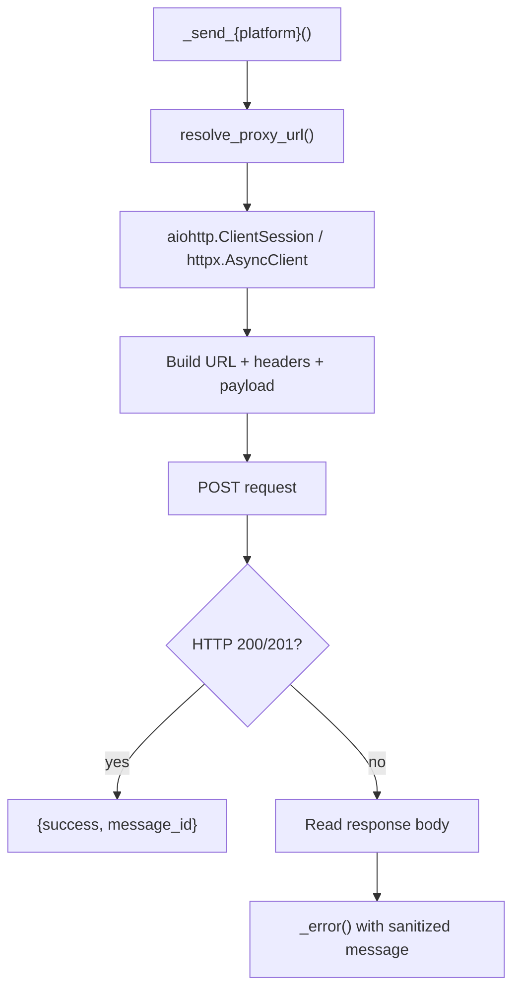

# Hermes Platform Adapters -- REST API: Discord, Slack, Mattermost, Home Assistant, DingTalk, QQBot

## Purpose

Six platforms connect via direct HTTP REST calls — no SDK needed. Each adapter constructs the appropriate URL, headers, and payload, then POSTs via `aiohttp` or `httpx`. They share the proxy resolution, error sanitization, and chunking infrastructure from the base adapter.

Source: `hermes-agent/tools/send_message_tool.py`

## Aha Moments

**Aha: Discord forum channels (type 15) reject POST `/messages` — a thread is created automatically.** When sending to a forum channel, the code detects it and creates a thread post via `POST /channels/{id}/threads`. The thread name is derived from the first line of the message, capped at 100 chars.

**Aha: Three-layer forum detection avoids unnecessary API calls.** The code checks: (1) channel directory cache, (2) process-local probe cache, (3) live `GET /channels/{id}` API probe — whose result is memoized. After the first probe, every subsequent send hits the cache.

**Aha: SMS strips all markdown because phones render it as literal characters.** Regex removal of `**`, `*`, `__`, `_`, `` ``` ``, `` ` ``, `#`, and `[text](url)` before sending. A message with `**bold**` would literally send the asterisks to the user's phone.

**Aha: Discord forum thread creation with media uses multipart `payload_json` + `files[N]` in a single API call.** This creates a forum thread with the starter message AND attachments simultaneously, avoiding the need for a separate upload step.

## Architecture: Unified REST Pattern



## Discord (`_send_discord`, lines 741-935)

| Detail | Value |
|--------|-------|
| Library | `aiohttp` (REST only — no discord.py client) |
| Formatting | Plain text (Discord auto-renders markdown) |
| Max message | 2000 chars |
| Media | Multipart/form-data file uploads |
| Auth | `Bot {token}` header |
| Proxy | `DISCORD_PROXY` env var, SOCKS/HTTP auto-detect |

### Forum Channel Detection (three-layer)

```python
# Layer 1: Channel directory cache
_channel_type = lookup_channel_type("discord", chat_id)
if _channel_type == "forum":
    is_forum = True
elif _channel_type is not None:
    is_forum = False
else:
    # Layer 2: Process-local probe cache (memoized across sends)
    cached = _probe_is_forum_cached(chat_id)
    if cached is not None:
        is_forum = cached
    else:
        # Layer 3: Live API probe (result memoized)
        info_url = f"https://discord.com/api/v10/channels/{chat_id}"
        async with aiohttp.ClientSession(timeout=15) as info_sess:
            info = await info_resp.json()
            is_forum = info.get("type") == 15  # ChannelType.GUILD_FORUM
            _remember_channel_is_forum(chat_id, is_forum)
```

The probe cache is a simple module-level dict:

```python
_DISCORD_CHANNEL_TYPE_PROBE_CACHE: Dict[str, bool] = {}

def _remember_channel_is_forum(chat_id: str, is_forum: bool) -> None:
    _DISCORD_CHANNEL_TYPE_PROBE_CACHE[str(chat_id)] = bool(is_forum)

def _probe_is_forum_cached(chat_id: str) -> Optional[bool]:
    return _DISCORD_CHANNEL_TYPE_PROBE_CACHE.get(str(chat_id))
```

### Forum Thread Creation

```python
if is_forum:
    thread_name = _derive_forum_thread_name(message)  # First line, max 100 chars
    thread_url = f"https://discord.com/api/v10/channels/{chat_id}/threads"

    if valid_media:
        # Multipart: payload_json + files[N] — single API call
        attachments_meta = [
            {"id": str(idx), "filename": os.path.basename(path)}
            for idx, path in enumerate(valid_media)
        ]
        starter_message = {"content": message, "attachments": attachments_meta}
        payload_json = json.dumps({"name": thread_name, "message": starter_message})

        form = aiohttp.FormData()
        form.add_field("payload_json", payload_json, content_type="application/json")
        for idx, media_path in enumerate(valid_media):
            form.add_field(f"files[{idx}]", open(media_path, "rb").read(), filename=...)

        resp = await session.post(thread_url, headers=auth_headers, data=form)
    else:
        # Simple JSON POST creates thread with just text
        resp = await session.post(thread_url, headers=json_headers,
            json={"name": thread_name, "message": {"content": message}})
```

### Regular Message Send

```python
url = f"https://discord.com/api/v10/channels/{chat_id}/messages"
async with session.post(url, headers=json_headers, json={"content": message}) as resp:
    if resp.status not in (200, 201):
        body = await resp.text()
        return _error(f"Discord API error ({resp.status}): {body}")
    last_data = await resp.json()
```

Media files are uploaded separately after the text message:

```python
for media_path, _is_voice in media_files:
    form = aiohttp.FormData()
    form.add_field("files[0]", open(media_path, "rb"), filename=...)
    resp = await session.post(url, headers=auth_headers, data=form)
```

## Slack (`_send_slack`, lines 938-958)

| Detail | Value |
|--------|-------|
| Library | `aiohttp` |
| Formatting | mrkdwn (applied via `SlackAdapter.format_message` before routing) |
| Max message | 40000 chars |
| API | `POST https://slack.com/api/chat.postMessage` |
| Auth | `Bearer {token}` |
| Payload | `{"channel": chat_id, "text": message, "mrkdwn": True}` |

```python
url = "https://slack.com/api/chat.postMessage"
headers = {"Authorization": f"Bearer {token}", "Content-Type": "application/json"}
payload = {"channel": chat_id, "text": message, "mrkdwn": True}
async with session.post(url, headers=headers, json=payload) as resp:
    data = await resp.json()
    if data.get("ok"):
        return {"success": True, "platform": "slack", "message_id": data.get("ts")}
    return _error(f"Slack API error: {data.get('error', 'unknown')}")
```

Slack formatting is applied in `_send_to_platform` before routing:

```python
slack_adapter = SlackAdapter.__new__(SlackAdapter)
message = slack_adapter.format_message(message)  # markdown → mrkdwn
```

## Mattermost (`_send_mattermost`, lines 1134-1155)

| Detail | Value |
|--------|-------|
| Library | `aiohttp` |
| API | `POST {base_url}/api/v4/posts` |
| Auth | `Bearer {token}` |
| Payload | `{"channel_id": chat_id, "message": message}` |
| Config | `MATTERMOST_URL` + `MATTERMOST_TOKEN` env vars |

```python
base_url = (extra.get("url") or os.getenv("MATTERMOST_URL", "")).rstrip("/")
url = f"{base_url}/api/v4/posts"
headers = {"Authorization": f"Bearer {token}", "Content-Type": "application/json"}
async with session.post(url, headers=headers, json={"channel_id": chat_id, "message": message}) as resp:
    if resp.status not in (200, 201):
        body = await resp.text()
        return _error(f"Mattermost API error ({resp.status}): {body}")
    data = await resp.json()
    return {"success": True, "platform": "mattermost", "message_id": data.get("id")}
```

## Home Assistant (`_send_homeassistant`, lines 1262-1282)

| Detail | Value |
|--------|-------|
| Library | `aiohttp` |
| API | `POST {hass_url}/api/services/notify/notify` |
| Auth | `Bearer {token}` |
| Payload | `{"message": message, "target": chat_id}` |
| Config | `HASS_URL` + `HASS_TOKEN` env vars |

```python
url = f"{hass_url}/api/services/notify/notify"
headers = {"Authorization": f"Bearer {token}", "Content-Type": "application/json"}
async with session.post(url, headers=headers, json={"message": message, "target": chat_id}) as resp:
    if resp.status not in (200, 201):
        body = await resp.text()
        return _error(f"Home Assistant API error ({resp.status}): {body}")
    return {"success": True, "platform": "homeassistant", "chat_id": chat_id}
```

## DingTalk (`_send_dingtalk`, lines 1285-1313)

| Detail | Value |
|--------|-------|
| Library | `httpx` |
| API | Static robot webhook URL |
| Auth | URL-embedded token |
| Payload | `{"msgtype": "text", "text": {"content": message}}` |
| Config | `DINGTALK_WEBHOOK_URL` env var |
| Proxy | **None** — `httpx` client does not use `resolve_proxy_url()` |

```python
webhook_url = extra.get("webhook_url") or os.getenv("DINGTALK_WEBHOOK_URL", "")
async with httpx.AsyncClient(timeout=30.0) as client:
    resp = await client.post(webhook_url,
        json={"msgtype": "text", "text": {"content": message}})
    resp.raise_for_status()
    data = resp.json()
    if data.get("errcode", 0) != 0:
        return _error(f"DingTalk API error: {data.get('errmsg', 'unknown')}")
    return {"success": True, "platform": "dingtalk", "chat_id": chat_id}
```

## QQBot (`_send_qqbot`, lines 1461-1510)

| Detail | Value |
|--------|-------|
| Library | `httpx` |
| Auth | Two-step: get access token → use for sends |
| Token endpoint | `POST https://bots.qq.com/app/getAppAccessToken` |
| Message endpoint | `POST https://api.sgroup.qq.com/channels/{chat_id}/messages` |
| Max message | 4000 chars (hardcoded) |
| Config | `QQ_APP_ID` + `QQ_CLIENT_SECRET` env vars |

The two-step auth is unique among REST adapters:

```python
# Step 1: Get access token
token_resp = await client.post(
    "https://bots.qq.com/app/getAppAccessToken",
    json={"appId": str(appid), "clientSecret": str(secret)},
)
access_token = token_data.get("access_token")

# Step 2: Send message with token
headers = {"Authorization": f"QQBot {access_token}"}
payload = {"content": message[:4000], "msg_type": 0}
resp = await client.post(url, json=payload, headers=headers)
```

## SMS (`_send_sms`, lines 1078-1131)

| Detail | Value |
|--------|-------|
| Library | Twilio REST API via `aiohttp` |
| Auth | HTTP Basic (`Account SID : Auth Token`, base64-encoded) |
| API | `POST https://api.twilio.com/2010-04-01/Accounts/{sid}/Messages.json` |
| Format | Form-encoded (`From`, `To`, `Body`) |
| Config | `TWILIO_ACCOUNT_SID`, `TWILIO_AUTH_TOKEN`, `TWILIO_PHONE_NUMBER` |

SMS strips all markdown before sending:

```python
message = re.sub(r"\*\*(.+?)\*\*", r"\1", message, flags=re.DOTALL)  # **bold**
message = re.sub(r"\*(.+?)\*", r"\1", message, flags=re.DOTALL)      # *italic*
message = re.sub(r"__(.+?)__", r"\1", message, flags=re.DOTALL)      # __underline__
message = re.sub(r"_(.+?)_", r"\1", message, flags=re.DOTALL)        # _italic_
message = re.sub(r"```[a-z]*\n?", "", message)                        # code blocks
message = re.sub(r"`(.+?)`", r"\1", message)                          # inline code
message = re.sub(r"^#{1,6}\s+", "", message, flags=re.MULTILINE)     # headings
message = re.sub(r"\[([^\]]+)\]\([^\)]+\)", r"\1", message)          # links
message = re.sub(r"\n{3,}", "\n\n", message)                          # extra newlines
```

The form-encoded POST uses `aiohttp.FormData`:

```python
creds = f"{account_sid}:{auth_token}"
encoded = base64.b64encode(creds.encode("ascii")).decode("ascii")
url = f"https://api.twilio.com/2010-04-01/Accounts/{account_sid}/Messages.json"
headers = {"Authorization": f"Basic {encoded}"}

form_data = aiohttp.FormData()
form_data.add_field("From", from_number)
form_data.add_field("To", chat_id)      # E.164 phone number with '+'
form_data.add_field("Body", message)

async with session.post(url, data=form_data, headers=headers) as resp:
    body = await resp.json()
    if resp.status >= 400:
        return _error(f"Twilio API error ({resp.status}): {body.get('message')}")
    return {"success": True, "platform": "sms", "message_id": body.get("sid")}
```

## Proxy Resolution

All REST adapters (except DingTalk which uses httpx) share the same proxy resolution from `base.py`:

```python
from gateway.platforms.base import resolve_proxy_url, proxy_kwargs_for_aiohttp
_proxy = resolve_proxy_url(platform_env_var="DISCORD_PROXY")  # or None
_sess_kw, _req_kw = proxy_kwargs_for_aiohttp(_proxy)

# SOCKS → {"connector": ProxyConnector(...)}  (rdns=True for remote DNS)
# HTTP  → ({}, {"proxy": url})
# None  → ({}, {})

async with aiohttp.ClientSession(timeout=30, **_sess_kw) as session:
    async with session.post(url, headers=headers, json=payload, **_req_kw) as resp:
        ...
```

Proxy check order: `PLATFORM_PROXY` env → `HTTPS_PROXY`/`HTTP_PROXY` → macOS system proxy (`scutil --proxy`). Respects `NO_PROXY`/`no_proxy` for bypass.

## Building Your Own REST API Adapter

The pattern for any REST-based platform:

```python
async def _send_your_platform(config, chat_id, message, thread_id=None):
    try:
        import aiohttp
    except ImportError:
        return {"error": "aiohttp not installed"}

    from gateway.platforms.base import resolve_proxy_url, proxy_kwargs_for_aiohttp
    proxy = resolve_proxy_url(platform_env_var="YOUR_PROXY")
    sess_kw, req_kw = proxy_kwargs_for_aiohttp(proxy)

    # Build request
    url = f"YOUR_API_URL/channels/{chat_id}/messages"
    headers = {"Authorization": f"Bearer {config.token}"}
    payload = {"content": message}
    if thread_id:
        payload["thread_id"] = thread_id

    async with aiohttp.ClientSession(timeout=aiohttp.ClientTimeout(total=30), **sess_kw) as session:
        async with session.post(url, headers=headers, json=payload, **req_kw) as resp:
            if resp.status not in (200, 201):
                body = await resp.text()
                return _error(f"YourPlatform API error ({resp.status}): {body}")
            data = await resp.json()
            return {"success": True, "platform": "your_platform", "message_id": data.get("id")}
```

Key patterns:
- Use `aiohttp` for HTTP/HTTP proxy, `httpx` for simpler cases
- Resolve proxy via `resolve_proxy_url()` + `proxy_kwargs_for_aiohttp()`
- Always use `_error()` for error messages (sanitizes secrets)
- Return `{"success": True, "platform": "name", "message_id": "..."}` on success
- Support `thread_id` for thread/topic platforms

## Key Files

```
tools/
  └── send_message_tool.py   ← _send_discord() (lines 741-935)
                              ← _send_slack() (lines 938-958)
                              ← _send_mattermost() (lines 1134-1155)
                              ← _send_homeassistant() (lines 1262-1282)
                              ← _send_dingtalk() (lines 1285-1313)
                              ← _send_qqbot() (lines 1461-1510)
                              ← _send_sms() (lines 1078-1131)

gateway/platforms/
  └── base.py                ← resolve_proxy_url() (line 242)
                              ← proxy_kwargs_for_aiohttp() (line 306)
```

[Back to platform adapters overview → 10-platform-adapters.md](10-platform-adapters.md)
[See bridge/daemon adapters → 10c-bridge-daemon-adapters.md](10c-bridge-daemon-adapters.md)
