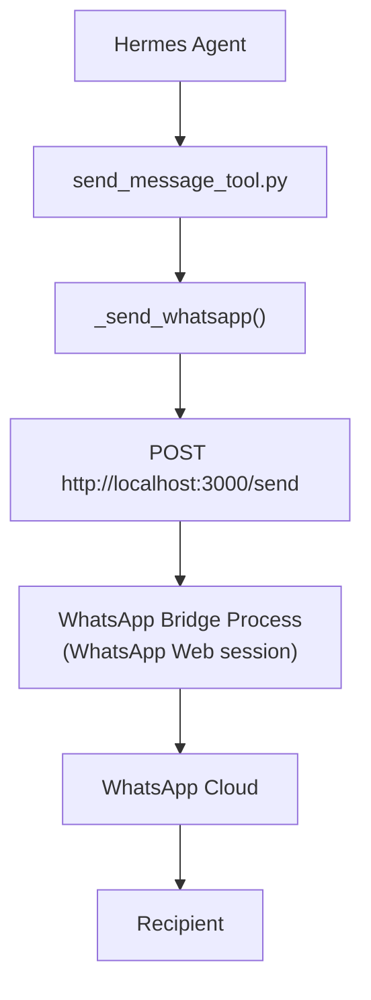
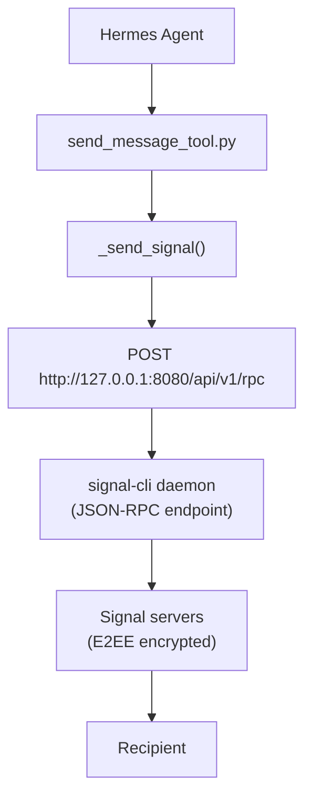

# Hermes Platform Adapters -- Bridge/Daemon: WhatsApp and Signal

## Purpose

WhatsApp and Signal connect via local processes rather than direct cloud APIs. WhatsApp uses a local bridge HTTP API (typically a WhatsApp Web session), while Signal uses JSON-RPC to a local `signal-cli` daemon. Both avoid cloud API dependencies by running on localhost.

Source: `hermes-agent/tools/send_message_tool.py`

## Aha Moments

**Aha: WhatsApp uses a local bridge HTTP API, not direct cloud API calls.** The adapter POSTs to `http://localhost:{bridge_port}/send` with `{"chatId": ..., "message": ...}`. The bridge is a separate process (typically a WhatsApp Web session) that the gateway communicates with over localhost. No Twilio/Vonage dependency needed.

**Aha: Signal uses JSON-RPC to a local signal-cli daemon.** The adapter sends `{"jsonrpc": "2.0", "method": "send", "params": {"account": ..., "recipient": [...], "message": ...}}` to `http://127.0.0.1:8080/api/v1/rpc`. Attachments are passed as an `"attachments"` array of file paths in the same params object — signal-cli reads the files directly from disk.

**Aha: E.164 phone number preservation for Signal/SMS/WhatsApp.** The target parser explicitly preserves the leading `+` in phone numbers (`_E164_TARGET_RE` matches `^\s*\+(\d{7,15})\s*$`). Without this, `"+15551234567"` would fail the `isdigit()` check and fall through to channel-name resolution, which has no way to resolve a raw phone number.

## Architecture: WhatsApp



### WhatsApp Implementation (`_send_whatsapp`, lines 961-986)

| Detail | Value |
|--------|-------|
| Connection | Local bridge HTTP API |
| Endpoint | `POST http://localhost:{bridge_port}/send` |
| Default port | 3000 |
| Auth | None (localhost only) |
| Payload | `{"chatId": chat_id, "message": message}` |
| Response | `{"messageId": "..."}` |
| Library | `aiohttp` |

```python
async def _send_whatsapp(extra, chat_id, message):
    try:
        import aiohttp
    except ImportError:
        return {"error": "aiohttp not installed. Run: pip install aiohttp"}

    bridge_port = extra.get("bridge_port", 3000)
    async with aiohttp.ClientSession() as session:
        async with session.post(
            f"http://localhost:{bridge_port}/send",
            json={"chatId": chat_id, "message": message},
            timeout=aiohttp.ClientTimeout(total=30),
        ) as resp:
            if resp.status == 200:
                data = await resp.json()
                return {
                    "success": True,
                    "platform": "whatsapp",
                    "chat_id": chat_id,
                    "message_id": data.get("messageId"),
                }
            body = await resp.text()
            return _error(f"WhatsApp bridge error ({resp.status}): {body}")
```

The `extra` config dict contains `bridge_port` (default 3000). The bridge must be running and accessible on localhost before messages can be sent.

### Configuration

```yaml
# config.yaml
platforms:
  - name: whatsapp
    enabled: true
    extra:
      bridge_port: 3000  # Port of the WhatsApp bridge process
```

## Architecture: Signal



### Signal Implementation (`_send_signal`, lines 989-1043)

| Detail | Value |
|--------|-------|
| Connection | JSON-RPC to local signal-cli daemon |
| Endpoint | `POST {http_url}/api/v1/rpc` |
| Default URL | `http://127.0.0.1:8080` |
| Auth | Account string (registered phone number) |
| Library | `httpx` |
| Groups | `chat_id` prefixed with `group:` → `groupId` param |
| Individuals | `chat_id` without prefix → `recipient` array |
| Attachments | File paths in `attachments` array |

```python
async def _send_signal(extra, chat_id, message, media_files=None):
    try:
        import httpx
    except ImportError:
        return {"error": "httpx not installed"}

    http_url = extra.get("http_url", "http://127.0.0.1:8080").rstrip("/")
    account = extra.get("account", "")
    if not account:
        return {"error": "Signal account not configured"}

    # Build params — group vs individual recipient
    params = {"account": account, "message": message}
    if chat_id.startswith("group:"):
        params["groupId"] = chat_id[6:]       # Strip "group:" prefix
    else:
        params["recipient"] = [chat_id]        # E.164 phone number with '+'

    # Add attachments if media files are present
    valid_media = media_files or []
    attachment_paths = []
    for media_path, _is_voice in valid_media:
        if os.path.exists(media_path):
            attachment_paths.append(media_path)

    if attachment_paths:
        params["attachments"] = attachment_paths  # signal-cli reads from disk

    # Build JSON-RPC request
    payload = {
        "jsonrpc": "2.0",
        "method": "send",
        "params": params,
        "id": f"send_{int(time.time() * 1000)}",
    }

    async with httpx.AsyncClient(timeout=30.0) as client:
        resp = await client.post(f"{http_url}/api/v1/rpc", json=payload)
        resp.raise_for_status()
        data = resp.json()
        if "error" in data:
            return _error(f"Signal RPC error: {data['error']}")

        result = {"success": True, "platform": "signal", "chat_id": chat_id}
        if len(attachment_paths) < len(valid_media):
            result["warnings"] = ["Some media files were skipped (not found on disk)"]
        return result
```

Key design decisions:
- **File paths, not bytes**: signal-cli reads attachment files directly from disk, avoiding the overhead of base64 encoding and transferring file contents over JSON-RPC.
- **Group detection**: `chat_id.startswith("group:")` — Signal group IDs are opaque strings prefixed with `group:`.
- **E.164 preservation**: Individual recipients use the full `+15551234567` format (preserved by `_parse_target_ref`).

### Configuration

```yaml
# config.yaml
platforms:
  - name: signal
    enabled: true
    extra:
      http_url: "http://127.0.0.1:8080"  # signal-cli JSON-RPC endpoint
      account: "+15551234567"             # Registered phone number
```

### Running signal-cli

The signal-cli daemon must be running before Hermes can send messages:

```bash
# Start signal-cli in JSON-RPC mode
signal-cli -a +15551234567 daemon --json-rpc -u 8080
```

## Building Your Own Bridge/Daemon Adapter

For platforms that run as local processes:

```python
async def _send_your_bridge(extra, chat_id, message):
    """Local bridge via HTTP."""
    import aiohttp
    host = extra.get("host", "localhost")
    port = extra.get("port", 3000)

    async with aiohttp.ClientSession() as session:
        async with session.post(
            f"http://{host}:{port}/send",
            json={"target": chat_id, "content": message},
            timeout=aiohttp.ClientTimeout(total=30),
        ) as resp:
            if resp.status == 200:
                data = await resp.json()
                return {"success": True, "platform": "your_platform", "message_id": data.get("id")}
            return _error(f"Bridge error ({resp.status}): {await resp.text()}")


async def _send_your_daemon(extra, chat_id, message):
    """Local daemon via JSON-RPC."""
    import httpx
    url = extra.get("rpc_url", "http://127.0.0.1:8080")

    payload = {
        "jsonrpc": "2.0",
        "method": "send",
        "params": {"recipient": chat_id, "text": message},
        "id": f"send_{int(time.time() * 1000)}",
    }

    async with httpx.AsyncClient(timeout=30.0) as client:
        resp = await client.post(f"{url}/rpc", json=payload)
        resp.raise_for_status()
        data = resp.json()
        if "error" in data:
            return _error(f"RPC error: {data['error']}")
        return {"success": True, "platform": "your_platform"}
```

When to use bridge/daemon pattern:
- **Bridge (HTTP)**: When the platform has a web-based session model (WhatsApp Web, iMessage via BlueBubbles). The bridge manages the session, your adapter just POSTs to it.
- **Daemon (JSON-RPC)**: When the platform has a CLI tool with a daemon mode (signal-cli). The daemon handles encryption, registration, and protocol complexity.

## Key Files

```
tools/
  └── send_message_tool.py   ← _send_whatsapp() (lines 961-986)
                              ← _send_signal() (lines 989-1043)
```

[Back to platform adapters overview → 10-platform-adapters.md](10-platform-adapters.md)
[See SMTP adapter → 10d-smtp-adapter.md](10d-smtp-adapter.md)
