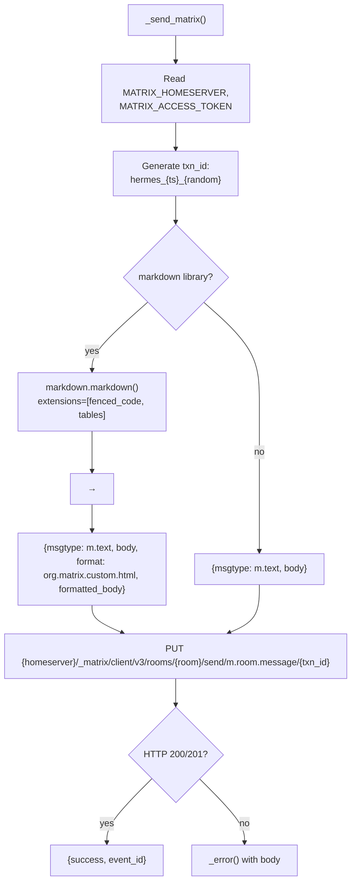
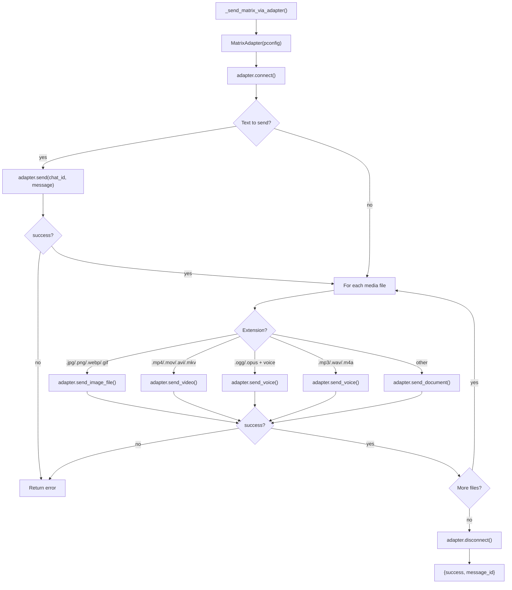

# Hermes Platform Adapters -- Matrix: Client-Server API + E2EE

## Purpose

Matrix has two send paths: a lightweight REST API for text-only messages (`_send_matrix`, lines 1158-1199) and the full `MatrixAdapter` class for native media uploads (`_send_matrix_via_adapter`, lines 1202-1259). The Matrix adapter supports E2EE (end-to-end encryption) when the gateway is running, which the standalone HTTP path cannot provide.

Source: `hermes-agent/tools/send_message_tool.py:1158-1259`
Source: `hermes-agent/gateway/platforms/matrix.py` — `MatrixAdapter` class
Source: `hermes-agent/cron/scheduler.py:407-444` — live adapter delivery for E2EE

## Aha Moments

**Aha: Matrix has two distinct send paths — lightweight REST for text, full adapter for media.** The text-only path uses a simple `PUT /rooms/{id}/send/m.room.message/{txn_id}` with the Matrix Client-Server API. When media files are present, the full `MatrixAdapter` class is instantiated, connected, and used for `send_image_file`, `send_video`, `send_voice`, and `send_document`.

**Aha: Live adapter delivery supports E2EE rooms where HTTP fallback cannot.** When the gateway is running and cron needs to deliver to an encrypted Matrix room, it prefers the live adapter (which has the encryption keys). Only if the live adapter fails does it fall back to the standalone HTTP path, which sends unencrypted.

**Aha: Dedup via random transaction ID.** Each send uses `txn_id = f"hermes_{ts}_{os.urandom(4).hex()}"` to prevent duplicate messages on retries. Matrix servers deduplicate by transaction ID, so retrying a send with the same `txn_id` is safe.

**Aha: Markdown → HTML with heading conversion.** The adapter converts markdown to HTML via the `markdown` library, then converts `<h1>` through `<h6>` to `<strong>` for Element X compatibility (which doesn't render headings well in room messages).

## Architecture: Text-Only Path



## Architecture: Media Path



## Implementation: Text-Only Path

```python
# send_message_tool.py:1158-1199
async def _send_matrix(token, extra, chat_id, message):
    homeserver = (extra.get("homeserver") or os.getenv("MATRIX_HOMESERVER", "")).rstrip("/")
    token = token or os.getenv("MATRIX_ACCESS_TOKEN", "")
    if not homeserver or not token:
        return {"error": "Matrix not configured (MATRIX_HOMESERVER, MATRIX_ACCESS_TOKEN required)"}

    # Unique transaction ID for deduplication
    txn_id = f"hermes_{int(time.time() * 1000)}_{os.urandom(4).hex()}"
    from urllib.parse import quote
    encoded_room = quote(chat_id, safe="")
    url = f"{homeserver}/_matrix/client/v3/rooms/{encoded_room}/send/m.room.message/{txn_id}"
    headers = {"Authorization": f"Bearer {token}", "Content-Type": "application/json"}

    # Build message payload with optional HTML formatted_body
    payload = {"msgtype": "m.text", "body": message}
    try:
        import markdown as _md
        html = _md.markdown(message, extensions=["fenced_code", "tables"])
        # Convert h1-h6 to bold for Element X compatibility
        html = re.sub(r"<h[1-6]>(.*?)</h[1-6]>", r"<strong>\1</strong>", html)
        payload["format"] = "org.matrix.custom.html"
        payload["formatted_body"] = html
    except ImportError:
        pass  # Plain text fallback if markdown library not installed

    async with aiohttp.ClientSession(timeout=30) as session:
        async with session.put(url, headers=headers, json=payload) as resp:
            if resp.status not in (200, 201):
                body = await resp.text()
                return _error(f"Matrix API error ({resp.status}): {body}")
            data = await resp.json()
    return {"success": True, "platform": "matrix", "chat_id": chat_id, "message_id": data.get("event_id")}
```

### Markdown → HTML Conversion

```python
html = markdown.markdown(message, extensions=["fenced_code", "tables"])
# Before: ## Heading\n**bold** and `code`
# After: <h2>Heading</h2>\n<p><strong>bold</strong> and <code>code</code></p>

# Then convert headings to <strong> for Element X
html = re.sub(r"<h[1-6]>(.*?)</h[1-6]>", r"<strong>\1</strong>", html)
# Final: <p><strong>Heading</strong></p>\n<p><strong>bold</strong> and <code>code</code></p>
```

## Implementation: Media Path

```python
# send_message_tool.py:1202-1259
async def _send_matrix_via_adapter(pconfig, chat_id, message, media_files=None, thread_id=None):
    from gateway.platforms.matrix import MatrixAdapter

    try:
        adapter = MatrixAdapter(pconfig)
        connected = await adapter.connect()
        if not connected:
            return _error("Matrix connect failed")

        metadata = {"thread_id": thread_id} if thread_id else None
        last_result = None

        # Send text first
        if message.strip():
            last_result = await adapter.send(chat_id, message, metadata=metadata)
            if not last_result.success:
                return _error(f"Matrix send failed: {last_result.error}")

        # Route media files by extension
        for media_path, is_voice in media_files:
            if not os.path.exists(media_path):
                return _error(f"Media file not found: {media_path}")

            ext = os.path.splitext(media_path)[1].lower()
            if ext in _IMAGE_EXTS:
                last_result = await adapter.send_image_file(chat_id, media_path, metadata=metadata)
            elif ext in _VIDEO_EXTS:
                last_result = await adapter.send_video(chat_id, media_path, metadata=metadata)
            elif ext in _VOICE_EXTS and is_voice:
                last_result = await adapter.send_voice(chat_id, media_path, metadata=metadata)
            elif ext in _AUDIO_EXTS:
                last_result = await adapter.send_voice(chat_id, media_path, metadata=metadata)
            else:
                last_result = await adapter.send_document(chat_id, media_path, metadata=metadata)

            if not last_result.success:
                return _error(f"Matrix media send failed: {last_result.error}")

        return {"success": True, "platform": "matrix", "chat_id": chat_id, "message_id": last_result.message_id}
    except Exception as e:
        return _error(f"Matrix send failed: {e}")
    finally:
        try:
            await adapter.disconnect()
        except Exception:
            pass
```

## E2EE Delivery in Cron

When the gateway is running and cron needs to deliver to a Matrix room, it uses the live adapter (which has encryption keys):

```python
# scheduler.py:407-444
runtime_adapter = (adapters or {}).get(platform)
if runtime_adapter is not None and loop is not None:
    try:
        future = asyncio.run_coroutine_threadsafe(
            runtime_adapter.send(chat_id, text_to_send, metadata=send_metadata),
            loop,
        )
        send_result = future.result(timeout=60)
        if send_result.success:
            # Send media via the live adapter too
            if media_files:
                _send_media_via_adapter(runtime_adapter, chat_id, media_files, send_metadata, loop, job)
            delivered = True
    except Exception:
        # Fall back to standalone HTTP path (won't support E2EE)
        pass
```

## Configuration

```yaml
# config.yaml
platforms:
  - name: matrix
    enabled: true
    token: "your-access-token"
    extra:
      homeserver: "https://matrix.example.com"
```

```bash
# Environment variables (alternative)
export MATRIX_HOMESERVER="https://matrix.example.com"
export MATRIX_ACCESS_TOKEN="your-access-token"
```

## Building Your Own Matrix Adapter

```python
async def _send_matrix(homeserver, token, room_id, message):
    import aiohttp
    from urllib.parse import quote

    txn_id = f"myapp_{int(time.time() * 1000)}"
    encoded_room = quote(room_id, safe="")
    url = f"{homeserver}/_matrix/client/v3/rooms/{encoded_room}/send/m.room.message/{txn_id}"

    payload = {"msgtype": "m.text", "body": message}
    # Optional: add HTML formatted_body for rich rendering

    async with aiohttp.ClientSession() as session:
        async with session.put(url,
            headers={"Authorization": f"Bearer {token}"},
            json=payload
        ) as resp:
            data = await resp.json()
            return data.get("event_id")
```

For E2EE support, use the full `MatrixAdapter` class which handles encryption via `mautrix`:

```python
from gateway.platforms.matrix import MatrixAdapter
from gateway.config import PlatformConfig

pconfig = PlatformConfig(
    token="access-token",
    extra={"homeserver": "https://matrix.example.com"},
)
adapter = MatrixAdapter(pconfig)
await adapter.connect()
await adapter.send("!room:server.org", "Hello from Matrix!")
await adapter.disconnect()
```

## Key Files

```
tools/
  └── send_message_tool.py   ← _send_matrix() (lines 1158-1199)
                              ← _send_matrix_via_adapter() (lines 1202-1259)

gateway/platforms/
  └── matrix.py              ← MatrixAdapter class (connect, send, media)

cron/
  └── scheduler.py           ← Live adapter delivery (lines 407-444)
```

[Back to platform adapters overview → 10-platform-adapters.md](10-platform-adapters.md)
[See native SDK adapters → 10f-native-sdk-adapters.md](10f-native-sdk-adapters.md)
