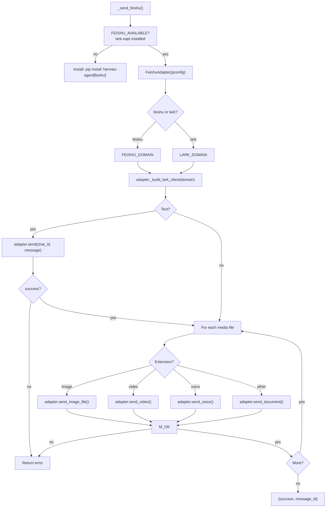

# Hermes Platform Adapters -- Native SDK: Feishu/Lark, Weixin, WeCom, BlueBubbles

## Purpose

Four platforms use native SDKs or adapter classes for their full send pipelines. Feishu/Lark uses the `lark-oapi` SDK, Weixin uses the iLink native API, WeCom uses a WebSocket-based adapter, and BlueBubbles connects to an iMessage server via REST. These adapters manage connections, authentication, and media uploads through platform-specific libraries.

Source: `hermes-agent/tools/send_message_tool.py`

## Aha Moments

**Aha: Weixin can be configured purely via `.env` without a `gateway.yaml` entry.** The `send_message_tool` synthesizes a `PlatformConfig` from `WEIXIN_TOKEN`, `WEIXIN_ACCOUNT_ID`, and `WEIXIN_BASE_URL` environment variables. This is unique — all other platforms require a `config.yaml` entry.

**Aha: Feishu/Lark auto-detects between Feishu (China) and Lark (global) domains.** The adapter reads `_domain_name` from config and selects `FEISHU_DOMAIN` or `LARK_DOMAIN` accordingly, then builds the `lark-oapi` client with the correct base URL.

**Aha: WeCom and BlueBubbles use a connect → send → disconnect lifecycle.** Unlike the REST adapters that are stateless, these adapters maintain a connection (WebSocket for WeCom, HTTP session for BlueBubbles) that must be explicitly opened and closed for each send.

## Architecture: Feishu/Lark



## Feishu/Lark (`_send_feishu`, lines 1391-1445)

| Detail | Value |
|--------|-------|
| Library | `lark-oapi` SDK |
| Connection | Feishu or Lark domain (auto-detected) |
| Max message | 20000 chars |
| Media | `send_image_file`, `send_video`, `send_voice`, `send_document` |
| Threads | `thread_id` passed via metadata dict |
| Config | Feishu app ID + secret, or Lark equivalents |

```python
async def _send_feishu(pconfig, chat_id, message, media_files=None, thread_id=None):
    from gateway.platforms.feishu import FeishuAdapter, FEISHU_AVAILABLE
    if not FEISHU_AVAILABLE:
        return {"error": "Feishu dependencies not installed. Run: pip install 'hermes-agent[feishu]'"}
    from gateway.platforms.feishu import FEISHU_DOMAIN, LARK_DOMAIN

    adapter = FeishuAdapter(pconfig)
    domain_name = getattr(adapter, "_domain_name", "feishu")
    domain = FEISHU_DOMAIN if domain_name != "lark" else LARK_DOMAIN
    adapter._client = adapter._build_lark_client(domain)
    metadata = {"thread_id": thread_id} if thread_id else None

    last_result = None
    if message.strip():
        last_result = await adapter.send(chat_id, message, metadata=metadata)
        if not last_result.success:
            return _error(f"Feishu send failed: {last_result.error}")

    for media_path, is_voice in media_files:
        ext = os.path.splitext(media_path)[1].lower()
        if ext in _IMAGE_EXTS:
            last_result = await adapter.send_image_file(chat_id, media_path, metadata=metadata)
        elif ext in _VIDEO_EXTS:
            last_result = await adapter.send_video(chat_id, media_path, metadata=metadata)
        elif ext in _VOICE_EXTS and is_voice:
            last_result = await adapter.send_voice(chat_id, media_path, metadata=metadata)
        elif ext in _AUDIO_EXTS:
            last_result = await adapter.send_voice(chat_id, media_path, metadata=metadata)
        else:
            last_result = await adapter.send_document(chat_id, media_path, metadata=metadata)

        if not last_result.success:
            return _error(f"Feishu media send failed: {last_result.error}")
```

### Feishu Target Parsing

Feishu uses structured ID formats that are recognized as explicit targets:

```python
_FEISHU_TARGET_RE = re.compile(r"^\s*((?:oc|ou|on|chat|open)_[-A-Za-z0-9]+)(?::([-A-Za-z0-9_]+))?\s*$")
# Matches: oc_abc123, ou_user456, on_..., chat_..., open_...
# Optional thread_id after colon: oc_abc123:thread_id
```

## Weixin (`_send_weixin`, lines 1343-1361)

| Detail | Value |
|--------|-------|
| Connection | Weixin iLink native API |
| Auth | `WEIXIN_TOKEN` + `WEIXIN_ACCOUNT_ID` (env-only, no config.yaml needed) |
| Media | `send_weixin_direct` with media_files support |
| Config | Can be purely env-based — unique among all platforms |

```python
async def _send_weixin(pconfig, chat_id, message, media_files=None):
    from gateway.platforms.weixin import check_weixin_requirements, send_weixin_direct
    if not check_weixin_requirements():
        return {"error": "Weixin requirements not met. Need aiohttp + cryptography."}

    return await send_weixin_direct(
        extra=pconfig.extra,
        token=pconfig.token,
        chat_id=chat_id,
        message=message,
        media_files=media_files,
    )
```

The env-only configuration is synthesized in `_handle_send`:

```python
# send_message_tool.py:228-242
if platform_name == "weixin":
    wx_token = os.getenv("WEIXIN_TOKEN", "").strip()
    wx_account = os.getenv("WEIXIN_ACCOUNT_ID", "").strip()
    if wx_token and wx_account:
        pconfig = PlatformConfig(
            enabled=True,
            token=wx_token,
            extra={
                "account_id": wx_account,
                "base_url": os.getenv("WEIXIN_BASE_URL", "").strip(),
                "cdn_base_url": os.getenv("WEIXIN_CDN_BASE_URL", "").strip(),
            },
        )
    else:
        return tool_error(f"Platform '{platform_name}' is not configured...")
```

### Weixin Target Parsing

```python
_WEIXIN_TARGET_RE = re.compile(r"^\s*((?:wxid|gh|v\d+|wm|wb)_[A-Za-z0-9_-]+|[A-Za-z0-9._-]+@chatroom|filehelper)\s*$")
# Matches: wxid_abc123, gh_def456, v1_..., user@chatroom, filehelper
```

## WeCom (`_send_wecom`, lines 1316-1340)

| Detail | Value |
|--------|-------|
| Connection | WebSocket-based send pipeline via `WeComAdapter` |
| Auth | `WECOM_BOT_ID` + `WECOM_BOT_SECRET` |
| Lifecycle | Connect → send → disconnect (one-shot) |
| Library | `aiohttp` |

```python
async def _send_wecom(extra, chat_id, message):
    from gateway.platforms.wecom import WeComAdapter, check_wecom_requirements
    if not check_wecom_requirements():
        return {"error": "WeCom requirements not met. Need aiohttp + WECOM_BOT_ID/SECRET."}

    from gateway.config import PlatformConfig
    pconfig = PlatformConfig(extra=extra)
    adapter = WeComAdapter(pconfig)
    connected = await adapter.connect()
    if not connected:
        return _error(f"WeCom: failed to connect - {adapter.fatal_error_message or 'unknown error'}")
    try:
        result = await adapter.send(chat_id, message)
        if not result.success:
            return _error(f"WeCom send failed: {result.error}")
        return {"success": True, "platform": "wecom", "message_id": result.message_id}
    finally:
        await adapter.disconnect()
```

## BlueBubbles (`_send_bluebubbles`, lines 1364-1388)

| Detail | Value |
|--------|-------|
| Connection | BlueBubbles iMessage server REST API |
| Auth | Server URL + password |
| Lifecycle | Connect → send → disconnect (one-shot) |
| Library | `aiohttp` + `httpx` |

```python
async def _send_bluebubbles(extra, chat_id, message):
    from gateway.platforms.bluebubbles import BlueBubblesAdapter, check_bluebubbles_requirements
    if not check_bluebubbles_requirements():
        return {"error": "BlueBubbles requirements not met (need aiohttp + httpx)."}

    from gateway.config import PlatformConfig
    pconfig = PlatformConfig(extra=extra)
    adapter = BlueBubblesAdapter(pconfig)
    connected = await adapter.connect()
    if not connected:
        return _error("BlueBubbles: failed to connect to server")
    try:
        result = await adapter.send(chat_id, message)
        if not result.success:
            return _error(f"BlueBubbles send failed: {result.error}")
        return {"success": True, "platform": "bluebubbles", "message_id": result.message_id}
    finally:
        await adapter.disconnect()
```

## Connect → Send → Disconnect Pattern

WeCom and BlueBubbles share a lifecycle pattern that applies to any connection-based platform:

```python
async def _send_connection_based(extra, chat_id, message):
    # 1. Check requirements
    check_requirements()

    # 2. Build config and adapter
    pconfig = PlatformConfig(extra=extra)
    adapter = YourAdapter(pconfig)

    # 3. Connect
    connected = await adapter.connect()
    if not connected:
        return _error(f"Failed to connect: {adapter.fatal_error_message}")

    # 4. Send (always in try/finally to ensure disconnect)
    try:
        result = await adapter.send(chat_id, message)
        if not result.success:
            return _error(f"Send failed: {result.error}")
        return {"success": True, "platform": "your_platform", "message_id": result.message_id}
    finally:
        await adapter.disconnect()
```

The `try/finally` ensures the connection is closed even if the send raises an exception, preventing resource leaks (open WebSocket connections, unclosed HTTP sessions).

## Building Your Own Native SDK Adapter

For platforms with Python SDKs:

```python
async def _send_your_sdk(pconfig, chat_id, message, media_files=None):
    # 1. Check SDK availability
    try:
        from your_platform_sdk import Client
    except ImportError:
        return {"error": "your-platform-sdk not installed"}

    # 2. Initialize client
    client = Client(
        app_id=pconfig.extra.get("app_id"),
        secret=pconfig.token,
    )

    # 3. Send text
    result = await client.send_message(
        target=chat_id,
        content=message,
    )

    # 4. Send media (if supported)
    for media_path, is_voice in media_files or []:
        ext = os.path.splitext(media_path)[1].lower()
        if ext in IMAGE_EXTS:
            await client.send_image(target=chat_id, file=media_path)
        elif ext in VIDEO_EXTS:
            await client.send_video(target=chat_id, file=media_path)
        else:
            await client.send_file(target=chat_id, file=media_path)

    return {"success": True, "platform": "your_platform", "message_id": result.id}
```

For connection-based adapters (WebSocket, persistent sessions):

```python
async def _send_with_connection(pconfig, chat_id, message):
    adapter = YourAdapter(pconfig)
    connected = await adapter.connect()
    if not connected:
        return _error("Connection failed")
    try:
        result = await adapter.send(chat_id, message)
        return {"success": True, "message_id": result.id}
    finally:
        await adapter.disconnect()  # Always clean up
```

## Key Files

```
tools/
  └── send_message_tool.py   ← _send_feishu() (lines 1391-1445)
                              ← _send_weixin() (lines 1343-1361)
                              ← _send_wecom() (lines 1316-1340)
                              ← _send_bluebubbles() (lines 1364-1388)

gateway/platforms/
  ├── feishu.py              ← FeishuAdapter (lark-oapi SDK)
  ├── weixin.py              ← send_weixin_direct (iLink native API)
  ├── wecom.py               ← WeComAdapter (WebSocket)
  └── bluebubbles.py         ← BlueBubblesAdapter (REST API)
```

[Back to platform adapters overview → 10-platform-adapters.md](10-platform-adapters.md)
