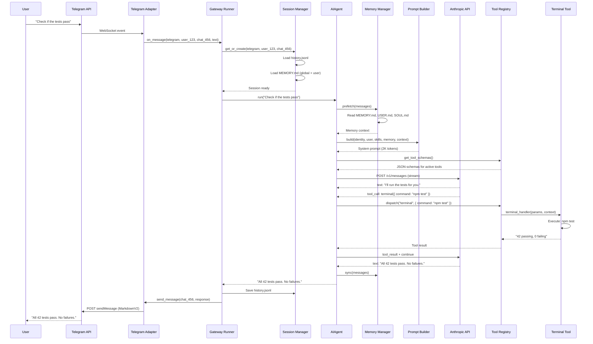
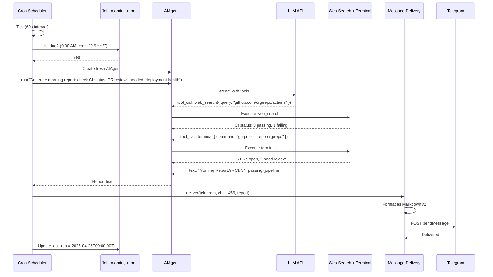
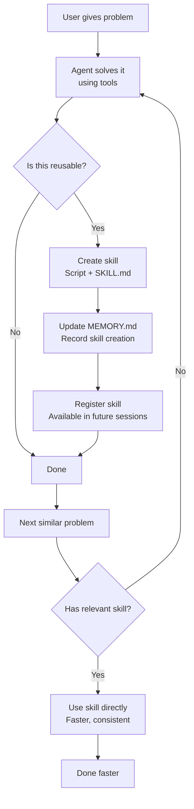
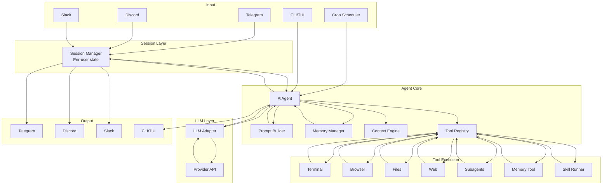

# Hermes Agent -- Data Flow (End-to-End)

## Overview

Three end-to-end flows showing how data moves through the entire Hermes system:
1. Telegram message → Agent → Response
2. Cron job execution
3. Self-improvement (skill creation)

## Flow 1: Telegram Message to Response

A user sends a message to the Hermes bot on Telegram.



### What Happens at Each Layer

| Layer | Responsibility |
|-------|---------------|
| Telegram Adapter | Parse WebSocket event, extract user/channel/text |
| Gateway Runner | Route to session, coordinate agent lifecycle |
| Session Manager | Load/save history, manage per-user state |
| Memory Manager | Prefetch relevant memories, sync after response |
| Prompt Builder | Assemble system prompt from persona + memory + context |
| AIAgent | Loop: call LLM, execute tools, repeat until done |
| Tool Registry | Dispatch tool calls to handlers |
| Terminal Tool | Execute shell commands, return output |
| Anthropic API | Generate responses, decide tool calls |

## Flow 2: Cron Job Execution

A scheduled job runs every morning at 9am.



### Key Differences from Direct Messages

1. **No user message** -- the job task description replaces the user message
2. **Fresh agent** -- no conversation history from previous runs
3. **Automatic delivery** -- results go to the configured platform/channel
4. **No interaction** -- the agent runs to completion without user input
5. **Isolation** -- each job has its own agent instance and context

## Flow 3: Self-Improvement (Skill Creation)

The agent solves a problem and creates a skill for future use.

```mermaid
sequenceDiagram
    participant User
    participant Agent as AIAgent
    participant LLM
    participant Terminal as Terminal Tool
    participant FileTools as File Tools
    participant Skills as Skills System

    User->>Agent: "Deploy the staging server"
    Agent->>LLM: How to deploy staging?
    LLM-->>Agent: tool_call: terminal({ command: "ssh staging ./deploy.sh" })
    Agent->>Terminal: Execute SSH deploy
    Terminal-->>Agent: Deploy output (success)
    LLM-->>Agent: "Deployed successfully."

    Note over Agent: Agent recognizes this as reusable

    LLM-->>Agent: tool_call: file_tools.write({
        path: "~/.hermes/skills/deploy-staging/deploy-staging.sh",
        content: "#!/bin/bash\nssh staging ./deploy.sh $@"
    })
    Agent->>FileTools: Create skill script

    LLM-->>Agent: tool_call: file_tools.write({
        path: "~/.hermes/skills/deploy-staging/SKILL.md",
        content: "---\nname: deploy-staging\ndescription: Deploy to staging server\n---"
    })
    Agent->>FileTools: Create SKILL.md

    LLM-->>Agent: tool_call: memory.append({
        content: "Created skill: deploy-staging for future deployments"
    })
    Agent->>Skills: Register new skill

    Agent-->>User: "Deployed to staging. I've also created a 'deploy-staging' skill so I can do this faster next time."

    Note over Agent: Next time user asks to deploy...

    User->>Agent: "Deploy staging"
    Agent->>LLM: (system prompt now includes deploy-staging skill)
    LLM-->>Agent: tool_call: execute_skill({ name: "deploy-staging" })
    Agent->>Skills: Run deploy-staging.sh
    Skills-->>Agent: Deploy output
    Agent-->>User: "Done. Staging deployed."
```

### The Learning Loop



## Data Formats

### Message Format (OpenAI-compatible)

```json
{
  "role": "user",
  "content": "Check if the tests pass"
}

{
  "role": "assistant",
  "content": "I'll run the tests.",
  "tool_calls": [{
    "id": "tc_1",
    "type": "function",
    "function": {
      "name": "terminal",
      "arguments": "{\"command\": \"npm test\"}"
    }
  }]
}

{
  "role": "tool",
  "tool_call_id": "tc_1",
  "content": "42 passing, 0 failing"
}
```

### Session Storage (JSONL)

```jsonl
{"role":"user","content":"Check if the tests pass","timestamp":"2026-04-26T10:00:00Z","platform":"telegram","user_id":"user_123"}
{"role":"assistant","content":"I'll run the tests.","tool_calls":[...],"timestamp":"2026-04-26T10:00:01Z"}
{"role":"tool","tool_call_id":"tc_1","content":"42 passing, 0 failing","timestamp":"2026-04-26T10:00:05Z"}
{"role":"assistant","content":"All 42 tests pass.","timestamp":"2026-04-26T10:00:06Z"}
```

### Cron Job (JSONL)

```jsonl
{"id":"job_1","name":"morning-report","schedule":"0 9 * * *","task":"Generate morning report...","platform":"telegram","channel":"456","enabled":true,"last_run":"2026-04-26T09:00:00Z"}
```

### Skill Definition

```yaml
# SKILL.md frontmatter
---
name: deploy-staging
description: Deploy to the staging server
parameters:
  branch:
    type: string
    description: Branch to deploy
    default: main
---
```

## Full System Data Flow


