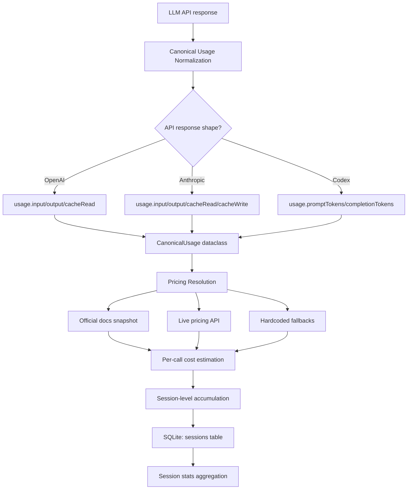

# Hermes Agent -- Token Usage and Cost Tracking

## Overview

Hermes has a multi-layered cost tracking system that goes far beyond simple token counting. It includes:

1. **Per-call token normalization** -- Canonical token buckets from 3 API shapes
2. **Pricing resolution** -- Official docs snapshots, live APIs, and fallbacks
3. **Per-call cost estimation** -- Decimal-accurate cost calculation
4. **Session-level accumulation** -- Cumulative counters in SQLite
5. **Account usage monitoring** -- Live quota checks from provider APIs
6. **Billing exhaustion detection** -- Error classifier identifies credit limits

---

## Cost Tracking Pipeline



## Layer 1: Canonical Usage Normalization

Every LLM API returns usage data in a different format. Hermes normalizes all three shapes into a single `CanonicalUsage` dataclass:

```python
@dataclass(frozen=True)
class CanonicalUsage:
    input_tokens: int = 0        # Non-cached input tokens
    output_tokens: int = 0       # Completion tokens
    cache_read_tokens: int = 0   # Tokens served from prompt cache
    cache_write_tokens: int = 0  # Tokens written to prompt cache
    reasoning_tokens: int = 0    # Extended thinking/reasoning tokens
    request_count: int = 1
    raw_usage: Optional[dict] = None

    @property
    def prompt_tokens(self) -> int:
        return self.input_tokens + self.cache_read_tokens + self.cache_write_tokens

    @property
    def total_tokens(self) -> int:
        return self.prompt_tokens + self.output_tokens
```

### Three API Shapes

The `normalize_usage()` function handles three fundamentally different API response formats:

**Anthropic Messages API** -- All fields are top-level and separate:

```python
# input_tokens, output_tokens, cache_read_input_tokens, cache_creation_input_tokens
input_tokens = usage.input_tokens           # Already separated
output_tokens = usage.output_tokens
cache_read_tokens = usage.cache_read_input_tokens
cache_write_tokens = usage.cache_creation_input_tokens
```

**Codex Responses API** -- `input_tokens` is a total that includes cache tokens; details break them out:

```python
input_total = usage.input_tokens             # Includes cached tokens
output_tokens = usage.output_tokens
cache_read = usage.input_tokens_details.cached_tokens
cache_write = usage.input_tokens_details.cache_creation_tokens
input_tokens = max(0, input_total - cache_read - cache_write)  # Derive non-cached
```

**OpenAI Chat Completions** -- `prompt_tokens` is a total, `prompt_tokens_details` breaks out cache:

```python
prompt_total = usage.prompt_tokens           # Includes cached tokens
output_tokens = usage.completion_tokens
cache_read = usage.prompt_tokens_details.cached_tokens
cache_write = usage.prompt_tokens_details.cache_write_tokens
input_tokens = max(0, prompt_total - cache_read - cache_write)
```

The OpenAI path also falls back to Anthropic-style top-level fields for proxies (OpenRouter, Vercel AI Gateway, Cline) that expose cache tokens differently when routing Claude models.

Reasoning tokens are extracted from `output_tokens_details.reasoning_tokens` across all API shapes.

---

## Layer 2: Billing Route Resolution

Before pricing can be applied, Hermes must determine the **billing route** -- which provider and billing mode applies to a given model:

```python
@dataclass(frozen=True)
class BillingRoute:
    provider: str          # "anthropic", "openai", "openrouter", "bedrock", etc.
    model: str             # Canonical model ID
    base_url: str          # API base URL
    billing_mode: str      # How cost should be calculated
```

### Billing Modes

| Mode | Meaning | Cost Calculation |
|------|---------|-----------------|
| `official_docs_snapshot` | Model with known published pricing | Lookup in `_OFFICIAL_DOCS_PRICING` dict |
| `official_models_api` | Provider has a live models API | Fetch pricing from `/models` endpoint |
| `provider_models_api` | OpenAI-compatible endpoint | Fetch from `{base_url}/models` |
| `subscription_included` | Cost covered by subscription (Codex) | $0 |
| `unknown` | Custom/local model | No pricing available |

Route resolution logic:

```python
def resolve_billing_route(model_name, provider, base_url):
    # OpenAI Codex → subscription included
    if provider == "openai-codex":
        return BillingRoute(..., billing_mode="subscription_included")

    # OpenRouter → live models API
    if provider == "openrouter":
        return BillingRoute(..., billing_mode="official_models_api")

    # Anthropic → official docs snapshot
    if provider == "anthropic":
        return BillingRoute(..., billing_mode="official_docs_snapshot")

    # OpenAI → official docs snapshot
    if provider == "openai":
        return BillingRoute(..., billing_mode="official_docs_snapshot")

    # Custom/local base URL → try endpoint models API
    if base_url and "localhost" in base_url:
        return BillingRoute(..., billing_mode="unknown")

    # Fallback → unknown
    return BillingRoute(..., billing_mode="unknown")
```

---

## Layer 3: Pricing Entry Resolution

`get_pricing_entry()` returns a `PricingEntry` with per-million-token costs:

```python
@dataclass(frozen=True)
class PricingEntry:
    input_cost_per_million: Optional[Decimal]    # $/M input tokens
    output_cost_per_million: Optional[Decimal]   # $/M output tokens
    cache_read_cost_per_million: Optional[Decimal]  # $/M cache read
    cache_write_cost_per_million: Optional[Decimal] # $/M cache write
    request_cost: Optional[Decimal]              # Per-request cost (some providers)
    source: CostSource                           # Where pricing came from
    source_url: Optional[str]                    # URL of pricing source
    pricing_version: Optional[str]               # Version identifier for audit
    fetched_at: Optional[datetime]
```

### Pricing Sources (in priority order)

1. **Official docs snapshot** -- Hardcoded pricing from provider documentation for well-known models. Stored in `_OFFICIAL_DOCS_PRICING` dict with source URLs for verification.

2. **OpenRouter models API** -- Live pricing fetched from `openrouter.ai/api/v1/models`. OpenRouter returns per-token pricing which is converted to per-million.

3. **OpenAI-compatible endpoint** -- For custom base URLs, Hermes fetches `{base_url}/models` and extracts pricing from the model metadata.

4. **None** -- If no pricing source is available, cost is marked as `unknown`.

### Official Docs Snapshot Models

The hardcoded pricing table covers all major models with source URLs:

| Provider | Model | Input ($/M) | Output ($/M) | Cache Read ($/M) | Cache Write ($/M) |
|----------|-------|-------------|--------------|-------------------|-------------------|
| Anthropic | claude-opus-4-20250514 | $15.00 | $75.00 | $1.50 | $18.75 |
| Anthropic | claude-sonnet-4-20250514 | $3.00 | $15.00 | $0.30 | $3.75 |
| Anthropic | claude-3-5-sonnet-20241022 | $3.00 | $15.00 | $0.30 | $3.75 |
| Anthropic | claude-3-5-haiku-20241022 | $0.80 | $4.00 | $0.08 | $1.00 |
| Anthropic | claude-3-opus-20240229 | $15.00 | $75.00 | $1.50 | $18.75 |
| Anthropic | claude-3-haiku-20240307 | $0.25 | $1.25 | $0.03 | $0.30 |
| OpenAI | gpt-4o | $2.50 | $10.00 | $1.25 | -- |
| OpenAI | gpt-4o-mini | $0.15 | $0.60 | $0.075 | -- |
| OpenAI | gpt-4.1 | $2.00 | $8.00 | $0.50 | -- |
| OpenAI | gpt-4.1-mini | $0.40 | $1.60 | $0.10 | -- |
| OpenAI | gpt-4.1-nano | $0.10 | $0.40 | $0.025 | -- |
| OpenAI | o3 | $10.00 | $40.00 | $2.50 | -- |
| OpenAI | o3-mini | $1.10 | $4.40 | $0.55 | -- |
| DeepSeek | deepseek-chat | $0.14 | $0.28 | -- | -- |
| DeepSeek | deepseek-reasoner | $0.55 | $2.19 | -- | -- |
| Google | gemini-2.5-pro | $1.25 | $10.00 | -- | -- |
| Google | gemini-2.5-flash | $0.15 | $0.60 | -- | -- |
| Google | gemini-2.0-flash | $0.10 | $0.40 | -- | -- |
| Bedrock | anthropic.claude-opus-4-6 | $15.00 | $75.00 | -- | -- |
| Bedrock | anthropic.claude-sonnet-4-6 | $3.00 | $15.00 | -- | -- |
| Bedrock | amazon.nova-pro | $0.80 | $3.20 | -- | -- |
| Bedrock | amazon.nova-lite | $0.06 | $0.24 | -- | -- |
| Bedrock | amazon.nova-micro | $0.035 | $0.14 | -- | -- |

Each entry includes `source="official_docs_snapshot"`, a `source_url` pointing to the provider's pricing page, and a `pricing_version` for audit (e.g., `"anthropic-prompt-caching-2026-03-16"`).

---

## Layer 4: Cost Estimation

`estimate_usage_cost()` combines the pricing entry with actual token counts:

```python
def estimate_usage_cost(model_name, usage: CanonicalUsage, *, provider, base_url, api_key):
    route = resolve_billing_route(model_name, provider, base_url)

    # Subscription included (e.g., Codex) → $0
    if route.billing_mode == "subscription_included":
        return CostResult(amount_usd=Decimal("0"), status="included", source="none", label="included")

    entry = get_pricing_entry(model_name, provider, base_url, api_key)
    if not entry:
        return CostResult(amount_usd=None, status="unknown", source="none", label="n/a")

    # Missing pricing for any used token type → unknown
    if usage.input_tokens and entry.input_cost_per_million is None:
        return CostResult(amount_usd=None, status="unknown", ...)
    if usage.output_tokens and entry.output_cost_per_million is None:
        return CostResult(amount_usd=None, status="unknown", ...)

    # Calculate: (tokens × price_per_million) / 1_000_000
    amount = Decimal("0")
    amount += Decimal(usage.input_tokens) * entry.input_cost_per_million / _ONE_MILLION
    amount += Decimal(usage.output_tokens) * entry.output_cost_per_million / _ONE_MILLION
    amount += Decimal(usage.cache_read_tokens) * entry.cache_read_cost_per_million / _ONE_MILLION
    amount += Decimal(usage.cache_write_tokens) * entry.cache_write_cost_per_million / _ONE_MILLION
    if entry.request_cost:
        amount += Decimal(usage.request_count) * entry.request_cost

    return CostResult(
        amount_usd=amount,
        status="estimated",
        source=entry.source,
        label=f"~${amount:.2f}",
        pricing_version=entry.pricing_version,
    )
```

All calculations use Python `Decimal` to avoid floating-point rounding errors. The result includes a `label` field (e.g., `"~$0.35"`) for display.

### Cost Status Values

| Status | Meaning |
|--------|---------|
| `actual` | Real cost from provider billing API |
| `estimated` | Calculated from pricing tables |
| `included` | Cost covered by subscription (Codex, etc.) |
| `unknown` | Pricing data unavailable |

### Cost Source Values

| Source | Meaning |
|--------|---------|
| `provider_cost_api` | Real-time from provider's billing endpoint |
| `provider_generation_api` | From provider's generation API metadata |
| `provider_models_api` | From provider's models listing API (OpenRouter) |
| `official_docs_snapshot` | From hardcoded pricing table (this module) |
| `user_override` | Manually set by user |
| `custom_contract` | Custom enterprise pricing |
| `none` | No cost (subscription included, free model) |

---

## Layer 5: Integration into the Agent Loop

Every LLM call in `run_agent.py` goes through this pipeline:

```python
# 1. Extract raw usage from API response
if hasattr(response, 'usage') and response.usage:
    # 2. Normalize to canonical buckets
    canonical_usage = normalize_usage(
        response.usage,
        provider=self.provider,
        api_mode=self.api_mode,
    )

    # 3. Update context compressor (for compaction decisions)
    self.context_compressor.update_from_response({
        "prompt_tokens": canonical_usage.prompt_tokens,
        "completion_tokens": canonical_usage.output_tokens,
        "total_tokens": canonical_usage.total_tokens,
    })

    # 4. Accumulate session-level counters
    self.session_input_tokens += canonical_usage.input_tokens
    self.session_output_tokens += canonical_usage.output_tokens
    self.session_cache_read_tokens += canonical_usage.cache_read_tokens
    self.session_cache_write_tokens += canonical_usage.cache_write_tokens
    self.session_reasoning_tokens += canonical_usage.reasoning_tokens
    self.session_api_calls += 1

    # 5. Estimate cost
    cost_result = estimate_usage_cost(
        self.model,
        canonical_usage,
        provider=self.provider,
        base_url=self.base_url,
        api_key=self.api_key,
    )

    # 6. Accumulate session cost
    if cost_result.amount_usd is not None:
        self.session_estimated_cost_usd += float(cost_result.amount_usd)

    # 7. Persist to SQLite session DB
    self._session_db.update_token_counts(
        self.session_id,
        input_tokens=canonical_usage.input_tokens,
        output_tokens=canonical_usage.output_tokens,
        cache_read_tokens=canonical_usage.cache_read_tokens,
        cache_write_tokens=canonical_usage.cache_write_tokens,
        reasoning_tokens=canonical_usage.reasoning_tokens,
        estimated_cost_usd=float(cost_result.amount_usd),
        cost_status=cost_result.status,
        cost_source=cost_result.source,
        billing_provider=self.provider,
        billing_base_url=self.base_url,
    )
```

---

## Layer 6: Session DB Persistence

The `SessionDB.update_token_counts()` method supports both **incremental** and **absolute** modes:

**Incremental (default)** -- CLI path, per-call deltas:

```sql
UPDATE sessions SET
    input_tokens = input_tokens + ?,
    output_tokens = output_tokens + ?,
    cache_read_tokens = cache_read_tokens + ?,
    cache_write_tokens = cache_write_tokens + ?,
    reasoning_tokens = reasoning_tokens + ?,
    estimated_cost_usd = estimated_cost_usd + COALESCE(?, 0),
    api_call_count = api_call_count + 1
WHERE id = ?
```

**Absolute** -- Gateway path, cumulative totals:

```sql
UPDATE sessions SET
    input_tokens = ?,
    output_tokens = ?,
    cache_read_tokens = ?,
    cache_write_tokens = ?,
    reasoning_tokens = ?,
    estimated_cost_usd = COALESCE(?, 0),
    api_call_count = api_call_count + 1
WHERE id = ?
```

This dual-mode design prevents double-counting when the gateway holds a cached agent and accumulates across multiple messages.

### Cost Columns in the Sessions Table

| Column | Type | Purpose |
|--------|------|---------|
| `input_tokens` | INTEGER | Cumulative non-cached input |
| `output_tokens` | INTEGER | Cumulative output tokens |
| `cache_read_tokens` | INTEGER | Cumulative cache reads |
| `cache_write_tokens` | INTEGER | Cumulative cache writes |
| `reasoning_tokens` | INTEGER | Cumulative reasoning/thinking |
| `estimated_cost_usd` | REAL | Running total of estimated cost |
| `actual_cost_usd` | REAL | Real cost (if provider reports it) |
| `cost_status` | TEXT | 'estimated', 'actual', 'included', 'unknown' |
| `cost_source` | TEXT | Which pricing source was used |
| `pricing_version` | TEXT | Audit trail for pricing data |
| `billing_provider` | TEXT | Which provider was billed |
| `billing_base_url` | TEXT | API base URL for the route |
| `billing_mode` | TEXT | 'subscription_included', etc. |
| `api_call_count` | INTEGER | Number of individual API calls |

---

## Layer 7: Account Usage Monitoring

Beyond per-call cost tracking, Hermes can query **live account usage APIs** to check remaining quotas:

### Supported Providers

**Anthropic (OAuth only)** -- Fetches from `api.anthropic.com/api/oauth/usage`:

```python
# Returns usage windows for multiple time periods:
# - Current session (5-hour window)
# - Current week (7-day window)
# - Opus week (separate Opus quota)
# - Sonnet week (separate Sonnet quota)
# - Extra usage (monthly credit overage)
```

Example response:

```
Provider: Anthropic (Pro)
Current session: 73% remaining (27% used) • resets in 3h 15m
Current week: 42% remaining (58% used) • resets in 2d 5h
Opus week: 89% remaining (11% used) • resets in 2d 5h
Sonnet week: 42% remaining (58% used) • resets in 2d 5h
Extra usage: 12.50 / 25.00 USD
```

**OpenAI Codex** -- Fetches from the Codex backend's `/wham/usage` endpoint:

```
Provider: OpenAI Codex (Pro)
Session: 65% remaining (35% used) • resets in 4h 30m
Weekly: 82% remaining (18% used) • resets in 5d 2h
Credits balance: $42.50
```

**OpenRouter** -- Fetches from `openrouter.ai/credits` and `/key`:

```
Provider: OpenRouter
API key quota: 23% used • $7.70 of $10.00 remaining • resets 2026-05-01
Credits balance: $15.23
API key usage: $2.30 total • $0.50 today • $1.20 this week
```

### Usage Command

The `/usage` CLI command fetches and displays account usage:

```python
def fetch_account_usage(provider, *, base_url=None, api_key=None):
    if provider == "openai-codex":
        return _fetch_codex_account_usage()
    if provider == "anthropic":
        return _fetch_anthropic_account_usage()
    if provider == "openrouter":
        return _fetch_openrouter_account_usage(base_url, api_key)
```

If the provider doesn't support a usage API, returns `None`. For Anthropic API keys (non-OAuth), returns "unavailable" with an explanation.

---

## Layer 8: Billing Exhaustion Detection

Hermes's error classifier (`error_classifier.py`) detects **billing exhaustion** vs transient rate limits:

```python
class FailoverReason(Enum):
    billing = "billing"                  # 402 or confirmed credit exhaustion
    rate_limit = "rate_limit"            # 429, transient quota
    context_overflow = "context_overflow"
    auth = "auth"
    long_context_tier = "long_context_tier"  # Anthropic "extra usage" tier gate
```

The classifier uses a multi-stage detection:

1. **HTTP status code** -- 402 = billing, 429 = rate limit (but needs disambiguation)
2. **Error message patterns** -- "billing hard limit", "credit exhausted", "insufficient_quota"
3. **Usage limit disambiguation** -- "usage limit" + "resets" = transient rate limit, not billing
4. **Provider-specific patterns** -- OpenRouter 403 "key limit exceeded" = billing, not auth

```python
def _disambiguate_402(status_code, error_msg, provider):
    # 402 with "usage limit" + "resets in" = transient quota, not billing
    has_usage_limit = any(p in error_msg for p in _USAGE_LIMIT_PATTERNS)
    has_transient_signal = any(p in error_msg for p in _TRANSIENT_PATTERNS)

    if has_usage_limit and has_transient_signal:
        return FailoverReason.rate_limit  # Periodic quota, resets

    # Confirmed billing exhaustion
    if any(p in error_msg for p in _BILLING_PATTERNS):
        return FailoverReason.billing
```

When billing exhaustion is detected, Hermes can:
- Alert the user to rotate credentials or add credits
- Skip the provider in failover routing
- Classify the error differently for retry logic (don't retry billing errors)

---

## Layer 9: Context Engine Token Tracking

The `ContextCompressor` tracks token usage for compaction decisions:

```python
class ContextCompressor:
    last_prompt_tokens: int = 0
    last_completion_tokens: int = 0

    def update_from_response(self, usage: Dict[str, Any]):
        self.last_prompt_tokens = usage.get("prompt_tokens", 0)
        self.last_completion_tokens = usage.get("completion_tokens", 0)
```

This feeds into:
- **Context pressure calculation** -- `(prompt_tokens / context_window) * 100`
- **Compaction triggers** -- When pressure exceeds threshold (e.g., 80%)
- **Token estimation** -- After compaction, `last_prompt_tokens` reflects the compressed context size

---

## Utility Functions

### Token Count Formatting

```python
def format_token_count_compact(value: int) -> str:
    # 500 → "500"
    # 1500 → "1.5K"
    # 1500000 → "1.5M"
    # 1500000000 → "1.5B"
```

### Duration Formatting

```python
def format_duration_compact(seconds: float) -> str:
    # 30 → "30s"
    # 90 → "2m"
    # 3600 → "1h"
    # 90000 → "1d 1h"
```

---

## Cost Tracking Architecture Diagram

```mermaid
flowchart TD
    RESP[LLM API Response] --> NORM[normalize_usage]
    NORM -->|CanonicalUsage| CUM[Session Counters<br/>input/output/cache/reasoning]
    NORM -->|CanonicalUsage| CC[Context Compressor<br/>pressure calculation]

    NORM -->|CanonicalUsage| COST[estimate_usage_cost]
    ROUTE[resolve_billing_route] -->|BillingRoute| COST
    PRICE[get_pricing_entry] -->|PricingEntry| COST
    PRICE -->|Snapshot| SNAP[_OFFICIAL_DOCS_PRICING]
    PRICE -->|Live API| LIVE[OpenRouter /models API]

    COST -->|CostResult| ACCUM[Session Cost Accumulator]
    ACCUM -->|Deltas| PERSIST[_session_db.update_token_counts]

    PERSIST --> DB[(SQLite sessions table)]
    DB --> INSIGHTS[/insights command]

    USAGE[fetch_account_usage] -->|Live quotas| ANTH[Anthropic OAuth]
    USAGE -->|Live quotas| CODEX[Codex endpoint]
    USAGE -->|Live quotas| OR[OpenRouter credits]

    ERR[API Error] --> CLASS[error_classifier]
    CLASS -->|billing| ALERT[Alert: rotate credentials]
    CLASS -->|rate_limit| RETRY[Retry after backoff]
```

---

## Comparison with Pi's Approach

| Aspect | Pi | Hermes |
|--------|----|--------|
| **Pricing storage** | In `models.generated.ts` (TypeScript, per-model config) | `_OFFICIAL_DOCS_PRICING` dict + live APIs |
| **Cost calculation** | `(price / 1M) * tokens` in `models.ts` | Same formula, but with `Decimal` precision |
| **Usage normalization** | Per-provider in each adapter file | Central `normalize_usage()` with 3 API shapes |
| **Billing routing** | None (model ID determines pricing) | `resolve_billing_route()` with 5 billing modes |
| **Live pricing** | None (all hardcoded) | OpenRouter models API, custom endpoint APIs |
| **Account quotas** | None | Live API checks for Anthropic, Codex, OpenRouter |
| **Billing detection** | None | Error classifier detects credit exhaustion |
| **Per-request cost** | `AssistantMessage.usage.cost` | `CostResult` per call, accumulated to session |
| **Session persistence** | In-memory aggregation, not persisted | SQLite cumulative counters + JSON log files |
| **Cache token handling** | Provider-specific extraction | 3 modes: Anthropic, OpenAI, Codex with fallbacks |
| **Reasoning tokens** | Tracked in usage | Tracked in usage + persisted to DB |

### Design Decisions

1. **Decimal over float** -- All cost calculations use Python `Decimal` to avoid floating-point accumulation errors over long sessions.

2. **Incremental vs absolute persistence** -- CLI path sends per-call deltas, gateway path sends cumulative totals. Prevents double-counting.

3. **Graceful degradation** -- If pricing lookup fails, cost is marked `unknown` but the call still succeeds. Missing cache pricing for used cache tokens returns `unknown` rather than guessing.

4. **Multi-source pricing** -- Official docs snapshot for known models, live APIs for OpenRouter and custom endpoints. Ensures cost estimates are available even for new models not in the hardcoded table.

5. **Billing exhaustion detection** -- Critical for multi-provider failover. A billing error on one provider triggers failover to another, while a rate limit triggers backoff.
