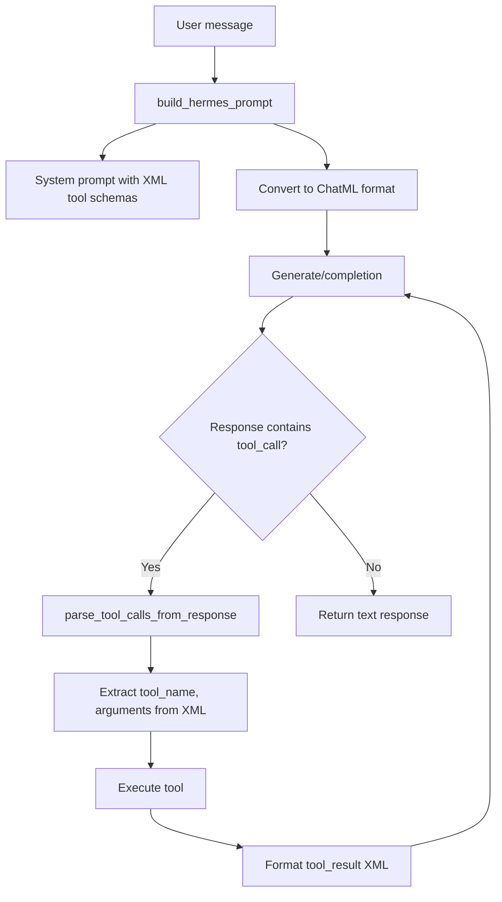
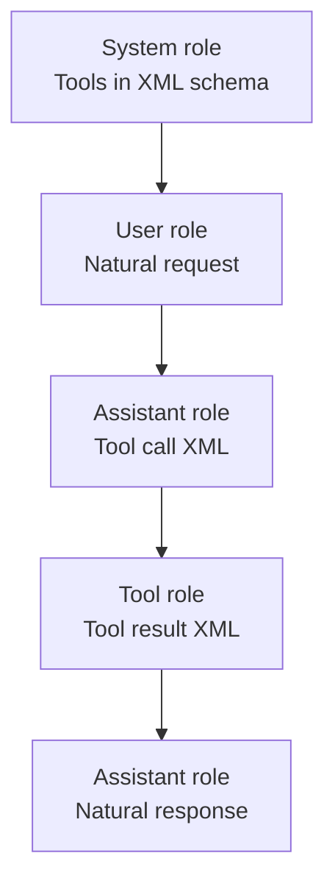

# Hermes Function Calling

**Structured tool use and JSON output for Hermes 2 Pro and Hermes 3 models.**

Hermes-Function-Calling provides the prompt templates, schemas, and inference scripts for enabling function calling and structured JSON output on Hermes 2 Pro and Hermes 3 models. The models use ChatML prompt format with XML-wrapped tool calls, enabling OpenAI endpoint compatibility.

## Features

| Feature | Models | Description |
|---------|--------|-------------|
| **Function Calling** | Hermes 2 Pro, Hermes 3 | Parse tool schemas, generate function calls with arguments |
| **JSON Mode** | Hermes 2 Pro, Hermes 3 | Structured output adhering to a provided JSON schema |
| **Scratch Pad (Hermes 3)** | Hermes 3 only | GOAP reasoning framework for planning before tool calls |

## Function Calling Architecture

## Function Calling Prompt Format

Hermes uses ChatML with XML tags for tool calls. The system prompt defines available tools and the expected output format:

- System role with tool schema in XML tools tags
- Pydantic model schema for function call structure
- Tool calls wrapped in XML tool_call tags (Hermes 2 Pro)
- Tool calls wrapped in XML tool_call tags with scratch_pad planning (Hermes 3)
- Tool responses returned in XML tool_result tags

### Conversation Flow

1. **System**: Defines available tools and calling format
2. **User**: Natural language request
3. **Assistant**: Generates structured function call
4. **Tool**: Executes function, returns result
5. **Assistant**: Interprets result, generates natural language response

See the key scripts section below for the Python implementations.

## ChatML Message Format

## JSON Mode Prompt Format

For structured outputs, the model responds with only a JSON object matching the provided schema:

- System: "You are a helpful assistant that answers in JSON" with schema in XML schema tags
- User: Natural language request
- Assistant: JSON object matching the provided schema

## Example: Function Call

Input: "Fetch the stock fundamentals data for Tesla (TSLA)"

The model generates a tool call for get_stock_fundamentals with symbol=TSLA. After execution, the result contains market cap, P/E ratio, P/B ratio, EPS, beta, 52-week range, and more. The assistant then provides a natural language summary.

## Example: JSON Mode

Input: "Please return a json object to represent Goku from Dragon Ball Z"

With a Pydantic Character schema (name, species, role, personality_traits, special_attacks), the model outputs valid JSON matching that schema.

## Key Scripts

| Script | Purpose |
|--------|---------|
| functioncall.py | Main entry point for function call inference. Initializes model, tokenizer, handles recursive loop for generating and executing function calls |
| jsonmode.py | JSON mode inference. Generates JSON objects adhering to provided schema, validates output |
| prompter.py | Manages prompt generation. Reads system prompts from YAML, formats with tools/examples/schema |
| schema.py | Defines Pydantic models for function calls and definitions |
| functions.py | Tool implementations using yfinance for stock data |
| validator.py | Validates function call outputs |
| utils.py | Utility functions |

## Adding Custom Functions

Functions are defined in functions.py using the @tool decorator. Each function needs:
- Typed parameters with descriptions
- Docstring explaining purpose
- Return type (dict)
- Registration in get_openai_tools()

## Adding Custom Pydantic Models for JSON Mode

Define a Pydantic model with desired fields, set additionalProperties to false in schema_extra, and serialize with .schema_json(). The model schema becomes the constraint the LLM must follow.

## Hermes 3 Scratch Pad

Hermes 3 adds a scratch_pad section with the GOAP (Goal Oriented Action Planning) framework for more deliberate reasoning:

- **Goal**: Restates the user request
- **Actions**: Lists Python-style function calls to execute
- **Observation**: Tool results summarized when provided
- **Reflection**: Evaluates tool relevance, parameter availability, and overall task status

This structured reasoning helps the model plan its tool calls more carefully before generating them.

## Package Details

| Property | Value |
|----------|-------|
| Source | github.com/NousResearch/Hermes-Function-Calling |
| License | Apache 2.0 |
| Models | Hermes 2 Pro, Hermes 3 |
| Default Model | NousResearch/Hermes-2-Pro-Llama-3-8B |
| Prompt Format | ChatML with XML tags |
| Framework | Transformers + bitsandbytes (optional 4-bit) |
| Compatibility | OpenAI endpoint format |
