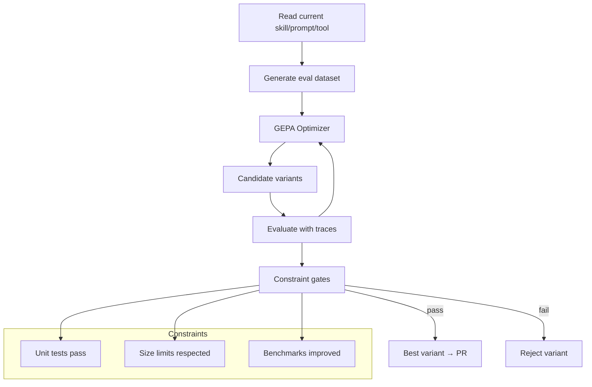
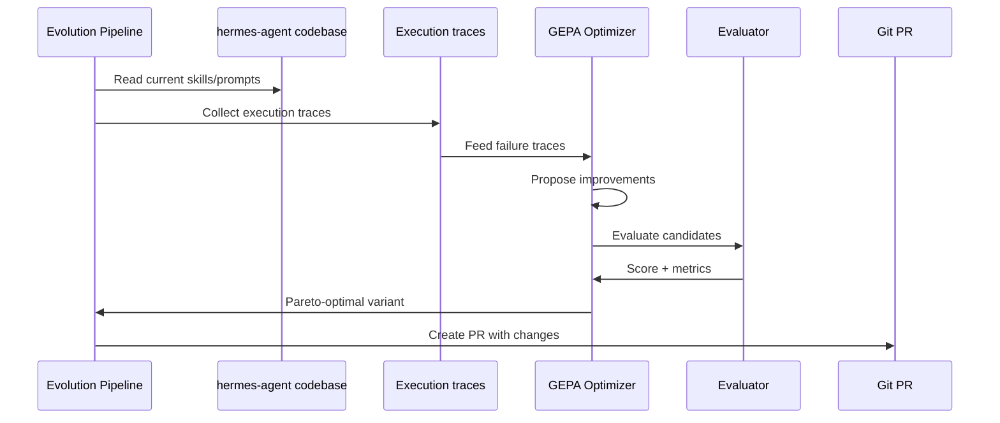

# Hermes Agent Self-Evolution

**Evolutionary self-improvement for Hermes Agent via DSPy + GEPA.**

hermes-agent-self-evolution is a standalone optimization pipeline that systematically improves Hermes Agent's skills, tool descriptions, system prompts, and code through genetic-pareto prompt evolution. It operates ON hermes-agent -- not inside it -- reading from the codebase and writing evolved versions to git branches as PRs for human review.

## How It Works





GEPA (Genetic-Pareto Prompt Evolution) reads execution traces to understand *why* things fail -- not just that they failed -- then proposes targeted improvements. ICLR 2026 Oral, MIT licensed. No GPU training required; everything operates via API calls, mutating text and evaluating results.

## Evolution Engines

| Engine | What It Optimizes | License | Role |
|--------|------------------|---------|------|
| **DSPy + GEPA** | Skills, prompts, instructions, tool descriptions | MIT | Primary engine |
| **DSPy MIPROv2** | Few-shot examples, instruction text | MIT | Fallback optimizer |
| **Darwinian Evolver** | Code files, tool implementations | AGPL v3 | External CLI only |

## What Gets Evolved (5 Phases)

| Phase | Target | Status | Cost/Run |
|-------|--------|--------|----------|
| **Phase 1** | Skill files (SKILL.md) | Implemented | ~$2-10 |
| **Phase 2** | Tool descriptions | Planned | ~$2-10 |
| **Phase 3** | System prompt sections | Planned | ~$2-10 |
| **Phase 4** | Tool implementation code | Planned | ~$2-9 |
| **Phase 5** | Continuous improvement loop | Planned | Automated |

## Evaluation Data Sources

| Source | Description | Quality |
|--------|------------|---------|
| **Synthetic** | Strong LLM generates test cases from skill text | Good for bootstrapping |
| **SessionDB mining** | Real usage conversations from Hermes sessions | Best signal, grows over time |
| **Golden sets** | Hand-curated test cases for high-value skills | Highest quality, manual effort |
| **Auto-evaluation** | Skill-specific checks (e.g., planted bugs for debugging skill) | Bonus, not all skills |

## Guardrails

Every evolved variant must pass ALL constraints before being considered:

1. **Full test suite** -- `pytest tests/ -q` must pass 100%
2. **Size limits** -- Skills ≤15KB, tool descriptions ≤500 chars, prompt sections ≤+20%
3. **Caching compatibility** -- No mid-conversation changes; changes take effect on next session only
4. **Semantic preservation** -- Must not drift from original purpose or behavior
5. **PR review** -- All changes go through human review, never direct commit
6. **Benchmark gates** -- TBLite + YC-Bench must not regress (within 2%)

## Benchmark Role in Evolution

Benchmarks are **gates**, not fitness functions:

```
Candidate Variant
    │
    ├──► pytest (must pass 100%) ────────── GATE 1: functional correctness
    │
    ├──► TBLite fast subset (20 tasks) ──── GATE 2: quick capability check
    │
    ├──► Task-specific eval dataset ──────── FITNESS: quality score
    │
    ▼
Top Candidates
    │
    ├──► Full TBLite (100 tasks) ─────────── GATE 3: regression check
    │
    ├──► YC-Bench fast_test ──────────────── GATE 4: coherence check
    │
    ▼
Best Candidate → PR with full metrics
```

| Benchmark | Tasks | Speed | Role |
|-----------|-------|-------|------|
| **TBLite** | 100 | ~1-2 hours | Primary regression gate |
| **TerminalBench2** | 89 | ~2-4 hours | Thorough validation before PR |
| **YC-Bench** | 100-500 turns | ~3-6 hours | Long-horizon coherence check |

## Quick Start

```bash
git clone https://github.com/NousResearch/hermes-agent-self-evolution.git
cd hermes-agent-self-evolution
pip install -e ".[dev]"

export HERMES_AGENT_REPO=~/.hermes/hermes-agent

# Evolve a skill
python -m evolution.skills.evolve_skill \
    --skill github-code-review \
    --iterations 10 \
    --eval-source sessiondb
```

## Integration Points with Hermes

| Hermes Component | Role in Self-Evolution |
|-----------------|------------------------|
| `batch_runner.py` | Evaluation harness -- parallel task execution |
| `agent/trajectory.py` | Execution traces for GEPA reflective analysis |
| `hermes_state.py` (SessionDB) | Real usage data for eval datasets |
| `skills/` directory | Primary optimization targets |
| `tools/registry.py` | Tool descriptions to optimize |
| `tests/` | Guardrails -- evolved code must pass all tests |

## Architecture

```
hermes-agent-self-evolution/             # Standalone repo
├── evolution/
│   ├── core/                           # Shared infrastructure
│   │   ├── dataset_builder.py          # Eval dataset generation
│   │   ├── fitness.py                  # Fitness functions
│   │   ├── constraints.py              # Constraint validators
│   │   ├── benchmark_gate.py           # Benchmark gating
│   │   └── pr_builder.py              # Auto-generate PRs
│   ├── skills/                         # Phase 1: Skill evolution
│   ├── tools/                          # Phase 2: Tool descriptions
│   ├── prompts/                        # Phase 3: System prompts
│   ├── code/                           # Phase 4: Code evolution
│   └── monitor/                        # Phase 5: Continuous loop
├── datasets/                           # Generated eval datasets
└── tests/
```

## Package Details

| Property | Value |
|----------|-------|
| Source | github.com/NousResearch/hermes-agent-self-evolution |
| License | MIT |
| Dependencies | DSPy, GEPA (MIT); Darwinian Evolver (AGPL v3, CLI only) |
| Cost per run | ~$2-10 |
| Deployment | Git PR against hermes-agent, human review required |
