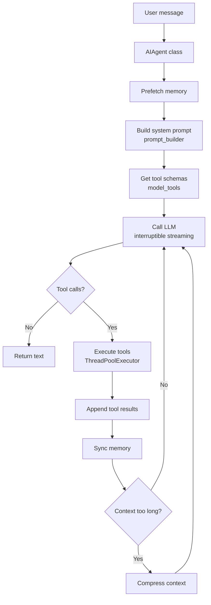
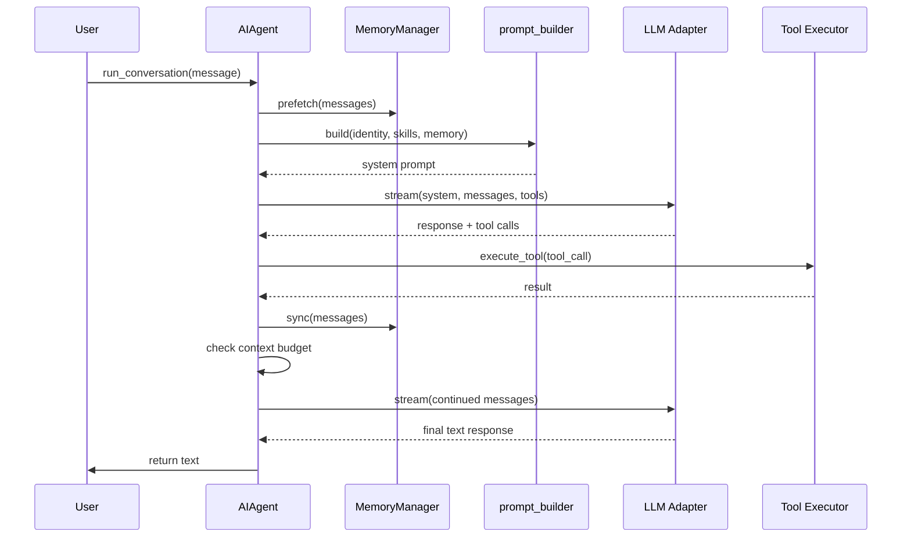

# Hermes Agent -- Agent Loop Deep Dive

## Overview

Hermes's agent loop lives primarily in `run_agent.py` (~12,000+ lines for the `AIAgent` class), with supporting infrastructure spread across the `agent/` subdirectory and the gateway runner. Unlike Pi's modular three-layer architecture, Hermes is a **monolithic orchestrator** — the `AIAgent` class handles LLM communication, tool execution, memory management, context compression, error recovery, plugin hooks, and session persistence all within a single class.

```
run_agent.py (AIAgent)
  ├── run_conversation()          ← The main loop (~4000 lines of logic)
  ├── _interruptible_streaming_api_call()  ← SSE streaming with interrupt support
  ├── _interruptible_api_call()   ← Non-streaming fallback
  ├── _execute_tool_calls()       ← Dispatch to sequential or concurrent execution
  ├── _compress_context()         ← Context compression engine
  ├── _build_system_prompt()      ← Multi-source prompt assembly
  └── _persist_session()          ← SQLite + JSON dual-write

agent/
  ├── anthropic_adapter.py        ← Anthropic Messages API
  ├── codex_responses_adapter.py  ← OpenAI Codex Responses API
  ├── bedrock_adapter.py          ← AWS Bedrock Converse API
  ├── gemini_native_adapter.py    ← Google Gemini native tool use
  ├── gemini_cloudcode_adapter.py ← Google Cloud Code adapter
  ├── context_compressor.py       ← Token estimation, compression triggers
  ├── prompt_builder.py           ← SOUL.md, skills, memory, context files
  ├── memory_manager.py           ← External memory provider integration
  ├── error_classifier.py         ← API error classification → recovery strategy
  ├── credential_pool.py          ← API key rotation for high availability
  ├── prompt_caching.py           ← Anthropic cache_control injection
  ├── model_metadata.py           ← Token limits, pricing, context probing
  └── transports/                 ← Per-API-mode transport layer
```

## The Core Loop: `run_conversation()`

### Architecture Overview





### Entry Point and Setup

```python
def run_conversation(
    self,
    user_message: str,
    system_message: str = None,
    conversation_history: List[Dict[str, Any]] = None,
    task_id: str = None,
    stream_callback: Optional[callable] = None,
    persist_user_message: Optional[str] = None,
) -> Dict[str, Any]:
```

**Phase 1: Initialization** (before the loop starts):

1. **Restore primary runtime** — if a previous turn activated fallback, reset to preferred model
2. **Sanitize input** — strip surrogate characters, leaked `<memory-context>` blocks
3. **Reset per-turn counters** — `_invalid_tool_retries`, `_invalid_json_retries`, `_empty_content_retries`, `_incomplete_scratchpad_retries`, etc.
4. **Check connection health** — detect and clean up dead TCP connections from previous provider outages
5. **Hydrate todo store** — recover in-memory todo state from conversation history (gateway creates fresh AIAgent per message)
6. **Track user turn** — increment `_user_turn_count`
7. **Memory nudge check** — if enough turns have passed, schedule a memory review
8. **Add user message** to the `messages` list
9. **Build/load system prompt** — either rebuild from scratch (new session) or reuse cached prompt from SQLite (continuing session, for Anthropic prefix cache matching)
10. **Preflight context compression** — if loaded conversation history exceeds threshold, compress proactively (up to 3 passes)
11. **Fire `pre_llm_call` plugin hook** — plugins can inject ephemeral context into the user message
12. **Prefetch memory** — call `memory_manager.prefetch_all(query)` once before the loop, cache result for all iterations
13. **Record execution thread** — for thread-scoped interrupt signal management

### The Outer Loop

```python
while (api_call_count < self.max_iterations and self.iteration_budget.remaining > 0) or self._budget_grace_call:
```

The loop condition combines:
- **Iteration budget** (`max_iterations`, default 90) — protects against infinite tool-call chains
- **Shared `IterationBudget`** — parent + all subagents consume from the same budget
- **Grace call flag** — one extra iteration after budget exhaustion for graceful termination

### Per-Iteration Structure

Each iteration follows this pipeline:

```
1. Check interrupt → break if user interrupted
2. Consume iteration budget (or enter grace call)
3. Fire step_callback (gateway agent:step event)
4. Drain pending /steer messages → inject into last tool message
5. Sanitize tool-call arguments (repair corrupted JSON)
6. Build api_messages (copy + transform each message)
7. Inject ephemeral context (memory prefetch + plugin context) into user message
8. Copy reasoning_content for API replay
9. Strip internal fields (reasoning, finish_reason, thinking-prefill markers)
10. Sanitize for strict APIs (remove call_id, response_item_id)
11. Build effective system prompt (cached + ephemeral additions)
12. Insert prefill messages (few-shot priming)
13. Apply Anthropic prompt caching (cache_control markers)
14. Sanitize orphaned tool results
15. Normalize whitespace and tool-call JSON for prefix cache consistency
16. Strip surrogate characters
17. Calculate approximate token size
18. ── API Call with retry loop ──
19. Process response → tool calls or final text
20. Execute tools → append results
21. Check context compression trigger
22. Save session log incrementally
23. continue → next iteration
```

## Multi-Platform Session Management

### Per-Message Agent Creation (Gateway Pattern)

Unlike Pi's long-lived `Agent` instance, Hermes creates a **fresh `AIAgent` for every message** in gateway mode. Each platform adapter (Telegram, Discord, Slack, etc.) calls:

```python
agent = AIAgent(
    base_url=...,
    model=...,
    platform="telegram",        # Platform for system prompt hints
    user_id="123456",           # Platform user identifier
    chat_id="chat_789",         # Chat/channel identifier
    gateway_session_key="agent:main:telegram:dm:123456",
    session_db=session_db,      # Shared SQLite instance
    conversation_history=loaded_history,  # Previous messages loaded
)
response = agent.run_conversation(user_message)
```

The `gateway_session_key` is a stable identifier composed as `agent_name:platform:chat_type:chat_id`, ensuring:
- Session continuity across process restarts
- Per-chat isolation (each chat gets its own session)
- Cross-platform separation (same user, different platform = different session)
- Memory provider scoping

### Session Persistence: Dual-Write Strategy

Every turn writes to **two locations**:
1. **SQLite database** (`~/.hermes/sessions.db`) — FTS5 searchable, indexed, concurrent
2. **JSON log file** (`~/.hermes/sessions/session_<id>.json`) — human-readable, portable

The `_flush_messages_to_session_db()` method tracks `_last_flushed_db_idx` to avoid duplicate writes:

```python
def _flush_messages_to_session_db(self, messages, conversation_history=None):
    start_idx = len(conversation_history) if conversation_history else 0
    flush_from = max(start_idx, self._last_flushed_db_idx)
    for msg in messages[flush_from:]:
        self._session_db.append_message(session_id=..., role=..., content=..., ...)
    self._last_flushed_db_idx = len(messages)
```

### Compression-Triggered Session Rotation

When context is compressed, Hermes **rotates** the session rather than rewriting in-place:

1. Commit memory provider data (extract memories before rotation)
2. `end_session(old_id, "compression")` — mark old session as ended
3. Create new session with `parent_session_id=old_id` — establishes lineage chain
4. Propagate title with auto-numbering ("Project Setup" → "Project Setup (2)")

This creates a parent chain:
```
session_A → session_B → session_C  (each linked by parent_session_id)
```

## Message Management

### Message Format (OpenAI-compatible)

```python
# User message
{"role": "user", "content": "Check if the tests pass"}

# Assistant message (with tool calls)
{
    "role": "assistant",
    "content": "I'll run the tests.",
    "tool_calls": [{
        "id": "tc_1",
        "type": "function",
        "function": {
            "name": "terminal",
            "arguments": '{"command": "npm test"}'
        }
    }]
}

# Assistant message (with reasoning/thinking)
{
    "role": "assistant",
    "content": "The fix is straightforward...",
    "reasoning": "Looking at the code, the issue is...",     # Internal storage
    "reasoning_content": "...",                               # Provider-facing
    "reasoning_details": "...",                               # JSON metadata
}

# Tool result
{
    "role": "tool",
    "tool_call_id": "tc_1",
    "content": "42 passing, 0 failing"
}
```

### Message Transformation Pipeline (`api_messages` build)

Before each API call, messages go through a transformation pipeline:

1. **Copy each message** — original `messages` list is never mutated for API calls
2. **Inject ephemeral context** into the current turn's user message:
   - Memory prefetch result wrapped in `<memory-context>` fence
   - Plugin `pre_llm_call` hook output
3. **Copy reasoning_content** — for multi-turn reasoning continuity across API modes
4. **Strip internal fields** — `reasoning` (kept as `reasoning_content`), `finish_reason`, `_thinking_prefill`, Codex Responses API fields
5. **Sanitize for strict APIs** — remove `call_id`, `response_item_id` for providers like Mistral/Fireworks that reject unknown fields
6. **Normalize whitespace** — `content.strip()` for consistent prefix matching
7. **Normalize tool-call JSON** — `json.dumps(args, separators=(",", ":"), sort_keys=True)` for cache hit consistency
8. **Strip surrogates** — prevent UnicodeEncodeError crashes in the OpenAI SDK

### Tool-Call Argument Repair

Hermes has a dedicated `_sanitize_tool_call_arguments()` method that repairs malformed JSON in tool-call arguments. It scans all assistant messages with `tool_calls` and attempts JSON repair on corrupted argument strings. Repaired entries get a marker prepended to the corresponding tool result so the model knows its arguments were fixed.

### Message Sanitization Before API

`_sanitize_api_messages()` strips orphaned tool results and adds stubs for missing results. This runs unconditionally — not gated on context compression — to catch orphans from session loading or manual message manipulation.

## Tool Handling

### Tool Discovery and Registration

Tools are registered via `model_tools.py`:

```python
from model_tools import (
    get_tool_definitions,    # Get all tool schemas for the LLM
    get_toolset_for_tool,    # Get toolset membership for a specific tool
    handle_function_call,    # Execute a single tool call
    check_toolset_requirements,  # Validate toolset constraints
)
```

The `AIAgent.__init__` builds `self.valid_tool_names` — a set of valid tool function names used for hallucination detection:

```python
self.valid_tool_names = {tool["function"]["name"] for tool in self.tools}
```

### Tool Call Processing Pipeline

After the API call succeeds, tool calls go through multiple validation stages:

#### Stage 1: Tool Name Repair

```python
for tc in assistant_message.tool_calls:
    if tc.function.name not in self.valid_tool_names:
        repaired = self._repair_tool_call(tc.function.name)
        if repaired:
            tc.function.name = repaired  # Auto-repair: "write" → "write_file"
```

If repair fails, the tool is flagged as invalid. After 3 retries of invalid tool calls, the loop exits with a partial result — the model is told what tools are available so it can self-correct.

#### Stage 2: JSON Argument Validation

Each tool call's `arguments` field must be valid JSON:
- Empty/whitespace strings → `"{}"`
- Non-string types → `json.dumps()`
- Malformed JSON → tracked in `invalid_json_args`

**Truncation detection**: If any tool call's arguments don't end with `}` or `]`, it's likely a truncated response (router rewrote `finish_reason` from `"length"` to `"tool_calls"`). The loop refuses to execute and returns partial.

After 3 retries of invalid JSON, recovery tool results are injected into the message stream so the model can retry with valid arguments.

#### Stage 3: Guardrails

```python
# Cap delegate_task calls to prevent spawn loops
assistant_message.tool_calls = self._cap_delegate_task_calls(assistant_message.tool_calls)

# Deduplicate identical tool calls
assistant_message.tool_calls = self._deduplicate_tool_calls(assistant_message.tool_calls)
```

#### Stage 4: Content + Tool Call Coexistence Detection

When the model returns **both text content AND tool calls** in the same turn:
- Content is captured as `_last_content_with_tools` — a fallback final response
- If ALL tools are "housekeeping" (memory, todo, skill_manage, session_search), subsequent output is muted (`_mute_post_response = True`)
- If any substantive tool is present, output stays visible so users see progress

#### Stage 5: Tool Execution

```python
self._execute_tool_calls(assistant_message, messages, effective_task_id, api_call_count)
```

Two execution modes:

**Sequential** (`_execute_tool_calls_sequential`):
- Execute tool calls one at a time in source order
- Each tool result is appended to `messages` before the next starts
- Used when tool calls have interdependencies

**Concurrent** (`_execute_tool_calls_concurrent`):
- Tools are dispatched via `ThreadPoolExecutor` with configurable max workers
- `_NEVER_PARALLEL_TOOLS` list forces certain tools to run sequentially (e.g., `terminal`, `delegate_task`)
- Results are appended to `messages` in completion order, not source order
- The `_executing_tools` flag tracks in-flight concurrent tools for interrupt management

### Tool Execution: `handle_function_call()`

The central dispatch function from `model_tools.py`:

```python
function_result = handle_function_call(
    tool_call_id=tc.id,
    tool_name=tc.function.name,
    arguments=json.loads(tc.function.arguments),
    context=tool_context,
    task_id=effective_task_id,
    api_call_count=api_call_count,
    agent=self,  # Reference back to AIAgent for callbacks
)
```

Each tool result is appended as a `{"role": "tool", "tool_call_id": ..., "content": ...}` message.

### Post-Tool-Call Processing

After tools execute:
1. **Refund iteration budget** if the ONLY tool was `execute_code` (programmatic tool calling)
2. **Check context compression** — `should_compress(real_tokens)` triggers if prompt tokens exceed threshold (default 50% of context window)
3. **Save session log** incrementally (visible even if interrupted)
4. **Signal paragraph break** for streaming display (`_stream_needs_break = True`)

### Empty Response After Tool Calls

Hermes has extensive recovery for when the model returns empty content after tool execution:

1. **Prior-turn content fallback**: If the previous turn had content + only housekeeping tools, reuse that content
2. **Post-tool nudge**: Append a user-level hint ("You just executed tool calls but returned an empty response. Please process the tool results above and continue.")
3. **Thinking-only prefill**: If the model produced reasoning but no visible text, append the assistant message as-is and continue (up to 2 retries)
4. **Empty response retry**: Up to 3 retries with the same messages
5. **Fallback provider**: If configured, switch to the next provider in the fallback chain
6. **Terminal "(empty)"**: All recovery exhausted — return "(empty)" as the final response

## Multi-Turn Handling

### Interrupt Mechanism

Hermes supports **user interruption** via a thread-scoped interrupt signal:

```python
# Setting the interrupt
_set_interrupt(True, self._execution_thread_id)

# Checking in the loop
if self._interrupt_requested:
    interrupted = True
    break
```

The interrupt is checked at multiple points:
1. **Top of loop iteration** — before the API call
2. **During API call** — via `_interruptible_streaming_api_call()` which monitors the interrupt while consuming the SSE stream
3. **During retry backoff** — sleep in 200ms increments to stay responsive
4. **During error handling** — before deciding to retry

When interrupted:
- The loop breaks with `_turn_exit_reason = "interrupted_by_user"`
- Session is persisted (progress not lost)
- Interrupt is cleared via `self.clear_interrupt()`

### Steer Messages (`/steer` command)

Hermes supports a `/steer` command that injects guidance mid-run:

```python
_pre_api_steer = self._drain_pending_steer()
if _pre_api_steer:
    # Scan backwards for the last tool-role message
    for _si in range(len(messages) - 1, -1, -1):
        if messages[_si].get("role") == "tool":
            messages[_si]["content"] += f"\n\nUser guidance: {_pre_api_steer}"
            break
```

**Key design decisions:**
- Steer is injected into the **last tool result message**, not as a new user message (preserves role alternation)
- If no tool message exists yet (first iteration), steer stays pending for the next tool batch
- Steer arriving **during** the API call (while the model is thinking) is drained **before** building `api_messages` so the model sees it on the current iteration

### Truncated Response Handling

Hermes handles three truncation scenarios:

1. **Text truncation** (`finish_reason = "length"`):
   - Append the partial response as an assistant message
   - Add a user message: "Continue exactly where you left off"
   - Retry up to 3 times, progressively boosting `max_tokens` (2x, 3x base, capped at 32768)

2. **Tool call truncation**:
   - Detect truncated JSON in tool call arguments
   - Refuse to execute incomplete arguments
   - Retry the API call once (don't append the broken response)

3. **Incomplete reasoning scratchpad**:
   - Detect unclosed `<REASONING_SCRATCHPAD>` tags
   - Retry up to 2 times without appending the broken message
   - On exhaustion, roll back to last complete assistant turn

### Codex Responses API Specifics

For the Codex Responses API (`api_mode = "codex_responses"`):

- **Incomplete status handling**: `status = "incomplete"` with `incomplete_details.reason` triggers continuation retries
- **ACK continuation**: Codex sometimes returns an intermediate acknowledgment ("I'll help with that...") instead of executing tools. Hermes detects this pattern (`_looks_like_codex_intermediate_ack`) and sends a continue nudge: "Continue now. Execute the required tool calls."
- **Deterministic call IDs**: Codex tool call IDs are derived from function name + arguments + index for consistency across retries

## Infrastructure

### API Mode Detection and Adapter Selection

Hermes auto-detects the appropriate API mode at init time:

```python
if provider == "openai-codex":           → "codex_responses"
elif provider == "xai":                  → "codex_responses"
elif provider == "anthropic":            → "anthropic_messages"
elif base_url ends with "/anthropic":    → "anthropic_messages"  # third-party
elif provider == "bedrock":              → "bedrock_converse"
else:                                    → "chat_completions"     # OpenAI-compatible
```

Each API mode has its own transport layer in `agent/transports/` with:
- `build_kwargs()` — construct API-specific request parameters
- `normalize_response()` — convert to a standard `FinishResult` (content, tool_calls, finish_reason, usage)
- `validate_response()` — check response shape for the specific API
- `map_finish_reason()` — normalize provider-specific finish reasons

### Streaming: `_interruptible_streaming_api_call()`

The streaming path is preferred (even without display consumers) for health checking:

1. **90s stale-stream detection** — if no data arrives for 90s, the stream is considered dead
2. **60s read timeout** — per-read timeout on the SSE connection
3. **Interrupt monitoring** — checks `self._interrupt_requested` during stream consumption
4. **Tool call accumulator** — accumulates streaming tool call deltas into complete tool call objects
5. **Content accumulation** — accumulates text deltas for display and final response

**Tool call streaming detail**: Tool calls arrive as indexed deltas (`tool_calls[0].function.name`, `tool_calls[0].function.arguments`). The accumulator:
- Tracks active slots by raw index
- Handles gaps (provider may send index 2 before 1)
- Validates JSON arguments on completion
- Falls back to mocking from accumulated text if the provider drops tool call data

### Error Recovery: Multi-Layer Retry and Fallback

The retry loop inside each API call iteration:

```python
while retry_count < max_retries:
    try:
        # Make API call (streaming or non-streaming)
        response = self._interruptible_streaming_api_call(...)
        # Validate response shape
        # Check finish_reason
        # Process response
        break  # Success
    except InterruptedError:
        # Clean exit
    except Exception as api_error:
        # Classify error → decide recovery strategy
        classified = classify_api_error(api_error)

        # Recovery strategies (in priority order):
        # 1. Anthropic OAuth refresh (401 → refresh credentials)
        # 2. Thinking signature recovery (strip reasoning_details)
        # 3. Context overflow (compress history)
        # 4. Long-context tier gate (reduce context_length to 200k)
        # 5. Rate limit → fallback provider
        # 6. Payload too large → compress
        # 7. Generic error → jittered backoff + retry
        # 8. Non-retryable client error → fallback → abort

        # Before giving up on retries:
        if self._fallback_index < len(self._fallback_chain):
            self._try_activate_fallback()
            retry_count = 0
            continue
```

### Fallback Chain

Hermes supports a chain of fallback providers:

```python
self._fallback_chain = [...]  # Configured list of (model, base_url, api_key) tuples
self._fallback_index = 0      # Current position in the chain
```

When fallback activates:
1. Switch model, base_url, api_key, provider
2. Reset retry counters (`retry_count = 0`, `compression_attempts = 0`)
3. Rebuild the API client for the new provider
4. Continue the retry loop

### Plugin Hooks

Hermes fires plugin hooks at key lifecycle points:

| Hook | When | Purpose |
|------|------|---------|
| `on_session_start` | First call of a new session | Initialize session-scoped state |
| `pre_llm_call` | Before each tool-calling loop | Inject ephemeral context into user message |
| `pre_api_request` | Before each individual API call | Logging, metrics, request modification |
| `post_api_request` | After each successful API call | Response metrics, auditing |

Plugin context is **always injected into the user message**, never the system prompt — this preserves the Anthropic prompt cache prefix (system prompt stays identical across turns).

### System Prompt Construction

The system prompt is built once per session and cached for prefix cache consistency:

1. **Load from SQLite** if continuing session (match previous turn's exact prompt)
2. **Build from scratch** if new session:
   - SOUL.md (AI identity)
   - Nous subscription prompt (if applicable)
   - Skills system prompt (active skills with descriptions)
   - Memory guidance (how to use the memory system)
   - Session search guidance
   - Context files (`.hermes.md`, `HERMES.md`, etc.)
   - Environment hints
   - Platform hints (Telegram, Discord, etc.)
   - Tool use enforcement (for models that need explicit tool instructions)

The cached prompt is only rebuilt after context compression events (which invalidate the cache and reload memory from disk).

### Prompt Caching

For Anthropic models, Hermes injects `cache_control` markers:

```python
if self._use_prompt_caching:
    api_messages = apply_anthropic_cache_control(
        api_messages,
        cache_ttl=self._cache_ttl,
        native_anthropic=self._use_native_cache_layout,
    )
```

The layout is chosen per endpoint:
- **Native Anthropic**: cache the system prompt + last 3 messages
- **OpenRouter/third-party**: different cache control layout

### Context Compression

The `ContextCompressor` tracks token usage and triggers compression when:
- `prompt_tokens >= threshold_tokens` (default: 50% of context window)

Compression strategy:
1. Split messages into "protected" (first N + last N) and "compressible" (middle)
2. Send compressible messages to the LLM with a summarization prompt
3. Replace the middle with the summary
4. Create a new session with `parent_session_id` pointing to the old one
5. Reset retry counters after compression (model gets fresh budget)

## Session Management: The Gateway Runner

The gateway (`gateway/` directory) manages multi-platform sessions:

```python
# Per-chat key: agent:main:telegram:dm:123456
session_key = f"agent:main:{platform}:{chat_type}:{chat_id}"

# Get or create session
session = self.sessions.get(session_key)
if not session:
    history = load_session_history(session_key)
    agent = AIAgent(
        gateway_session_key=session_key,
        conversation_history=history,
        platform=platform,
        user_id=user_id,
        chat_id=chat_id,
    )
    self.sessions[session_key] = agent
```

The gateway:
- Creates one `AIAgent` per active chat
- Loads conversation history from SQLite on session creation
- Saves history after each `run_conversation()` call
- Handles platform-specific message formatting (MarkdownV2 for Telegram, embeds for Discord, etc.)
- Manages inactivity monitoring (gateway detects dead sessions via heartbeat)

## Summary: The Full Loop in One View

```
agent.run_conversation("Fix the bug")
  │
  ├── Phase 1: Setup
  │    ├── Restore primary runtime (fallback reset)
  │    ├── Sanitize user input (surrogates, memory-context blocks)
  │    ├── Reset per-turn retry counters
  │    ├── Check dead connections
  │    ├── Hydrate todo store from history
  │    ├── Build/load system prompt (cached or fresh)
  │    ├── Preflight context compression (if history exceeds threshold)
  │    ├── Fire pre_llm_call plugin hook
  │    ├── Prefetch memory (cached for all iterations)
  │    └── Add user message to messages[]
  │
  └── OUTER LOOP (while api_call_count < max_iterations)
       │
       ├── Check interrupt
       ├── Consume iteration budget
       ├── Fire step_callback (gateway hook)
       ├── Drain /steer messages → inject into last tool result
       │
       ├── Build api_messages:
       │    ├── Copy + transform each message
       │    ├── Inject memory prefetch + plugin context into user message
       │    ├── Copy reasoning_content for API
       │    ├── Strip internal fields
       │    ├── Sanitize for strict APIs
       │    ├── Normalize whitespace + tool-call JSON
       │    └── Strip surrogates
       │
       ├── Build effective system prompt (cached + ephemeral)
       ├── Insert prefill messages
       ├── Apply Anthropic cache_control markers
       ├── Sanitize orphaned tool results
       │
       ├── API CALL with retry loop:
       │    ├── Nous Portal rate limit guard
       │    ├── Build API kwargs
       │    ├── Fire pre_api_request plugin hook
       │    ├── _interruptible_streaming_api_call() (preferred)
       │    │    └── _interruptible_api_call() (fallback)
       │    ├── Validate response shape
       │    └── On error:
       │         ├── Anthropic OAuth refresh
       │         ├── Thinking signature recovery
       │         ├── Context overflow → compress
       │         ├── Rate limit → fallback provider
       │         ├── Payload too large → compress
       │         ├── Non-retryable → fallback → abort
       │         └── Retryable → jittered backoff → retry
       │
       ├── Process response:
       │    ├── Normalize to standard shape
       │    ├── Check incomplete reasoning scratchpad → retry
       │    ├── Check finish_reason = "length":
       │    │    ├── Text truncation → continuation retry (up to 3x)
       │    │    └── Tool call truncation → retry API call (once)
       │    │
       │    ├── If has tool_calls:
       │    │    ├── Repair tool names → validate against valid_tool_names
       │    │    ├── Validate JSON arguments → repair/truncate detection
       │    │    ├── Cap delegate_task, deduplicate
       │    │    ├── Capture content + tool coexistence (housekeeping detection)
       │    │    ├── Append assistant message
       │    │    ├── Close streaming display
       │    │    ├── _execute_tool_calls() (sequential or concurrent)
       │    │    ├── Refund budget for execute_code-only turns
       │    │    ├── Check context compression → compress if needed
       │    │    └── Save session log
       │    │
       │    └── If NO tool_calls (final response):
       │         ├── Check for thinking-only content
       │         ├── Check for partial stream recovery
       │         ├── Check for prior-turn content fallback
       │         ├── Post-tool-call empty response nudge
       │         ├── Thinking-only prefill continuation (up to 2x)
       │         ├── Empty response retry (up to 3x)
       │         ├── Fallback provider attempt
       │         └── Terminal "(empty)" or Codex ACK continuation
       │
       └── continue → next iteration
```

## Key Files

```
run_agent.py                          AIAgent class (~12,000+ lines)
  ├── __init__                        Configuration, adapter setup
  ├── run_conversation                Main loop (~4,000 lines of logic)
  ├── _interruptible_streaming_api_call   SSE streaming with health checks
  ├── _interruptible_api_call         Non-streaming fallback
  ├── _execute_tool_calls             Sequential/concurrent dispatch
  ├── _execute_tool_calls_concurrent  ThreadPoolExecutor-based parallel
  ├── _execute_tool_calls_sequential  One-at-a-time execution
  ├── _compress_context               Context compression trigger + execution
  ├── _build_system_prompt            Multi-source prompt assembly
  └── _persist_session                SQLite + JSON dual-write

model_tools.py                        Tool dispatch bridge (get_tool_definitions, handle_function_call)
toolsets.py                           Toolset definitions

agent/
  ├── anthropic_adapter.py            Anthropic Messages API transport
  ├── codex_responses_adapter.py      OpenAI Codex Responses API
  ├── bedrock_adapter.py              AWS Bedrock Converse API
  ├── gemini_native_adapter.py        Google Gemini native tool use
  ├── gemini_cloudcode_adapter.py     Google Cloud Code adapter
  ├── context_compressor.py           Token estimation, compression logic
  ├── prompt_builder.py               System prompt construction
  ├── prompt_caching.py               Anthropic cache_control injection
  ├── memory_manager.py               External memory provider integration
  ├── error_classifier.py             API error classification
  ├── credential_pool.py              API key rotation
  ├── retry_utils.py                  Jittered backoff strategies
  ├── model_metadata.py               Token limits, pricing, context probing
  ├── usage_pricing.py                Cost estimation
  ├── trajectory.py                   RL trajectory recording
  ├── subdirectory_hints.py           Auto-detected project context hints
  └── transports/                     Per-API-mode transport layers
```
