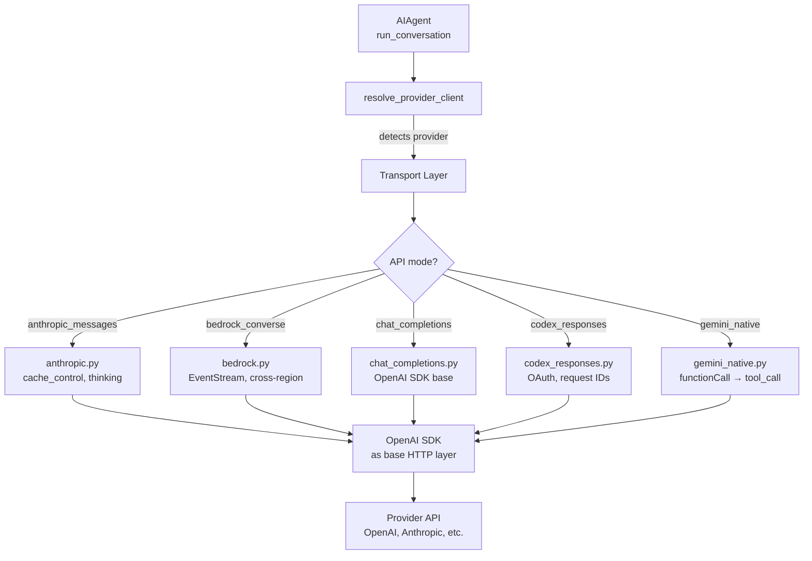
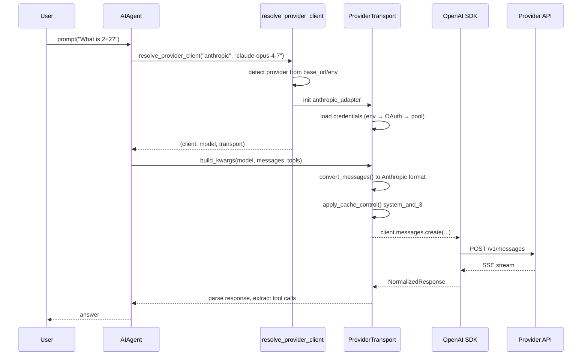

# Hermes Agent -- Model Providers Deep Dive

## Overview

Hermes implements a custom multi-provider abstraction layer built directly on the OpenAI Python SDK — **no LiteLLM dependency**. Instead, it uses provider-specific adapters (`agent/*_adapter.py`) for non-OpenAI-compatible APIs and a transport layer (`agent/transports/`) for format conversion. The system supports 30+ LLM providers, OAuth and API key authentication, credential pooling for failover, and dynamic context length detection.

```
┌─────────────────────────────────────────────────────────────┐
│                        AIAgent                               │
│                  run_conversation()                           │
│  ┌───────────────────┐  ┌──────────────────────────────┐    │
│  │ Provider Resolver  │  │ Transport Layer               │    │
│  │ - config.yaml      │  │ ┌────────────────────────┐   │    │
│  │ - env vars         │  │ │ base.py (ABC)           │   │    │
│  │ - credential pool  │  │ ├────────────────────────┤   │    │
│  │ - OAuth store      │  │ │ chat_completions.py     │   │    │
│  └───────┬───────────┘  │ │ anthropic.py            │   │    │
│          │               │ │ bedrock.py              │   │    │
│          ▼               │ │ codex.py                │   │    │
│  ┌───────────────────┐  │ └────────────────────────┘   │    │
│  │ OpenAI SDK Client  │  └──────────────────────────────┘    │
│  │ (base HTTP layer)  │                                       │
│  └───────┬───────────┘                                       │
└──────────┼───────────────────────────────────────────────────┘
           │
           ▼
   Provider API (OpenAI, Anthropic, Google, Bedrock, local, etc.)
```

## Provider Architecture

### Transport Abstraction

Every provider implements the `ProviderTransport` ABC (`agent/transports/base.py`):

```python
class ProviderTransport(ABC):
    @property
    def api_mode(self) -> str:
        """e.g., 'anthropic_messages', 'chat_completions', 'bedrock_converse'"""

    def convert_messages(self, messages, **kwargs) -> Any:
        """OpenAI format → provider-native format"""

    def convert_tools(self, tools) -> Any:
        """OpenAI tool schemas → provider-native schemas"""

    def build_kwargs(self, model, messages, tools=None, **params) -> Dict:
        """Complete API call kwargs ready for the SDK"""

    def normalize_response(self, response, **kwargs) -> NormalizedResponse:
        """Provider response → shared NormalizedResponse"""

    def extract_cache_stats(self, response) -> Optional[Dict[str, int]]:
        """Provider-specific cache hit/creation stats"""

    def map_finish_reason(self, raw_reason) -> str:
        """Provider stop reason → OpenAI equivalent"""
```

### Provider-Specific Adapters

**Anthropic** (`anthropic_adapter.py`):
- Translates OpenAI messages to Anthropic Messages API format
- Injects `cache_control` breakpoints (system_and_3 strategy)
- Handles thinking/reasoning blocks from Claude 4.6+
- Extended thinking output parsing

**Bedrock** (`bedrock_adapter.py`):
- AWS SDK ConverseStream API
- EventStream parser for chunked responses
- Cross-region inference support
- Max 200K context (Bedrock limit vs 1M native Anthropic)

**Gemini** (`gemini_native_adapter.py` + `gemini_cloudcode_adapter.py`):
- Google GenerativeAI SDK integration
- Tool call format translation (functionCall → tool_call)
- Gemini Cloud Code adapter for enterprise deployments

**Codex** (`codex_responses_adapter.py`):
- ChatGPT.com backend-api format (not standard OpenAI API)
- OAuth token management with automatic refresh
- Request ID tracking for reconnection
- Context window capped at 272K (vs 1.05M on direct API)

**Chat Completions** (`transports/chat_completions.py`):
- Default transport for OpenAI and all OpenAI-compatible providers
- Handles 15+ providers that speak the same protocol with quirks

## Supported Providers

### Provider Registry

```python
_URL_TO_PROVIDER = {
    "api.openai.com": "openai",
    "api.anthropic.com": "anthropic",
    "generativelanguage.googleapis.com": "gemini",
    "api.z.ai": "zai",
    "api.moonshot.ai": "kimi-coding",
    "dashscope.aliyuncs.com": "alibaba",
    "api.deepseek.com": "deepseek",
    "api.x.ai": "xai",
    "integrate.api.nvidia.com": "nvidia",
    "api.arcee.ai": "arcee",
    "api.minimax.io": "minimax",
    "api.xiaomimimo.com": "xiaomi",
    "api.fireworks.ai": "fireworks",
    "openrouter.ai": "openrouter",
    "inference-api.nousresearch.com": "nous",
    "api.githubcopilot.com": "copilot",
    # ... 30+ total
}
```

### Provider Categories

| Category | Providers | Transport |
|----------|-----------|-----------|
| **Enterprise Cloud** | OpenAI, Anthropic, Google Gemini, AWS Bedrock | Dedicated adapters |
| **China/Asia** | Z.AI/Zhipu GLM, Kimi/Moonshot, Alibaba Qwen, StepFun, MiniMax, Xiaomi MiMo | Chat completions |
| **Inference APIs** | DeepSeek, xAI/Grok, NVIDIA NIM, Arcee, Fireworks, Together, Groq | Chat completions |
| **Aggregators** | OpenRouter, Vercel AI Gateway, Ollama Cloud | Chat completions with routing |
| **OAuth-Based** | GitHub Copilot, Nous Portal, OpenAI Codex | Dedicated adapters |
| **Local** | Ollama, vLLM, LM Studio, llama.cpp | Chat completions |

### Local Model Support

Hermes detects local servers by hostname and adjusts behavior:

```python
_LOCAL_HOSTS = ("localhost", "127.0.0.1", "::1", "0.0.0.0")
_CONTAINER_LOCAL_SUFFIXES = (
    ".docker.internal",
    ".containers.internal",
    ".lima.internal",
)
_TAILSCALE_CGNAT = ipaddress.IPv4Network("100.64.0.0/10")
```

For local servers, Hermes:
- Auto-bumps stream read and stale timeouts
- Probes context length via server-specific APIs
- Skips API key requirements if base URL is local
- Uses model-specific query APIs (Ollama `/api/show`, llama.cpp `/v1/props`)

## Context Length Detection

### Multi-Tier Resolution

Hermes uses a 10-level cascade to determine each model's context window:

```
1. Explicit config override (config.yaml model.context_length)
       ↓ miss
2. Persistent cache (~/.hermes/context_length_cache.yaml)
       ↓ miss
3. AWS Bedrock table (static limits, 200K for Claude on Bedrock)
       ↓ miss
4. Endpoint /v1/models metadata query
       ↓ miss
5. Local server queries (Ollama, LM Studio, llama.cpp)
       ↓ miss
6. Anthropic /v1/models API (API key only)
       ↓ miss
7. models.dev lookup (4000+ models, 109 providers)
       ↓ miss
8. OpenRouter live API (real-time model registry)
       ↓ miss
9. Hardcoded defaults (200+ entries by model family)
       ↓ miss
10. Default fallback: 256K (probe-down on first error)
```

### Probe-Down on Errors

When the API returns a context length error, Hermes steps down through probe tiers:

```python
CONTEXT_PROBE_TIERS = [256_000, 128_000, 64_000, 32_000, 16_000, 8_000]

# If API says "context_length_exceeded: limit 200000"
# → Save discovered limit, retry with smaller context
```

### Default Context Lengths

The hardcoded fallback table covers all major model families:

```python
DEFAULT_CONTEXT_LENGTHS = {
    "claude-opus-4-7": 1_000_000,
    "claude-sonnet-4.6": 1_000_000,
    "gpt-5.5": 400_000,
    "gpt-5.4": 1_050_000,
    "gemini": 1_048_576,
    "grok-4-1-fast": 2_000_000,
    "deepseek": 128_000,
    "qwen3-coder-plus": 1_000_000,
    # ... 50+ entries with substring matching
}
```

The minimum context length for Hermes is 64K — models below this threshold are rejected as unable to maintain enough working memory for tool-calling workflows.

## Credential Management

### API Key Resolution

Keys are resolved through a priority cascade:

```
1. Environment variables (OPENAI_API_KEY, ANTHROPIC_API_KEY, etc.)
       ↓
2. Config-embedded keys (config.yaml, discouraged)
       ↓
3. OAuth tokens (auth.json refresh flow)
       ↓
4. Credential pool (multiple keys per provider)
       ↓
5. Claude Code credentials (~/.claude/.credentials.json)
```

### Credential Pool

The `CredentialPool` (`credential_pool.py`) manages multiple API keys per provider for high availability:

```python
@dataclass
class PooledCredential:
    provider: str
    id: str                           # UUID[:6]
    label: str                        # "Production Key"
    auth_type: str                    # "api_key" | "oauth"
    priority: int                     # 0 = first choice
    access_token: str                 # The actual key
    last_status: Optional[str]        # "ok" | "exhausted"
    last_error_code: Optional[int]    # 429, 402, etc.
    last_error_reset_at: Optional[float]  # When to retry
    request_count: int                # Total requests issued
```

**Selection strategies**:
- `fill_first` (default) — use highest-priority until exhausted
- `round_robin` — rotate through available credentials
- `random` — random selection from available pool
- `least_used` — pick credential with lowest request count

**Exhaustion management**:
- 429 (rate limit): 1-hour cooldown
- 402 (billing/quota): 1-hour cooldown
- Provider-supplied `reset_at` timestamps override defaults
- Automatic restoration when cooldown expires

### OAuth Token Management

OAuth flows support:
- Anthropic Claude Code OAuth (PKCE)
- GitHub Copilot device code flow
- Nous Portal JWT-based authentication
- Single-use refresh tokens (updated in store after each use)
- TTL tracking (`DEFAULT_AGENT_KEY_MIN_TTL_SECONDS = 300`)

## Error Classification and Recovery

### Error Taxonomy

`error_classifier.py` provides a structured taxonomy for API failures:

```python
class FailoverReason(enum.Enum):
    auth = "auth"                         # 401/403 — refresh/rotate
    auth_permanent = "auth_permanent"     # Auth failed after refresh — abort
    billing = "billing"                   # 402 — rotate immediately
    rate_limit = "rate_limit"             # 429 — backoff then rotate
    overloaded = "overloaded"             # 503/529 — backoff
    server_error = "server_error"         # 500/502 — retry
    timeout = "timeout"                   # Connection/read timeout — rebuild client
    context_overflow = "context_overflow" # Context too large — compress
    model_not_found = "model_not_found"   # 404 — fallback model
    format_error = "format_error"         # 400 — abort or strip + retry
    unknown = "unknown"                   # Retry with backoff
```

### Recovery Actions

Each classified error maps to recovery hints:

```python
@dataclass
class ClassifiedError:
    reason: FailoverReason
    retryable: bool = True
    should_compress: bool = False           # For context_overflow
    should_rotate_credential: bool = False  # For rate_limit, billing
    should_fallback: bool = False           # For model_not_found
```

### Fallback Chain

```python
def _try_activate_fallback() -> bool:
    """Switch to configured fallback model on persistent failure."""
    # 1. Check if fallback configured in config.yaml
    # 2. Resolve fallback provider + credentials
    # 3. Switch client, model, context engine
    # 4. Resume conversation
    # Only fires once per session
```

## Prompt Caching

### Anthropic Cache Strategy

`prompt_caching.py` implements the "system_and_3" strategy — 4 cache breakpoints (Anthropic's maximum):

```python
def apply_anthropic_cache_control(api_messages, cache_ttl="5m", native_anthropic=False):
    """
    Breakpoint 1: System prompt (stable across all turns)
    Breakpoints 2-4: Last 3 non-system messages (rolling window)
    """
    marker = {"type": "ephemeral"}
    if cache_ttl == "1h":
        marker["ttl"] = "1h"

    # Tag system prompt
    if messages[0].role == "system":
        apply_cache_marker(messages[0], marker)

    # Tag last 3 non-system messages
    for idx in non_system_indices[-3:]:
        apply_cache_marker(messages[idx], marker)
```

This reduces input costs by ~75% on multi-turn conversations. The system prompt (largest, most stable) is always cached. The last 3 messages form a rolling cache window that slides with each turn.

### Cache Consistency

Hermes normalizes whitespace and tool-call JSON before each API call to maximize prefix cache hit rates:

```python
# In run_conversation() per-iteration pipeline:
# Step 15: Normalize whitespace and tool-call JSON for prefix cache consistency
# Step 16: Strip surrogate characters
```

## Architecture





## Related Documents

- [02-agent-core.md](./02-agent-core.md) — AIAgent class that owns provider resolution
- [05-memory-system.md](./05-memory-system.md) — Memory providers and context fencing
- [06-context-engine.md](./06-context-engine.md) — Context compression triggers
- [11-data-flow.md](./11-data-flow.md) — End-to-end message flows
- [12-cost-tracking.md](./12-cost-tracking.md) — Token usage and pricing
- [17-memory-deep.md](./17-memory-deep.md) — Memory providers and context compression
- [18-multi-model.md](./18-multi-model.md) — Credential pool and fallback chains

## Source Paths

```
agent/
├── run_agent.py              ← AIAgent.run_conversation(), provider resolution
├── credential_pool.py        ← PooledCredential, selection strategies
├── model_metadata.py         ← 10-tier context length cascade
├── error_classifier.py       ← FailoverReason, ClassifiedError
└── prompt_caching.py         ← apply_anthropic_cache_control()

agent/transports/
├── base.py                   ← ProviderTransport ABC
├── chat_completions.py       ← Default transport for 15+ providers
├── anthropic.py              ← Anthropic Messages adapter
├── bedrock.py                ← AWS Bedrock Converse adapter
├── codex_responses.py        ← ChatGPT.com backend adapter
└── gemini_native.py          ← Google GenerativeAI adapter
```
