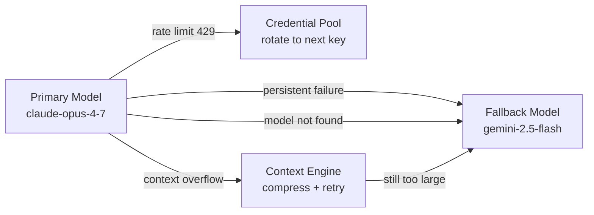
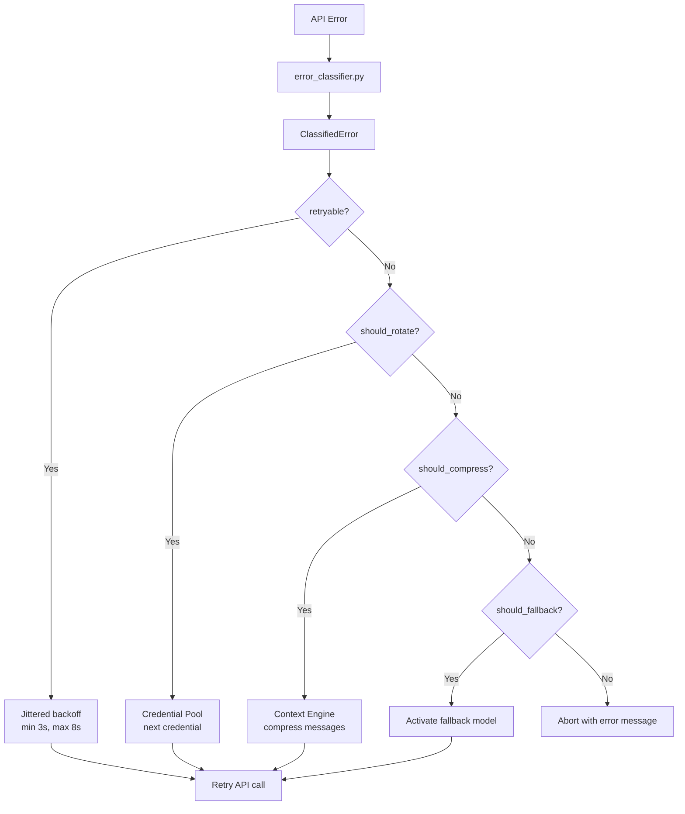

# Hermes Agent -- Multi-Model Execution

## Overview

Hermes uses one model at a time per conversation, but provides rich infrastructure for model failover, credential pooling across multiple keys, auxiliary model usage for background tasks, and runtime model switching. The architecture supports a primary → fallback chain with automatic activation on persistent failures.



## Credential Pool

### Architecture

The credential pool (`credential_pool.py`) manages multiple API keys per provider for high availability:

```python
@dataclass
class PooledCredential:
    provider: str                         # "openai", "anthropic", etc.
    id: str                               # UUID[:6] for display
    label: str                            # "Production Key", user@email.com
    auth_type: str                        # "api_key" | "oauth"
    priority: int                         # 0 = first choice, 1 = second, ...
    source: str                           # "manual" | "oauth" | "import"
    access_token: str                     # The actual API key
    last_status: Optional[str]            # "ok" | "exhausted"
    last_error_code: Optional[int]        # 429, 402, 401, etc.
    last_error_reset_at: Optional[float]  # Unix timestamp for retry
    request_count: int                    # Total requests issued
    base_url: Optional[str]              # Custom endpoint per credential
```

### Selection Strategies

```python
SUPPORTED_POOL_STRATEGIES = {
    "fill_first",    # Use first until exhausted, then next (default)
    "round_robin",   # Rotate through available credentials
    "random",        # Random selection from available pool
    "least_used",    # Credential with lowest request_count
}
```

Configuration in `config.yaml`:

```yaml
credential_pool_strategies:
  openai: "round_robin"
  anthropic: "fill_first"
  custom:my-endpoint: "least_used"
```

### Exhaustion and Recovery

```python
EXHAUSTED_TTL_429_SECONDS = 3600    # 1 hour for rate limits
EXHAUSTED_TTL_DEFAULT_SECONDS = 3600 # 1 hour for billing/quota

def _exhausted_until(entry: PooledCredential) -> Optional[float]:
    """When can this credential be retried?"""
    if entry.last_status != STATUS_EXHAUSTED:
        return None
    # Provider-supplied reset_at overrides defaults
    reset_at = entry.last_error_reset_at
    if reset_at is not None:
        return reset_at
    # Fallback to default TTL
    return entry.last_status_at + _exhausted_ttl(entry.last_error_code)
```

### Custom Provider Pools

Custom OpenAI-compatible endpoints get their own pool namespace:

```python
def get_custom_provider_pool_key(base_url: str) -> Optional[str]:
    """Look up custom_providers in config.yaml → 'custom:<name>'"""
    for norm_name, entry in _iter_custom_providers():
        if entry["base_url"] == base_url:
            return f"custom:{norm_name}"
    return None
```

### Pool Persistence

Stored in `~/.hermes/auth.json`:

```json
{
  "openai": [
    {
      "id": "abc123",
      "label": "Production Key",
      "access_token": "sk-...",
      "priority": 0,
      "request_count": 5000,
      "last_status": "ok"
    },
    {
      "id": "def456",
      "label": "Backup Key",
      "access_token": "sk-...",
      "priority": 1,
      "last_status": "exhausted",
      "last_error_code": 429,
      "last_error_reset_at": 1714300000.0
    }
  ]
}
```

## Fallback Chain

### Configuration

```yaml
# config.yaml
model:
  provider: "anthropic"
  name: "claude-opus-4-7"

fallback_model:
  provider: "openrouter"
  model: "google/gemini-2.5-flash"
  base_url: ""  # Optional override
```

### Activation Logic

```python
def _try_activate_fallback() -> bool:
    """Switch to fallback on persistent primary failure."""
    if _fallback_activated or not _fallback_model:
        return False

    # Resolve fallback provider credentials
    client, model = resolve_provider_client(
        provider=_fallback_model["provider"],
        model=_fallback_model["model"],
        base_url=_fallback_model.get("base_url"),
    )

    if client is None:
        logger.error("Fallback unavailable (missing credentials)")
        return False

    # Update agent state
    self.client = client
    self.model = model
    self._context_engine.update_model(model, ctx_len, base_url)

    _fallback_activated = True  # Only fire once per session
    return True
```

### Fallback triggers:
1. **Rate limit exhaustion** — all credentials for primary provider exhausted
2. **Model not found** — 404 from primary provider
3. **Persistent server errors** — 5xx after max retries
4. **Auth failure** — permanent 401/403 after token refresh

### Recovery to Primary

```python
# At the start of each new turn:
def _restore_primary_runtime():
    """If fallback was activated in previous turn, try restoring primary."""
    if _fallback_activated and primary_credentials_recovered():
        _fallback_activated = False
        # Rebuild client for primary provider
```

## Error Classification Pipeline

### Structured Error Handling

Every API failure passes through the error classifier:



### Retry Strategy

```python
# Jittered exponential backoff
retry_delay = min(3 + retry_count, 8)  # seconds
# Max 2 retries per error before escalation
# Rate-limit recovery: wait 1 hour then retry
# Context error: shrink context, no wait
```

## Runtime Model Switching

### User-Initiated Switch

```python
def switch_model(self, provider, model, base_url="", api_key="") -> bool:
    """User runs /model to switch mid-conversation."""

    # 1. Resolve new provider client
    client, norm_model = resolve_provider_client(provider, model, base_url, api_key)
    if not client:
        return False

    # 2. Update agent state
    self.client = client
    self.model = norm_model
    self.provider = provider

    # 3. Detect new context window
    ctx_len = get_model_context_length(norm_model, base_url, api_key, provider)
    self._context_engine.update_model(norm_model, ctx_len, base_url, api_key, provider)

    return True
```

### Cron Job Model Selection

Cron jobs (scheduled tasks) can specify their own model:

```yaml
# In cron configuration
cron:
  weekly_summary:
    schedule: "0 9 * * 1"
    model:
      provider: "openai"
      name: "gpt-4o-mini"  # Cheaper model for automated tasks
```

## Auxiliary Models

### Summarization Client

Context compression uses a separate "auxiliary" model — cheaper and faster than the primary:

```python
_AUXILIARY_CLIENT_CACHE: Dict[tuple, tuple[client, model, loop]] = {}

def get_async_text_auxiliary_client(task: str = ""):
    """Get or create async client for summarization/compression."""
    # Reuses clients to avoid creation overhead
    # Runs in separate event loop per provider
    # Default: gpt-4o-mini or similar cheap model
```

### Background Operations

Background tasks that use auxiliary models:
1. **Context compression** — summarize old messages to fit context window
2. **Memory prefetch** — background threads querying memory backends
3. **Title generation** — generate session titles from conversation content
4. **Insights collection** — track usage patterns and cost statistics

## Parallel Tool Execution

### Concurrent Tool Batching

When the LLM returns multiple tool calls in a single response:

```python
_MAX_TOOL_WORKERS = 8

_PARALLEL_SAFE_TOOLS = {"read_file", "search_files", "web_search", ...}
_NEVER_PARALLEL_TOOLS = {"clarify"}
_PATH_SCOPED_TOOLS = {"read_file", "write_file", "patch"}

# Execute concurrently where safe:
with concurrent.futures.ThreadPoolExecutor(max_workers=8) as executor:
    futures = [executor.submit(execute_tool, call) for call in tool_calls]
    results = [f.result() for f in futures]
```

### Safety Rules

- **Read-only tools**: Always parallelizable
- **Interactive tools** (clarify): Never parallel
- **Path-scoped tools**: Check for file path conflicts before parallelizing
- **Write tools**: Sequential if touching same file

## Subagent Model Delegation

### Shared Iteration Budget

Parent and subagents share a single `IterationBudget`:

```python
class IterationBudget:
    def __init__(self, max_iterations: int):
        self.remaining = max_iterations

    def consume(self) -> bool:
        """Returns False if budget exhausted."""
        if self.remaining <= 0:
            return False
        self.remaining -= 1
        return True
```

A parent with budget 90 and a subagent each consume from the same counter — preventing runaway nested loops.

### Subagent Model Selection

Subagents can use different models than the parent:

```python
# Parent delegates with specific model
subagent = AIAgent(
    model="gpt-4o-mini",           # Cheaper for sub-tasks
    fallback_model=None,            # No fallback for subagents
    iteration_budget=parent.budget, # Shared budget
)
result = await subagent.run(sub_task)
```

## Cost-Aware Routing

### Usage Pricing

`usage_pricing.py` tracks costs per model:

```python
@dataclass(frozen=True)
class PricingEntry:
    input_cost_per_million: Optional[Decimal]
    output_cost_per_million: Optional[Decimal]
    cache_read_cost_per_million: Optional[Decimal]
    cache_write_cost_per_million: Optional[Decimal]
    source: CostSource  # "official_docs_snapshot", "models_dev", "unknown"
```

### Cost Estimation

```python
def estimate_usage_cost(usage, billing_route) -> CostResult:
    pricing = lookup_model_pricing(billing_route.provider, billing_route.model)

    prompt_cost = usage.prompt_tokens * pricing.input / 1_000_000
    output_cost = usage.output_tokens * pricing.output / 1_000_000

    if billing_route.provider == "anthropic":
        cache_read = usage.cache_read * pricing.cache_read / 1_000_000
        cache_write = usage.cache_write * pricing.cache_write / 1_000_000

    return CostResult(
        amount_usd=prompt_cost + output_cost + cache_read + cache_write,
        source=pricing.source,
    )
```

### Usage Insights

`agent/insights.py` provides a session-level cost dashboard:
- Cost per session with breakdown by component
- Cache hit rates and savings from prompt caching
- Model comparison for task categories
- Cheapest-model recommendations based on observed usage
