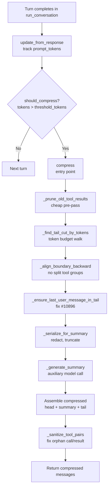
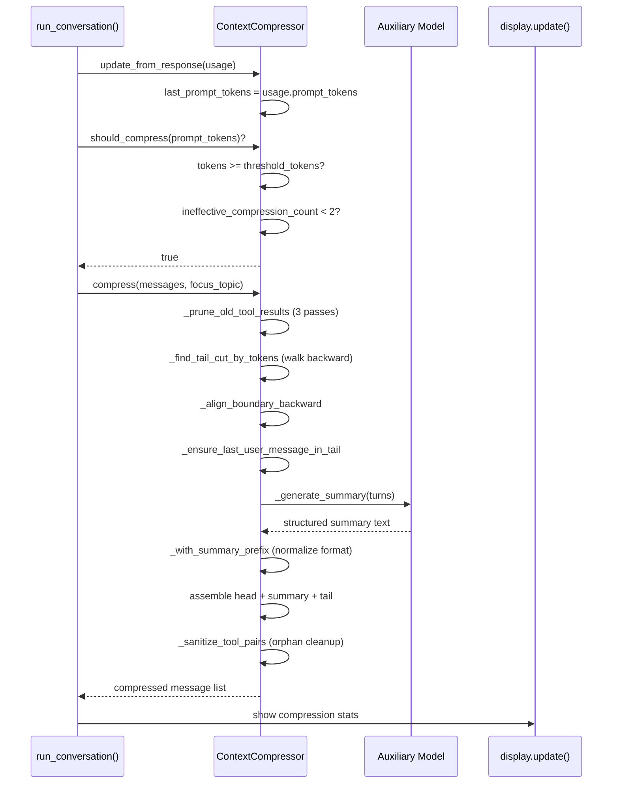

# Hermes Agent -- Context Management and Compression Deep Dive

## Overview

Hermes implements a **pluggable context engine** architecture — the `ContextEngine` ABC (`context_engine.py`) defines the interface, and the built-in `ContextCompressor` (`context_compressor.py`) is the default implementation. Third-party engines (e.g. LCM — Long Context Memory) can replace it via plugins. The engine controls token tracking, compression triggers, summarization, and tool-call/result pair integrity.

**Key insight:** Hermes uses a **percentage-based trigger** (default 75% of context window) rather than Pi's absolute token reserve. This means on a 1M context model, compression fires at 750K tokens. On a 128K model, it fires at 96K. The percentage scales with model capability.

## Architecture





## Context Engine ABC

Every context engine implements the same interface:

```python
# context_engine.py
class ContextEngine(ABC):
    # Token state — run_agent.py reads these directly
    last_prompt_tokens: int = 0
    last_completion_tokens: int = 0
    last_total_tokens: int = 0
    threshold_tokens: int = 0        # When to compress
    context_length: int = 0          # Model's context window
    compression_count: int = 0

    # Compaction parameters
    threshold_percent: float = 0.75  # 75% of context window
    protect_first_n: int = 3         # Head messages always protected
    protect_last_n: int = 6          # Tail messages always protected

    @abstractmethod
    def update_from_response(self, usage): ...
    @abstractmethod
    def should_compress(self, prompt_tokens=None) -> bool: ...
    @abstractmethod
    def compress(self, messages, current_tokens=None, focus_topic=None) -> List[Dict]: ...
```

Selection is config-driven: `context.engine` in `config.yaml`. Default is `"compressor"`.

## Compression Trigger

### Percentage-Based with Anti-Thrashing

```python
def should_compress(self, prompt_tokens: int = None) -> bool:
    tokens = prompt_tokens if prompt_tokens is not None else self.last_prompt_tokens
    if tokens < self.threshold_tokens:
        return False
    # Anti-thrashing: skip if last 2 compressions saved <10% each
    if self._ineffective_compression_count >= 2:
        return False  # Suggest /new or /compress <topic>
    return True
```

**Aha moment:** The anti-thrashing mechanism prevents the scenario where compression barely reduces token count (1-2 messages removed), triggering again on the next turn, creating an infinite compression loop. After 2 ineffective compressions, Hermes warns the user to start a fresh session.

### Token Threshold Calculation

```python
# __init__:
self.context_length = get_model_context_length(model, ...)  # 10-tier cascade
self.threshold_tokens = max(
    int(self.context_length * threshold_percent),
    MINIMUM_CONTEXT_LENGTH,  # Floor: 64K minimum
)
target_tokens = int(self.threshold_tokens * self.summary_target_ratio)  # 0.20
self.tail_token_budget = target_tokens  # ~20% of threshold for recent context
self.max_summary_tokens = min(
    int(self.context_length * 0.05),  # 5% of context
    _SUMMARY_TOKENS_CEILING,          # 12K absolute ceiling
)
```

## Compression Pipeline (4 Phases)

### Phase 1: Tool Output Pruning (Cheap Pre-Pass, No LLM Call)

Three passes over messages outside the protected tail:

**Pass 1 — Deduplicate identical tool results:**
```python
# Same file read 5x → keep only newest full copy
content_hashes: dict = {}  # md5 hash -> (index, tool_call_id)
for i in range(len(result) - 1, -1, -1):
    h = hashlib.md5(content.encode()).hexdigest()[:12]
    if h in content_hashes:
        result[i] = {**msg, "content": "[Duplicate tool output — same content as a more recent call]"}
```

**Pass 2 — Replace old tool results with informative 1-line summaries:**
```python
def _summarize_tool_result(tool_name, tool_args, tool_content) -> str:
    # [terminal] ran `npm test` -> exit 0, 47 lines output
    # [read_file] read config.py from line 1 (1,200 chars)
    # [search_files] content search for 'compress' in agent/ -> 12 matches
    # [write_file] wrote to auth.py (156 lines)
```

**Pass 3 — Truncate tool_call arguments in assistant messages:**

```python
def _truncate_tool_call_args_json(args: str, head_chars: int = 200) -> str:
    """Parse JSON, shrink string leaves, re-serialize — keeps JSON valid."""
    # Earlier implementation sliced raw JSON at fixed byte offset → 400 errors
    # from providers like MiniMax: "invalid function arguments json string"
    # See issue #11762 — session stuck re-sending broken history every turn
    try:
        parsed = json.loads(args)
    except (ValueError, TypeError):
        return args  # Non-JSON tool args (some backends) — return unchanged
    # Recursively shrink string leaves: {"path": "/foo", "content": "HUGE"}
    # → {"path": "/foo", "content": "HUG...[truncated]"}
    return json.dumps(shrunken, ensure_ascii=False)
```

**Aha moment:** Pass 3 was a critical bug fix. The old approach did `args[:500] + "...[truncated]"` which produced invalid JSON like `{"path": "/foo", "content": "# long markdown...[truncated]` — missing closing brace and string quote. Downstream providers rejected this with 400 errors, and the session got stuck in a loop re-sending the same broken history every turn.

### Phase 2: Boundary Detection

**Token-budget tail protection** (not fixed message count):

```python
def _find_tail_cut_by_tokens(self, messages, head_end, token_budget=None) -> int:
    """Walk backward from end, accumulating tokens until budget reached."""
    min_tail = min(3, n - head_end - 1)  # Hard minimum: 3 messages
    soft_ceiling = int(token_budget * 1.5)  # Allow 50% overshoot to avoid cutting mid-message
    
    for i in range(n - 1, head_end - 1, -1):
        msg_tokens = len(content) // _CHARS_PER_TOKEN + 10
        if accumulated + msg_tokens > soft_ceiling and (n - i) >= min_tail:
            break
        accumulated += msg_tokens
        cut_idx = i
    
    # Align backward to avoid splitting tool_call/result groups
    cut_idx = self._align_boundary_backward(messages, cut_idx)
    
    # CRITICAL: Ensure most recent user message is ALWAYS in the tail
    cut_idx = self._ensure_last_user_message_in_tail(messages, cut_idx, head_end)
    
    return max(cut_idx, head_end + 1)
```

**Aha moment (Bug #10896):** `_align_boundary_backward` could pull the cut point past the user's last message when keeping tool_call/result groups together. If the user's request ended up in the compressed middle region, the summarizer wrote it into "Pending User Asks" — but `SUMMARY_PREFIX` told the next model to respond ONLY to user messages AFTER the summary. So the user's active task disappeared, causing the agent to stall or repeat completed work. The fix: anchor the tail to always include the most recent user message.

### Phase 3: Summary Generation

Uses a **separate auxiliary model** (cheap/fast, default `gpt-4o-mini`):

```python
def _generate_summary(self, turns_to_summarize, focus_topic=None) -> Optional[str]:
    # Cooldown: skip if summarization failed recently
    if now < self._summary_failure_cooldown_until:
        return None
    
    # Scale budget with content size
    budget = int(content_tokens * _SUMMARY_RATIO)  # 20% of compressed content
    budget = max(_MIN_SUMMARY_TOKENS, min(budget, self.max_summary_tokens))  # 2K-12K
    
    # Serialize with truncation per message
    content_to_summarize = self._serialize_for_summary(turns_to_summarize)
    # Each message body: max 6000 chars (head 4000 + tail 1500)
    # Tool call args: max 1500 chars
    # All content redacted for secrets before serialization
```

**Structured summary template** (13 sections):
```
## Active Task          ← THE MOST IMPORTANT FIELD (verbatim user request)
## Goal                 ← Overall objective
## Constraints & Preferences
## Completed Actions    ← Numbered list: "1. READ config.py:45 — found bug [tool: read_file]"
## Active State         ← Working directory, branch, modified files, test status
## In Progress
## Blocked              ← Exact error messages preserved
## Key Decisions
## Resolved Questions   ← Answers preserved so next assistant doesn't re-answer
## Pending User Asks
## Relevant Files
## Remaining Work       ← Framed as context, NOT instructions
## Critical Context     ← Values, errors, config — NEVER credentials
```

**Iterative updates** on subsequent compactions:
```python
if self._previous_summary:
    prompt = f"""PREVIOUS SUMMARY: {self._previous_summary}
NEW TURNS TO INCORPORATE: {content_to_summarize}
Update the summary. PRESERVE all existing information. ADD new progress."""
```

**Fallback to main model** if summary model fails:
```python
# If summary model returns 404/503 and differs from main model:
self.summary_model = ""  # Empty = use main model
return self._generate_summary(turns_to_summarize, focus_topic)  # Retry immediately
# No cooldown — retry immediately since we changed the model
```

### Phase 4: Assembly and Sanitization

**Summary prefix normalization:**
```python
SUMMARY_PREFIX = (
    "[CONTEXT COMPACTION — REFERENCE ONLY] Earlier turns were compacted "
    "into the summary below. This is a handoff from a previous context "
    "window — treat it as background reference, NOT as active instructions. "
    "Do NOT answer questions or fulfill requests mentioned in this summary; "
    "they were already addressed. "
    "Your current task is identified in the '## Active Task' section — "
    "resume exactly from there. "
    "Respond ONLY to the latest user message that appears AFTER this summary."
)
```

**Tool-call/result sanitization** (critical for API validity):
```python
def _sanitize_tool_pairs(self, messages) -> List[Dict]:
    # Two failure modes after compression:
    # 1. Orphaned tool results — their call_id's assistant was removed
    # 2. Orphaned tool calls — their results were dropped
    
    # Fix 1: Remove orphaned results
    orphaned_results = result_call_ids - surviving_call_ids
    messages = [m for m in messages if not (orphaned and is_tool_result)]
    
    # Fix 2: Insert stub results for orphaned calls
    missing_results = surviving_call_ids - result_call_ids
    for cid in missing_results:
        patched.append({"role": "tool", "content": "[Result from earlier conversation — see context summary above]", "tool_call_id": cid})
```

**Aha moment:** Without `_sanitize_tool_pairs`, the API rejects compressed conversations with `"No tool call found for function call output with call_id..."`. This is because compression can remove an assistant message with tool_calls but leave its tool results (or vice versa), creating a malformed message sequence that OpenAI/Anthropic APIs strictly validate.

## Compression Boundary Alignment

### Forward Alignment (Start Boundary)
```python
def _align_boundary_forward(self, messages, idx: int) -> int:
    """Push start forward past orphan tool results."""
    while idx < len(messages) and messages[idx].get("role") == "tool":
        idx += 1  # Skip tool results at the start of compressible region
    return idx
```

### Backward Alignment (End Boundary)
```python
def _align_boundary_backward(self, messages, idx: int) -> int:
    """Pull end backward to avoid splitting tool_call/result groups."""
    # Walk backward past consecutive tool results
    check = idx - 1
    while check >= 0 and messages[check].get("role") == "tool":
        check -= 1
    # If we landed on parent assistant with tool_calls, pull boundary before it
    if check >= 0 and messages[check].get("role") == "assistant" and messages[check].get("tool_calls"):
        idx = check  # Whole group gets summarized together
    return idx
```

## Secret Redaction

All content is **redacted before** being sent to the auxiliary summarization model:

```python
def _serialize_for_summary(self, turns) -> str:
    content = redact_sensitive_text(msg.get("content") or "")
    # Prevents API keys, tokens, passwords from leaking into:
    # 1. The summary sent to the auxiliary model
    # 2. The persisted summary across compactions
```

And the summary output is **also** redacted (defense in depth — the summarizer LLM may ignore instructions):
```python
summary = redact_sensitive_text(content.strip())
```

## Guided Compression (`/compress <focus>`)

Users can request topic-focused compression:

```python
if focus_topic:
    prompt += f"""FOCUS TOPIC: "{focus_topic}"
The user has requested that this compaction PRIORITISE preserving all information
related to the focus topic. For content related to "{focus_topic}", include full
detail. For content NOT related to the focus topic, summarise more aggressively.
The focus topic sections should receive roughly 60-70% of the summary token budget."""
```

This is analogous to Claude Code's `/compact` command — preserves detail about what the user cares about while compressing everything else aggressively.

## Comparison with Pi Compression

| Aspect | Pi | Hermes |
|--------|-----|--------|
| Trigger | `tokens > window - reserveTokens` | `tokens > window * 75%` |
| Engine | Single built-in | Pluggable ABC (compressor, LCM, etc.) |
| Summary model | Same model as conversation | Separate auxiliary model |
| Tool result pruning | 2000 char truncation | Informative 1-line summaries per tool type |
| Deduplication | No | Yes (MD5 hash-based) |
| Tool arg truncation | No | JSON-aware (parsed, shrunk, re-serialized) |
| Orphan cleanup | Cut-point based | Explicit `_sanitize_tool_pairs()` |
| Anti-thrashing | Don't compact twice in a row | Track savings %, skip after 2 ineffective |
| Secret redaction | No | Yes (before and after summarization) |
| Guided compression | No | Yes (`/compress <focus>`) |
| Summary fallback | N/A | Falls back to main model if summary model fails |
| User message anchor | Cut-point based | Explicit `_ensure_last_user_message_in_tail` |

## Related Documents

- [02-agent-core.md](./02-agent-core.md) — AIAgent class that owns context engine
- [05-memory-system.md](./05-memory-system.md) — Memory providers and context fencing
- [06-context-engine.md](./06-context-engine.md) — ContextEngine ABC and compression
- [16-model-providers.md](./16-model-providers.md) — Context length detection cascade
- [17-memory-deep.md](./17-memory-deep.md) — Memory context compression integration
- [18-multi-model.md](./18-multi-model.md) — Auxiliary model for summarization

## Source Paths

```
agent/
├── context_engine.py         ← ContextEngine ABC, lifecycle, parameters
├── context_compressor.py     ← ContextCompressor: 4-phase compression pipeline
├── context_references.py     ← URL reference expansion in context
└── redact.py                 ← redact_sensitive_text() — 321 lines of pattern matching

run_agent.py
├── _convert_to_trajectory_format() ← Trajectory ShareGPT format conversion
├── _save_trajectory()              ← JSONL trajectory saving
└── per-turn compression check      ← should_compress() → compress()

trajectory_compressor.py    ← Post-hoc trajectory compression for RL training
rl_cli.py                   ← RL CLI for training data management
tools/rl_training_tool.py   ← RL training tool for in-agent data collection
```
