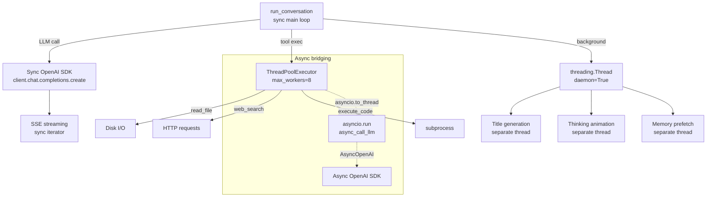

# Hermes Agent -- Async Python Deep Dive

## Overview

Hermes operates in a **hybrid sync/async world** — its core message loop (`run_conversation`) is synchronous Python, but it wraps async operations (streaming LLM responses, web extraction, background tasks) using `asyncio` primitives. The framework's async architecture is pragmatic: **sync where possible, async when needed, bridge the gap with `asyncio.to_thread()`**.

**Key insight:** Hermes doesn't run a persistent event loop. Instead, it creates event loops on-demand via `asyncio.run()` for specific operations, wrapping sync SDK calls in thread pools, and using `ThreadPoolExecutor` for concurrent tool execution. This avoids the complexity of a fully async agent while still getting the benefits of async I/O where it matters.

## Async Architecture

```mermaid
flowchart TD
    SYNC[run_conversation<br/>sync main loop] -->|LLM call| ASYNC_ASYNC[async_call_llm]
    SYNC -->|tool exec| THREAD[ThreadPoolExecutor<br/>max_workers=8]
    SYNC -->|background| BG[Thread for title,<br/>memory prefetch]

    ASYNC_ASYNC --> STREAM[SSE streaming<br/>sync OpenAI SDK]
    ASYNC_ASYNC -->|async path| AIO[asyncio.run<br/>async_call_llm]

    AIO --> TO_THREAD[asyncio.to_thread<br/>wrap sync SDK]
    TO_THREAD --> SDK[OpenAI SDK<br/>sync create()]

    THREAD -->|read_file| DISK[Disk I/O]
    THREAD -->|web_search| HTTP[HTTP requests]
    THREAD -->|execute_code| SUBPROCESS[subprocess]

    BG --> TITLE[title_generator.py<br/>threading.Thread]
    BG --> MEM[Memory prefetch<br/>background threads]
```

## The Main Loop: Sync-First Design

Hermes's core `run_conversation()` is a **synchronous while loop**:

```python
# run_agent.py — simplified
def run_conversation(self, user_message, messages, ...):
    while True:
        # 1. Build prompt
        # 2. Call LLM (sync OpenAI SDK)
        response = client.chat.completions.create(**kwargs)
        # 3. Parse tool calls
        # 4. Execute tools (ThreadPoolExecutor)
        # 5. Append results
        # 6. Check context compression
        # 7. Loop or exit
```

**Aha moment:** This is a deliberate design choice. A sync loop avoids the "async all the way down" problem where every function needs to be `async def`. The LLM SDK itself is synchronous (OpenAI's `OpenAI` client, not `AsyncOpenAI`), so there's no inherent need for async in the main loop. Async is reserved for **background operations** that shouldn't block the conversation.

## Sync/Async Architecture Overview



## Bridging Sync and Async: `asyncio.to_thread()`

When Hermes needs async operations from sync code, it uses `asyncio.to_thread()`:

```python
# auxiliary_client.py
class _AsyncCodexCompletionsAdapter:
    """Wraps the sync adapter via asyncio.to_thread() so async consumers
    (web_tools, session_search) can await it as normal."""

    def __init__(self, sync_adapter: _CodexCompletionsAdapter):
        self._sync = sync_adapter

    async def create(self, **kwargs) -> Any:
        import asyncio
        return await asyncio.to_thread(self._sync.create, **kwargs)
```

Same pattern for Gemini:
```python
# gemini_native_adapter.py
async def _create_chat_completion(self, **kwargs: Any) -> Any:
    result = await asyncio.to_thread(self._sync.chat.completions.create, **kwargs)
    
    async def _async_stream() -> Any:
        while True:
            done, chunk = await asyncio.to_thread(self._sync._advance_stream_iterator, result)
            if done:
                break
            yield chunk
```

**Aha moment:** `asyncio.to_thread()` runs the sync call in a separate thread from the default thread pool executor, then returns control to the event loop. This is cleaner than `loop.run_in_executor()` because it auto-creates the thread and handles the future-to-awaitable conversion. It's the modern Python 3.9+ way to bridge sync/async.

## Event Loop Management

### On-Demand Event Loops

Hermes creates event loops per-operation, not persistent:

```python
# context_references.py — running async code from sync context
def run_coro_in_new_loop(coro):
    try:
        loop = asyncio.get_running_loop()
        # If we're already in an async context, run in a thread
        import concurrent.futures
        with concurrent.futures.ThreadPoolExecutor(max_workers=1) as pool:
            return pool.submit(asyncio.run, coro).result()
    except RuntimeError:
        # No running loop — create one
        return asyncio.run(coro)
```

**Aha moment:** The `try/except RuntimeError` pattern detects whether we're already inside an event loop. If so, `asyncio.get_running_loop()` succeeds and we need a separate thread + new loop. If not, `RuntimeError` is raised and we can safely `asyncio.run()`. This is the standard Python pattern for "run async from sync, regardless of context."

### Async Client Lifecycle

The auxiliary client creates async clients **lazily** to bind to the current event loop:

```python
# auxiliary_client.py
def _get_async_client(self):
    """Return an AsyncOpenAI client bound to the current event loop.

    Created lazily so that each asyncio.run() call gets a client tied to
    its own loop, avoiding 'Event loop is closed' errors on repeated calls.
    """
    from openai import AsyncOpenAI
    self.async_client = AsyncOpenAI(
        api_key=self._async_client_api_key,
        base_url=_to_openai_base_url(self.config.base_url),
    )
    return self.async_client
```

**Aha moment:** `AsyncOpenAI` captures the event loop at creation time. If you create it once and reuse it across multiple `asyncio.run()` calls (each with its own loop), you get "Event loop is closed" errors. The fix: create a fresh client for each loop.

## Concurrent Tool Execution: `ThreadPoolExecutor`

When the LLM returns multiple tool calls, Hermes executes them **concurrently**:

```python
# run_agent.py
_MAX_TOOL_WORKERS = 8

_PARALLEL_SAFE_TOOLS = {"read_file", "search_files", "web_search", ...}
_NEVER_PARALLEL_TOOLS = {"clarify"}
_PATH_SCOPED_TOOLS = {"read_file", "write_file", "patch"}

with concurrent.futures.ThreadPoolExecutor(max_workers=8) as executor:
    futures = {
        executor.submit(execute_tool, call): call
        for call in parallel_safe_calls
    }
    results = [f.result() for f in as_completed(futures)]
```

### Path-Scoped Parallelism

For tools that modify files, Hermes checks for **path conflicts** before parallelizing:

```python
# Two write_file calls to different files → safe to parallelize
# Two write_file calls to the same file → sequential
def _can_parallelize(tool_calls):
    path_scoped = [tc for tc in tool_calls if tc.name in PATH_SCOPED_TOOLS]
    paths = [tc.arguments.get("path") for tc in path_scoped]
    return len(paths) == len(set(paths))  # No duplicate paths
```

## Threading and Locks

Hermes uses `threading.Lock` extensively for thread-safe shared state:

```python
# credential_pool.py
class CredentialPool:
    def __init__(self):
        self._lock = threading.Lock()
    
    def get_credential(self, provider):
        with self._lock:
            # Find next available credential
            # Mark exhausted ones
            # Return the best option

# shell_hooks.py
_registered_lock = threading.Lock()
_allowlist_write_lock = threading.Lock()

# retry_utils.py
_jitter_lock = threading.Lock()  # For jittered backoff randomness

# auxiliary_client.py
_client_cache_lock = threading.Lock()  # For LLM client caching

# prompt_builder.py
_SKILLS_PROMPT_CACHE_LOCK = threading.Lock()  # For skills prompt caching
```

**Aha moment:** Hermes uses `threading.Lock` (not `threading.RLock`) intentionally in most places — it's faster and catches reentrancy bugs early. The only reentrant lock is in POSIX shell hook registration where recursive locking is expected.

## Google OAuth: Thread-Local State + In-Flight Dedup

```python
# google_oauth.py
_lock_state = threading.local()  # Per-thread state

# Deduplicate concurrent refresh attempts for the same token
_refresh_inflight: Dict[str, threading.Event] = {}
_refresh_inflight_lock = threading.Lock()

def refresh_token(token_info):
    key = token_info["refresh_token"]
    with _refresh_inflight_lock:
        if key in _refresh_inflight:
            # Another thread is already refreshing — wait for it
            event = _refresh_inflight[key]
        else:
            # This thread owns the refresh
            event = threading.Event()
            _refresh_inflight[key] = event
    
    event.wait()  # Block until refresh completes
    # All waiting threads get the same refreshed token
```

**Aha moment:** This is a classic "thundering herd" prevention pattern. When multiple threads detect an expired OAuth token simultaneously, instead of all refreshing (which can trigger rate limits), one thread refreshes while others wait on a `threading.Event`. When the refresh completes, all waiting threads unblock with the same new token.

## Background Operations

### Title Generation

```python
# title_generator.py
def generate_title_async(conversation_text, model, provider, ...):
    thread = threading.Thread(
        target=_generate_title_sync,
        args=(conversation_text, model, provider, ...),
        daemon=True,  # Don't block process exit
        name="title-generator",
    )
    thread.start()
    # Returns immediately — title saved when thread completes
```

### Display Animation

```python
# display.py
class ThinkingAnimation:
    def start(self):
        self.thread = threading.Thread(target=self._animate, daemon=True)
        self.thread.start()
    
    def _animate(self):
        # Spins through animation frames in background
        # Updates terminal without blocking the main loop
```

### Copilot ACP: Stdout/Stderr Readers

```python
# copilot_acp_client.py
def _start_process(self, cmd):
    self._active_process_lock = threading.Lock()
    process = subprocess.Popen(cmd, stdout=PIPE, stderr=PIPE)
    
    def _stdout_reader():
        for line in process.stdout:
            # Parse and queue output
    
    def _stderr_reader():
        for line in process.stderr:
            # Log errors
    
    out_thread = threading.Thread(target=_stdout_reader, daemon=True)
    err_thread = threading.Thread(target=_stderr_reader, daemon=True)
    out_thread.start()
    err_thread.start()
```

**Aha moment:** Reading from `subprocess.Popen` pipes in the main thread would block the agent loop. Hermes spawns dedicated reader threads for stdout and stderr, feeding output into thread-safe queues that the main loop polls.

## Async LLM Calls

The `async_call_llm` function provides an async path to LLM calls with retry logic:

```python
# auxiliary_client.py
async def async_call_llm(provider, model, messages, ...):
    # Initial attempt
    try:
        response, task = await asyncio.wait_for(
            asyncio.create_task(
                client.chat.completions.create(**kwargs)
            ),
            timeout=timeout,
        )
        return response
    except Exception:
        # Retry with jittered backoff
        for attempt in range(max_retries):
            try:
                response = await client.chat.completions.create(**retry_kwargs)
                return response
            except Exception:
                await asyncio.sleep(jittered_backoff(attempt + 1))
        
        # Fallback model attempt
        if fallback_model_configured:
            response = await async_fb.chat.completions.create(**fb_kwargs)
            return response
```

**Key pattern:** `asyncio.wait_for(asyncio.create_task(...), timeout=timeout)` — the `create_task` wraps the call so it can be cancelled on timeout, and `wait_for` applies the deadline.

## Trajectory Compression: Async Parallel Processing

The trajectory compressor processes hundreds of JSONL files concurrently:

```python
# trajectory_compressor.py
async def _process_directory_async(self, input_dir, output_dir):
    # Semaphore for rate limiting — max N concurrent API calls
    semaphore = asyncio.Semaphore(self.config.max_concurrent_requests)
    
    # Thread-safe counters with asyncio.Lock
    progress_lock = asyncio.Lock()
    compressed_count = 0
    in_flight = 0
    
    async def process_single(file_path, entry_idx, entry, ...):
        async with semaphore:  # Rate limit
            async with progress_lock:
                in_flight += 1
            
            try:
                # Per-trajectory timeout
                result = await asyncio.wait_for(
                    self.process_entry_async(entry),
                    timeout=self.config.per_trajectory_timeout  # 5 min default
                )
            except asyncio.TimeoutError:
                # Skip timed-out entries
            except Exception:
                # Keep original on error
    
    # Run ALL trajectories concurrently
    tasks = [process_single(...) for ...]
    await asyncio.gather(*tasks)  # Parallel with semaphore control
```

**Aha moment:** The `asyncio.Semaphore` pattern limits concurrent API calls to avoid rate limits (default 50), while `asyncio.wait_for` with a per-trajectory timeout (default 5 min) prevents any single trajectory from hanging indefinitely. The `asyncio.gather(*tasks)` runs everything in parallel, but the semaphore ensures at most 50 API calls are in flight at once.

## Key Optimizations

### 1. Client Caching with Lock

```python
# auxiliary_client.py
_client_cache_lock = threading.Lock()
_client_cache: Dict[tuple, tuple] = {}

def get_client(provider, model, ...):
    key = (provider, model, ...)
    with _client_cache_lock:
        if key in _client_cache:
            return _client_cache[key]
    # Create new client
    with _client_cache_lock:
        _client_cache[key] = client
    return client
```

### 2. Prompt Cache Lock

```python
# prompt_builder.py
_SKILLS_PROMPT_CACHE_LOCK = threading.Lock()
_skills_prompt_cache: Dict[str, str] = {}

# Skills prompts are expensive to generate — cache them
# The lock prevents duplicate generation under concurrent requests
```

### 3. Nous Rate Guard

```python
# nous_rate_guard.py
# Tracks token rate limits per provider using:
# Signal 1: current 429 response headers (Retry-After, X-RateLimit-*)
# Signal 2: last-known-good state from successful response
# Proactively throttles requests before hitting the limit
```

### 4. Retry with Jitter

```python
# retry_utils.py
_jitter_lock = threading.Lock()

def jittered_backoff(attempt, base_delay=1.0, max_delay=60.0):
    with _jitter_lock:
        # Full jitter: random delay in [0, base_delay * 2^attempt]
        delay = random.uniform(0, min(base_delay * (2 ** attempt), max_delay))
        return delay
```

## What Hermes Does NOT Use

| Pattern | Why Not |
|---------|---------|
| `asyncio.Queue` for main loop | Main loop is sync, no async producer/consumer needed |
| `ProcessPoolExecutor` | Tool execution is I/O bound, not CPU bound |
| Persistent event loop | Simpler to create loops on-demand per operation |
| `asyncio.Runner` (3.11+) | Hermes supports Python 3.9+, `asyncio.run()` is sufficient |
| `uvloop` | Adds dependency; stdlib event loop is adequate for Hermes's needs |

## Comparison with Pi's Concurrency

| Aspect | Pi (TypeScript) | Hermes (Python) |
|--------|-----------------|-----------------|
| Main loop | Async (`async run()`) | Sync (`def run_conversation()`) |
| Tool execution | `Promise.all()` | `ThreadPoolExecutor` |
| Streaming | Native async/await SSE | Sync OpenAI SDK |
| Background tasks | `agent.run()` queue | `threading.Thread(daemon=True)` |
| Concurrency control | `AbortController` | `threading.Lock`, `Semaphore` |
| Event loop | Single Node.js loop | Per-operation `asyncio.run()` |
| Client reuse | Single long-lived client | Fresh client per loop (async) |

## Related Documents

- [02-agent-core.md](./02-agent-core.md) — AIAgent run_conversation() sync loop
- [03-tool-system.md](./03-tool-system.md) — Parallel tool execution with ThreadPoolExecutor
- [05-memory-system.md](./05-memory-system.md) — Background memory prefetch threads
- [13-self-evolution.md](./13-self-evolution.md) — GEPA evolution and async patterns
- [18-multi-model.md](./18-multi-model.md) — Auxiliary model async client management
- [19-context-compression.md](./19-context-compression.md) — Trajectory compression async processing

## Source Paths

```
agent/
├── auxiliary_client.py         ← async_call_llm, asyncio.to_thread wrappers, lazy async clients
├── credential_pool.py          ← threading.Lock for credential selection
├── google_oauth.py             ← threading.Event for OAuth refresh dedup, threading.local
├── gemini_native_adapter.py    ← asyncio.to_thread for Gemini sync SDK
├── context_references.py       ← asyncio.run from sync context, ThreadPoolExecutor bridge
├── retry_utils.py              ← threading.Lock for jittered backoff
├── prompt_builder.py           ← threading.Lock for skills prompt cache
├── shell_hooks.py              ← threading.Lock for hook registration
├── copilot_acp_client.py       ← threading.Thread for stdout/stderr readers
├── image_gen_registry.py       ← threading.Lock for image provider registry
├── title_generator.py          ← threading.Thread for background title generation
├── display.py                  ← threading.Thread for thinking animation
└── transports/                 ← Sync transport implementations

run_agent.py                    ← Main sync loop, ThreadPoolExecutor for tools
trajectory_compressor.py        ← asyncio.Semaphore, asyncio.gather, asyncio.wait_for
```
