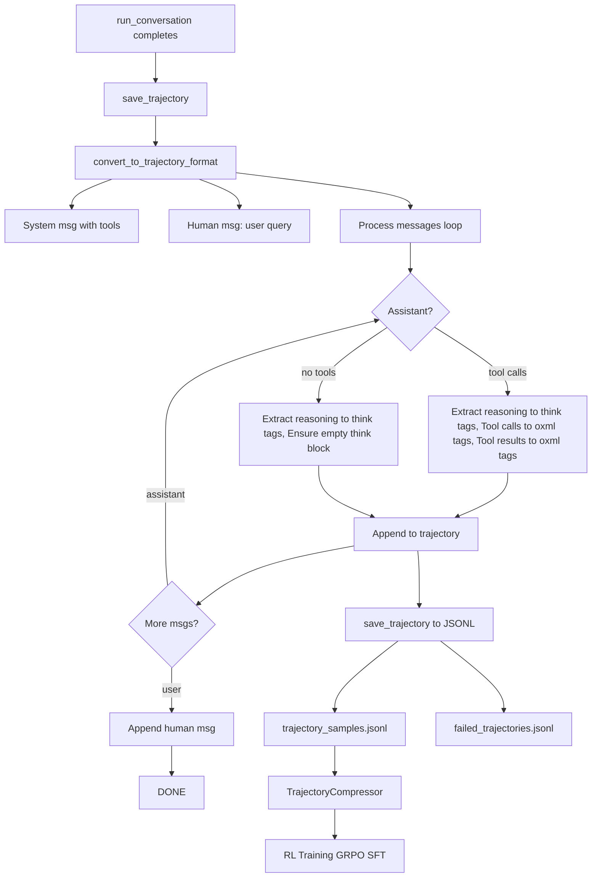
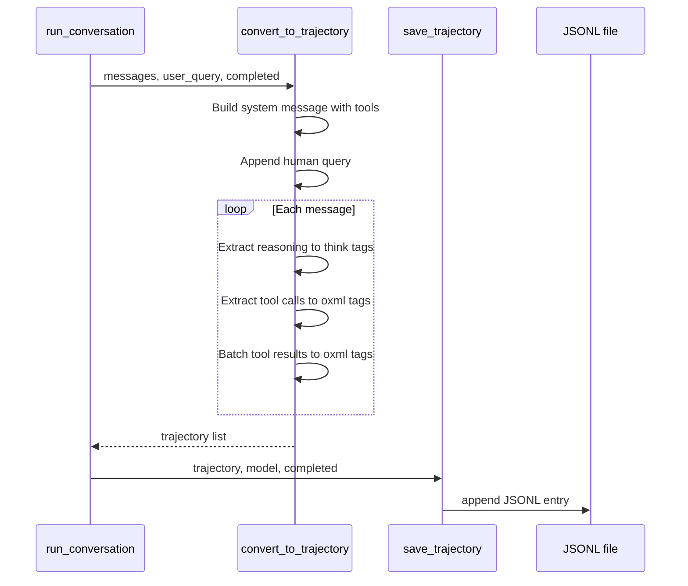

# Hermes Agent -- RL Training Traces Deep Dive

## Overview

Hermes generates **ShareGPT-format conversation traces** with full tool call and reasoning detail for reinforcement learning training. The system converts the internal message history (OpenAI format) into a standardized training format with thinking blocks, tool call tags, and tool result tags -- all normalized to formats that open-source reasoning models (DeepSeek-R1, Kimi-K2, etc.) understand.

**Key insight:** The trajectory system is Hermes's bridge between production agent usage and model fine-tuning. Every successful conversation becomes potential training data. The conversion is lossless -- all reasoning, tool calls, and results are preserved in the format that RL pipelines expect.

## Architecture





## ShareGPT Format

Hermes uses the **ShareGPT conversation format** -- the de facto standard for RL training data:

```json
{
  "conversations": [
    {"from": "system", "value": "You are a function calling AI model..."},
    {"from": "human", "value": "Fix the bug in auth.ts"},
    {"from": "gpt", "value": "I need to read the auth file first..."},
    {"from": "tool", "value": "file contents here..."},
    {"from": "gpt", "value": "I found the bug on line 45..."},
    {"from": "tool", "value": "Patch applied successfully"}
  ],
  "timestamp": "2026-04-28T10:30:00",
  "model": "claude-sonnet-4.6",
  "completed": true
}
```

**Four roles map to Hermes internal messages:**

| Hermes Role | Trajectory Role | Content |
|-------------|----------------|---------|
| system | system | System prompt with tool definitions |
| user | human | User queries including multi-turn |
| assistant with tool calls | gpt + tool | Reasoning + tool calls, then tool results |
| assistant no tool calls | gpt | Reasoning + natural language response |

## Trajectory Conversion

### System Message Construction

The system message embeds **complete tool definitions** so the training data is self-contained:

```python
# run_agent.py line 3463-3479
system_msg = (
    "You are a function calling AI model. You are provided with function signatures "
    "within <tools> </tools> XML tags. You may call one or more functions to assist "
    "with the user query. If available tools are not relevant, just respond in natural "
    "conversational language. Don't make assumptions about what values to plug into "
    "functions. After calling & executing the functions, you will be provided with "
    "function results within <tool_response> </think> XML tags.\n"
    f"<tools>\n{self._format_tools_for_system_message()}\n</tools>\n"
    "For each function call return a JSON object with schema:\n"
    "{'title': 'FunctionCall', 'type': 'object', 'properties': "
    "{'name': {'title': 'Name', 'type': 'string'}, "
    "'arguments': {'title': 'Arguments', 'type': 'object'}}, "
    "'required': ['name', 'arguments']}\n"
    "Each function call should be enclosed within oxml oxml tags.\n"
    "Example:\noxml\n{'name': <function-name>,'arguments': <args-dict>}\noxml"
)

trajectory.append({"from": "system", "value": system_msg})
```

**Aha moment:** The system message includes the **full tool schema** with JSON Schema definitions. This means each trajectory is a complete, self-contained training example -- the model sees exactly what tools were available, their parameter schemas, and the expected calling format. No external context needed.

### Assistant Messages with Reasoning and Tool Calls

The conversion handles two scenarios for assistant messages:

**Scenario 1: Assistant with tool calls** (run_agent.py line 3496-3539)

```python
if msg["role"] == "assistant" and "tool_calls" in msg and msg["tool_calls"]:
    content = ""

    # 1. Extract reasoning from native thinking tokens
    if msg.get("reasoning") and msg["reasoning"].strip():
        content = f"<think>\n{msg['reasoning']}\n</think>\n"

    # 2. Convert REASONING_SCRATCHPAD tags if native thinking disabled
    if msg.get("content"):
        content += convert_scratchpad_to_think(msg["content"])

    # 3. Add each tool call wrapped in oxml tags
    for tool_call in msg["tool_calls"]:
        arguments = json.loads(tool_call["function"]["arguments"])
        tool_call_json = {
            "name": tool_call["function"]["name"],
            "arguments": arguments
        }
        content += f"oxml\n{json.dumps(tool_call_json, ensure_ascii=False)}\noxml\n"

    # 4. CRITICAL: Ensure every GPT turn has a think block
    if "<think>" not in content:
        content = "<think>\n</think>\n" + content

    trajectory.append({"from": "gpt", "value": content.rstrip()})
```

**Scenario 2: Regular assistant message without tool calls** (run_agent.py line 3580-3601)

```python
else:
    content = ""
    if msg.get("reasoning") and msg["reasoning"].strip():
        content = f"<think>\n{msg['reasoning']}\n</think>\n"
    content += convert_scratchpad_to_think(msg["content"] or "")

    # Ensure consistent think block even if no reasoning
    if "<think>" not in content:
        content = "<think>\n</think>\n" + content

    trajectory.append({"from": "gpt", "value": content.strip()})
```

**Aha moment:** Every GPT turn in the trajectory **must** have a think block -- even if empty. This is critical for RL training because the model learns to always reason before acting. An empty think block teaches the model that even simple responses involve a reasoning step. This is what enables the "think before you act" behavior in fine-tuned models.

### Tool Results Batched into Single Turn

Multiple tool results between two assistant messages are **batched into a single tool turn**:

```python
# run_agent.py line 3541-3578
# Collect all subsequent tool responses
tool_responses = []
j = i + 1
while j < len(messages) and messages[j]["role"] == "tool":
    tool_msg = messages[j]
    tool_response = "<tool_response>\n"

    # Parse tool content as JSON if it looks like JSON
    tool_content = tool_msg["content"]
    try:
        if tool_content.strip().startswith(("{", "[")):
            tool_content = json.loads(tool_content)
    except (json.JSONDecodeError, AttributeError):
        pass  # Keep as string if not valid JSON

    tool_index = len(tool_responses)
    tool_name = (
        msg["tool_calls"][tool_index]["function"]["name"]
        if tool_index < len(msg["tool_calls"])
        else "unknown"
    )
    tool_response += json.dumps({
        "tool_call_id": tool_msg.get("tool_call_id", ""),
        "name": tool_name,
        "content": tool_content
    }, ensure_ascii=False)
    tool_response += "\n<tool_response>"
    tool_responses.append(tool_response)
    j += 1

# Single tool turn with all results
if tool_responses:
    trajectory.append({
        "from": "tool",
        "value": "\n".join(tool_responses)
    })
    i = j - 1  # Skip the tool messages we just processed
```

**Aha moment:** Hermes batches ALL tool results between two assistant messages into a single tool turn. This mirrors how the model sees them during inference -- as a single batch of results after making parallel tool calls. For RL training, this teaches the model that parallel tool calls return their results together, not one at a time.

### Reasoning Tag Normalization

Hermes handles two reasoning formats and normalizes both to think tags:

```python
# agent/trajectory.py
def convert_scratchpad_to_think(content: str) -> str:
    """Convert REASONING_SCRATCHPAD tags to think tags."""
    if not content or "<REASONING_SCRATCHPAD>" not in content:
        return content
    return content.replace("<REASONING_SCRATCHPAD>", "<think>").replace("</REASONING_SCRATCHPAD>", "</think>")

def has_incomplete_scratchpad(content: str) -> bool:
    """Check for open REASONING_SCRATCHPAD without closing tag."""
    if not content:
        return False
    return "<REASONING_SCRATCHPAD>" in content and "</REASONING_SCRATCHPAD>" not in content
```

This normalizes both native thinking tokens (Claude's antThinking) and XML-based reasoning (models that reason via REASONING_SCRATCHPAD) into the standard think format used by DeepSeek-R1 and other open-source reasoning models.

## Trajectory Saving

### JSONL Output with Two-File Strategy

```python
# agent/trajectory.py line 30-56
def save_trajectory(trajectory, model, completed, filename=None):
    if filename is None:
        filename = "trajectory_samples.jsonl" if completed else "failed_trajectories.jsonl"

    entry = {
        "conversations": trajectory,
        "timestamp": datetime.now().isoformat(),
        "model": model,
        "completed": completed,
    }

    with open(filename, "a", encoding="utf-8") as f:
        f.write(json.dumps(entry, ensure_ascii=False) + "\n")
```

**Two-file strategy:**

- trajectory_samples.jsonl -- successful conversations (good training data)
- failed_trajectories.jsonl -- failed or incomplete conversations (useful for learning failure modes)

The completed flag lets RL pipelines weight successful trajectories differently from failed ones.

### Where Saving is Triggered

```python
# run_agent.py line 12399-12401
# Save trajectory if enabled. user_message may be a multimodal list of parts;
# the trajectory format wants a plain string.
self._save_trajectory(messages, _summarize_user_message_for_log(user_message), completed)
```

Saving happens at the very end of run_conversation, after all tool calls and responses are complete. The completed flag reflects whether the conversation ended successfully or was aborted.

## Trajectory Compression for RL Training

Raw trajectories can be **very long** (100+ turns for complex tasks). Hermes provides a TrajectoryCompressor to fit them within token budgets for training.

### Why Compression is Needed

Training models on full trajectories is expensive. A single complex coding session might have 200+ turns spanning 100K+ tokens. Most RL training pipelines (GRPO, SFT) require trajectories under 15K-32K tokens. The compressor reduces trajectories while preserving the training signal.

### Compression Configuration

```python
# trajectory_compressor.py line 82-123
@dataclass
class CompressionConfig:
    target_max_tokens: int = 15250        # Target per trajectory
    summary_target_tokens: int = 750      # Summary size
    protect_first_system: bool = True     # Keep system prompt
    protect_first_human: bool = True      # Keep user query
    protect_first_gpt: bool = True        # Keep first response
    protect_first_tool: bool = True       # Keep first tool result
    protect_last_n_turns: int = 4         # Keep final turns
    summarization_model: str = "google/gemini-3-flash-preview"
    max_concurrent_requests: int = 50     # Rate limit for batch processing
    per_trajectory_timeout: int = 300     # 5 min timeout per trajectory
```

### Compression Algorithm

```python
# trajectory_compressor.py line 709-827
def compress_trajectory(self, trajectory):
    # 1. Count tokens per turn using HF tokenizer
    turn_tokens = self.count_turn_tokens(trajectory)
    total_tokens = sum(turn_tokens)

    # 2. If under target, skip compression
    if total_tokens <= self.config.target_max_tokens:
        return trajectory, metrics

    # 3. Find protected head and tail regions
    protected, compress_start, compress_end = self._find_protected_indices(trajectory)

    # 4. Calculate how many tokens need to be saved
    tokens_to_save = total_tokens - self.config.target_max_tokens
    target_tokens_to_compress = tokens_to_save + self.config.summary_target_tokens

    # 5. Accumulate turns from compress_start until savings met
    accumulated_tokens = 0
    compress_until = compress_start
    for i in range(compress_start, compress_end):
        accumulated_tokens += turn_tokens[i]
        compress_until = i + 1
        if accumulated_tokens >= target_tokens_to_compress:
            break

    # 6. Extract content and generate summary via auxiliary model
    content_to_summarize = self._extract_turn_content_for_summary(
        trajectory, compress_start, compress_until
    )
    summary = self._generate_summary(content_to_summarize, metrics)

    # 7. Build compressed trajectory: head + summary + tail
    compressed = []
    for i in range(compress_start):
        turn = trajectory[i].copy()
        if turn.get("from") == "system" and self.config.add_summary_notice:
            turn["value"] = turn["value"] + self.config.summary_notice_text
        compressed.append(turn)

    compressed.append({"from": "human", "value": summary})

    for i in range(compress_until, len(trajectory)):
        compressed.append(trajectory[i].copy())
```

**Key insight:** The compressor replaces middle turns with a **single human summary message** -- not an assistant message. This is intentional for RL: the summary acts as context injection, and the model learns to continue from the summary through the remaining turns. The head is preserved to show the model how to start a task, and the tail is preserved to show how to finish.

### Async Parallel Compression for Batch Processing

For processing thousands of trajectories efficiently:

```python
# trajectory_compressor.py line 986-1179
async def _process_directory_async(self, input_dir, output_dir):
    # Semaphore for rate limiting -- max N concurrent API calls
    semaphore = asyncio.Semaphore(self.config.max_concurrent_requests)

    # Thread-safe counters with asyncio.Lock
    progress_lock = asyncio.Lock()
    compressed_count = 0
    in_flight = 0

    async def process_single(file_path, entry_idx, entry, ...):
        async with semaphore:  # Rate limit
            async with progress_lock:
                in_flight += 1

            try:
                # Per-trajectory timeout
                result = await asyncio.wait_for(
                    self.process_entry_async(entry),
                    timeout=self.config.per_trajectory_timeout
                )
            except asyncio.TimeoutError:
                # Skip timed-out entries entirely
            except Exception:
                # Keep original entry on error

    # Run ALL trajectories concurrently
    tasks = [process_single(...) for all_entries]
    await asyncio.gather(*tasks)  # Parallel with semaphore control
```

**Aha moment:** The asyncio.Semaphore pattern limits concurrent API calls to avoid rate limits (default 50), while asyncio.wait_for with a per-trajectory timeout (default 5 min) prevents any single trajectory from hanging indefinitely. The asyncio.gather runs everything in parallel, but the semaphore ensures at most 50 API calls are in flight at once.

### Compression Metrics

Each compressed trajectory includes detailed metrics:

```python
@dataclass
class TrajectoryMetrics:
    original_tokens: int = 0
    compressed_tokens: int = 0
    tokens_saved: int = 0
    compression_ratio: float = 1.0
    original_turns: int = 0
    compressed_turns: int = 0
    turns_removed: int = 0
    turns_compressed_start_idx: int = -1
    turns_compressed_end_idx: int = -1
    turns_in_compressed_region: int = 0
    was_compressed: bool = False
    still_over_limit: bool = False
    skipped_under_target: bool = False
    summarization_api_calls: int = 0
    summarization_errors: int = 0
```

Aggregate metrics across a batch show compression rate, token savings distribution, and summarization API success rate.

## GRPO Training Integration

Hermes includes a GRPO training template that consumes the trajectory data:

```python
# skills/mlops/training/trl-fine-tuning/templates/basic_grpo_training.py
# Template for GRPO training using the trajectory data
# Each trajectory becomes a training example with:
# - Prompt: system + human query
# - Response: assistant reasoning + tool calls + final answer
# - Reward: based on task completion quality
```

The compressed trajectories feed directly into Group Relative Policy Optimization training. Each trajectory sample provides:

1. **The prompt** -- system message with tools + user query
2. **The response** -- assistant reasoning blocks, tool calls, and final answer
3. **The reward signal** -- derived from the completed flag and tool execution success

## GEPA Self-Evolution Connection

The trajectory data feeds Hermes's **GEPA** (Generative Evolution of Prompt Agents) self-improvement loop:

1. **Collect** trajectories from successful agent runs (trajectory_samples.jsonl)
2. **Score** trajectories based on task completion quality
3. **Select** top-performing trajectories
4. **Evolve** prompts, skills, and strategies through GEPA
5. **Deploy** evolved prompts back into the agent

The trajectory system is the data source that makes GEPA possible. Without high-quality conversation traces with full reasoning and tool call detail, the evolutionary loop has nothing to learn from.

## Comparison with Standard RL Data Collection

| Aspect | Hermes Trajectories | Traditional RL Data |
|--------|-------------------|-------------------|
| Format | ShareGPT (system/human/gpt/tool) | Various (often custom) |
| Reasoning | Preserved in think tags | Often stripped |
| Tool calls | XML-wrapped JSON | May be flattened |
| Multi-turn | Full conversation history | Often single-turn |
| Tool results | Batched per call group | Individual entries |
| Completion flag | Binary (completed/failed) | Often missing |
| Metadata | Timestamp, model, status | Varies |
| Compression | Token-budget aware with summary | Rarely compressed |

## Related Documents

- 02-agent-core.md -- AIAgent run_conversation that generates trajectories
- 03-tool-system.md -- Tool calling format that trajectories capture
- 13-self-evolution.md -- GEPA evolution that consumes trajectory data
- 14-function-calling.md -- Function calling format normalized for trajectories
- 18-multi-model.md -- Model metadata stored with each trajectory
- 20-async-python.md -- Async compression pipeline for batch processing

## Source Paths

```
agent/trajectory.py             -- save_trajectory, convert_scratchpad_to_think

run_agent.py
├── _convert_to_trajectory_format (line 3448-3611)  -- Full conversion logic
├── _save_trajectory (line 3613-3626)               -- JSONL file writing
└── trajectory save call (line 12399-12401)         -- Where saving is triggered

trajectory_compressor.py        -- Post-hoc trajectory compression for RL training
├── CompressionConfig (line 82-118)                 -- Configuration dataclass
├── TrajectoryMetrics (line 182-224)                -- Per-trajectory metrics
├── compress_trajectory (line 709-827)              -- Main compression algorithm
├── _generate_summary (line 571-638)                -- LLM-based summarization
├── _process_directory_async (line 986-1179)        -- Parallel batch processing
└── main (line 1290-1508)                           -- CLI entry point

tools/rl_training_tool.py       -- RL training tool for in-agent data collection

skills/mlops/training/trl-fine-tuning/templates/basic_grpo_training.py
                                -- GRPO training template consuming trajectories
```