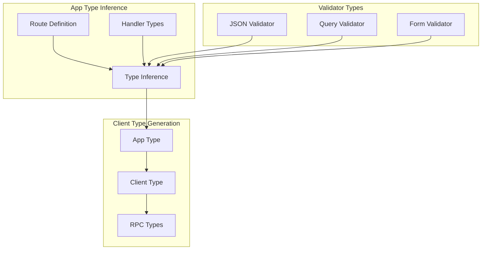

# Deep Dive: Type System and RPC

## Overview

This deep dive examines Hono's TypeScript type system - how route types are inferred, how the RPC client achieves end-to-end type safety, validator type inference, and advanced typing patterns for building type-safe APIs.

## Architecture



## Route Type Inference

```typescript
// src/types.ts - Core type definitions

// Handler function type
type Handler<
  E extends Env = any,
  P extends string = any,
  I extends Input = Input,
  R extends HandlerResponse<any> = any
> = (c: Context<E, P, I>, next: Next) => R

// Handler response type
type HandlerResponse<O> = Response | TypedResponse<O> | Promise<Response | TypedResponse<O>>

// Typed response (for type-safe return values)
export type TypedResponse<T = unknown> = {
  response: Response | Promise<Response>
  data: T
  format: 'json' | 'text' | 'html'
  status: StatusCode
}

// Input types (what handler receives)
type Input = {
  in?: Partial<ValidationTargets>
  out?: Partial<ValidationTargets>
}

// Validation targets
type ValidationTargets = {
  json: any
  form: Record<string, string | File>
  query: Record<string, string | string[]>
  param: Record<string, string>
  header: Record<string, string>
  cookie: Record<string, string>
}

// Route type builder
type RouteHandler<
  M extends string,
  P extends string,
  I extends Input,
  E extends Env
> = Handler<E, P, I, HandlerResponse<any>>

// App type with route accumulation
type HonoType<
  E extends Env = Env,
  P extends string = '/',
  I extends Input = {}
> = {
  // GET route
  get: <
    P2 extends string,
    I2 extends Input = I,
    R extends HandlerResponse<any> = any
  >(
    path: P2,
    handler: Handler<E, P2, I2, R>
  ) => HonoType<E, MergePath<P, P2>, MergeInput<I, I2>>
  
  // POST route
  post: <
    P2 extends string,
    I2 extends Input = I,
    R extends HandlerResponse<any> = any
  >(
    path: P2,
    handler: Handler<E, P2, I2, R>
  ) => HonoType<E, MergePath<P, P2>, MergeInput<I, I2>>
  
  // ... other methods
}

// Path merging
type MergePath<P1 extends string, P2 extends string> = 
  P1 extends '/' ? P2 : 
  P2 extends '/' ? P1 : 
  `${P1}${P2}`

// Input merging (union of all inputs)
type MergeInput<I1 extends Input, I2 extends Input> = {
  in: I1['in'] & I2['in']
  out: I1['out'] & I2['out']
}
```

## Handler Type Inference

```typescript
// How handler types are inferred

// Basic handler
const app = new Hono()

app.get('/users/:id', (c) => {
  // c.req.param('id') is inferred as string
  const id = c.req.param('id')
  
  // Return type is inferred from response
  return c.json({ id: parseInt(id), name: 'User' })
  //     ^ TypedResponse<{ id: number; name: string }>
})

// Handler with explicit types
type User = { id: number; name: string }

app.get('/users/:id', async (c): Promise<TypedResponse<User>> => {
  const id = c.req.param('id')
  const user = await getUserById(parseInt(id))
  return c.json(user)
})

// Handler with validation
import { validator } from 'hono/validator'

app.post('/posts',
  // Validator adds types to input
  validator('json', (v) => {
    return {
      title: v.title as string,
      body: v.body as string,
    }
  }),
  // Handler receives validated input
  (c) => {
    const { title, body } = c.req.valid('json')
    //     ^ { title: string; body: string }
    
    return c.json({ title, body, id: 1 })
  }
)
```

## RPC Client Types

```typescript
// src/client/client.ts - RPC client type inference

import type { Hono } from '../hono'
import type { HandlerResponse } from '../types'

// Extract response type from handler
type GetResponse<T> = T extends HandlerResponse<infer R> ? R : never

// Extract request types from handler
type GetRequest<T> = T extends Handler<infer E, infer P, infer I> ? I : never

// Client type for a single route
type RouteClient<
  M extends string,
  T extends Handler<any, any, any, any>
> = {
  // GET request
  $get: (args?: {
    param?: GetRequest<T>['in']['param']
    query?: GetRequest<T>['in']['query']
    header?: GetRequest<T>['in']['header']
  }) => Promise<GetResponse<T>>
  
  // POST request
  $post: (args?: {
    param?: GetRequest<T>['in']['param']
    json?: GetRequest<T>['in']['json']
    form?: GetRequest<T>['in']['form']
    header?: GetRequest<T>['in']['header']
  }) => Promise<GetResponse<T>>
  
  // ... other methods
}

// Build client type from app
type ClientType<T extends Hono<any, any, any>> = {
  [K in keyof T['routes'] as T['routes'][K]['path']]: {
    [M in T['routes'][K]['method'] as `$${Lowercase<M>}`]: 
      RouteClient<M, T['routes'][K]['handler']>
  }
}

// Client function
export const hc = <T extends Hono<any, any, any>>(
  baseUrl: string,
  options?: ClientOptions
): ClientType<T> => {
  // Implementation creates proxy that makes fetch calls
  return new Proxy({} as ClientType<T>, {
    get: (target, path: string) => {
      return new Proxy({}, {
        get: (target, method: string) => {
          return async (args?: any) => {
            const url = `${baseUrl}${path}`
            const response = await fetch(url, {
              method: method.slice(1),  // Remove $ prefix
              ...args,
            })
            return response.json()
          }
        }
      })
    }
  })
}
```

## Client Usage Examples

```typescript
// Type-safe RPC client usage

// Server definition
const app = new Hono()

const routes = app
  .get('/posts', (c) => {
    return c.json({ posts: [] as Post[] })
  })
  .get('/posts/:id', (c) => {
    const id = c.req.param('id')
    return c.json({ post: { id: parseInt(id), title: 'Post' } })
  })
  .post('/posts',
    validator('json', (v) => ({ title: v.title as string })),
    (c) => {
      const { title } = c.req.valid('json')
      return c.json({ post: { id: 1, title } })
    }
  )

type AppType = typeof routes

// Client creation
import { hc } from 'hono/client'

const client = hc<AppType>('http://localhost:3000')

// Type-safe API calls
const posts = await client.posts.$get()
//     ^ Promise<{ posts: Post[] }>

const post = await client.posts[':id'].$get({
  param: { id: '123' }  // Type-checked!
})
//     ^ Promise<{ post: { id: number; title: string } }>

const created = await client.posts.$post({
  json: { title: 'New Post' }  // Type-checked!
})
//     ^ Promise<{ post: { id: number; title: string } }>

// Error: Property 'invalid' does not exist
await client.posts.$post({
  json: { invalid: 'field' }  // TypeScript error!
})
```

## Validator Types

```typescript
// src/validator/validator.ts - Type inference for validators

import type { Context } from '../context'
import type { Env, Input, MiddlewareHandler } from '../types'

type ValidationTarget = 'json' | 'form' | 'query' | 'param' | 'header' | 'cookie'

type ValidationFunction<T extends ValidationTarget, O> = (
  value: ValidationTargets[T],
  c: Context
) => O | Response | Promise<O | Response>

/**
 * Validator middleware with type inference
 */
export const validator = <
  T extends ValidationTarget,
  O extends any,
  E extends Env = any,
  P extends string = any,
  I extends Input = {},
  V extends {
    in: { [K in T]: ValidationTargets[K] }
    out: { [K in T]: O }
  } = {
    in: { [K in T]: ValidationTargets[K] }
    out: { [K in T]: O }
  }
>(
  target: T,
  validationFn: ValidationFunction<T, O>
): MiddlewareHandler<E, P, I & V> => {
  return async (c, next) => {
    let value
    
    // Get value based on target
    switch (target) {
      case 'json':
        value = await c.req.json()
        break
      case 'form':
        value = await c.req.formData()
        break
      case 'query':
        value = c.req.query()
        break
      case 'param':
        value = c.req.param()
        break
      case 'header':
        value = c.req.header()
        break
      case 'cookie':
        value = parseCookie(c.req.header('Cookie'))
        break
    }
    
    // Run validation
    const result = await validationFn(value, c)
    
    if (result instanceof Response) {
      return result  // Validation failed
    }
    
    // Store validated value
    c.req.validated(target, result)
    
    await next()
  }
}

// Usage with type inference
app.post('/posts',
  validator('json', (v, c) => {
    // v is typed as any here
    if (!v.title) {
      return c.json({ error: 'Title required' }, 400)
    }
    
    // Return validated type
    return {
      title: v.title as string,
      body: v.body as string | undefined,
    }
  }),
  (c) => {
    // Validated data is typed
    const { title, body } = c.req.valid('json')
    //     ^ { title: string; body?: string }
    
    return c.json({ title, body })
  }
)
```

## Zod Integration

```typescript
// @hono/zod-validator - Type inference from Zod schemas

import { z } from 'zod'
import type { zValidator as zValidatorType } from '@hono/zod-validator'

// Create schema
const postSchema = z.object({
  title: z.string().min(1).max(100),
  body: z.string().min(1),
  tags: z.array(z.string()).optional(),
  published: z.boolean().default(false),
})

// Validator with type inference
app.post('/posts',
  zValidator('json', postSchema),
  (c) => {
    const data = c.req.valid('json')
    // Type is inferred from schema:
    // { title: string; body: string; tags?: string[]; published?: boolean }
    
    return c.json(data)
  }
)

// Type can also be extracted
type PostInput = z.infer<typeof postSchema>
// { title: string; body: string; tags?: string[]; published?: boolean }
```

## Type Helpers

```typescript
// Type utilities for complex scenarios

// Extract handler response type
type HandlerResponse<T> = T extends Handler<any, any, any, infer R> ? R : never

// Extract JSON response type
type JsonResponse<T> = HandlerResponse<T> extends TypedResponse<infer O>
  ? HandlerResponse<T>['format'] extends 'json'
    ? O
    : never
  : never

// Usage
const getUserHandler = (c: Context) => {
  return c.json({ user: { id: 1, name: 'Alice' } })
}

type UserResponse = JsonResponse<typeof getUserHandler>
// { user: { id: number; name: string } }

// Merge types from multiple routes
type MergeRoutes<T extends any[]> = T extends [infer First, ...infer Rest]
  ? First & MergeRoutes<Rest>
  : {}

// Path parameters type
type PathParams<T extends string> = T extends `${string}:${infer Param}/${infer Rest}`
  ? { [K in Param]: string } & PathParams<Rest>
  : T extends `${string}:${infer Param}`
  ? { [K in Param]: string }
  : {}

// Usage
type UserPathParams = PathParams<'/users/:userId/posts/:postId'>
// { userId: string; postId: string }
```

## Advanced Type Patterns

```typescript
// Typed context variables

interface Env {
  Variables: {
    user: { id: number; role: string }
    db: Database
  }
}

const app = new Hono<Env>()

// Middleware with typed context
app.use('*', async (c, next) => {
  // c has typed Variables
  const user = c.get('user')  // { id: number; role: string } | undefined
  await next()
})

// Handler with typed context
app.get('/admin', async (c) => {
  const user = c.get('user')
  
  if (!user || user.role !== 'admin') {
    return c.json({ error: 'Forbidden' }, 403)
  }
  
  return c.json({ admin: true })
})

// Typed response helper
type SuccessResponse<T> = TypedResponse<{ success: true; data: T }>
type ErrorResponse = TypedResponse<{ success: false; error: string }>

const handler = async (c: Context): Promise<SuccessResponse<User> | ErrorResponse> => {
  const user = await getUser()
  
  if (!user) {
    return c.json({ success: false, error: 'User not found' }, 404) as ErrorResponse
  }
  
  return c.json({ success: true, data: user }) as SuccessResponse<User>
}
```

## Type-Safe Route Groups

```typescript
// Typed route groups

type ApiEnv = {
  Variables: {
    user: User
  }
}

// Create typed group
const api = new Hono<ApiEnv>()

// Middleware adds typed variable
api.use('*', authMiddleware)  // Sets c.set('user', user)

// Routes inherit types
api.get('/me', (c) => {
  const user = c.get('user')  // Typed as User
  return c.json({ user })
})

// Mount with prefix
const app = new Hono()
app.route('/api', api)

// Types are preserved
```

## Conclusion

Hono's type system provides:

1. **Automatic Inference**: Types inferred from handlers and validators
2. **End-to-End Safety**: RPC client types match server types
3. **Validator Integration**: Types flow from validators to handlers
4. **Context Typing**: Type-safe context variables
5. **Route Accumulation**: Types build up as routes are added
6. **Response Typing**: TypedResponse for explicit return types

The type system leverages TypeScript's conditional types, template literal types, and inference to provide a type-safe development experience without sacrificing flexibility.
