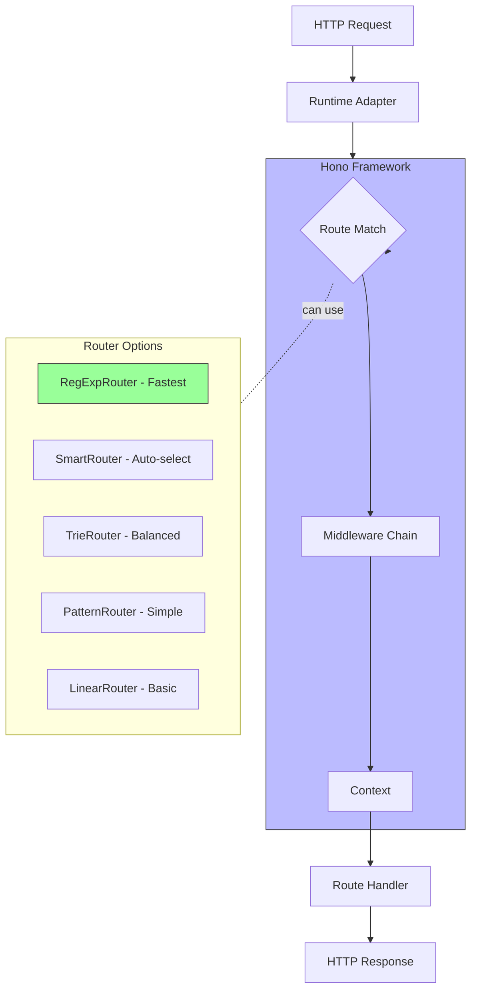
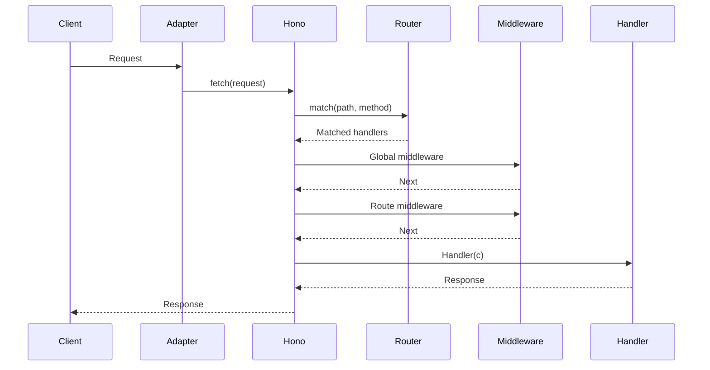

# Project Exploration: Hono

## Overview

Hono (means "flame🔥" in Japanese) is a small, simple, and ultrafast web framework built on Web Standards. It works on any JavaScript runtime: Cloudflare Workers, Fastly Compute, Deno, Bun, Vercel, AWS Lambda, Lambda@Edge, and Node.js.

**Key Characteristics:**
- **Ultrafast** - RegExpRouter with O(1) lookups, no linear loops
- **Lightweight** - `hono/tiny` preset is under 13kB with zero dependencies
- **Multi-runtime** - Same code runs everywhere
- **Batteries Included** - Built-in middleware, validators, JSX, HTTP client
- **Type-Safe** - First-class TypeScript support with inferred types

## Repository Structure

```
hono/
├── src/
│   ├── hono-base.ts              # Core Hono class (15KB)
│   ├── hono.ts                   # Hono with default routers
│   ├── context.ts                # Context object (25KB)
│   ├── compose.ts                # Middleware composition
│   ├── router.ts                 # Router interface
│   ├── router/                   # Router implementations
│   │   ├── pattern-router/       # Pattern-based router
│   │   ├── regexp-router/        # RegExp-based router (fastest)
│   │   ├── trie-router/          # Trie-based router
│   │   ├── smart-router/         # Smart router selection
│   │   └── linear-router/        # Linear router (simple)
│   ├── middleware/               # Built-in middleware
│   │   ├── basic-auth/
│   │   ├── bearer-auth/
│   │   ├── body-limit/
│   │   ├── cache/
│   │   ├── compress/
│   │   ├── cors/
│   │   ├── csrf/
│   │   ├── etag/
│   │   ├── ip-restriction/
│   │   ├── jsx-renderer/
│   │   ├── jwt/
│   │   ├── method-override/
│   │   ├── powered-by/
│   │   ├── pretty-json/
│   │   ├── request-id/
│   │   ├── secure-headers/
│   │   ├── timing/
│   │   └── timeout/
│   ├── adapter/                  # Runtime adapters
│   │   ├── bun/
│   │   ├── cloudflare-workers/
│   │   ├── cloudflare-pages/
│   │   ├── deno/
│   │   ├── aws-lambda/
│   │   ├── lambda-edge/
│   │   ├── vercel/
│   │   ├── netlify/
│   │   └── service-worker/
│   ├── jsx/                      # JSX/HTMX support
│   │   ├── index.ts
│   │   ├── components.ts
│   │   ├── hooks/
│   │   ├── dom/                  # JSX DOM (Preact-like)
│   │   └── streaming/
│   ├── validator/                # Request validation
│   │   ├── validator.ts
│   │   └── validator.test.ts
│   ├── client/                   # HTTP client (Hono RPC)
│   │   ├── client.ts
│   │   └── types.ts
│   ├── helper/                   # Helper utilities
│   │   ├── accepts/              # Content negotiation
│   │   ├── cookie/               # Cookie helpers
│   │   ├── css/                  # CSS helpers
│   │   ├── dev/                  # Dev tools
│   │   ├── factory/              # App factory
│   │   ├── html/                 # HTML helpers
│   │   ├── ssg/                  # Static site generation
│   │   ├── streaming/            # Streaming (SSE, Stream)
│   │   ├── testing/              # Testing utilities
│   │   └── websocket/            # WebSocket helpers
│   ├── utils/                    # Internal utilities
│   │   ├── body.ts
│   │   ├── buffer.ts
│   │   ├── color.ts
│   │   ├── concurrent.ts
│   │   ├── cookie.ts
│   │   ├── crypto.ts
│   │   ├── encode.ts
│   │   ├── filepath.ts
│   │   ├── handler.ts
│   │   ├── html.ts
│   │   ├── http.ts
│   │   ├── jwt/
│   │   ├── mime.ts
│   │   ├── stream.ts
│   │   ├── url.ts
│   │   └── types.ts
│   ├── preset/                   # Preset configurations
│   │   ├── tiny.ts               # Minimal preset (~13KB)
│   │   └── quick.ts              # Quick preset
│   ├── http-exception.ts         # HTTP error handling
│   ├── types.ts                  # Type definitions (59KB)
│   ├── request.ts                # Request wrapper
│   └── index.ts                  # Main exports
├── runtime-tests/                # Runtime-specific tests
│   ├── deno/
│   ├── bun/
│   ├── workerd/
│   ├── node/
│   ├── fastly/
│   ├── lambda/
│   └── lambda-edge/
├── benchmarks/                   # Performance benchmarks
├── build/                        # Build configuration
└── docs/                         # Documentation
```

## Architecture

### Core Architecture



### Request Flow



## Core APIs

### Basic Usage

```typescript
import { Hono } from 'hono'
const app = new Hono()

// GET handler
app.get('/', (c) => {
  return c.text('Hello!')
})

// POST with validation
app.post('/posts', validator('json', (v, c) => {
  if (!v.title) return c.json({ error: 'Title required' }, 400)
  return v
}), async (c) => {
  const { title } = c.req.valid('json')
  return c.json({ title })
})

// Middleware
app.use('*', logger())
app.use('/api/*', cors())

export default app
```

### Context Object

The Context (`c`) is the heart of Hono:

```typescript
// Request
c.req.raw          // Raw Request
c.req.url          // URL string
c.req.method       // HTTP method
c.req.path         // Path
c.req.headers      // Headers
c.req.query(key)   // Query params
c.req.param(key)   // Route params
c.req.json()       // Parse JSON body
c.req.formData()   // Form data
c.req.text()       // Text body

// Response helpers
c.text(body, status, headers)
c.json(object, status, headers)
c.html(string, status, headers)
c.redirect(url, status)
c.body(data, status, headers)
c.render(component, props)

// Misc
c.set(key, value)  // Set context value
c.get(key)         // Get context value
c.executionCtx     // ExecutionContext
c.var              // Custom variables
```

### Type System

Hono has extensive type inference:

```typescript
// Route types
type Routes = {
  '/posts/:id': {
    $get: {
      param: { id: string }
      return: { post: Post }
    }
  }
}

// RPC client
import { hc } from 'hono/client'
const client = hc<Routes>('/api')
const post = await client.posts[':id'].$get({ param: { id: '1' } })
```

## Routers

Hono provides multiple router implementations:

| Router | Speed | Memory | Use Case |
|--------|-------|--------|----------|
| RegExpRouter | ⚡⚡⚡ | Medium | Production (fastest) |
| SmartRouter | ⚡⚡⚡ | Low | Auto-selects best |
| TrieRouter | ⚡⚡ | Low | Balanced |
| PatternRouter | ⚡ | Low | Simple apps |
| LinearRouter | ⚡ | Lowest | Very small apps |

```typescript
import { Hono } from 'hono'
import { RegExpRouter } from 'hono/reg-exp-router'

const app = new Hono({ router: new RegExpRouter() })
```

## Middleware

### Built-in Middleware

| Middleware | Purpose |
|------------|---------|
| `basicAuth` | HTTP Basic Auth |
| `bearerAuth` | Bearer Token Auth |
| `bodyLimit` | Request body size limit |
| `cache` | HTTP caching |
| `compress` | Gzip compression |
| `cors` | CORS headers |
| `csrf` | CSRF protection |
| `etag` | ETag headers |
| `ipRestriction` | IP allow/block |
| `jsxRenderer` | JSX rendering |
| `jwt` | JWT authentication |
| `methodOverride` | Method override |
| `prettyJson` | Pretty JSON responses |
| `requestId` | Request ID header |
| `secureHeaders` | Security headers |
| `timeout` | Request timeout |
| `timing` | Server Timing header |

### Custom Middleware

```typescript
// Global middleware
const logger = () => async (c: Context, next: Next) => {
  console.log(`${c.req.method} ${c.req.url}`)
  await next()
}

// Factory middleware
const poweredBy = (name: string) => async (c: Context, next: Next) => {
  await next()
  c.header('X-Powered-By', name)
}

// Usage
app.use('*', logger())
app.use('/api/*', poweredBy('Hono'))
```

## Runtime Adapters

Hono works on every major JavaScript runtime:

```typescript
// Cloudflare Workers
import { handle } from 'hono/cloudflare-workers'
export default { fetch: handle(app) }

// Deno
import { serve } from 'hono/deno'
serve(app)

// Bun
import { serve } from 'hono/bun'
serve(app)

// Node.js
import { serve } from 'hono/node-server'
serve(app)

// AWS Lambda
import { handle } from 'hono/aws-lambda'
export const handler = handle(app)

// Vercel
import { handle } from 'hono/vercel'
export default handle(app)
```

## JSX/HTMX

Hono has built-in JSX support with server-side rendering:

```typescript
import { Hono } from 'hono'
import { jsx, css } from 'hono/jsx'

const app = new Hono()

app.get('/', (c) => {
  return c.render(
    <html>
      <head><title>Hono</title></head>
      <body>
        <h1>Hello!</h1>
      </body>
    </html>
  )
})
```

### JSX DOM (Client-side)

```typescript
import { render } from 'hono/jsx/dom'
import { useState } from 'hono/jsx/dom/hooks'

function Counter() {
  const [count, setCount] = useState(0)
  return (
    <button onclick={() => setCount(count + 1)}>
      Count: {count}
    </button>
  )
}

render(<Counter />, document.getElementById('app'))
```

## HTTP Client (Hono RPC)

Type-safe RPC-style client:

```typescript
import { hc } from 'hono/client'

const client = hc<AppType>('/api')

// Type-safe API calls
const data = await client.posts.$get()
const post = await client.posts[':id'].$get({ param: { id: '1' } })
```

## Static Site Generation (SSG)

```typescript
import { SSG } from 'hono/ssg'

const ssg = new SSG()

ssg.toFile('/blog/:id', async (c) => {
  const posts = await getPosts()
  return c.html(<Blog posts={posts} />)
})
```

## Key Insights

1. **Zero Dependencies** - Hono has no external dependencies, only Web Standard APIs.

2. **Multi-runtime** - Same code runs on Cloudflare, Deno, Bun, Node.js, Lambda, etc.

3. **Ultra-fast Routing** - RegExpRouter provides O(1) route matching.

4. **Type-first Design** - Full TypeScript support with inferred types for routes, params, and responses.

5. **Batteries Included** - Middleware, validators, JSX, HTTP client, SSG all built-in.

6. **Tiny Footprint** - `hono/tiny` is ~13KB, `hono/quick` is slightly larger with more features.

7. **Composable** - Middleware stack based on Koa-style composition.

8. **Streaming First** - Built-in support for SSE, streaming responses.

## Performance

Benchmark results (requests/second):
- Hono: ~3x faster than Express
- Hono: ~2x faster than Fastify
- Hono: Similar to Elysia

## Testing

```typescript
import { testClient } from 'hono/testing'

const app = new Hono()
app.get('/', (c) => c.text('Hello'))

test('GET /', async () => {
  const res = await testClient(app).$get('/')
  expect(await res.text()).toBe('Hello')
})
```

## Open Considerations

1. **JSX DOM Performance** - How does Hono's JSX DOM compare to Preact/React?

2. **WebSocket Scaling** - How does WebSocket handle concurrent connections?

3. **SSG Deep Dive** - How does SSG handle incremental builds?

4. **RPC Type Inference** - How are types inferred across the wire?

5. **Adapter Implementation** - How do adapters normalize different runtimes?

6. **Router Selection** - When should each router be used?

7. **Memory Usage** - What's the memory footprint at scale?

8. **Production Deployments** - What are best practices for each runtime?
