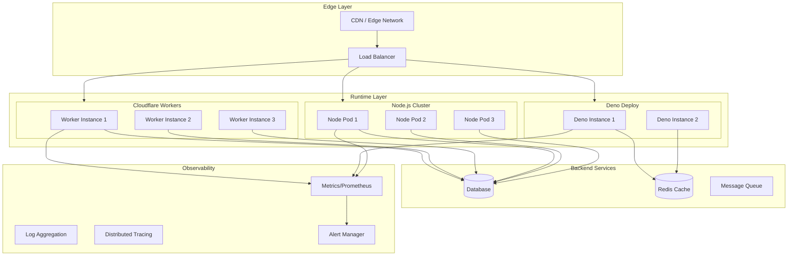

# Production-Grade Hono

## Overview

This document outlines production-grade patterns for deploying Hono applications across Cloudflare Workers, Deno, Bun, Node.js, AWS Lambda, and Vercel. We cover high availability, monitoring, security hardening, and operational excellence.

## Architecture



## Multi-Runtime Deployment

### Cloudflare Workers Production Config

```typescript
// wrangler.toml - Production configuration

name = "my-hono-app-production"
main = "src/index.ts"
compatibility_date = "2024-01-01"

# Production environment
[env.production]
routes = [
  { pattern = "api.example.com/*", zone_name = "example.com" }
]

# Workers KV for caching
[[env.production.kv_namespaces]]
binding = "CACHE"
id = "your-kv-namespace-id"
preview_id = "your-preview-kv-id"

# D1 Database
[[env.production.d1_databases]]
binding = "DB"
database_name = "my-app-db"
database_id = "your-d1-database-id"

# R2 for file storage
[[env.production.r2_buckets]]
binding = "STORAGE"
bucket_name = "my-app-storage"

# Durable Objects for state
[env.production.durable_objects]
bindings = [
  { name = "SESSION_STORE", class_name = "SessionStore" }
]

# Cron triggers
[env.production.triggers]
crons = ["0 * * * *"]  # Every hour

# Autoscaling
[env.production.autoscaling]
min_instances = 1
max_instances = 100
scale_memory_threshold = 0.8
scale_cpu_threshold = 0.8

# Observability
[env.production.observability]
enabled = true
head_sampling_rate = 0.1  # 10% trace sampling
```

### Node.js Production Setup

```typescript
// src/production.ts - Production server

import { Hono } from 'hono'
import { serve } from '@hono/node-server'
import { prometheus } from '@hono/prometheus'
import helmet from 'helmet'
import compression from 'compression'

const app = new Hono()

// Security headers
app.use('*', helmet({
  contentSecurityPolicy: {
    defaultSrc: ["'self'"],
    styleSrc: ["'self'", "'unsafe-inline'"],
  },
  hsts: {
    maxAge: 31536000,
    includeSubDomains: true,
    preload: true,
  },
}))

// Compression
app.use('*', async (c, next) => {
  const compressMiddleware = compression()
  // Apply compression
  await next()
})

// Prometheus metrics
const { printMetrics, registerMetrics } = prometheus()
app.use('*', registerMetrics)
app.get('/metrics', printMetrics)

// Health checks
app.get('/health', (c) => {
  return c.json({
    status: 'healthy',
    timestamp: new Date().toISOString(),
    uptime: process.uptime(),
  })
})

app.get('/ready', async (c) => {
  // Check database connectivity
  const dbHealthy = await checkDatabase()
  const cacheHealthy = await checkCache()
  
  if (!dbHealthy || !cacheHealthy) {
    return c.json({ status: 'not ready' }, 503)
  }
  
  return c.json({ status: 'ready' })
})

// Graceful shutdown
let server: any

const shutdown = async () => {
  console.log('Shutting down gracefully...')
  
  // Stop accepting new connections
  server.close()
  
  // Wait for in-flight requests
  await new Promise(resolve => setTimeout(resolve, 30000))
  
  // Cleanup resources
  await cleanup()
  
  process.exit(0)
}

process.on('SIGTERM', shutdown)
process.on('SIGINT', shutdown)

// Start server
serve(app, { port: 3000 }, (info) => {
  console.log(`Listening on http://localhost:${info.port}`)
})
```

### Docker Production Setup

```dockerfile
# Dockerfile - Multi-stage build for Node.js

# Build stage
FROM node:20-alpine AS builder

WORKDIR /app

# Copy package files
COPY package*.json ./
COPY pnpm-lock.yaml ./

# Install dependencies
RUN corepack enable pnpm && pnpm install --frozen-lockfile

# Copy source
COPY . .

# Build
RUN pnpm build

# Production stage
FROM node:20-alpine AS production

# Security: non-root user
RUN addgroup -g 1001 -S nodejs && \
    adduser -S nodejs -u 1001

WORKDIR /app

# Copy built artifacts
COPY --from=builder --chown=nodejs:nodejs /app/dist ./dist
COPY --from=builder --chown=nodejs:nodejs /app/node_modules ./node_modules
COPY --from=builder --chown=nodejs:nodejs /app/package.json ./

# Security hardening
USER nodejs

# Health check
HEALTHCHECK --interval=30s --timeout=3s --start-period=5s --retries=3 \
  CMD wget -qO- http://localhost:3000/health || exit 1

EXPOSE 3000

CMD ["node", "dist/index.js"]
```

```yaml
# docker-compose.production.yml

version: '3.8'

services:
  app:
    build:
      context: .
      dockerfile: Dockerfile
      target: production
    ports:
      - "3000:3000"
    environment:
      - NODE_ENV=production
      - DATABASE_URL=postgresql://user:pass@db:5432/app
      - REDIS_URL=redis://redis:6379
    depends_on:
      db:
        condition: service_healthy
      redis:
        condition: service_healthy
    deploy:
      replicas: 3
      resources:
        limits:
          cpus: '1'
          memory: 512M
      restart_policy:
        condition: on-failure
        delay: 5s
        max_attempts: 3
    healthcheck:
      test: ["CMD", "wget", "-qO-", "http://localhost:3000/health"]
      interval: 30s
      timeout: 3s
      retries: 3
      start_period: 10s
    networks:
      - app-network

  db:
    image: postgres:15-alpine
    environment:
      - POSTGRES_USER=user
      - POSTGRES_PASSWORD=pass
      - POSTGRES_DB=app
    volumes:
      - postgres-data:/var/lib/postgresql/data
    healthcheck:
      test: ["CMD-SHELL", "pg_isready -U user"]
      interval: 10s
      timeout: 5s
      retries: 5
    networks:
      - app-network

  redis:
    image: redis:7-alpine
    volumes:
      - redis-data:/data
    healthcheck:
      test: ["CMD", "redis-cli", "ping"]
      interval: 10s
      timeout: 5s
      retries: 5
    networks:
      - app-network

volumes:
  postgres-data:
  redis-data:

networks:
  app-network:
    driver: bridge
```

## Monitoring and Observability

### Metrics Collection

```typescript
// src/middleware/metrics.ts

import { PrometheusExporter } from '@opentelemetry/exporter-prometheus'
import { Counter, Histogram, Gauge } from 'prom-client'

// Request metrics
const httpRequestCounter = new Counter({
  name: 'http_requests_total',
  help: 'Total HTTP requests',
  labelNames: ['method', 'path', 'status'],
})

const requestDurationHistogram = new Histogram({
  name: 'http_request_duration_seconds',
  help: 'HTTP request duration in seconds',
  labelNames: ['method', 'path'],
  buckets: [0.001, 0.005, 0.01, 0.025, 0.05, 0.1, 0.25, 0.5, 1, 2.5, 5, 10],
})

const requestInFlightGauge = new Gauge({
  name: 'http_requests_in_flight',
  help: 'HTTP requests currently in flight',
  labelNames: ['method'],
})

// Business metrics
const activeUsersGauge = new Gauge({
  name: 'active_users',
  help: 'Active users',
})

const apiCallsCounter = new Counter({
  name: 'api_calls_total',
  help: 'Total API calls',
  labelNames: ['endpoint', 'success'],
})

// Metrics middleware
export const metricsMiddleware = async (c: Context, next: Next) => {
  const start = Date.now()
  const method = c.req.method
  const path = c.req.path
  
  requestInFlightGauge.inc({ method })
  
  try {
    await next()
    
    // Record success
    httpRequestCounter.inc({ method, path, status: c.res.status })
    apiCallsCounter.inc({ endpoint: path, success: 'true' })
  } catch (err) {
    // Record error
    httpRequestCounter.inc({ method, path, status: 500 })
    apiCallsCounter.inc({ endpoint: path, success: 'false' })
    throw err
  } finally {
    requestInFlightGauge.dec({ method })
    const duration = (Date.now() - start) / 1000
    requestDurationHistogram.observe({ method, path }, duration)
  }
}

// Metrics endpoint
export const metricsHandler = async (c: Context) => {
  const metrics = await register.metrics()
  return c.body(metrics, 200, {
    'Content-Type': register.contentType,
  })
}
```

### Distributed Tracing

```typescript
// src/middleware/tracing.ts

import { trace, context, SpanStatusCode } from '@opentelemetry/api'
import { SemanticAttributes } from '@opentelemetry/semantic-conventions'

const tracer = trace.getTracer('hono-app')

export const tracingMiddleware = async (c: Context, next: Next) => {
  const span = tracer.startSpan('http_request', {
    attributes: {
      [SemanticAttributes.HTTP_METHOD]: c.req.method,
      [SemanticAttributes.HTTP_URL]: c.req.url,
      [SemanticAttributes.HTTP_ROUTE]: c.req.path,
    },
  })
  
  // Get trace context from headers
  const traceContext = propagation.extract(c.req.raw.headers)
  const ctx = trace.setSpan(context.active(), span)
  
  try {
    await context.with(ctx, next)
    
    span.setStatus({ code: SpanStatusCode.OK })
    span.setAttribute(SemanticAttributes.HTTP_STATUS_CODE, c.res.status)
  } catch (err) {
    span.setStatus({ code: SpanStatusCode.ERROR, message: err.message })
    span.recordException(err)
    throw err
  } finally {
    span.end()
  }
}

// Database tracing
export const withTracing = async <T>(
  operation: string,
  fn: () => Promise<T>
): Promise<T> => {
  const span = tracer.startSpan(`db.${operation}`)
  
  try {
    const result = await fn()
    return result
  } catch (err) {
    span.recordException(err)
    throw err
  } finally {
    span.end()
  }
}
```

### Logging

```typescript
// src/middleware/logging.ts

import pino from 'pino'

const logger = pino({
  level: process.env.LOG_LEVEL || 'info',
  transport: {
    target: 'pino-pretty',
    options: {
      translateTime: 'HH:MM:ss Z',
      ignore: 'pid,hostname',
    },
  },
})

export const loggingMiddleware = async (c: Context, next: Next) => {
  const start = Date.now()
  const requestId = crypto.randomUUID()
  
  // Add request ID to context
  c.set('requestId', requestId)
  
  // Log request
  logger.info({
    requestId,
    method: c.req.method,
    path: c.req.path,
    query: c.req.query(),
    headers: c.req.raw.headers,
  }, 'request started')
  
  try {
    await next()
    
    const duration = Date.now() - start
    
    // Log response
    logger.info({
      requestId,
      method: c.req.method,
      path: c.req.path,
      status: c.res.status,
      duration,
    }, 'request completed')
  } catch (err) {
    const duration = Date.now() - start
    
    // Log error
    logger.error({
      requestId,
      method: c.req.method,
      path: c.req.path,
      status: 500,
      duration,
      error: err.message,
      stack: err.stack,
    }, 'request failed')
    
    throw err
  }
}
```

## Security Hardening

### Rate Limiting

```typescript
// src/middleware/rate-limit.ts

import { Context, Next } from 'hono'
import { LRUCache } from 'lru-cache'

interface RateLimitOptions {
  windowMs: number  // Time window in milliseconds
  maxRequests: number  // Max requests per window
  message: string
}

const cache = new LRUCache<string, number[]>({
  max: 10000,
  ttl: 60000,  // 1 minute
})

export const rateLimit = (options: RateLimitOptions) => {
  return async (c: Context, next: Next) => {
    // Get client identifier (IP or API key)
    const clientId = c.req.header('X-Forwarded-For')?.split(',')[0] || 
                     c.req.header('X-Real-IP') ||
                     'unknown'
    
    const now = Date.now()
    const windowStart = now - options.windowMs
    
    // Get request timestamps for this client
    const requests = cache.get(clientId) || []
    
    // Filter to requests within window
    const recentRequests = requests.filter(timestamp => timestamp > windowStart)
    
    // Check if rate limited
    if (recentRequests.length >= options.maxRequests) {
      c.header('Retry-After', Math.ceil(options.windowMs / 1000).toString())
      c.header('X-RateLimit-Limit', options.maxRequests.toString())
      c.header('X-RateLimit-Remaining', '0')
      return c.json({ error: options.message }, 429)
    }
    
    // Add current request
    recentRequests.push(now)
    cache.set(clientId, recentRequests)
    
    // Set rate limit headers
    c.header('X-RateLimit-Limit', options.maxRequests.toString())
    c.header('X-RateLimit-Remaining', (options.maxRequests - recentRequests.length).toString())
    
    await next()
  }
}

// Usage
app.use('/api/*', rateLimit({
  windowMs: 60 * 1000,  // 1 minute
  maxRequests: 100,
  message: 'Too many requests',
}))
```

### Input Validation

```typescript
// src/middleware/validation.ts

import { z } from 'zod'
import { validator } from 'hono/validator'

// User registration schema
const registerSchema = z.object({
  email: z.string().email(),
  password: z.string().min(8).regex(/[A-Z]/, 'Must contain uppercase'),
  name: z.string().min(1).max(100),
})

app.post('/register',
  validator('json', (v, c) => {
    const result = registerSchema.safeParse(v)
    
    if (!result.success) {
      return c.json({
        error: 'Validation failed',
        details: result.error.errors,
      }, 400)
    }
    
    return result.data
  }),
  async (c) => {
    const { email, password, name } = c.req.valid('json')
    // Handle registration
  }
)
```

### Authentication

```typescript
// src/middleware/auth.ts

import { sign, verify } from 'hono/jwt'

interface JwtPayload {
  userId: number
  role: string
  exp: number
}

export const auth = async (c: Context, next: Next) => {
  const authHeader = c.req.header('Authorization')
  
  if (!authHeader || !authHeader.startsWith('Bearer ')) {
    return c.json({ error: 'Unauthorized' }, 401)
  }
  
  const token = authHeader.substring(7)
  
  try {
    const payload = await verify(token, process.env.JWT_SECRET!)
    c.set('user', payload)
  } catch {
    return c.json({ error: 'Invalid token' }, 401)
  }
  
  await next()
}

// Role-based access control
export const requireRole = (...roles: string[]) => {
  return async (c: Context, next: Next) => {
    const user = c.get('user') as JwtPayload
    
    if (!user || !roles.includes(user.role)) {
      return c.json({ error: 'Forbidden' }, 403)
    }
    
    await next()
  }
}

// Usage
app.get('/admin', auth, requireRole('admin'), (c) => {
  return c.json({ admin: true })
})
```

## High Availability

### Circuit Breaker

```typescript
// src/middleware/circuit-breaker.ts

enum CircuitState {
  Closed = 'closed',
  Open = 'open',
  HalfOpen = 'half_open',
}

interface CircuitBreakerOptions {
  failureThreshold: number
  resetTimeout: number
}

class CircuitBreaker {
  private state = CircuitState.Closed
  private failures = 0
  private lastFailureTime: number | null = null
  
  constructor(private options: CircuitBreakerOptions) {}
  
  async call<T>(fn: () => Promise<T>): Promise<T> {
    if (this.state === CircuitState.Open) {
      if (Date.now() - this.lastFailureTime! > this.options.resetTimeout) {
        this.state = CircuitState.HalfOpen
      } else {
        throw new Error('Circuit breaker is open')
      }
    }
    
    try {
      const result = await fn()
      
      if (this.state === CircuitState.HalfOpen) {
        this.state = CircuitState.Closed
        this.failures = 0
      }
      
      return result
    } catch (err) {
      this.failures++
      this.lastFailureTime = Date.now()
      
      if (this.failures >= this.options.failureThreshold) {
        this.state = CircuitState.Open
      }
      
      throw err
    }
  }
}

// Usage
const dbBreaker = new CircuitBreaker({
  failureThreshold: 5,
  resetTimeout: 30000,  // 30 seconds
})

app.get('/data', async (c) => {
  const data = await dbBreaker.call(() => db.query('SELECT * FROM data'))
  return c.json({ data })
})
```

### Retry with Exponential Backoff

```typescript
// src/middleware/retry.ts

interface RetryOptions {
  maxRetries: number
  initialDelay: number
  maxDelay: number
}

export async function withRetry<T>(
  fn: () => Promise<T>,
  options: RetryOptions = { maxRetries: 3, initialDelay: 100, maxDelay: 5000 }
): Promise<T> {
  let lastError: Error
  
  for (let attempt = 0; attempt <= options.maxRetries; attempt++) {
    try {
      return await fn()
    } catch (err) {
      lastError = err as Error
      
      if (attempt === options.maxRetries) {
        break
      }
      
      // Exponential backoff with jitter
      const delay = Math.min(
        options.initialDelay * Math.pow(2, attempt) + Math.random() * 100,
        options.maxDelay
      )
      
      await new Promise(resolve => setTimeout(resolve, delay))
    }
  }
  
  throw lastError!
}
```

## Conclusion

Production-grade Hono deployment requires:

1. **Multi-Runtime Strategy**: Deploy to Workers, Deno, or Node.js based on needs
2. **Comprehensive Monitoring**: Metrics, tracing, and logging
3. **Security Hardening**: Rate limiting, input validation, authentication
4. **High Availability**: Circuit breakers, retries, graceful degradation
5. **Container Orchestration**: Docker and Kubernetes for Node.js deployments
6. **Edge Optimization**: Leverage CDN and edge compute for low latency

These patterns ensure reliable, secure, and observable applications at scale.
