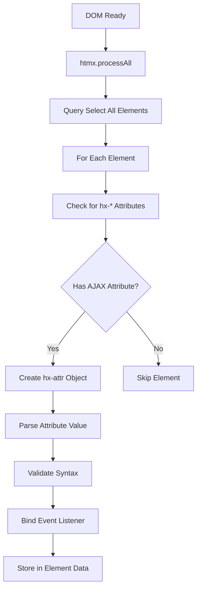
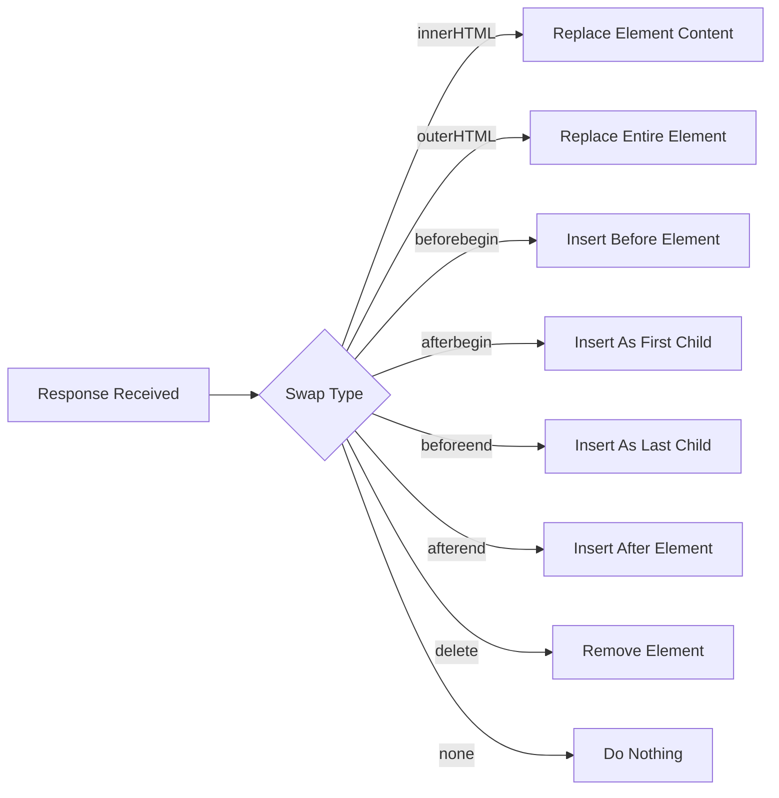
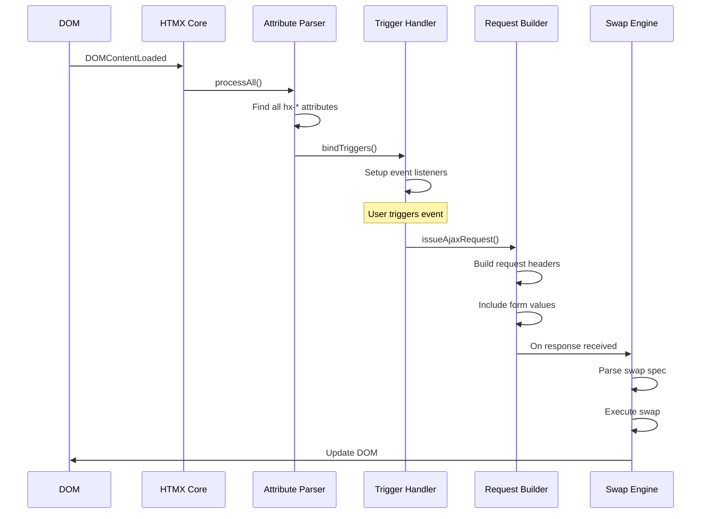

# Deep Dive: HTMX Attribute System

## Overview

HTMX's attribute system is the core innovation that enables hypermedia-driven web development. This deep dive explores every aspect of how HTMX parses, validates, and executes HTML attributes to create dynamic web experiences without JavaScript frameworks.

### Design Philosophy

HTMX's attribute system follows several key design principles:

1. **Progressive Enhancement**: Attributes enhance existing HTML without breaking it
2. **Declarative Syntax**: What should happen is declared in HTML, not scripted
3. **Composability**: Multiple attributes can work together on the same element
4. **Graceful Degradation**: If HTMX fails to load, HTML still functions

## Attribute Categories

HTMX attributes fall into several functional categories:

### 1. AJAX Core Attributes

These are the primary AJAX-triggering attributes:

| Attribute | Purpose | Example |
|-----------|---------|---------|
| `hx-get` | Issue GET request | `<button hx-get="/api/users">` |
| `hx-post` | Issue POST request | `<form hx-post="/api/users">` |
| `hx-put` | Issue PUT request | `<button hx-put="/api/users/1">` |
| `hx-patch` | Issue PATCH request | `<button hx-patch="/api/users/1">` |
| `hx-delete` | Issue DELETE request | `<button hx-delete="/api/users/1">` |

### 2. Target & Swap Control

| Attribute | Purpose | Values |
|-----------|---------|--------|
| `hx-target` | Where to swap response | CSS selector, `closest`, `next`, `previous`, `find` |
| `hx-swap` | How to swap content | `innerHTML`, `outerHTML`, `beforebegin`, `afterbegin`, `beforeend`, `afterend`, `delete`, `none` |
| `hx-swap-oob` | Out-of-band swaps | `true`, CSS selector |

### 3. Trigger Control

| Attribute | Purpose | Example |
|-----------|---------|---------|
| `hx-trigger` | What event triggers request | `click`, `keyup`, `load`, `revealed`, `every:3s` |
| `hx-event` | Listen for custom events | `hx-event="content-updated"` |

### 4. Request Configuration

| Attribute | Purpose | Example |
|-----------|---------|---------|
| `hx-include` | What inputs to include | `[name='email']`, `*`, `.inputs` |
| `hx-params` | Filter parameters | `*`, `none`, `param1,param2` |
| `hx-headers` | Add request headers | `{"X-Custom": "value"}` |
| `hx-vars` | Add dynamic variables | `{"userId": "123"}` |

### 5. UI/UX Enhancement

| Attribute | Purpose | Example |
|-----------|---------|---------|
| `hx-indicator` | Loading indicator | `#loading`, `.spinner` |
| `hx-confirm` | Confirmation dialog | `"Are you sure?"` |
| `hx-disabled-elt` | Element to disable | `this`, `#submit-btn` |
| `hx-push-url` | Update browser history | `/new-url`, `false` |

### 6. Validation & Error Handling

| Attribute | Purpose | Example |
|-----------|---------|---------|
| `hx-validate` | Trigger validation | `true` |
| `hx-on` | Client-side event handlers | `htmx:afterRequest:console.log(event)` |

## Internal Architecture

### Attribute Parsing Pipeline



### Core Parsing Function

The main attribute parsing happens in `htmx.js`:

```javascript
/**
 * Process an element for HTMX attributes
 * @param {Element} elt - The element to process
 * @returns {Object|null} - The attribute info object or null
 */
htmx.process = function(elt) {
    // Skip if already processed
    if (htmx.elementContainsData(elt)) {
        return null;
    }

    // Get all attributes
    var attributes = getAttributes(elt);
    
    // Find AJAX attribute (hx-get, hx-post, etc.)
    var ajaxAttr = findAjaxAttribute(attributes);
    
    if (ajaxAttr) {
        var attrInfo = {
            ajaxAttr: ajaxAttr,
            path: attributes[ajaxAttr],
            verb: ajaxAttr.replace('hx-', ''),
            target: attributes['hx-target'] || 'this',
            swap: attributes['hx-swap'] || 'innerHTML',
            trigger: parseTriggerSpec(attributes['hx-trigger'] || 'click'),
            include: attributes['hx-include'],
            confirm: attributes['hx-confirm'],
            // ... more properties
        };
        
        // Bind the trigger
        bindTrigger(elt, attrInfo);
        
        // Store for later
        htmx.setPrivateProperty(elt, 'htmx-attr-info', attrInfo);
        
        return attrInfo;
    }
    
    return null;
}
```

## Deep Dive: hx-trigger

The `hx-trigger` attribute is the most complex attribute in HTMX. Let's explore it in detail.

### Trigger Syntax

```
hx-trigger="<event>[ <modifier>]*"
```

### Modifiers

| Modifier | Purpose | Example |
|----------|---------|---------|
| `changed` | Only if value changed | `keyup changed` |
| `once` | Only fire once | `load once` |
| `consume` | Prevent event bubbling | `click consume` |
| `delay:<time>` | Debounce | `keyup delay:500ms` |
| `throttle:<time>` | Throttle | `click throttle:1s` |
| `from:<selector>` | Listen on different element | `keyup from:#input` |
| `target:<selector>` | Only if target matches | `click target:.delete-btn` |
| `revealed` | When element scrolls into view | `revealed` |
| `load` | On page load | `load delay:100ms` |
| `every:<time>` | Poll at interval | `every:5s` |

### Trigger Parsing Implementation

```javascript
/**
 * Parse trigger specification string
 * @param {string} triggerSpec - The hx-trigger value
 * @returns {Array} - Array of trigger specifications
 */
function parseTriggerSpec(triggerSpec) {
    if (!triggerSpec) return [{ event: 'click' }];
    
    var specs = [];
    var parts = triggerSpec.split(',');
    
    for (var i = 0; i < parts.length; i++) {
        var part = parts[i].trim();
        var tokens = part.split(/\\s+/);
        var spec = {
            event: tokens[0],
            changed: false,
            once: false,
            consume: false,
            delay: null,
            throttle: null,
            from: null,
            target: null
        };
        
        for (var j = 1; j < tokens.length; j++) {
            var token = tokens[j];
            
            if (token === 'changed') spec.changed = true;
            else if (token === 'once') spec.once = true;
            else if (token === 'consume') spec.consume = true;
            else if (token.startsWith('delay:')) spec.delay = parseTime(token);
            else if (token.startsWith('throttle:')) spec.throttle = parseTime(token);
            else if (token.startsWith('from:')) spec.from = token.substring(5);
            else if (token.startsWith('target:')) spec.target = token.substring(7);
        }
        
        specs.push(spec);
    }
    
    return specs;
}
```

### Event Listener Binding

```javascript
/**
 * Bind event listener based on trigger spec
 * @param {Element} elt - Target element
 * @param {Object} attrInfo - Attribute info object
 */
function bindTrigger(elt, attrInfo) {
    var triggers = attrInfo.trigger;
    
    for (var i = 0; i < triggers.length; i++) {
        var trigger = triggers[i];
        var elementToListenOn = trigger.from ? 
            htmx.querySelectorExt(trigger.from) : elt;
        
        var handler = function(evt) {
            // Check target filter
            if (trigger.target && !matches(evt.target, trigger.target)) {
                return;
            }
            
            // Check changed
            if (trigger.changed) {
                var currentValue = getValue(elt);
                if (currentValue === getPrivateProperty(elt, 'last-value')) {
                    return;
                }
                setPrivateProperty(elt, 'last-value', currentValue);
            }
            
            // Check once
            if (trigger.once && getPrivateProperty(elt, 'triggered-once')) {
                return;
            }
            setPrivateProperty(elt, 'triggered-once', true);
            
            // Consume event
            if (trigger.consume) {
                evt.preventDefault();
                evt.stopPropagation();
            }
            
            // Handle delay/throttle
            if (trigger.delay) {
                clearTimeout(getPrivateProperty(elt, 'delay-timeout'));
                var timeout = setTimeout(function() {
                    issueAjaxRequest(attrInfo, elt, evt);
                }, trigger.delay);
                setPrivateProperty(elt, 'delay-timeout', timeout);
                return;
            }
            
            if (trigger.throttle) {
                if (getPrivateProperty(elt, 'throttle-timeout')) {
                    return;
                }
                var throttleTimeout = setTimeout(function() {
                    issueAjaxRequest(attrInfo, elt, evt);
                    setPrivateProperty(elt, 'throttle-timeout', null);
                }, trigger.throttle);
                setPrivateProperty(elt, 'throttle-timeout', throttleTimeout);
                return;
            }
            
            // Fire immediately
            issueAjaxRequest(attrInfo, elt, evt);
        };
        
        // Special handling for 'revealed' trigger
        if (trigger.event === 'revealed') {
            setupRevealTrigger(elt, handler);
        }
        // Special handling for 'load' trigger
        else if (trigger.event === 'load') {
            if (trigger.delay) {
                setTimeout(handler, trigger.delay);
            } else {
                handler(new Event('load'));
            }
        }
        // Special handling for 'every' trigger (polling)
        else if (trigger.event.startsWith('every:')) {
            var interval = parseTime(trigger.event);
            setInterval(handler, interval);
        }
        // Standard event listener
        else {
            elementToListenOn.addEventListener(trigger.event, handler);
        }
    }
}
```

## Deep Dive: hx-swap

The `hx-swap` attribute controls how the response is inserted into the DOM.

### Swap Strategies



### Swap Modifiers

| Modifier | Purpose | Example |
|----------|---------|---------|
| `swap:<time>` | Delay before swap | `innerHTML swap:500ms` |
| `settle:<time>` | Delay before settle | `innerHTML settle:20ms` |
| `transition:<bool>` | Enable CSS transitions | `innerHTML transition:true` |
| `ignoreTitle:<bool>` | Don't update title | `innerHTML ignoreTitle:true` |
| `scroll:<pos>` | Scroll behavior | `innerHTML scroll:bottom` |
| `show:<pos>` | Show position | `innerHTML show:top` |

### Swap Implementation

```javascript
/**
 * Parse swap specification
 * @param {string} swapSpec - The hx-swap value
 * @returns {Object} - Parsed swap specification
 */
function parseSwapSpec(swapSpec) {
    var spec = {
        swapStyle: 'innerHTML',
        swapDelay: 0,
        settleDelay: 20,
        transition: false,
        ignoreTitle: false,
        scroll: null,
        show: null
    };
    
    if (!swapSpec) return spec;
    
    var parts = swapSpec.split(' ');
    spec.swapStyle = parts[0];
    
    for (var i = 1; i < parts.length; i++) {
        var part = parts[i];
        
        if (part.startsWith('swap:')) {
            spec.swapDelay = parseTime(part);
        } else if (part.startsWith('settle:')) {
            spec.settleDelay = parseTime(part);
        } else if (part.startsWith('transition:')) {
            spec.transition = part.substring(11) === 'true';
        } else if (part.startsWith('ignoreTitle:')) {
            spec.ignoreTitle = part.substring(12) === 'true';
        } else if (part.startsWith('scroll:')) {
            spec.scroll = part.substring(7);
        } else if (part.startsWith('show:')) {
            spec.show = part.substring(5);
        }
    }
    
    return spec;
}

/**
 * Execute the swap operation
 * @param {string} content - Response content
 * @param {Element} target - Target element
 * @param {Object} swapSpec - Parsed swap specification
 */
function swapInnerHTML(content, target, swapSpec) {
    var range = target.ownerDocument.createRange();
    var fragment = range.createContextualFragment(content);
    
    // Clear existing content
    target.innerHTML = '';
    
    // Insert new content
    target.appendChild(fragment);
    
    // Handle scroll
    if (swapSpec.scroll === 'top') {
        target.scrollTop = 0;
    } else if (swapSpec.scroll === 'bottom') {
        target.scrollTop = target.scrollHeight;
    }
    
    // Handle show
    if (swapSpec.show === 'top') {
        target.scrollIntoView({ block: 'start' });
    } else if (swapSpec.show === 'bottom') {
        target.scrollIntoView({ block: 'end' });
    }
}

function swapOuterHTML(content, target, swapSpec) {
    var range = target.ownerDocument.createRange();
    var fragment = range.createContextualFragment(content);
    
    // Replace element
    target.parentNode.replaceChild(fragment, target);
}

function swapBeforeBegin(content, target, swapSpec) {
    var range = target.ownerDocument.createRange();
    var fragment = range.createContextualFragment(content);
    target.parentNode.insertBefore(fragment, target);
}

function swapAfterBegin(content, target, swapSpec) {
    var range = target.ownerDocument.createRange();
    var fragment = range.createContextualFragment(content);
    if (target.firstChild) {
        target.insertBefore(fragment, target.firstChild);
    } else {
        target.appendChild(fragment);
    }
}

function swapBeforeEnd(content, target, swapSpec) {
    var range = target.ownerDocument.createRange();
    var fragment = range.createContextualFragment(content);
    if (target.lastChild) {
        target.insertBefore(fragment, target.lastChild.nextSibling);
    } else {
        target.appendChild(fragment);
    }
}

function swapAfterEnd(content, target, swapSpec) {
    var range = target.ownerDocument.createRange();
    var fragment = range.createContextualFragment(content);
    if (target.nextSibling) {
        target.parentNode.insertBefore(fragment, target.nextSibling);
    } else {
        target.parentNode.appendChild(fragment);
    }
}
```

## Deep Dive: hx-include

The `hx-include` attribute controls which input values are submitted with the request.

### Include Syntax

| Syntax | Meaning |
|--------|---------|
| `*` | Include all inputs in the form |
| `none` | Include no additional inputs |
| `param1,param2` | Include specific parameters |
| `.class` | Include elements with class |
| `#id` | Include element with id |
| `[name='email']` | Include elements matching selector |

### Include Implementation

```javascript
/**
 * Get values to include in request
 * @param {Element} elt - Source element
 * @param {string} includeSpec - hx-include value
 * @returns {Array} - Array of {name, value} objects
 */
function getIncludeValues(elt, includeSpec) {
    if (includeSpec === 'none') return [];
    
    var toInclude = [];
    
    if (includeSpec === '*') {
        // Include entire form
        var form = elt.closest('form');
        if (form) {
            toInclude = getFormValues(form);
        }
    } else if (includeSpec) {
        // Parse selector
        var elements = htmx.querySelectorAllExt(includeSpec);
        for (var i = 0; i < elements.length; i++) {
            var element = elements[i];
            if (isInput(element)) {
                toInclude.push({
                    name: element.name,
                    value: getInputValue(element)
                });
            } else {
                // Include all inputs within element
                var inputs = element.querySelectorAll('input, select, textarea');
                for (var j = 0; j < inputs.length; j++) {
                    toInclude.push({
                        name: inputs[j].name,
                        value: getInputValue(inputs[j])
                    });
                }
            }
        }
    }
    
    return toInclude;
}
```

## Attribute Processing Order

HTMX processes attributes in a specific order:



## Edge Cases and Browser Compatibility

### 1. SVG Elements

SVG elements have different attribute handling:

```javascript
// SVG elements use getAttributeNS for namespaced attributes
function getAttributeValue(elt, attrName) {
    if (elt instanceof SVGElement) {
        return elt.getAttribute(attrName); // No namespace for HTMX attrs
    }
    return elt.getAttribute(attrName);
}
```

### 2. Shadow DOM

Shadow DOM requires special handling:

```javascript
// Query within shadow DOM
function querySelectorExt(context, selector) {
    if (context.shadowRoot) {
        return context.shadowRoot.querySelector(selector);
    }
    return context.querySelector(selector);
}
```

### 3. Event Delegation

HTMX uses event delegation for efficiency:

```javascript
// Single listener at document level for some events
document.addEventListener('click', function(evt) {
    var elt = evt.target.closest('[hx-trigger*="click"]');
    if (elt) {
        // Handle click
    }
});
```

## Performance Considerations

### 1. Attribute Caching

HTMX caches parsed attribute info:

```javascript
// Store parsed info on element
htmx.setPrivateProperty(elt, 'htmx-attr-info', attrInfo);

// Retrieve instead of re-parsing
var cached = htmx.getPrivateProperty(elt, 'htmx-attr-info');
```

### 2. Event Listener Optimization

Using event delegation reduces memory:

```javascript
// Instead of adding listener to every element
// Use document-level listener
document.body.addEventListener('htmx-trigger', function(evt) {
    // Handle all triggers
});
```

## Examples

### Complex Trigger Example

```html
<!-- Search input with debounce and changed detection -->
<input 
    type="text" 
    name="search"
    hx-get="/api/search"
    hx-trigger="keyup changed delay:500ms"
    hx-target="#results"
    hx-indicator="#spinner"
>
<div id="results"></div>
<span id="spinner" class="htmx-indicator">Searching...</span>
```

### Dynamic Parameters Example

```html
<!-- Include additional values dynamically -->
<button 
    hx-post="/api/update"
    hx-include="[name='selected'], [name='mode']"
    hx-vars="{'timestamp': Date.now()}"
    hx-target="#status"
>
    Update
</button>
```

### Out-of-Band Swap Example

```html
<!-- Update multiple locations with one response -->
<div hx-post="/api/item" hx-swap="outerHTML">
    Add Item
</div>

<!-- This will be updated via OOB swap in response -->
<div id="item-count">Items: 0</div>
<div id="item-list"></div>

<!-- Server response: -->
<!-- <div id="item-count">Items: 1</div> -->
<!-- <div id="item-list" hx-swap-oob="beforeend"> -->
<!--   <div>New Item</div> -->
<!-- </div> -->
```

## Conclusion

The HTMX attribute system provides a powerful, declarative way to add AJAX functionality to web applications. By parsing attributes and binding event listeners, HTMX intercepts user actions and translates them into AJAX requests with minimal configuration.

The key innovations are:
1. **Declarative AJAX**: No JavaScript required
2. **Composable attributes**: Multiple behaviors can be combined
3. **Flexible triggers**: Events can be customized extensively
4. **Multiple swap strategies**: Content can be inserted in various ways
5. **Progressive enhancement**: Works without HTMX loaded
