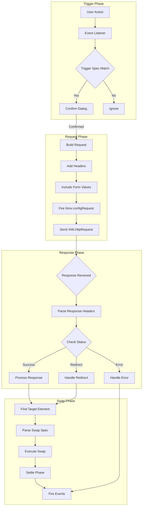
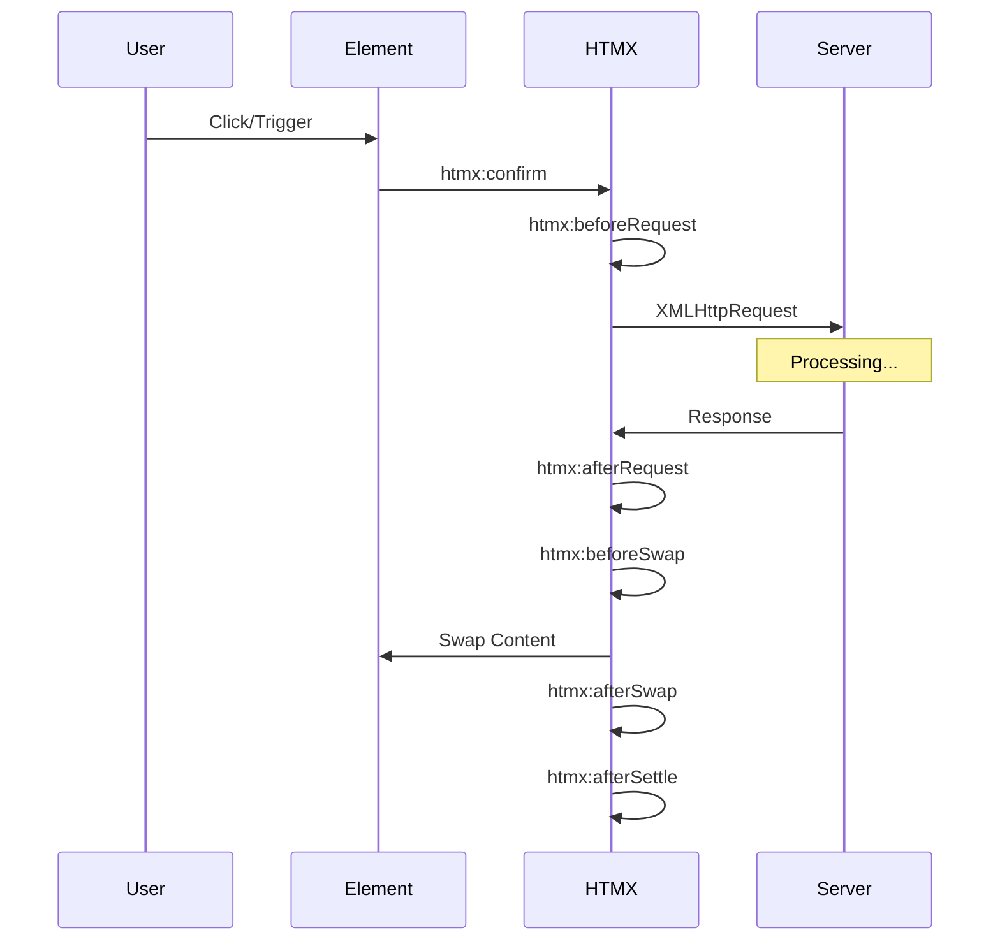

# Deep Dive: HTMX AJAX Engine

## Overview

The AJAX engine is the heart of HTMX. It intercepts user-triggered events, constructs HTTP requests, sends them to the server, and processes the responses to update the DOM. This deep dive explores every aspect of how HTMX's AJAX engine works internally.

## Architecture



## Request Lifecycle

### 1. Event Triggering

```javascript
/**
 * Main entry point for AJAX requests
 * @param {Element} elt - The triggering element
 * @param {Event} event - The triggering event
 */
function issueAjaxRequest(elt, event) {
    var attrInfo = htmx.getPrivateProperty(elt, 'htmx-attr-info');
    
    // Validate element has HTMX attributes
    if (!attrInfo) {
        // Check for dynamic AJAX
        attrInfo = parseDynamicAjax(elt);
        if (!attrInfo) return;
    }
    
    // Handle confirmation
    if (attrInfo.confirm) {
        if (!confirm(attrInfo.confirm)) {
            return;
        }
    }
    
    // Disable element if specified
    var disabledElt = getDisabledElement(elt, attrInfo.disabledElt);
    if (disabledElt) {
        disabledElt.disabled = true;
    }
    
    // Show loading indicator
    var indicator = getIndicator(elt, attrInfo.indicator);
    if (indicator) {
        indicator.classList.add('htmx-indicator');
    }
    
    // Build and send request
    var xhr = new XMLHttpRequest();
    var path = attrInfo.path;
    var verb = attrInfo.verb;
    
    // Fire beforeRequest event
    var beforeRequest = htmx.triggerEvent(elt, 'htmx:beforeRequest', {
        xhr: xhr,
        target: elt,
        requestConfig: {
            path: path,
            verb: verb,
            headers: {},
            parameters: {}
        }
    });
    
    // Check if request was cancelled
    if (beforeRequest.defaultPrevented) {
        return;
    }
    
    // Setup request
    setupRequest(xhr, elt, attrInfo, event);
    
    // Send request
    xhr.send();
}
```

### 2. Request Configuration

```javascript
/**
 * Setup the XMLHttpRequest
 * @param {XMLHttpRequest} xhr - The XHR object
 * @param {Element} elt - Triggering element
 * @param {Object} attrInfo - Attribute info
 * @param {Event} event - Triggering event
 */
function setupRequest(xhr, elt, attrInfo, event) {
    var path = attrInfo.path;
    var verb = attrInfo.verb;
    var target = getTarget(elt, attrInfo.target);
    var parameters = getParameters(elt, attrInfo);
    
    // Open connection
    xhr.open(verb.toUpperCase(), path, true);
    
    // Set required headers
    xhr.setRequestHeader('HX-Request', 'true');
    xhr.setRequestHeader('HX-Trigger', getRawId(elt) || elt.id || '');
    xhr.setRequestHeader('HX-Trigger-Name', elt.name || '');
    xhr.setRequestHeader('HX-Target', getRawId(target) || '');
    xhr.setRequestHeader('HX-Current-URL', window.location.href);
    
    // Set optional headers
    if (elt.tagName === 'FORM') {
        xhr.setRequestHeader('Content-Type', 'application/x-www-form-urlencoded');
    }
    
    // Add custom headers from hx-headers
    if (attrInfo.headers) {
        for (var key in attrInfo.headers) {
            if (attrInfo.headers.hasOwnProperty(key)) {
                xhr.setRequestHeader(key, attrInfo.headers[key]);
            }
        }
    }
    
    // Fire configRequest event for last-minute modifications
    var configRequest = htmx.triggerEvent(elt, 'htmx:configRequest', {
        xhr: xhr,
        parameters: parameters,
        headers: xhr.getAllResponseHeaders()
    });
    
    // Encode parameters based on verb
    var body = null;
    if (verb === 'get') {
        // Append to URL for GET
        path = appendParameters(path, parameters);
        xhr.open('GET', path, true);
    } else {
        // Send as body for POST/PUT/DELETE
        body = encodeParameters(parameters);
    }
    
    // Store original data for potential cancellation
    htmx.setPrivateProperty(elt, 'htmx-xhr', xhr);
    
    // Setup response handlers
    setupResponseHandlers(xhr, elt, attrInfo, target);
}
```

### 3. Parameter Collection

```javascript
/**
 * Collect all parameters to send with request
 * @param {Element} elt - Triggering element
 * @param {Object} attrInfo - Attribute info
 * @returns {Object} - Key-value pairs of parameters
 */
function getParameters(elt, attrInfo) {
    var params = {};
    
    // Add value from triggering element if it's an input
    if (isInput(elt) && elt.name) {
        params[elt.name] = getInputValue(elt);
    }
    
    // Include form values
    var form = elt.closest('form');
    if (form && !attrInfo.include || attrInfo.include === '*') {
        var formParams = getFormValues(form);
        for (var i = 0; i < formParams.length; i++) {
            var param = formParams[i];
            // Don't duplicate triggering element
            if (elt.name !== param.name) {
                params[param.name] = param.value;
            }
        }
    }
    
    // Include specific elements from hx-include
    if (attrInfo.include && attrInfo.include !== '*' && attrInfo.include !== 'none') {
        var includeParams = getIncludeValues(elt, attrInfo.include);
        for (var j = 0; j < includeParams.length; j++) {
            var includeParam = includeParams[j];
            params[includeParam.name] = includeParam.value;
        }
    }
    
    // Filter parameters with hx-params
    if (attrInfo.params) {
        params = filterParameters(params, attrInfo.params);
    }
    
    // Add dynamic variables from hx-vars
    if (attrInfo.vars) {
        for (var key in attrInfo.vars) {
            if (attrInfo.vars.hasOwnProperty(key)) {
                params[key] = attrInfo.vars[key];
            }
        }
    }
    
    // Fire beforeSend event for final modifications
    htmx.triggerEvent(elt, 'htmx:confirm', {
        parameters: params
    });
    
    return params;
}

/**
 * Get form values as array of {name, value} objects
 * @param {HTMLFormElement} form - The form element
 * @returns {Array} - Array of parameter objects
 */
function getFormValues(form) {
    var values = [];
    var inputs = form.querySelectorAll('input, select, textarea');
    
    for (var i = 0; i < inputs.length; i++) {
        var input = inputs[i];
        
        // Skip disabled elements
        if (input.disabled) continue;
        
        // Skip unchecked checkboxes/radios
        if ((input.type === 'checkbox' || input.type === 'radio') && !input.checked) {
            continue;
        }
        
        // Skip submit buttons
        if (input.type === 'submit') continue;
        
        values.push({
            name: input.name,
            value: getInputValue(input)
        });
    }
    
    return values;
}
```

### 4. Response Handling

```javascript
/**
 * Setup handlers for XHR response
 * @param {XMLHttpRequest} xhr - The XHR object
 * @param {Element} elt - Triggering element
 * @param {Object} attrInfo - Attribute info
 * @param {Element} target - Target element
 */
function setupResponseHandlers(xhr, elt, attrInfo, target) {
    xhr.onload = function() {
        // Hide loading indicator
        var indicator = getIndicator(elt, attrInfo.indicator);
        if (indicator) {
            indicator.classList.remove('htmx-indicator');
        }
        
        // Re-enable disabled element
        var disabledElt = getDisabledElement(elt, attrInfo.disabledElt);
        if (disabledElt) {
            disabledElt.disabled = false;
        }
        
        // Fire afterRequest event
        htmx.triggerEvent(elt, 'htmx:afterRequest', {
            xhr: xhr,
            target: elt
        });
        
        // Check for redirect headers
        var redirect = xhr.getResponseHeader('HX-Redirect');
        if (redirect) {
            window.location.href = redirect;
            return;
        }
        
        var pushUrl = xhr.getResponseHeader('HX-Push-Url');
        if (pushUrl) {
            if (pushUrl === 'false') {
                // Don't update history
            } else {
                history.pushState({}, '', pushUrl);
            }
        }
        
        var refresh = xhr.getResponseHeader('HX-Refresh');
        if (refresh === 'true') {
            window.location.reload();
            return;
        }
        
        // Handle error status codes
        if (xhr.status >= 400) {
            htmx.triggerEvent(elt, 'htmx:responseError', {
                xhr: xhr,
                target: elt
            });
        }
        
        // Process successful response
        if (xhr.status >= 200 && xhr.status < 400) {
            handleSuccessfulResponse(xhr, elt, attrInfo, target);
        }
    };
    
    xhr.onerror = function() {
        // Hide indicator
        var indicator = getIndicator(elt, attrInfo.indicator);
        if (indicator) {
            indicator.classList.remove('htmx-indicator');
        }
        
        // Fire error event
        htmx.triggerEvent(elt, 'htmx:sendError', {
            xhr: xhr,
            target: elt
        });
    };
    
    xhr.onabort = function() {
        htmx.triggerEvent(elt, 'htmx:sendAbort', {
            xhr: xhr,
            target: elt
        });
    };
}

/**
 * Handle successful AJAX response
 * @param {XMLHttpRequest} xhr - The XHR object
 * @param {Element} elt - Triggering element
 * @param {Object} attrInfo - Attribute info
 * @param {Element} target - Target element
 */
function handleSuccessfulResponse(xhr, elt, attrInfo, target) {
    var responseText = xhr.responseText;
    var responseHeaders = xhr.getAllResponseHeaders();
    
    // Check for new target from header
    var newTarget = xhr.getResponseHeader('HX-Retarget');
    if (newTarget) {
        if (newTarget === 'this') {
            target = elt;
        } else {
            target = htmx.querySelectorExt(newTarget);
        }
    }
    
    // Check for new swap method from header
    var newSwap = xhr.getResponseHeader('HX-Reswap');
    if (newSwap) {
        attrInfo.swap = newSwap;
    }
    
    // Fire beforeSwap event
    var beforeSwap = htmx.triggerEvent(elt, 'htmx:beforeSwap', {
        xhr: xhr,
        target: target,
        swapSpec: parseSwapSpec(attrInfo.swap),
        shouldSwap: true,
        serverResponse: responseText
    });
    
    // Check if swap was prevented
    if (beforeSwap.defaultPrevented || !beforeSwap.detail.shouldSwap) {
        return;
    }
    
    // Execute swap
    var swapSpec = parseSwapSpec(attrInfo.swap);
    swap(target, responseText, swapSpec);
    
    // Handle out-of-band swaps
    handleOobSwaps(responseText, elt);
    
    // Fire afterSwap event
    htmx.triggerEvent(elt, 'htmx:afterSwap', {
        xhr: xhr,
        target: target
    });
}
```

### 5. Swap Execution

```javascript
/**
 * Execute the swap operation
 * @param {Element} target - Target element
 * @param {string} content - Response content
 * @param {Object} swapSpec - Parsed swap specification
 */
function swap(target, content, swapSpec) {
    // Handle delay
    if (swapSpec.swapDelay > 0) {
        setTimeout(function() {
            executeSwap(target, content, swapSpec);
        }, swapSpec.swapDelay);
    } else {
        executeSwap(target, content, swapSpec);
    }
}

/**
 * Execute swap immediately
 */
function executeSwap(target, content, swapSpec) {
    var swapStyle = swapSpec.swapStyle;
    
    // Fire beforeSwapDetails event
    htmx.triggerEvent(target, 'htmx:beforeOnLoad', {
        target: target,
        swapStyle: swapStyle
    });
    
    switch (swapStyle) {
        case 'innerHTML':
            swapInnerHTML(content, target, swapSpec);
            break;
        case 'outerHTML':
            swapOuterHTML(content, target, swapSpec);
            break;
        case 'beforebegin':
            swapBeforeBegin(content, target, swapSpec);
            break;
        case 'afterbegin':
            swapAfterBegin(content, target, swapSpec);
            break;
        case 'beforeend':
            swapBeforeEnd(content, target, swapSpec);
            break;
        case 'afterend':
            swapAfterEnd(content, target, swapSpec);
            break;
        case 'delete':
            if (target.parentNode) {
                target.parentNode.removeChild(target);
            }
            break;
        case 'none':
            // Do nothing
            break;
        default:
            // Try custom swap style
            if (htmx.swapDefinitions && htmx.swapDefinitions[swapStyle]) {
                htmx.swapDefinitions[swapStyle](target, content, swapSpec);
            } else {
                console.error('Unknown swap style: ' + swapStyle);
            }
    }
    
    // Settle phase
    setTimeout(function() {
        settle(target, swapSpec);
    }, swapSpec.settleDelay);
}

/**
 * Settle phase - scroll, focus, etc.
 */
function settle(target, swapSpec) {
    // Handle scroll
    if (swapSpec.scroll) {
        if (swapSpec.scroll === 'top') {
            window.scrollTo(0, 0);
        } else if (swapSpec.scroll === 'bottom') {
            window.scrollTo(0, document.body.scrollHeight);
        } else {
            var scrollTarget = htmx.querySelectorExt(swapSpec.scroll);
            if (scrollTarget) {
                scrollTarget.scrollIntoView();
            }
        }
    }
    
    // Handle show
    if (swapSpec.show) {
        var showTarget = htmx.querySelectorExt(swapSpec.show);
        if (showTarget) {
            showTarget.scrollIntoView({ block: 'center' });
        }
    }
    
    // Handle focus
    var focusElement = getPrivateProperty(target, 'htmx-focus');
    if (focusElement) {
        focusElement.focus();
    }
    
    // Fire settled event
    htmx.triggerEvent(target, 'htmx:afterSettle', {
        target: target
    });
}
```

## Request Headers

HTMX sends the following headers with every AJAX request:

| Header | Value | Purpose |
|--------|-------|---------|
| `HX-Request` | `true` | Indicates HTMX request |
| `HX-Trigger` | element-id | ID of triggering element |
| `HX-Trigger-Name` | element-name | Name of triggering element |
| `HX-Target` | target-id | ID of target element |
| `HX-Current-URL` | window.location.href | Current page URL |

Additional headers for specific scenarios:

| Header | When Sent |
|--------|-----------|
| `Content-Type: application/x-www-form-urlencoded` | Form submissions |
| `HX-Boosted` | Boosted elements |
| `HX-Prompt` | After prompt dialog |
| `HX-Modified-Since` | For caching |
| `If-None-Match` | For ETag caching |

## Response Headers

Server can control client behavior with these headers:

| Header | Effect |
|--------|--------|
| `HX-Location` | Client-side redirect without reload |
| `HX-Push-Url` | Push URL to browser history |
| `HX-Redirect` | Full redirect (client-side) |
| `HX-Refresh` | Reload entire page |
| `HX-Replace-Url` | Replace current history entry |
| `HX-Reswap` | Change swap method for this response |
| `HX-Retarget` | Change target element for this response |
| `HX-Trigger` | Trigger client-side event |
| `HX-Trigger-After-Settle` | Trigger after settle phase |
| `HX-Trigger-After-Swap` | Trigger after swap phase |

## Event System

HTMX fires events throughout the request lifecycle:



### Event Reference

| Event | When Fired | Detail Properties |
|-------|------------|-------------------|
| `htmx:confirm` | Before request | xhr, target, question |
| `htmx:beforeRequest` | Before sending | xhr, target, requestConfig |
| `htmx:afterRequest` | After response | xhr, target, successful |
| `htmx:beforeSwap` | Before content swap | xhr, target, swapSpec, shouldSwap |
| `htmx:afterSwap` | After content swap | xhr, target, serverResponse |
| `htmx:afterSettle` | After settle phase | xhr, target |
| `htmx:sendError` | On network error | xhr, target |
| `htmx:sendAbort` | On request abort | xhr, target |
| `htmx:timeout` | On request timeout | xhr, target |

### Event Handling Example

```javascript
// Listen for all HTMX requests
document.body.addEventListener('htmx:beforeRequest', function(evt) {
    console.log('Request starting:', evt.detail.requestConfig.path);
});

// Add CSRF token to all requests
document.body.addEventListener('htmx:configRequest', function(evt) {
    var token = document.querySelector('meta[name="csrf-token"]').content;
    evt.detail.headers['X-CSRF-Token'] = token;
});

// Handle validation errors
document.body.addEventListener('htmx:responseError', function(evt) {
    if (evt.detail.xhr.status === 422) {
        // Show validation errors
        var errors = JSON.parse(evt.detail.xhr.responseText);
        showValidationErrors(errors);
    }
});

// Trigger notification on specific event
document.body.addEventListener('htmx:afterSwap', function(evt) {
    if (evt.detail.xhr.getResponseHeader('HX-Trigger') === 'notification') {
        showToast('Update successful!');
    }
});
```

## Error Handling

### Network Errors

```javascript
xhr.onerror = function() {
    htmx.triggerEvent(elt, 'htmx:sendError', {
        xhr: xhr,
        target: elt,
        errorType: 'network',
        message: 'Network error occurred'
    });
    
    // Show error to user
    var errorDiv = document.createElement('div');
    errorDiv.className = 'htmx-error';
    errorDiv.textContent = 'Request failed. Please try again.';
    target.appendChild(errorDiv);
};
```

### Timeout Handling

```javascript
// Set timeout
xhr.timeout = 30000; // 30 seconds

xhr.ontimeout = function() {
    htmx.triggerEvent(elt, 'htmx:timeout', {
        xhr: xhr,
        target: elt
    });
    
    // Show timeout message
    showToast('Request timed out. Please try again.');
};
```

### HTTP Error Handling

```javascript
if (xhr.status >= 400) {
    var errorDetail = {
        xhr: xhr,
        target: elt,
        status: xhr.status,
        statusText: xhr.statusText
    };
    
    htmx.triggerEvent(elt, 'htmx:responseError', errorDetail);
    
    // Handle specific error codes
    switch (xhr.status) {
        case 400:
            showBadRequest(xhr.responseText);
            break;
        case 401:
            redirectToLogin();
            break;
        case 403:
            showForbidden();
            break;
        case 404:
            showNotFound();
            break;
        case 422:
            showValidationErrors(xhr.responseText);
            break;
        case 500:
            showServerError();
            break;
    }
}
```

## Performance Optimizations

### 1. Request Deduplication

```javascript
// Prevent duplicate requests
var currentRequest = getPrivateProperty(elt, 'htmx-current-request');
if (currentRequest && currentRequest.readyState < 4) {
    // Request already in progress
    return;
}
setPrivateProperty(elt, 'htmx-current-request', xhr);
```

### 2. Request Cancellation

```javascript
// Cancel previous request when new one starts
var previousXhr = getPrivateProperty(elt, 'htmx-xhr');
if (previousXhr && previousXhr.readyState < 4) {
    previousXhr.abort();
}
```

### 3. Response Caching

```javascript
// Simple cache for GET requests
var cache = {};

function getCachedResponse(path) {
    return cache[path];
}

function setCachedResponse(path, response) {
    cache[path] = response;
}

// In request handler
if (verb === 'get') {
    var cached = getCachedResponse(path);
    if (cached) {
        handleSuccessfulResponse({ responseText: cached }, elt, attrInfo, target);
        return;
    }
}
```

## Examples

### Form Submission with Validation

```html
<form hx-post="/api/users" 
      hx-swap="outerHTML"
      hx-on::after-request="if(event.detail.xhr.status === 200) showSuccess()">
    <input type="text" name="name" required>
    <input type="email" name="email" 
           hx-post="/validate/email" 
           hx-trigger="blur"
           hx-target="#email-error">
    <div id="email-error" class="error"></div>
    <button type="submit">Create User</button>
</form>

<script>
document.body.addEventListener('htmx:responseError', function(evt) {
    if (evt.detail.xhr.status === 422) {
        var errors = JSON.parse(evt.detail.xhr.responseText);
        for (var field in errors) {
            document.getElementById(field + '-error').textContent = errors[field];
        }
    }
});
</script>
```

### Optimistic UI Updates

```html
<button hx-post="/api/like"
        hx-swap="none"
        hx-on::after-request="this.classList.add('liked')"
        hx-trigger="click queue:none">
    Like
</button>
```

### Polling with Exponential Backoff

```html
<div id="status" 
     hx-get="/api/status"
     hx-trigger="every:5s"
     hx-on::after-request="updatePollInterval(event)">
    Loading...
</div>

<script>
var pollInterval = 5000;
function updatePollInterval(event) {
    var data = JSON.parse(event.detail.xhr.responseText);
    if (data.complete) {
        pollInterval = 60000; // Slow down when complete
    } else {
        pollInterval = Math.min(pollInterval * 1.5, 30000);
    }
    event.target.setAttribute('hx-trigger', 'every:' + pollInterval + 'ms');
}
</script>
```

## Conclusion

The HTMX AJAX engine provides a robust, event-driven architecture for handling AJAX requests. Key features include:

1. **Event-driven lifecycle**: Events fired at every stage for extensibility
2. **Header-based control**: Server can control client behavior via headers
3. **Flexible targeting**: Responses can be swapped to any element
4. **Error handling**: Comprehensive error events and handling
5. **Performance**: Request deduplication, caching, cancellation
