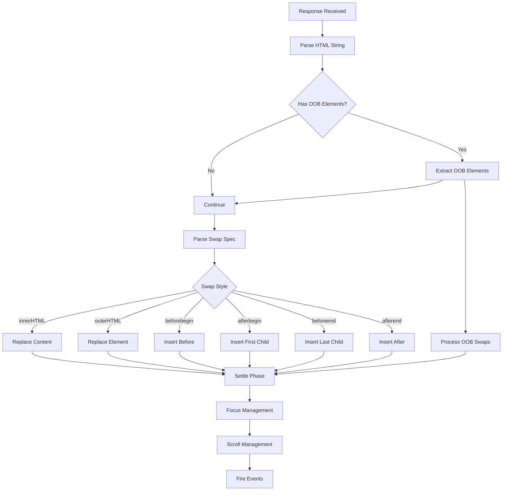

# Deep Dive: DOM Swapping and Morphing

## Overview

HTMX's DOM swapping engine is responsible for updating the page content based on server responses. This deep dive explores how HTMX parses, validates, and inserts HTML fragments into the DOM, including advanced topics like out-of-band swaps and morphing.

## Architecture



## Swap Strategies

### innerHTML

Replaces the content inside the target element:

```javascript
function swapInnerHTML(content, target, swapSpec) {
    // Create document fragment
    var range = target.ownerDocument.createRange();
    var fragment = range.createContextualFragment(content);
    
    // Clear existing content
    target.innerHTML = '';
    
    // Append new content
    target.appendChild(fragment);
    
    // Handle title update
    if (!swapSpec.ignoreTitle) {
        updateTitle(fragment);
    }
}
```

### outerHTML

Replaces the entire target element:

```javascript
function swapOuterHTML(content, target, swapSpec) {
    var range = target.ownerDocument.createRange();
    var fragment = range.createContextualFragment(content);
    
    // Get parent for replacement
    var parent = target.parentNode;
    var nextSibling = target.nextSibling;
    
    // Focus management
    var focusElement = document.activeElement;
    var focusPath = getFocusPath(focusElement, target);
    
    // Replace element
    if (nextSibling) {
        parent.insertBefore(fragment, nextSibling);
    } else {
        parent.appendChild(fragment);
    }
    parent.removeChild(target);
    
    // Restore focus
    restoreFocus(focusPath);
}
```

### Positional Swaps

```javascript
// beforebegin - Insert before the target element
function swapBeforeBegin(content, target, swapSpec) {
    var range = target.ownerDocument.createRange();
    var fragment = range.createContextualFragment(content);
    var parent = target.parentNode;
    
    if (parent) {
        var nextSibling = target;
        while (fragment.firstChild) {
            parent.insertBefore(fragment.firstChild, nextSibling);
        }
    }
}

// afterbegin - Insert as first child
function swapAfterBegin(content, target, swapSpec) {
    var range = target.ownerDocument.createRange();
    var fragment = range.createContextualFragment(content);
    
    if (target.firstChild) {
        var firstChild = target.firstChild;
        while (fragment.firstChild) {
            target.insertBefore(fragment.firstChild, firstChild);
        }
    } else {
        target.appendChild(fragment);
    }
}

// beforeend - Insert as last child (append)
function swapBeforeEnd(content, target, swapSpec) {
    var range = target.ownerDocument.createRange();
    var fragment = range.createContextualFragment(content);
    target.appendChild(fragment);
}

// afterend - Insert after the target element
function swapAfterEnd(content, target, swapSpec) {
    var range = target.ownerDocument.createRange();
    var fragment = range.createContextualFragment(content);
    var parent = target.parentNode;
    
    if (parent) {
        var nextSibling = target.nextSibling;
        while (fragment.firstChild) {
            if (nextSibling) {
                parent.insertBefore(fragment.firstChild, nextSibling);
            } else {
                parent.appendChild(fragment.firstChild);
            }
        }
    }
}
```

## Out-of-Band (OOB) Swaps

OOB swaps allow updating multiple elements with a single response:

### How OOB Works

```html
<!-- Initial HTML -->
<div id="user-list">
    <div id="user-1">John</div>
</div>
<div id="user-count">Users: 1</div>

<!-- Trigger -->
<button hx-post="/api/users" hx-target="#user-list">
    Add User
</button>

<!-- Server Response -->
<div id="user-1">John</div>
<div id="user-2">Jane</div>
<div id="user-count" hx-swap-oob="true">Users: 2</div>
```

### OOB Implementation

```javascript
/**
 * Handle out-of-band swaps
 * @param {string} responseText - Server response
 * @param {Element} triggeringElement - Element that triggered request
 */
function handleOobSwaps(responseText, triggeringElement) {
    // Parse response into fragment
    var range = document.createRange();
    var fragment = range.createContextualFragment(responseText);
    
    // Find all OOB elements
    var oobElements = fragment.querySelectorAll('[hx-swap-oob]');
    
    for (var i = 0; i < oobElements.length; i++) {
        var oobElement = oobElements[i];
        var oobValue = oobElement.getAttribute('hx-swap-oob');
        
        // Get target ID from attribute value or element ID
        var targetId = oobValue === 'true' ? 
            oobElement.id : 
            oobValue;
        
        var target = document.getElementById(targetId);
        if (target) {
            // Determine swap style
            var swapStyle = 'outerHTML';
            if (oobValue.startsWith('swap:')) {
                swapStyle = oobValue.substring(5);
            }
            
            // Execute OOB swap
            var oobContent = oobElement.outerHTML;
            swap(target, oobContent, { swapStyle: swapStyle });
        }
        
        // Remove from main fragment
        oobElement.parentNode.removeChild(oobElement);
    }
}
```

### OOB Swap Types

| Syntax | Effect |
|--------|--------|
| `hx-swap-oob="true"` | Swap outerHTML by ID |
| `hx-swap-oob="id"` | Swap element with that ID |
| `hx-swap-oob="innerHTML"` | Swap innerHTML |
| `hx-swap-oob="outerHTML"` | Swap outerHTML |
| `hx-swap-oob="beforebegin"` | Insert before target |
| `hx-swap-oob="afterbegin"` | Insert as first child |
| `hx-swap-oob="beforeend"` | Insert as last child |
| `hx-swap-oob="afterend"` | Insert after target |

## Morphing

Morphing updates existing DOM nodes while preserving state (focus, selections, etc.):

### Why Morphing?

Regular swapping can cause issues with:
- Lost focus on inputs
- Lost selection in text areas
- Reset form validation states
- Break third-party JavaScript widgets

### Morphing Implementation

```javascript
/**
 * Morph target element with new content
 * @param {Element} oldNode - Existing DOM node
 * @param {Element} newNode - New DOM node
 * @returns {Element} - The morphed node
 */
function morph(oldNode, newNode) {
    // If nodes are identical, no need to morph
    if (isSameNode(oldNode, newNode)) {
        return oldNode;
    }
    
    // If different tag names, replace entirely
    if (oldNode.nodeName !== newNode.nodeName) {
        return replace(oldNode, newNode);
    }
    
    // Sync attributes
    syncAttributes(oldNode, newNode);
    
    // Sync text content for text nodes
    if (oldNode.nodeType === 3) {
        if (oldNode.nodeValue !== newNode.nodeValue) {
            oldNode.nodeValue = newNode.nodeValue;
        }
        return oldNode;
    }
    
    // Sync children
    syncChildren(oldNode, newNode);
    
    return oldNode;
}

/**
 * Sync attributes from new node to old node
 */
function syncAttributes(oldNode, newNode) {
    var oldAttrs = oldNode.attributes;
    var newAttrs = newNode.attributes;
    
    // Remove attributes not in new node
    for (var i = oldAttrs.length - 1; i >= 0; i--) {
        var oldAttr = oldAttrs[i];
        if (!newNode.hasAttribute(oldAttr.name)) {
            oldNode.removeAttribute(oldAttr.name);
        }
    }
    
    // Add/update attributes from new node
    for (var j = 0; j < newAttrs.length; j++) {
        var newAttr = newAttrs[j];
        if (!oldNode.hasAttribute(newAttr.name) || 
            oldNode.getAttribute(newAttr.name) !== newAttr.value) {
            oldNode.setAttribute(newAttr.name, newAttr.value);
        }
    }
}

/**
 * Sync children using minimal DOM operations
 */
function syncChildren(oldParent, newParent) {
    var oldChildren = getChildElements(oldParent);
    var newChildren = getChildElements(newParent);
    
    var oldIndex = 0;
    var newIndex = 0;
    
    while (newIndex < newChildren.length) {
        var oldChild = oldChildren[oldIndex];
        var newChild = newChildren[newIndex];
        
        if (!oldChild) {
            // Old children exhausted, add remaining new children
            oldParent.appendChild(newChild.cloneNode(true));
            newIndex++;
        } else if (isSameNode(oldChild, newChild)) {
            // Nodes match, morph them
            morph(oldChild, newChild);
            oldIndex++;
            newIndex++;
        } else {
            // Check if new child exists later in old children
            var foundIndex = findNodeInArray(oldChild, newChildren, newIndex);
            
            if (foundIndex === -1) {
                // New child doesn't exist, insert it
                oldParent.insertBefore(newChild.cloneNode(true), oldChild);
                newIndex++;
            } else {
                // New child exists later, remove old children until we reach it
                for (var i = oldIndex; i < foundIndex; i++) {
                    oldParent.removeChild(oldChildren[i]);
                }
                oldIndex = foundIndex;
            }
        }
    }
    
    // Remove remaining old children
    for (var i = oldIndex; i < oldChildren.length; i++) {
        oldParent.removeChild(oldChildren[i]);
    }
}
```

### Idiomorph Algorithm

HTMX can use the Idiomorph library for more efficient morphing:

```html
<!-- Enable morphing -->
<div hx-swap="morph">
    Content that will be morphed
</div>

<!-- Or use morphdom library -->
<script src="https://unpkg.com/morphdom@2.7.0/dist/morphdom.js"></script>
<script>
htmx.defineSwap('morph', function(target, content) {
    morphdom(target, content, {
        childrenOnly: true
    });
});
</script>
```

## Focus Management

Preserving focus during swaps is critical for accessibility:

```javascript
/**
 * Get focus path before swap
 * @param {Element} focusElement - Currently focused element
 * @param {Element} target - Swap target
 * @returns {Array} - Path to focus element
 */
function getFocusPath(focusElement, target) {
    var path = [];
    var current = focusElement;
    
    while (current && current !== target && current !== document) {
        path.push({
            id: current.id,
            tagName: current.tagName,
            index: getChildIndex(current)
        });
        current = current.parentNode;
    }
    
    return path.reverse();
}

/**
 * Restore focus after swap
 * @param {Array} focusPath - Path to focus element
 * @param {Element} newTarget - New target after swap
 */
function restoreFocus(focusPath, newTarget) {
    if (focusPath.length === 0) return;
    
    var current = newTarget;
    
    for (var i = 0; i < focusPath.length; i++) {
        var step = focusPath[i];
        
        if (step.id) {
            current = document.getElementById(step.id);
        } else {
            // Find by tag name and index
            var siblings = current.parentNode.children;
            current = siblings[step.index];
        }
        
        if (!current) return;
    }
    
    if (current && current.focus) {
        current.focus();
    }
}
```

## Scroll Management

Preserving scroll position after swaps:

```javascript
/**
 * Save scroll position before swap
 * @returns {Object} - Scroll state
 */
function saveScrollState() {
    return {
        scrollX: window.scrollX,
        scrollY: window.scrollY,
        activeElement: document.activeElement
    };
}

/**
 * Restore scroll position after swap
 * @param {Object} scrollState - Saved scroll state
 */
function restoreScrollState(scrollState) {
    window.scrollTo(scrollState.scrollX, scrollState.scrollY);
    
    // Restore focus
    if (scrollState.activeElement && scrollState.activeElement.focus) {
        scrollState.activeElement.focus();
    }
}

/**
 * Handle scroll based on swap spec
 * @param {Element} target - Target element
 * @param {Object} swapSpec - Swap specification
 */
function handleScroll(target, swapSpec) {
    if (swapSpec.scroll === 'top') {
        window.scrollTo(0, 0);
    } else if (swapSpec.scroll === 'bottom') {
        window.scrollTo(0, document.body.scrollHeight);
    } else if (swapSpec.scroll) {
        var scrollTarget = htmx.querySelectorExt(swapSpec.scroll);
        if (scrollTarget) {
            scrollTarget.scrollIntoView();
        }
    }
    
    if (swapSpec.show === 'top') {
        target.scrollIntoView({ block: 'start' });
    } else if (swapSpec.show === 'bottom') {
        target.scrollIntoView({ block: 'end' });
    } else if (swapSpec.show) {
        var showTarget = htmx.querySelectorExt(swapSpec.show);
        if (showTarget) {
            showTarget.scrollIntoView({ block: 'center' });
        }
    }
}
```

## Title Handling

HTMX can update the page title from response content:

```javascript
/**
 * Update page title from response
 * @param {DocumentFragment} fragment - Response fragment
 */
function updateTitle(fragment) {
    var titleElement = fragment.querySelector('title');
    if (titleElement) {
        var newTitle = titleElement.textContent.trim();
        if (newTitle) {
            document.title = newTitle;
        }
    }
}

/**
 * Handle title from response header
 * @param {XMLHttpRequest} xhr - XHR object
 */
function handleTitleFromHeader(xhr) {
    var title = xhr.getResponseHeader('HX-Title');
    if (title) {
        document.title = title;
    }
}
```

## CSS Transitions

HTMX supports CSS transitions during swaps:

```javascript
/**
 * Execute swap with CSS transitions
 * @param {Element} target - Target element
 * @param {string} content - New content
 * @param {Object} swapSpec - Swap specification
 */
function swapWithTransition(target, content, swapSpec) {
    if (!swapSpec.transition) {
        executeSwap(target, content, swapSpec);
        return;
    }
    
    // Add transition class
    target.classList.add('htmx-swapping');
    
    // Wait for transition to complete
    var transitionDuration = getTransitionDuration(target);
    
    setTimeout(function() {
        executeSwap(target, content, swapSpec);
        target.classList.remove('htmx-swapping');
        
        // Trigger settle transition
        target.classList.add('htmx-settling');
        setTimeout(function() {
            target.classList.remove('htmx-settling');
        }, swapSpec.settleDelay);
    }, transitionDuration);
}

/**
 * Get CSS transition duration in ms
 * @param {Element} element - Element to check
 * @returns {number} - Duration in milliseconds
 */
function getTransitionDuration(element) {
    var styles = window.getComputedStyle(element);
    var duration = styles.transitionDuration;
    
    if (duration.includes('ms')) {
        return parseFloat(duration);
    } else if (duration.includes('s')) {
        return parseFloat(duration) * 1000;
    }
    
    return 200; // Default
}
```

## Examples

### Progressive Enhancement with Morphing

```html
<!-- Enable morphing for todo list -->
<ul id="todos" hx-swap="morphinnerHTML" hx-target="#todos">
    <li id="todo-1">
        <input type="checkbox" checked> Buy milk
        <button hx-delete="/api/todos/1">Delete</button>
    </li>
</ul>

<button hx-post="/api/todos" 
        hx-include="[name='text']"
        hx-swap="morphBeforeEnd">
    Add Todo
</button>

<!-- Server returns just the new item -->
<li id="todo-2">
    <input type="checkbox"> New todo
    <button hx-delete="/api/todos/2">Delete</button>
</li>
```

### OOB Swap for Multiple Updates

```html
<!-- Shopping cart -->
<div id="cart-items">
    <div class="item" id="item-1">Item 1 - $10</div>
</div>

<div id="cart-total">Total: $10</div>
<div id="cart-count">Items: 1</div>

<!-- Add to cart button -->
<button hx-post="/api/cart" hx-target="#cart-items">
    Add Item
</button>

<!-- Server response -->
<div class="item" id="item-2">Item 2 - $20</div>
<div id="cart-total" hx-swap-oob="true">Total: $30</div>
<div id="cart-count" hx-swap-oob="true">Items: 2</div>
```

### Infinite Scroll with Position Preservation

```html
<!-- Comments section -->
<div id="comments" 
     hx-get="/api/comments?page=2"
     hx-trigger="revealed"
     hx-swap="beforeend">
    <!-- Comments loaded here -->
</div>

<!-- Preserve scroll position -->
<script>
document.body.addEventListener('htmx:beforeSwap', function(evt) {
    evt.detail.scrollPosition = window.scrollY;
});

document.body.addEventListener('htmx:afterSwap', function(evt) {
    if (evt.detail.scrollPosition) {
        window.scrollTo(0, evt.detail.scrollPosition);
    }
});
</script>
```

## Performance Considerations

### 1. Minimal DOM Operations

```javascript
// Don't do this - causes full reflow
element.innerHTML = content;

// Do this - minimal operations
var range = document.createRange();
var fragment = range.createContextualFragment(content);
element.appendChild(fragment);
```

### 2. Batch DOM Updates

```javascript
// Batch multiple inserts
function batchInsert(parent, items) {
    var fragment = document.createDocumentFragment();
    
    for (var i = 0; i < items.length; i++) {
        fragment.appendChild(items[i]);
    }
    
    parent.appendChild(fragment);
}
```

### 3. Avoid Layout Thrashing

```javascript
// Bad - causes multiple reflows
element1.style.height = element1.scrollHeight + 'px';
element2.style.height = element2.scrollHeight + 'px';
element3.style.height = element3.scrollHeight + 'px';

// Good - single reflow
element1.style.height = element1.scrollHeight + 'px';
element2.style.height = element2.scrollHeight + 'px';
element3.style.height = element3.scrollHeight + 'px';
// All reads first, then all writes
```

## Conclusion

HTMX's DOM swapping engine provides powerful, flexible content updates:

1. **Multiple swap strategies**: innerHTML, outerHTML, positional swaps
2. **Out-of-band swaps**: Update multiple elements with one response
3. **Morphing**: Preserve state during updates
4. **Focus management**: Maintain keyboard accessibility
5. **Scroll management**: Preserve or control scroll position
6. **CSS transitions**: Animate content changes
7. **Performance**: Minimal DOM operations, batched updates
