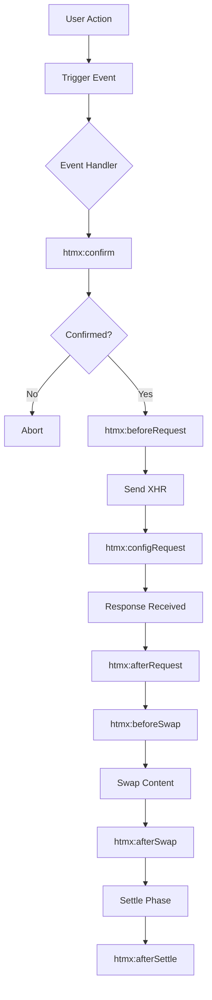

# Deep Dive: HTMX Event System

## Overview

HTMX has a comprehensive event system that fires events throughout the request lifecycle. This allows developers to hook into HTMX behavior, add custom logic, and integrate with other libraries. This deep dive explores every aspect of the HTMX event system.

## Event Architecture



## Event Lifecycle

### 1. Confirmation Phase

**Event:** `htmx:confirm`

Fired before a request is confirmed (e.g., before showing a confirmation dialog):

```javascript
document.body.addEventListener('htmx:confirm', function(evt) {
    // evt.detail question - the confirmation message
    // evt.detail question - can be modified
    
    // Custom confirmation logic
    if (evt.detail.question === 'Are you sure?') {
        // Show custom modal instead of browser confirm
        evt.preventDefault();
        showCustomConfirm(function(confirmed) {
            if (confirmed) {
                // Trigger the request manually
                htmx.trigger(evt.detail.elt, 'htmx:confirmed');
            }
        });
    }
});
```

### 2. Before Request Phase

**Event:** `htmx:beforeRequest`

Fired before the AJAX request is sent:

```javascript
document.body.addEventListener('htmx:beforeRequest', function(evt) {
    // evt.detail.xhr - XMLHttpRequest object
    // evt.detail.elt - triggering element
    // evt.detail.requestConfig - request configuration
    
    // Access request config
    var config = evt.detail.requestConfig;
    console.log('Requesting:', config.path);
    console.log('Method:', config.verb);
    
    // Cancel request
    if (shouldCancelRequest()) {
        evt.preventDefault();
    }
    
    // Add loading indicator
    evt.detail.elt.classList.add('loading');
});
```

### 3. Config Request Phase

**Event:** `htmx:configRequest`

Fired to allow last-minute modifications to the request:

```javascript
document.body.addEventListener('htmx:configRequest', function(evt) {
    // evt.detail.parameters - request parameters
    // evt.detail.headers - request headers
    // evt.detail.xhr - XMLHttpRequest object
    
    // Add CSRF token
    var csrfToken = document.querySelector('meta[name="csrf-token"]').content;
    evt.detail.headers['X-CSRF-Token'] = csrfToken;
    
    // Add custom header
    evt.detail.headers['X-Custom-Header'] = 'value';
    
    // Add parameters
    evt.detail.parameters['timestamp'] = Date.now();
    evt.detail.parameters['userAgent'] = navigator.userAgent;
    
    // Remove sensitive parameters
    delete evt.detail.parameters['password'];
});
```

### 4. After Request Phase

**Event:** `htmx:afterRequest`

Fired after the response is received (regardless of success):

```javascript
document.body.addEventListener('htmx:afterRequest', function(evt) {
    // evt.detail.xhr - XMLHttpRequest object
    // evt.detail.elt - triggering element
    // evt.detail.success - boolean indicating success
    
    // Remove loading indicator
    evt.detail.elt.classList.remove('loading');
    
    // Log request timing
    console.log('Request completed:', evt.detail.xhr.status);
    console.log('Duration:', performance.now() - requestStart);
    
    // Handle specific status codes
    switch (evt.detail.xhr.status) {
        case 200:
            console.log('Success!');
            break;
        case 401:
            console.log('Unauthorized - redirecting to login');
            window.location.href = '/login';
            break;
        case 403:
            console.log('Forbidden');
            break;
        case 500:
            console.log('Server error');
            break;
    }
});
```

### 5. Before Swap Phase

**Event:** `htmx:beforeSwap`

Fired before the response is swapped into the DOM:

```javascript
document.body.addEventListener('htmx:beforeSwap', function(evt) {
    // evt.detail.xhr - XMLHttpRequest object
    // evt.detail.elt - triggering element
    // evt.detail.target - target element
    // evt.detail.swapSpec - swap specification
    // evt.detail.shouldSwap - boolean (can be set to false)
    // evt.detail.serverResponse - response text
    // evt.detail.isError - boolean
    
    // Modify swap behavior based on status
    if (evt.detail.xhr.status === 422) {
        // Swap error response into error container
        evt.detail.target = document.getElementById('validation-errors');
        evt.detail.shouldSwap = true;
        evt.detail.isError = false; // Don't treat as error
    }
    
    // Prevent swap
    if (shouldPreventSwap()) {
        evt.detail.shouldSwap = false;
    }
    
    // Modify swap type
    if (evt.detail.xhr.getResponseHeader('HX-Reswap')) {
        evt.detail.swapSpec.swapStyle = 
            evt.detail.xhr.getResponseHeader('HX-Reswap');
    }
    
    // Log response
    console.log('Swapping response:', evt.detail.serverResponse.substring(0, 100));
});
```

### 6. After Swap Phase

**Event:** `htmx:afterSwap`

Fired after the response is swapped into the DOM:

```javascript
document.body.addEventListener('htmx:afterSwap', function(evt) {
    // evt.detail.xhr - XMLHttpRequest object
    // evt.detail.elt - triggering element
    // evt.detail.target - target element
    // evt.detail.serverResponse - response text
    
    // Initialize new content
    initializeWidgets(evt.detail.target);
    
    // Trigger notifications
    var notification = evt.detail.xhr.getResponseHeader('HX-Trigger-After-Swap');
    if (notification) {
        showToast(notification);
    }
    
    // Analytics tracking
    trackEvent('content_updated', {
        target: evt.detail.target.id,
        responseLength: evt.detail.serverResponse.length
    });
});
```

### 7. After Settle Phase

**Event:** `htmx:afterSettle`

Fired after the settle phase (scroll, focus, etc.):

```javascript
document.body.addEventListener('htmx:afterSettle', function(evt) {
    // evt.detail.xhr - XMLHttpRequest object
    // evt.detail.elt - triggering element
    // evt.detail.target - target element
    
    // Final adjustments
    fixLayout(evt.detail.target);
    
    // Focus management
    var autoFocus = evt.detail.target.querySelector('[autofocus]');
    if (autoFocus) {
        autoFocus.focus();
    }
    
    // Announce to screen readers
    announceToScreenReader('Content updated');
});
```

## Error Events

### Send Error

**Event:** `htmx:sendError`

Fired when a network error occurs:

```javascript
document.body.addEventListener('htmx:sendError', function(evt) {
    // evt.detail.xhr - XMLHttpRequest object
    // evt.detail.elt - triggering element
    
    // Show error to user
    showError('Network error. Please check your connection.');
    
    // Log error
    logError('HTMX network error', {
        element: evt.detail.elt.id,
        url: evt.detail.xhr.responseURL
    });
    
    // Retry logic
    var retryCount = htmx.getPrivateProperty(evt.detail.elt, 'retry-count') || 0;
    if (retryCount < 3) {
        htmx.setPrivateProperty(evt.detail.elt, 'retry-count', retryCount + 1);
        setTimeout(function() {
            evt.detail.elt.click();
        }, 1000 * (retryCount + 1));
    }
});
```

### Send Abort

**Event:** `htmx:sendAbort`

Fired when a request is aborted:

```javascript
document.body.addEventListener('htmx:sendAbort', function(evt) {
    console.log('Request aborted for element:', evt.detail.elt.id);
    
    // Clean up loading state
    evt.detail.elt.classList.remove('loading');
});
```

### Timeout

**Event:** `htmx:timeout`

Fired when a request times out:

```javascript
document.body.addEventListener('htmx:timeout', function(evt) {
    // evt.detail.xhr - XMLHttpRequest object
    // evt.detail.elt - triggering element
    
    // Show timeout message
    showToast('Request timed out. Please try again.');
    
    // Retry with longer timeout
    evt.detail.xhr.timeout = evt.detail.xhr.timeout * 2;
    evt.detail.elt.click();
});
```

### Response Error

**Event:** `htmx:responseError`

Fired when server returns an error status:

```javascript
document.body.addEventListener('htmx:responseError', function(evt) {
    // evt.detail.xhr - XMLHttpRequest object
    // evt.detail.elt - triggering element
    // evt.detail.error - error details
    
    var status = evt.detail.xhr.status;
    
    switch (status) {
        case 400:
            showBadRequest(evt.detail.xhr.responseText);
            break;
        case 401:
            // Redirect to login
            window.location.href = '/login?redirect=' + 
                encodeURIComponent(window.location.href);
            break;
        case 403:
            showForbidden();
            break;
        case 404:
            showNotFound();
            break;
        case 422:
            // Validation errors
            var errors = JSON.parse(evt.detail.xhr.responseText);
            displayValidationErrors(errors);
            break;
        case 500:
            showServerError();
            break;
    }
    
    // Log to error tracking service
    trackError({
        status: status,
        url: evt.detail.xhr.responseURL,
        element: evt.detail.elt.id
    });
});
```

## Custom Events from Server

The server can trigger client-side events via the `HX-Trigger` header:

```javascript
// Server response header:
// HX-Trigger: notification

document.body.addEventListener('notification', function(evt) {
    // evt.detail contains any data from server
    console.log('Server triggered notification:', evt.detail);
    showToast(evt.detail.message);
});
```

### Multiple Events

```javascript
// Server response header:
// HX-Trigger: notification,refresh-list

document.body.addEventListener('notification', function(evt) {
    showToast(evt.detail.message);
});

document.body.addEventListener('refresh-list', function(evt) {
    // Refresh the list
    htmx.ajax('GET', '/api/list', { target: '#list' });
});
```

### Events with Details

```javascript
// Server response header:
// HX-Trigger: {"user-created":{"id":123,"name":"John"}}

document.body.addEventListener('user-created', function(evt) {
    console.log('User created:', evt.detail.id, evt.detail.name);
    // Show: User created: 123 John
});
```

### After Settle/After Swap Events

```javascript
// Server response header:
// HX-Trigger-After-Settle: settled-event
// HX-Trigger-After-Swap: swapped-event

document.body.addEventListener('settled-event', function(evt) {
    // Fired after settle phase
    console.log('Content settled');
});

document.body.addEventListener('swapped-event', function(evt) {
    // Fired after swap phase
    console.log('Content swapped');
});
```

## Custom Event Handlers with hx-on

The `hx-on` attribute allows inline event handling:

```html
<!-- Handle HTMX events inline -->
<button 
    hx-post="/api/like"
    hx-on:htmx:before-request="this.classList.add('loading')"
    hx-on:htmx:after-request="this.classList.remove('loading')"
    hx-on:htmx:after-swap="this.classList.add('liked')">
    Like
</button>

<!-- Multiple events -->
<div hx-on="
    htmx:before-request: console.log('Starting...');
    htmx:after-request: console.log('Done!');
">
    Content
</div>

<!-- With event parameter -->
<button 
    hx-post="/api/data"
    hx-on:htmx:after-request="console.log(event.detail.xhr.status)">
    Load Data
</button>
```

## Event Utilities

### Triggering Custom Events

```javascript
// Trigger HTMX event
htmx.trigger(element, 'custom-event', { data: 'value' });

// Trigger HTMX ajax request
htmx.ajax('GET', '/api/data', {
    target: '#content',
    swap: 'innerHTML',
    source: element
});
```

### Finding Elements

```javascript
// Query with HTMX extensions
var elt = htmx.querySelectorExt('#my-element');
var elts = htmx.querySelectorAllExt('.my-class');

// Get closest matching element
var closest = htmx.closest(elt, '.container');

// Get values from element
var values = htmx.getValues(elt);
```

### Working with Classes

```javascript
// Add class during request
element.classList.add('htmx-request');

// Remove class after request
element.classList.remove('htmx-request');

// Toggle class
element.classList.toggle('active');
```

## Event Bus Pattern

Use HTMX events as a simple event bus:

```javascript
// Publish event
document.body.addEventListener('htmx:afterSwap', function(evt) {
    htmx.trigger(document.body, 'app:contentUpdated', {
        section: evt.detail.target.id
    });
});

// Subscribe to event
document.body.addEventListener('app:contentUpdated', function(evt) {
    console.log('Section updated:', evt.detail.section);
    updateNavigation();
});
```

## Integration with Frameworks

### React Integration

```javascript
// Initialize React components in HTMX content
document.body.addEventListener('htmx:afterSwap', function(evt) {
    var reactRoots = evt.detail.target.querySelectorAll('[data-react]');
    reactRoots.forEach(function(root) {
        var componentName = root.dataset.react;
        var props = JSON.parse(root.dataset.props || '{}');
        ReactDOM.render(
            React.createElement(window[componentName], props),
            root
        );
    });
});
```

### Vue Integration

```javascript
// Initialize Vue components
document.body.addEventListener('htmx:afterSwap', function(evt) {
    var vueEls = evt.detail.target.querySelectorAll('[data-vue]');
    vueEls.forEach(function(el) {
        var componentName = el.dataset.vue;
        new Vue({
            render: h => h(window[componentName])
        }).$mount(el);
    });
});
```

### Alpine.js Integration

```javascript
// Initialize Alpine
document.body.addEventListener('htmx:afterSwap', function(evt) {
    Alpine.initRoot(evt.detail.target);
});
```

## Debugging Events

### Event Logger

```javascript
// Log all HTMX events
['htmx:confirm', 'htmx:beforeRequest', 'htmx:afterRequest',
 'htmx:beforeSwap', 'htmx:afterSwap', 'htmx:afterSettle',
 'htmx:sendError', 'htmx:sendAbort', 'htmx:timeout'].forEach(function(eventName) {
    document.body.addEventListener(eventName, function(evt) {
        console.group(eventName);
        console.log('Element:', evt.detail.elt);
        console.log('Detail:', evt.detail);
        console.groupEnd();
    });
});
```

### Event Inspector

```html
<!-- Add event inspector to page -->
<script>
htmx.logAll();
</script>

<!-- Or with custom logger -->
<script>
htmx.logger = function(elt, event, data) {
    if (console.debug) {
        console.debug(event, elt, data);
    }
};
</script>
```

## Examples

### Progress Indicator

```html
<div id="progress-container">
    <div id="progress-bar" style="width: 0%"></div>
</div>

<button hx-get="/api/large-file"
        hx-on:htmx:before-request="showProgress()"
        hx-on:htmx:after-request="hideProgress()">
    Download
</button>

<script>
function showProgress() {
    var bar = document.getElementById('progress-bar');
    bar.style.display = 'block';
    bar.style.width = '0%';
    
    var interval = setInterval(function() {
        var width = parseFloat(bar.style.width);
        if (width < 90) {
            bar.style.width = (width + 10) + '%';
        }
    }, 200);
    
    document.body.addEventListener('htmx:afterRequest', function() {
        clearInterval(interval);
        bar.style.width = '100%';
        setTimeout(function() {
            bar.style.display = 'none';
        }, 500);
    }, { once: true });
}
</script>
```

### Undo Feature

```html
<div id="items">
    <div id="item-1">
        Item 1
        <button hx-delete="/api/items/1"
                hx-swap="outerHTML"
                hx-on:htmx:after-request="showUndo(1)">
            Delete
        </button>
    </div>
</div>

<div id="undo-container" style="display: none">
    Deleted item <span id="undo-item-id"></span>.
    <button onclick="undoDelete()">Undo</button>
</div>

<script>
var deletedItem = null;

function showUndo(itemId) {
    deletedItem = itemId;
    document.getElementById('undo-item-id').textContent = itemId;
    document.getElementById('undo-container').style.display = 'block';
    
    setTimeout(function() {
        if (deletedItem) {
            location.reload(); // Too late to undo
        }
    }, 5000);
}

function undoDelete() {
    if (deletedItem) {
        htmx.ajax('POST', '/api/items/' + deletedItem + '/restore', {
            target: '#items'
        });
        deletedItem = null;
        document.getElementById('undo-container').style.display = 'none';
    }
}
</script>
```

### Optimistic UI

```html
<button id="like-btn"
        hx-post="/api/like"
        hx-swap="none"
        hx-on:htmx:before-request="optimisticUpdate()"
        hx-on:htmx:response-error="revertUpdate()">
    Like
</button>

<script>
var originalState = null;

function optimisticUpdate() {
    var btn = document.getElementById('like-btn');
    originalState = btn.innerHTML;
    btn.innerHTML = '❤️ Liked';
    btn.classList.add('liked');
}

function revertUpdate() {
    var btn = document.getElementById('like-btn');
    btn.innerHTML = originalState;
    btn.classList.remove('liked');
    showToast('Failed to like. Please try again.');
}
</script>
```

## Conclusion

The HTMX event system provides comprehensive hooks into the request lifecycle:

1. **Lifecycle events**: confirm, beforeRequest, afterRequest, beforeSwap, afterSwap, afterSettle
2. **Error events**: sendError, sendAbort, timeout, responseError
3. **Server-triggered events**: HX-Trigger header
4. **Custom handlers**: hx-on attribute
5. **Utilities**: trigger, ajax, querySelectorExt
6. **Framework integration**: React, Vue, Alpine.js
