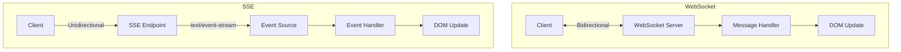
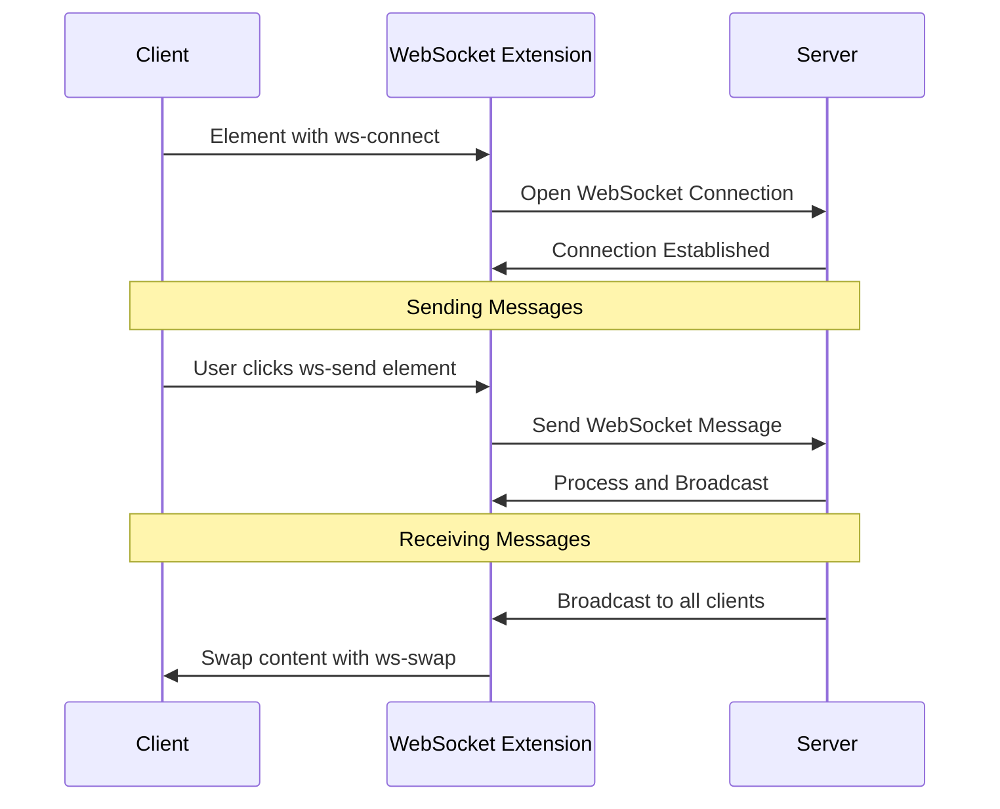
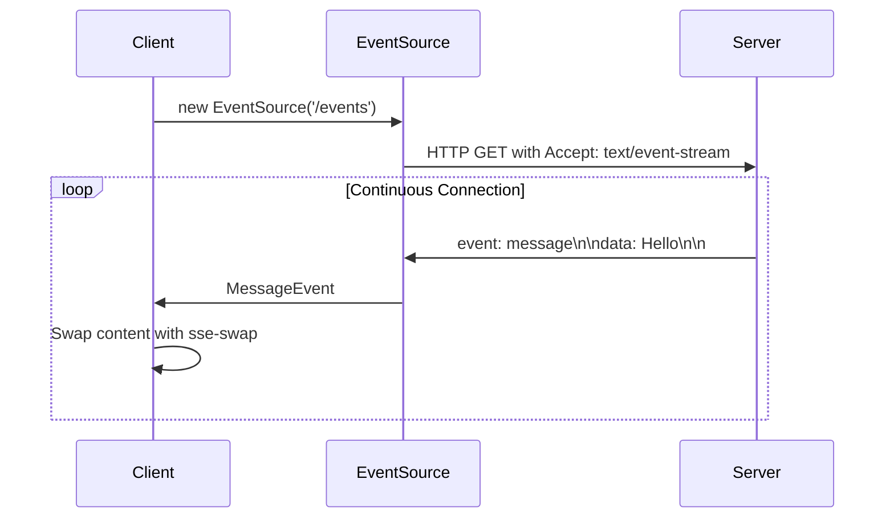

# Deep Dive: WebSocket and Server-Sent Events

## Overview

HTMX provides extensions for real-time communication via WebSockets and Server-Sent Events (SSE). This deep dive explores how these extensions work, their architecture, implementation details, and how to build production-grade real-time features.

## Architecture Comparison



| Feature | WebSocket | SSE |
|---------|-----------|-----|
| Direction | Bidirectional | Unidirectional (server→client) |
| Protocol | ws://, wss:// | http://, https:// |
| Data Format | Binary or Text | Text only |
| Browser Support | All modern | All modern (not IE) |
| Use Case | Chat, games, collaboration | Notifications, feeds, updates |

## WebSocket Extension

### Installation

```html
<script src="https://unpkg.com/htmx.org/dist/ext/ws.js"></script>
```

### Basic Usage

```html
<div hx-ext="ws" ws-connect="/ws">
    <!-- All elements inside can use ws-send and ws-swap -->
    <input name="message" placeholder="Type...">
    <button ws-send>Send</button>
    <div id="messages"></div>
</div>
```

### WebSocket Architecture



### WebSocket Implementation

```javascript
/**
 * WebSocket Extension Core
 */
htmx.defineExtension('ws', {
    init: function(api) {
        // Store connection
        this.socket = null;
        this.messageQueue = [];
        this.reconnectAttempts = 0;
        this.maxReconnectAttempts = 10;
        this.reconnectDelay = 1000;
    },
    
    onEvent: function(name, evt) {
        if (name === 'htmx:load') {
            // Initialize WebSocket connections
            var connectElements = 
                document.querySelectorAll('[ws-connect]');
            connectElements.forEach(function(elt) {
                this.initWebSocket(elt);
            }, this);
        }
    },
    
    initWebSocket: function(elt) {
        var url = elt.getAttribute('ws-connect');
        
        // Create WebSocket
        var socket = new WebSocket(url);
        
        socket.onopen = function() {
            console.log('WebSocket connected');
            htmx.trigger(elt, 'ws:open', { socket: socket });
            
            // Send queued messages
            this.messageQueue.forEach(function(msg) {
                socket.send(msg);
            });
            this.messageQueue = [];
        }.bind(this);
        
        socket.onmessage = function(event) {
            this.handleMessage(elt, event.data);
        }.bind(this);
        
        socket.onerror = function() {
            console.error('WebSocket error');
            htmx.trigger(elt, 'ws:error', { socket: socket });
        };
        
        socket.onclose = function(event) {
            console.log('WebSocket closed');
            htmx.trigger(elt, 'ws:close', { 
                socket: socket, 
                code: event.code,
                reason: event.reason 
            });
            
            // Attempt reconnect
            if (!event.wasClean && 
                this.reconnectAttempts < this.maxReconnectAttempts) {
                
                setTimeout(function() {
                    this.reconnectAttempts++;
                    this.initWebSocket(elt);
                }.bind(this), this.reconnectDelay * this.reconnectAttempts);
            }
        }.bind(this);
        
        // Store socket on element
        htmx.setPrivateProperty(elt, 'ws-socket', socket);
    },
    
    handleMessage: function(elt, data) {
        // Parse message
        var message = JSON.parse(data);
        
        // Check for swap target
        if (message.target) {
            var target = document.getElementById(message.target);
            if (target) {
                htmx.swap(target, message.html, {
                    swapStyle: message.swap || 'innerHTML'
                });
            }
        }
        
        // Trigger custom event
        if (message.event) {
            htmx.trigger(elt, message.event, message.detail);
        }
    },
    
    sendMessage: function(elt, data) {
        var socket = htmx.getPrivateProperty(elt, 'ws-socket');
        
        if (socket && socket.readyState === WebSocket.OPEN) {
            socket.send(JSON.stringify(data));
        } else {
            // Queue for later
            this.messageQueue.push(JSON.stringify(data));
        }
    }
});
```

### ws-connect Attribute

Establishes a WebSocket connection:

```html
<!-- Basic connection -->
<div ws-connect="/ws">
    Content
</div>

<!-- Connection with reconnection -->
<div ws-connect="/ws" ws-reconnect="true">
    Content
</div>

<!-- Connection with specific reconnection delay -->
<div ws-connect="/ws" ws-reconnect-delay="5000">
    Content
</div>
```

### ws-send Attribute

Sends data through the WebSocket:

```html
<!-- Send on click -->
<button ws-send>Send</button>

<!-- Send with specific trigger -->
<input ws-send ws-trigger="keyup[key=='Enter']">

<!-- Send with custom data -->
<button ws-send ws-data='{"type": "subscribe", "channel": "updates"}'>
    Subscribe
</button>

<!-- Send form data -->
<form ws-send>
    <input name="message">
    <button type="submit">Send</button>
</form>
```

### ws-swap Attribute

Specifies how to swap incoming messages:

```html
<!-- Swap by message type -->
<div ws-swap="new-message">
    Messages appear here
</div>

<!-- Multiple swap targets -->
<div ws-swap="user-joined">
    User joined notifications
</div>
<div ws-swap="user-left">
    User left notifications
</div>
```

### Chat Example

```html
<div hx-ext="ws" ws-connect="/ws/chat">
    <!-- Connection status -->
    <div id="status" 
         ws-swap="connection-status"
         class="connected">
        Connected
    </div>
    
    <!-- Message history -->
    <div id="messages" 
         ws-swap="message" 
         hx-swap="beforeend">
    </div>
    
    <!-- Message input -->
    <form ws-send ws-data='{"type": "message"}'>
        <input name="text" placeholder="Type..." autocomplete="off">
        <button type="submit">Send</button>
    </form>
    
    <!-- User list -->
    <div id="users" ws-swap="user-list">
    </div>
</div>

<script>
// Handle connection status
document.body.addEventListener('ws:open', function() {
    document.getElementById('status').className = 'connected';
    document.getElementById('status').textContent = 'Connected';
});

document.body.addEventListener('ws:close', function() {
    document.getElementById('status').className = 'disconnected';
    document.getElementById('status').textContent = 'Disconnected';
});
</script>
```

### Server Message Format

```javascript
// Server sends JSON messages
{
    "target": "messages",      // Element ID to swap
    "html": "<div>New message</div>",  // HTML to insert
    "swap": "beforeend",       // Swap style (optional)
    "event": "message-received" // Event to trigger (optional)
}
```

## Server-Sent Events Extension

### Installation

```html
<script src="https://unpkg.com/htmx.org/dist/ext/sse.js"></script>
```

### Basic Usage

```html
<div hx-ext="sse" sse-connect="/events">
    <div sse-swap="message">
        Messages appear here
    </div>
</div>
```

### SSE Architecture



### SSE Implementation

```javascript
/**
 * SSE Extension Core
 */
htmx.defineExtension('sse', {
    init: function(api) {
        this.sources = {};
    },
    
    onEvent: function(name, evt) {
        if (name === 'htmx:load') {
            var connectElements = 
                document.querySelectorAll('[sse-connect]');
            connectElements.forEach(function(elt) {
                this.initSSE(elt);
            }, this);
        }
        
        if (name === 'htmx:unload') {
            // Close all connections
            for (var url in this.sources) {
                this.sources[url].close();
            }
        }
    },
    
    initSSE: function(elt) {
        var url = elt.getAttribute('sse-connect');
        
        if (this.sources[url]) {
            return; // Already connected
        }
        
        // Create EventSource
        var source = new EventSource(url);
        
        source.onopen = function() {
            console.log('SSE connection opened');
            htmx.trigger(elt, 'sse:open', { source: source });
        };
        
        source.onerror = function(event) {
            console.error('SSE connection error');
            htmx.trigger(elt, 'sse:error', { source: source });
            
            if (source.readyState === EventSource.CLOSED) {
                // Connection closed, attempt reconnect
                delete this.sources[url];
                setTimeout(function() {
                    this.initSSE(elt);
                }.bind(this), 3000);
            }
        }.bind(this);
        
        this.sources[url] = source;
        
        // Find all sse-swap elements
        var swapElements = elt.querySelectorAll('[sse-swap]');
        swapElements.forEach(function(swapElt) {
            var eventName = swapElt.getAttribute('sse-swap');
            
            source.addEventListener(eventName, function(event) {
                var data = event.data;
                
                // Swap content
                htmx.swap(swapElt, data, {
                    swapStyle: swapElt.getAttribute('hx-swap') || 'innerHTML'
                });
                
                // Trigger custom event
                htmx.trigger(swapElt, 'sse:message', {
                    eventName: eventName,
                    data: data
                });
            });
        });
    }
});
```

### sse-connect Attribute

Establishes an SSE connection:

```html
<!-- Basic connection -->
<div sse-connect="/events">
    Content
</div>

<!-- Connection to specific endpoint -->
<div sse-connect="/api/notifications/stream">
    Content
</div>
```

### sse-swap Attribute

Specifies which events to swap:

```html
<!-- Swap on specific event type -->
<div sse-swap="notification">
    Notifications appear here
</div>

<!-- Swap with different event types -->
<div sse-swap="user-joined">
    User joined
</div>
<div sse-swap="user-left">
    User left
</div>
<div sse-swap="message">
    Messages
</div>
```

### sse-send Attribute

Sends data to SSE endpoint (if server supports POST):

```html
<!-- Send on click -->
<button sse-send>Send</button>

<!-- Send with form -->
<form sse-send="/api/events">
    <input name="data">
    <button type="submit">Send Event</button>
</form>
```

### Notification Example

```html
<div hx-ext="sse" sse-connect="/api/notifications">
    <!-- Unread count -->
    <span id="unread-count" sse-swap="unread">0</span>
    
    <!-- Notification list -->
    <div id="notifications" 
         sse-swap="notification" 
         hx-swap="afterbegin">
    </div>
    
    <!-- System messages -->
    <div id="system" sse-swap="system-message">
    </div>
</div>
```

## Server-Side Implementation

### Node.js WebSocket Server

```javascript
const WebSocket = require('ws');
const wss = new WebSocket.Server({ port: 8080 });

wss.on('connection', function connection(ws) {
    console.log('Client connected');
    
    ws.on('message', function incoming(message) {
        const data = JSON.parse(message);
        console.log('Received:', data);
        
        // Broadcast to all clients
        wss.clients.forEach(function each(client) {
            if (client !== ws && client.readyState === WebSocket.OPEN) {
                client.send(JSON.stringify({
                    target: 'messages',
                    html: `<div>${data.text}</div>`,
                    swap: 'beforeend'
                }));
            }
        });
    });
    
    ws.on('close', function() {
        console.log('Client disconnected');
        
        // Notify others
        wss.clients.forEach(function each(client) {
            if (client.readyState === WebSocket.OPEN) {
                client.send(JSON.stringify({
                    event: 'user-left',
                    detail: { timestamp: Date.now() }
                }));
            }
        });
    });
    
    // Send welcome
    ws.send(JSON.stringify({
        event: 'user-joined',
        detail: { timestamp: Date.now() }
    }));
});
```

### Node.js SSE Server

```javascript
const express = require('express');
const app = express();

// Store clients
const clients = new Set();

app.get('/api/notifications', (req, res) => {
    // SSE headers
    res.setHeader('Content-Type', 'text/event-stream');
    res.setHeader('Cache-Control', 'no-cache');
    res.setHeader('Connection', 'keep-alive');
    res.setHeader('X-Accel-Buffering', 'no');
    
    // Add client
    clients.add(res);
    
    // Send initial message
    res.write(`event: welcome\ndata: ${JSON.stringify({ message: 'Connected' })}\n\n`);
    
    // Handle disconnect
    req.on('close', () => {
        clients.delete(res);
    });
});

// Send notification to all clients
function broadcast(eventType, data) {
    clients.forEach(client => {
        client.write(`event: ${eventType}\ndata: ${JSON.stringify(data)}\n\n`);
    });
}

// Example: Send notification
app.post('/api/notify', (req, res) => {
    broadcast('notification', req.body);
    res.sendStatus(200);
});
```

### Go WebSocket Server

```go
package main

import (
    "github.com/gorilla/websocket"
    "net/http"
)

var upgrader = websocket.Upgrader{
    ReadBufferSize:  1024,
    WriteBufferSize: 1024,
}

var clients = make(map[*websocket.Conn]bool)

func handleWebSocket(w http.ResponseWriter, r *http.Request) {
    conn, _ := upgrader.Upgrade(w, r, nil)
    clients[conn] = true
    
    defer func() {
        delete(clients, conn)
        conn.Close()
    }()
    
    for {
        var msg map[string]interface{}
        err := conn.ReadJSON(&msg)
        if err != nil {
            break
        }
        
        // Broadcast to all clients
        for client := range clients {
            client.WriteJSON(map[string]interface{}{
                "target": "messages",
                "html": msg["text"],
                "swap": "beforeend",
            })
        }
    }
}

func main() {
    http.HandleFunc("/ws", handleWebSocket)
    http.ListenAndServe(":8080", nil)
}
```

### Python SSE Server (FastAPI)

```python
from fastapi import FastAPI, Request
from starlette.responses import StreamingResponse
import asyncio
import json

app = FastAPI()

clients = set()

@app.get("/api/events")
async def sse_endpoint(request: Request):
    async def event_generator():
        queue = asyncio.Queue()
        clients.add(queue)
        
        try:
            while True:
                if not await request.is_disconnected():
                    event = await queue.get()
                    yield f"event: {event['type']}\ndata: {json.dumps(event['data'])}\n\n"
                else:
                    break
        finally:
            clients.discard(queue)
    
    return StreamingResponse(
        event_generator(),
        media_type="text/event-stream",
        headers={
            "Cache-Control": "no-cache",
            "Connection": "keep-alive",
        }
    )

async def broadcast(event_type: str, data: dict):
    for queue in clients:
        await queue.put({"type": event_type, "data": data})
```

## Examples

### Collaborative Document

```html
<div hx-ext="ws" ws-connect="/ws/document/123">
    <!-- Document content -->
    <div id="doc-content" 
         contenteditable="true"
         ws-send
         ws-trigger="keyup changed delay:500ms"
         ws-data='{"type": "edit", "content": this.innerText}'>
    </div>
    
    <!-- Cursors -->
    <div id="cursors" ws-swap="cursor">
    </div>
    
    <!-- Collaborators -->
    <div id="collaborators" ws-swap="collaborators">
    </div>
</div>
```

### Live Dashboard

```html
<div hx-ext="sse" sse-connect="/api/dashboard/stream">
    <!-- Metrics -->
    <div class="metric" sse-swap="metric-update">
        <span class="value">0</span>
    </div>
    
    <!-- Alerts -->
    <div id="alerts" 
         sse-swap="alert" 
         hx-swap="beforebegin">
    </div>
    
    <!-- Activity feed -->
    <div id="activity" 
         sse-swap="activity" 
         hx-swap="afterbegin">
    </div>
    
    <!-- Chart data -->
    <canvas id="chart" sse-swap="chart-data">
    </canvas>
</div>
```

### Real-time Form Collaboration

```html
<div hx-ext="ws" ws-connect="/ws/form/contact">
    <form>
        <label>
            Name:
            <input name="name" 
                   ws-send 
                   ws-trigger="keyup"
                   ws-data='{"field": "name", "value": this.value}'>
        </label>
        
        <label>
            Email:
            <input name="email"
                   ws-send
                   ws-trigger="keyup"
                   ws-data='{"field": "email", "value": this.value}'>
        </label>
        
        <!-- Show other editors -->
        <div id="editors" ws-swap="editing">
            <span class="editing">John is editing...</span>
        </div>
    </form>
</div>
```

## Performance Considerations

### 1. Connection Management

```javascript
// Reuse connections
var connections = {};

function getConnection(url) {
    if (!connections[url]) {
        connections[url] = new WebSocket(url);
    }
    return connections[url];
}

// Clean up on page unload
window.addEventListener('beforeunload', function() {
    for (var url in connections) {
        connections[url].close();
    }
});
```

### 2. Message Batching

```javascript
// Batch messages before sending
var messageQueue = [];
var batchDelay = 100;

function queueMessage(msg) {
    messageQueue.push(msg);
    
    if (!batchTimeout) {
        batchTimeout = setTimeout(function() {
            sendMessage(messageQueue);
            messageQueue = [];
            batchTimeout = null;
        }, batchDelay);
    }
}
```

### 3. Throttling Updates

```javascript
// Throttle incoming updates
var lastUpdate = 0;
var throttleMs = 100;

source.addEventListener('update', function(event) {
    var now = Date.now();
    if (now - lastUpdate < throttleMs) {
        return; // Skip update
    }
    lastUpdate = now;
    
    // Process update
    updateContent(event.data);
});
```

## Conclusion

HTMX WebSocket and SSE extensions enable real-time features:

1. **WebSocket**: Bidirectional, low-latency communication
2. **SSE**: Simple, unidirectional server-push
3. **Extensions**: Easy to install and use
4. **Attributes**: ws-connect, ws-send, ws-swap, sse-connect, sse-swap
5. **Server implementations**: Node.js, Go, Python examples
6. **Performance**: Connection reuse, batching, throttling
