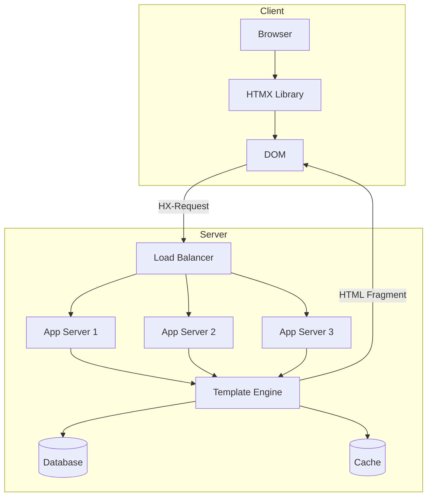
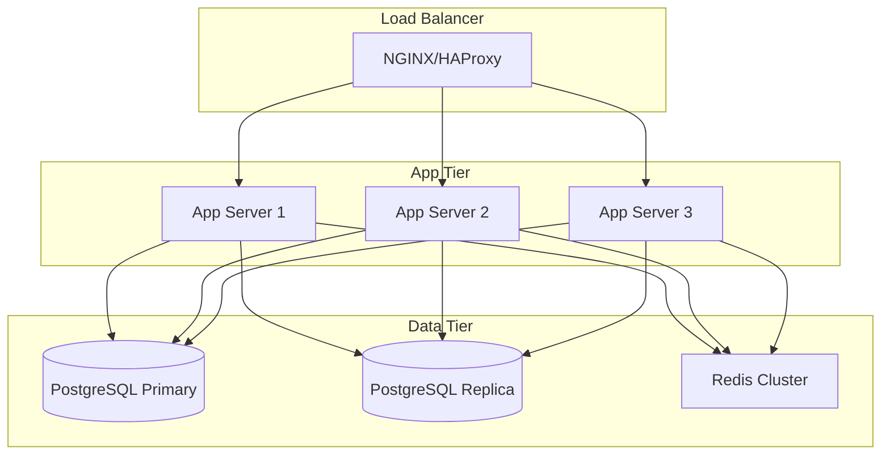

# Production-Grade HTMX: Building for Scale

## Overview

This guide covers what it takes to build production-grade applications using HTMX or HTMX-like libraries. We cover architecture patterns, operational concerns, security, and scaling strategies for hypermedia-driven web applications.

---

## Part 1: Architecture Patterns

### 1.1 Hypermedia-Driven Architecture



### 1.2 Fragment-Based Rendering

Unlike traditional SSR that renders full pages, HTMX applications render fragments:

```rust
// Full page render (traditional)
async fn user_page(user_id: String) -> Result<Html> {
    let user = db.get_user(&user_id).await?;
    let posts = db.get_posts(&user_id).await?;
    let sidebar = get_sidebar().await?;
    
    Ok(html! {
        <html>
            <head><title>User Profile</title></head>
            <body>
                {sidebar}
                <main>
                    <h1>{user.name}</h1>
                    {posts}
                </main>
            </body>
        </html>
    })
}

// Fragment render (HTMX-style)
async fn user_profile_fragment(user_id: String) -> Result<Html> {
    let user = db.get_user(&user_id).await?;
    
    Ok(html! {
        <div id="user-profile">
            <h1>{user.name}</h1>
            <p>{user.email}</p>
        </div>
    })
}

async fn user_posts_fragment(user_id: String, page: u32) -> Result<Html> {
    let posts = db.get_posts(&user_id, page).await?;
    
    Ok(html! {
        <ul id="posts-list">
            for post in posts {
                <li>{post.title}</li>
            }
        </ul>
    })
}
```

### 1.3 Backend Structure for HTMX

```
src/
├── handlers/
│   ├── pages/           # Full page renders
│   │   ├── mod.rs
│   │   ├── home.rs
│   │   └── dashboard.rs
│   └── fragments/       # HTMX fragment renders
│       ├── mod.rs
│       ├── users.rs
│       ├── posts.rs
│       └── forms.rs
├── templates/
│   ├── layouts/         # Full page layouts
│   │   ├── base.html
│   │   └── admin.html
│   └── fragments/       # Reusable fragments
│       ├── users/
│       ├── posts/
│       └── forms/
├── components/          # Template components
│   ├── mod.rs
│   ├── button.rs
│   └── modal.rs
└── lib.rs
```

---

## Part 2: Backend Integration

### 2.1 Go Implementation

```go
package main

import (
    "html/template"
    "net/http"
    "github.com/gorilla/mux"
)

type Handler struct {
    templates *template.Template
}

func NewHandler() *Handler {
    tmpl := template.Must(template.ParseGlob("templates/**/*.html"))
    return &Handler{templates: tmpl}
}

// Full page render
func (h *Handler) DashboardPage(w http.ResponseWriter, r *http.Request) {
    data := DashboardData{
        Title: "Dashboard",
        User:  getCurrentUser(r),
    }
    
    // Check if HTMX request
    if r.Header.Get("HX-Request") == "true" {
        // Render fragment only
        h.templates.ExecuteTemplate(w, "fragments/dashboard-content.html", data)
    } else {
        // Render full page
        h.templates.ExecuteTemplate(w, "pages/dashboard.html", data)
    }
}

// Fragment endpoint
func (h *Handler) UserListFragment(w http.ResponseWriter, r *http.Request) {
    users, err := getUsersFromDB()
    if err != nil {
        http.Error(w, "Failed to load users", http.StatusInternalServerError)
        return
    }
    
    data := UserListData{Users: users}
    h.templates.ExecuteTemplate(w, "fragments/users/list.html", data)
}

// Form submission with validation
func (h *Handler) CreateUserFragment(w http.ResponseWriter, r *http.Request) {
    if r.Method != http.MethodPost {
        http.Error(w, "Method not allowed", http.StatusMethodNotAllowed)
        return
    }
    
    name := r.FormValue("name")
    email := r.FormValue("email")
    
    // Validate
    errors := validateUser(name, email)
    if len(errors) > 0 {
        // Return validation errors
        w.Header().Set("HX-Reswap", "innerHTML")
        data := FormData{
            Errors: errors,
            Values: map[string]string{
                "name":  name,
                "email": email,
            },
        }
        h.templates.ExecuteTemplate(w, "fragments/users/form.html", data)
        return
    }
    
    // Create user
    user, err := createUser(name, email)
    if err != nil {
        http.Error(w, "Failed to create user", http.StatusInternalServerError)
        return
    }
    
    // Return success - swap outerHTML to remove form
    w.Header().Set("HX-Trigger", "user-created")
    data := UserCard{User: user}
    h.templates.ExecuteTemplate(w, "fragments/users/card.html", data)
}

func main() {
    h := NewHandler()
    
    r := mux.NewRouter()
    r.HandleFunc("/", h.DashboardPage)
    r.HandleFunc("/users", h.UserListFragment)
    r.HandleFunc("/users/create", h.CreateUserFragment).Methods("POST")
    
    http.ListenAndServe(":8080", r)
}
```

### 2.2 Python (FastAPI) Implementation

```python
from fastapi import FastAPI, Request, Form, HTTPException
from fastapi.responses import HTMLResponse
from fastapi.templating import Jinja2Templates
from pydantic import BaseModel

app = FastAPI()
templates = Jinja2Templates(directory="templates")

class UserData(BaseModel):
    name: str
    email: str

@app.get("/", response_class=HTMLResponse)
async def dashboard_page(request: Request):
    """Full page render"""
    return templates.TemplateResponse(
        "pages/dashboard.html",
        {"request": request, "user": get_current_user()}
    )

@app.get("/users", response_class=HTMLResponse)
async def user_list_fragment(request: Request):
    """HTMX fragment - user list"""
    users = await get_users()
    return templates.TemplateResponse(
        "fragments/users/list.html",
        {"request": request, "users": users}
    )

@app.post("/users/create", response_class=HTMLResponse)
async def create_user_fragment(
    request: Request,
    name: str = Form(...),
    email: str = Form(...)
):
    """HTMX form submission"""
    # Validate
    errors = validate_user_data(name, email)
    
    if errors:
        # Return form with errors
        response = templates.TemplateResponse(
            "fragments/users/form.html",
            {"request": request, "errors": errors, "values": {"name": name, "email": email}}
        )
        response.headers["HX-Reswap"] = "innerHTML"
        return response
    
    # Create user
    user = await create_user_in_db(name, email)
    
    # Return success
    response = templates.TemplateResponse(
        "fragments/users/card.html",
        {"request": request, "user": user}
    )
    response.headers["HX-Trigger"] = "user-created"
    return response

@app.get("/users/{user_id}/edit", response_class=HTMLResponse)
async def edit_user_form(request: Request, user_id: int):
    """Click to edit pattern"""
    user = await get_user(user_id)
    return templates.TemplateResponse(
        "fragments/users/edit_form.html",
        {"request": request, "user": user}
    )

@app.put("/users/{user_id}", response_class=HTMLResponse)
async def update_user(
    request: Request,
    user_id: int,
    name: str = Form(...),
    email: str = Form(...)
):
    """Update user and return display mode"""
    user = await update_user_in_db(user_id, name, email)
    return templates.TemplateResponse(
        "fragments/users/display.html",
        {"request": request, "user": user}
    )
```

### 2.3 Rust (Axum) Implementation

```rust
use axum::{
    extract::{Path, Form},
    http::HeaderMap,
    response::{Html, IntoResponse},
    routing::{get, post},
    Router,
};
use askama::Template;
use serde::Deserialize;

#[derive(Template)]
#[template(path = "fragments/users/list.html")]
struct UserListTemplate {
    users: Vec<User>,
}

#[derive(Template)]
#[template(path = "fragments/users/form.html")]
struct UserFormTemplate {
    errors: Vec<String>,
    values: Option<UserData>,
}

#[derive(Template)]
#[template(path = "fragments/users/card.html")]
struct UserCardTemplate {
    user: User,
}

async fn dashboard_page(headers: HeaderMap) -> impl IntoResponse {
    let user = get_current_user().await;
    
    if is_htmx_request(&headers) {
        // Render fragment
        Html(UserListTemplate { users: user.posts }.to_string())
    } else {
        // Render full page
        Html(DashboardPageTemplate { user }.to_string())
    }
}

async fn user_list_fragment() -> impl IntoResponse {
    let users = get_users().await;
    Html(UserListTemplate { users }.to_string())
}

async fn create_user_fragment(
    Form(data): Form<UserData>,
) -> impl IntoResponse {
    // Validate
    if let Err(errors) = validate_user(&data) {
        let template = UserFormTemplate {
            errors,
            values: Some(data),
        };
        
        return (
            [(HX_RESWAP, "innerHTML")],
            Html(template.to_string()),
        );
    }
    
    // Create user
    let user = create_user_in_db(data).await;
    
    let template = UserCardTemplate { user: user.clone() };
    
    (
        [
            (HX_TRIGGER, "user-created"),
        ],
        Html(template.to_string()),
    )
}

async fn edit_user_form(
    Path(user_id): Path<i32>,
) -> impl IntoResponse {
    let user = get_user(user_id).await;
    Html(EditUserFormTemplate { user }.to_string())
}

fn is_htmx_request(headers: &HeaderMap) -> bool {
    headers.get("HX-Request")
        .and_then(|v| v.to_str().ok())
        .map(|v| v == "true")
        .unwrap_or(false)
}

const HX_RESWAP: &str = "HX-Reswap";
const HX_TRIGGER: &str = "HX-Trigger";
const HX_REDIRECT: &str = "HX-Redirect";

#[tokio::main]
async fn main() {
    let app = Router::new()
        .route("/", get(dashboard_page))
        .route("/users", get(user_list_fragment))
        .route("/users/create", post(create_user_fragment))
        .route("/users/:id/edit", get(edit_user_form));
    
    let listener = tokio::net::TcpListener::bind("0.0.0.0:3000").await.unwrap();
    axum::serve(listener, app).await.unwrap();
}
```

---

## Part 3: Security Considerations

### 3.1 CSRF Protection

```html
<!-- Include CSRF token in meta tag -->
<meta name="csrf-token" content="{{ csrf_token }}">

<script>
// Add CSRF token to all HTMX requests
document.body.addEventListener('htmx:configRequest', function(evt) {
    var token = document.querySelector('meta[name="csrf-token"]').content;
    evt.detail.headers['X-CSRF-Token'] = token;
});
</script>
```

```rust
// Rust middleware for CSRF validation
use axum::{
    middleware::Next,
    http::{Request, StatusCode},
    response::Response,
};

pub async fn csrf_middleware<B>(
    req: Request<B>,
    next: Next<B>,
) -> Result<Response, StatusCode> {
    // Skip CSRF check for GET requests
    if req.method() == http::Method::GET {
        return Ok(next.run(req).await);
    }
    
    // Skip CSRF check for HTMX requests with valid token
    if req.headers().get("HX-Request").is_some() {
        let token = req.headers()
            .get("X-CSRF-Token")
            .and_then(|v| v.to_str().ok())
            .ok_or(StatusCode::FORBIDDEN)?;
        
        // Validate token against session
        if !is_valid_csrf_token(token).await {
            return Err(StatusCode::FORBIDDEN);
        }
        
        return Ok(next.run(req).await);
    }
    
    // For non-HTMX requests, require CSRF token
    Err(StatusCode::FORBIDDEN)
}
```

### 3.2 XSS Prevention

```rust
// Always escape user input in templates
use askama::Markup;

struct SafeHtml(String);

impl Display for SafeHtml {
    fn fmt(&self, f: &mut fmt::Formatter) -> fmt::Result {
        // This is already safe HTML from trusted source
        write!(f, "{}", self.0)
    }
}

fn escape_html(input: &str) -> String {
    input
        .replace('&', "&amp;")
        .replace('<', "&lt;")
        .replace('>', "&gt;")
        .replace('"', "&quot;")
        .replace('\'', "&#x27;")
}

#[derive(Template)]
#[template(path = "fragments/comment.html")]
struct CommentTemplate {
    // Content is automatically escaped by Askama
    content: String,
    // Safe HTML from trusted source
    #[askama(escape = "none")]
    trusted_html: Markup,
}
```

### 3.3 Content Security Policy (CSP)

```rust
use axum::{
    http::{HeaderMap, HeaderValue},
    middleware::Next,
    response::Response,
};

pub async fn csp_middleware<B>(
    mut req: Request<B>,
    next: Next<B>,
) -> Response {
    let response = next.run(req).await;
    
    let mut headers = response.headers().clone();
    
    // Strict CSP for HTMX applications
    let csp = "default-src 'self'; \
               script-src 'self' 'unsafe-inline'; \
               style-src 'self' 'unsafe-inline'; \
               img-src 'self' data: https:; \
               connect-src 'self' ws: wss:; \
               frame-ancestors 'none';";
    
    headers.insert(
        "Content-Security-Policy",
        HeaderValue::from_str(csp).unwrap(),
    );
    
    response
}
```

### 3.4 Input Sanitization

```rust
use ammonia::clean;

async fn create_comment(
    Form(data): Form<CommentData>,
) -> impl IntoResponse {
    // Sanitize user input
    let safe_content = clean(&data.content);
    let safe_author = clean(&data.author);
    
    let comment = Comment {
        content: safe_content,
        author: safe_author,
    };
    
    // Save and render
    Html(CommentTemplate { comment }.to_string())
}
```

---

## Part 4: Performance Optimization

### 4.1 Request Batching

```javascript
// Batch multiple rapid requests
class RequestBatcher {
    constructor(delayMs = 100) {
        this.queue = [];
        this.delayMs = delayMs;
        this.timer = null;
    }
    
    add(request) {
        return new Promise((resolve, reject) => {
            this.queue.push({ request, resolve, reject });
            
            if (!this.timer) {
                this.timer = setTimeout(() => this.flush(), this.delayMs);
            }
        });
    }
    
    async flush() {
        const batch = this.queue;
        this.queue = [];
        this.timer = null;
        
        // Combine requests if possible
        const results = await Promise.all(
            batch.map(item => this.execute(item.request))
        );
        
        results.forEach((result, i) => {
            batch[i].resolve(result);
        });
    }
    
    async execute(request) {
        // Execute individual request
        return fetch(request.url, request.options);
    }
}

// Usage
const batcher = new RequestBatcher(100);

document.body.addEventListener('click', function(evt) {
    if (evt.target.matches('[hx-get]')) {
        batcher.add({
            url: evt.target.getAttribute('hx-get'),
            options: { method: 'GET' }
        });
    }
});
```

### 4.2 Optimistic UI Updates

```html
<!-- Optimistic like button -->
<button 
    id="like-btn"
    hx-post="/api/like"
    hx-swap="none"
    hx-on::before-request="this.classList.add('liked'); this.textContent = 'Liked'"
    hx-on::response-error="this.classList.remove('liked'); this.textContent = 'Like'">
    Like
</button>

<!-- Optimistic delete with undo -->
<div id="item-{{item.id}}">
    {{item.name}}
    <button 
        hx-delete="/api/items/{{item.id}}"
        hx-swap="outerHTML"
        hx-on::after-request="showUndo({{item.id}})">
        Delete
    </button>
</div>

<div id="undo-container" style="display: none">
    Item deleted. <button onclick="undoDelete()">Undo</button>
</div>

<script>
let deletedItemId = null;

function showUndo(itemId) {
    deletedItemId = itemId;
    document.getElementById('undo-container').style.display = 'block';
    
    // Auto-confirm after 5 seconds
    setTimeout(function() {
        if (deletedItemId === itemId) {
            deletedItemId = null;
            document.getElementById('undo-container').style.display = 'none';
        }
    }, 5000);
}

function undoDelete() {
    if (deletedItemId) {
        htmx.ajax('POST', '/api/items/' + deletedItemId + '/restore', {
            target: '#items'
        });
        deletedItemId = null;
        document.getElementById('undo-container').style.display = 'none';
    }
}
</script>
```

### 4.3 Caching Strategies

```rust
use axum::{
    response::{Response, IntoResponse},
    http::{HeaderMap, header},
};
use tower_http::set_header::SetResponseHeaderLayer;

// Cache fragment responses
async fn cached_user_fragment(
    Path(user_id): Path<String>,
) -> impl IntoResponse {
    // Check cache first
    if let Some(cached) = get_from_cache(&format!("user:{}", user_id)) {
        return (
            [
                ("Content-Type", "text/html"),
                ("X-Cache", "HIT"),
                ("Cache-Control", "public, max-age=300"),
            ],
            cached,
        );
    }
    
    // Generate fragment
    let user = get_user(&user_id).await;
    let html = UserCardTemplate { user }.to_string();
    
    // Cache for 5 minutes
    cache(&format!("user:{}", user_id), &html, Duration::from_secs(300));
    
    (
        [
            ("Content-Type", "text/html"),
            ("X-Cache", "MISS"),
            ("Cache-Control", "public, max-age=300"),
        ],
        html,
    )
}

// Add caching middleware
fn app() -> Router {
    Router::new()
        .route("/users/:id", get(cached_user_fragment))
        .layer(SetResponseHeaderLayer::overriding(
            header::CACHE_CONTROL,
            HeaderValue::from_static("public, max-age=300"),
        ))
}
```

### 4.4 Loading States

```html
<!-- Global loading indicator -->
<style>
    .htmx-indicator {
        display: none;
        position: fixed;
        top: 0;
        left: 0;
        right: 0;
        bottom: 0;
        background: rgba(255,255,255,0.8);
        z-index: 9999;
    }
    
    .htmx-request .htmx-indicator {
        display: flex;
        align-items: center;
        justify-content: center;
    }
    
    .htmx-indicator.htmx-request {
        display: flex;
    }
</style>

<div class="htmx-indicator">
    <div class="spinner">Loading...</div>
</div>

<!-- Per-element loading states -->
<button hx-get="/api/data" hx-indicator="#btn-loading">
    Load Data
</button>
<span id="btn-loading" class="htmx-indicator">
    <spinner></spinner>
</span>

<!-- Inline loading state -->
<div id="content">
    <button hx-get="/api/content" hx-swap="innerHTML">
        Refresh
        <span class="htmx-indicator" style="display: inline">
            <spinner></spinner>
        </span>
    </button>
</div>
```

---

## Part 5: Testing Strategy

### 5.1 Backend Fragment Testing

```rust
#[cfg(test)]
mod tests {
    use axum::{
        body::Body,
        http::{Request, StatusCode},
    };
    use tower::ServiceExt;
    
    #[tokio::test]
    async fn test_user_list_fragment() {
        let app = create_app();
        
        let response = app
            .oneshot(Request::builder()
                .uri("/users")
                .header("HX-Request", "true")
                .body(Body::empty())
                .unwrap())
            .await
            .unwrap();
        
        assert_eq!(response.status(), StatusCode::OK);
        
        let body = axum::body::to_bytes(response.into_body(), usize::MAX)
            .await
            .unwrap();
        let html = String::from_utf8_lossy(&body);
        
        assert!(html.contains("<ul id=\"users-list\">"));
        assert!(html.contains("User 1"));
    }
    
    #[tokio::test]
    async fn test_create_user_validation() {
        let app = create_app();
        
        let form = "name=&email=invalid";
        
        let response = app
            .oneshot(Request::builder()
                .uri("/users/create")
                .method("POST")
                .header("Content-Type", "application/x-www-form-urlencoded")
                .body(Body::from(form))
                .unwrap())
            .await
            .unwrap();
        
        let body = axum::body::to_bytes(response.into_body(), usize::MAX)
            .await
            .unwrap();
        let html = String::from_utf8_lossy(&body);
        
        assert!(html.contains("error"));
        assert!(html.contains("Name is required"));
    }
}
```

### 5.2 Frontend Testing with Playwright

```typescript
import { test, expect } from '@playwright/test';

test('click to edit pattern', async ({ page }) => {
    await page.goto('/users/1');
    
    // Should show display mode
    await expect(page.locator('#user-1')).toContainText('John Doe');
    await expect(page.locator('#user-1 button')).toHaveText('Edit');
    
    // Click edit
    await page.click('#user-1 button');
    
    // Should show edit form
    await expect(page.locator('#user-1 input')).toBeVisible();
    
    // Edit and save
    await page.fill('#user-1 input[name="name"]', 'Jane Doe');
    await page.click('#user-1 button[type="submit"]');
    
    // Should show updated display mode
    await expect(page.locator('#user-1')).toContainText('Jane Doe');
});

test('infinite scroll', async ({ page }) => {
    await page.goto('/posts');
    
    const initialCount = await page.locator('.post').count();
    
    // Scroll to bottom
    await page.evaluate(() => window.scrollTo(0, document.body.scrollHeight));
    
    // Wait for new content
    await page.waitForSelector('.post:nth-child(11)');
    
    const newCount = await page.locator('.post').count();
    expect(newCount).toBeGreaterThan(initialCount);
});

test('form validation', async ({ page }) => {
    await page.goto('/users/new');
    
    // Submit empty form
    await page.click('button[type="submit"]');
    
    // Should show validation errors
    await expect(page.locator('.error')).toBeVisible();
    await expect(page.locator('#name-error')).toContainText('Name is required');
});
```

### 5.3 Integration Testing

```rust
use wiremock::{
    MockServer, Mock, ResponseTemplate,
    matchers::{method, path},
};

#[tokio::test]
async fn test_htmx_integration() {
    // Start mock server
    let mock_server = MockServer::start().await;
    
    // Mock external API
    Mock::given(method("GET"))
        .and(path("/api/external"))
        .respond_with(ResponseTemplate::new(200)
            .set_body_string("<div>External Data</div>"))
        .mount(&mock_server)
        .await;
    
    // Make HTMX request
    let client = reqwest::Client::new();
    let response = client
        .get(format!("{}/users", mock_server.uri()))
        .header("HX-Request", "true")
        .send()
        .await
        .unwrap();
    
    assert_eq!(response.status(), 200);
    
    let html = response.text().await.unwrap();
    assert!(html.contains("<ul id=\"users-list\">"));
}
```

---

## Part 6: Deployment & Monitoring

### 6.1 Docker Deployment

```dockerfile
# Multi-stage build for Rust HTMX app
FROM rust:1.75 as builder

WORKDIR /app
COPY Cargo.toml Cargo.lock ./
COPY src ./src
COPY templates ./templates

RUN cargo build --release

# Runtime image
FROM debian:bullseye-slim

RUN apt-get update && apt-get install -y \
    ca-certificates \
    && rm -rf /var/lib/apt/lists/*

WORKDIR /app
COPY --from=builder /app/target/release/myapp .

EXPOSE 3000

CMD ["./myapp"]
```

### 6.2 Observability

```rust
use tracing::{info, warn, error};
use tracing_subscriber::{layer::SubscriberExt, Registry};

#[tokio::main]
async fn main() {
    // Setup tracing
    Registry::default()
        .with(tracing_subscriber::fmt::layer())
        .with(tracing_subscriber::EnvFilter::from_default_env())
        .init();
    
    // Run app
    run_server().await;
}

// Log HTMX requests
async fn log_htmx_request(req: Request<Body>) -> Request<Body> {
    if req.headers().get("HX-Request").is_some() {
        info!(
            path = %req.uri().path(),
            target = req.headers().get("HX-Target").and_then(|v| v.to_str().ok()),
            trigger = req.headers().get("HX-Trigger").and_then(|v| v.to_str().ok()),
            "HTMX request"
        );
    }
    req
}

// Log response timing
async fn log_response_timing(
    req: Request<Body>,
    next: Next<Body>,
) -> Response {
    let start = Instant::now();
    let response = next.run(req).await;
    let duration = start.elapsed();
    
    info!(
        status = %response.status(),
        duration_ms = %duration.as_millis(),
        "Request completed"
    );
    
    response
}
```

### 6.3 Error Tracking

```rust
use sentry::{init, capture_error};

#[tokio::main]
async fn main() {
    let _sentry = init("https://your-sentry-dsn@sentry.io/project");
    
    run_server().await;
}

// Track HTMX errors
async fn track_htmx_errors(
    req: Request<Body>,
    next: Next<Body>,
) -> Response {
    let response = next.run(req).await;
    
    if response.status().is_server_error() {
        capture_error(&HtmxError::ResponseError {
            status: response.status(),
            path: req.uri().path().to_string(),
            htmx_request: req.headers().get("HX-Request").is_some(),
        });
    }
    
    response
}
```

### 6.4 Metrics

```rust
use prometheus::{Registry, Counter, Histogram};

#[derive(Clone)]
pub struct Metrics {
    htmx_requests: Counter,
    request_duration: Histogram,
}

impl Metrics {
    pub fn new(registry: &Registry) -> Self {
        let htmx_requests = Counter::new(
            "htmx_requests_total",
            "Total HTMX requests"
        ).unwrap();
        registry.register(Box::new(htmx_requests.clone())).unwrap();
        
        let request_duration = Histogram::with_opts(
            prometheus::HistogramOpts::new(
                "request_duration_seconds",
                "Request duration in seconds"
            )
        ).unwrap();
        registry.register(Box::new(request_duration.clone())).unwrap();
        
        Self {
            htmx_requests,
            request_duration,
        }
    }
    
    pub fn record_htmx_request(&self) {
        self.htmx_requests.inc();
    }
    
    pub fn record_duration(&self, duration: f64) {
        self.request_duration.observe(duration);
    }
}
```

---

## Part 7: Scaling Considerations

### 7.1 Horizontal Scaling



### 7.2 Session Management

For HTMX applications, sessions should be stored centrally:

```rust
use redis::{Client, Connection};
use uuid::Uuid;

pub struct SessionStore {
    redis: Client,
}

impl SessionStore {
    pub fn new(redis_url: &str) -> Self {
        Self {
            redis: Client::open(redis_url).unwrap(),
        }
    }
    
    pub fn create_session(&self, user_id: String) -> String {
        let session_id = Uuid::new_v4().to_string();
        let mut conn = self.redis.get_connection().unwrap();
        
        // Store session with 24h expiry
        conn.set_ex(
            format!("session:{}", session_id),
            user_id,
            86400,
        ).unwrap();
        
        session_id
    }
    
    pub fn get_user(&self, session_id: &str) -> Option<String> {
        let mut conn = self.redis.get_connection().unwrap();
        conn.get(format!("session:{}", session_id)).ok()
    }
}
```

### 7.3 WebSocket Scaling

```rust
use tokio::sync::broadcast;

pub struct WebSocketHub {
    tx: broadcast::Sender<String>,
}

impl WebSocketHub {
    pub fn new() -> Self {
        let (tx, _) = broadcast::channel(10000);
        Self { tx }
    }
    
    pub fn broadcast(&self, message: String) {
        let _ = self.tx.send(message);
    }
    
    pub fn subscribe(&self) -> broadcast::Receiver<String> {
        self.tx.subscribe()
    }
}

// For multi-server WebSocket, use Redis pub/sub
use redis::{Client, PubSubCommands};

pub struct RedisWebSocketHub {
    redis: Client,
}

impl RedisWebSocketHub {
    pub fn broadcast(&self, channel: &str, message: String) {
        let mut conn = self.redis.get_connection().unwrap();
        conn.publish(channel, message).unwrap();
    }
}
```

---

## Conclusion

Building production-grade HTMX applications requires attention to:

1. **Architecture**: Fragment-based rendering, proper backend structure
2. **Security**: CSRF protection, XSS prevention, CSP headers
3. **Performance**: Caching, optimistic updates, request batching
4. **Testing**: Backend tests, Playwright E2E, integration tests
5. **Observability**: Logging, tracing, metrics, error tracking
6. **Scaling**: Horizontal scaling, session management, WebSocket clustering
