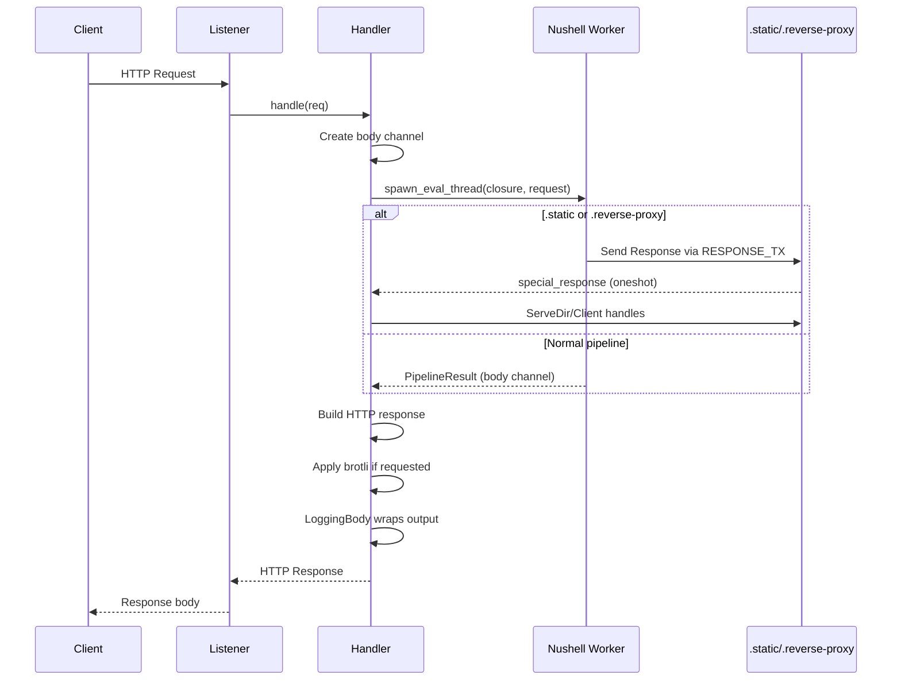

# http-nu Exploration

## Overview

http-nu is an HTTP server scripted entirely in [Nushell](https://www.nushell.sh). Rather than writing routes, handlers, and middleware in Rust, developers write a single Nushell closure that receives each request as a record and returns the response as a Nushell value. The entire server — request lifecycle, templating, static serving, reverse proxying, SSE, TLS, and hot-reload — is driven by the Nushell pipeline.

**Tagline:** "The surprisingly performant, Nushell-scriptable, cross.stream-powered, Datastar-ready HTTP server that fits in your back pocket."

**Version:** 0.16.1-dev (Nu 0.112.1, hyper 1.x, Datastar 1.0.1)

**Author:** Paul Annesley (cablehead), forked into `src.gedweb` by ged

**License:** MIT

## Architecture at a Glance

```mermaid
flowchart TD
    subgraph "Tokio Async Runtime"
        A["Listener (TCP/Unix/TLS)"]
        B["GracefulShutdown tracker"]
        C["Engine ArcSwap"]
        D["Event Broadcast (65536)"]
    end

    subgraph "Request Pipeline"
        E["handle() → spawn_eval_thread"]
        F["Engine.run_closure(request)"]
        G["RESPONSE_TX oneshot"]
        H["PipelineData → body"]
    end

    subgraph "Handler Threads"
        I["Human handler (rate-limited)"]
        J["JSONL handler"]
    end

    A -->|"accept()| B
    A -->|"service_fn"| E
    C -.->|"engine snapshot"| E
    E --> F
    F --> G
    F --> H
    E -.->|"emit()| D
    D --> I
    D --> J

    subgraph "Nushell Commands"
        K[".static"]
        L[".reverse-proxy"]
        M[".mj / .mj compile / .mj render"]
        N[".highlight / .md"]
        O["to sse"]
        P[".bus pub/sub"]
        Q[".run"]
    end

    F -.->|"calls"| K
    F -.->|"calls"| L
    F -.->|"calls"| M
    F -.->|"calls"| N
    F -.->|"calls"| O
    F -.->|"calls"| P
    F -.->|"calls"| Q
```

## Source Directory Structure

This is a **single-crate** workspace (not multi-crate). All source lives in `src/`.

```
http-nu/
├── Cargo.toml              # Single crate, workspace with tests/test_plugin
├── build.rs                # Build-time syntax set compilation
├── src/
│   ├── main.rs             # CLI args, engine bootstrap, serve loop, shutdown
│   ├── lib.rs              # Public re-exports of all modules
│   ├── engine.rs           # Nushell Engine: state, closure, plugin loading, commands
│   ├── handler.rs          # HTTP request handler: body streaming, routing, response building
│   ├── worker.rs           # Eval thread: runs closure, handles PipelineData types
│   ├── commands.rs         # Custom Nushell commands (.static, .mj, .bus, .run, etc.)
│   ├── request.rs          # Request struct, X-Forwarded-For trusted IP resolution
│   ├── response.rs         # Response types, value→bytes/json conversion, http.response meta
│   ├── listener.rs         # TCP + Unix + TLS listener abstraction
│   ├── bus.rs              # In-process pub/sub bus with glob matching
│   ├── store.rs            # cross.stream (xs) Store wrapper + feature-gated stubs
│   ├── compression.rs      # Streaming brotli compressor (BrotliStream)
│   ├── logging.rs          # Event system, human/JSONL handlers, LoggingBody, RequestGuard
│   ├── test_engine.rs      # Engine unit tests
│   ├── test_handler.rs     # Handler integration tests
│   └── stdlib/             # Embedded Nushell modules (virtual filesystem)
│       ├── mod.rs          # Rust-side VFS loader
│       ├── mod.nu          # http-nu module entry point
│       ├── router/mod.nu   # Declarative router with path params, mounts
│       ├── html/mod.nu     # Full HTML DSL (100+ uppercase tag functions)
│       ├── http/mod.nu     # Cookie parse/set/delete
│       └── datastar/mod.nu # Datastar SDK integration
├── docs/
│   ├── adr/                # Architecture Decision Records (5 ADRs)
│   └── issues/             # Known issue tracking (2 issues)
├── changes/                # Per-version changelogs (v0.2 → v0.16.0)
├── examples/               # Example scripts (2048, basic, etc.)
├── tests/                  # Integration tests + test_plugin
├── tests-browser/          # Chromium-driven E2E tests
├── www/                    # Website/assets
├── scripts/                # Build/check scripts
├── syntaxes/               # Syntax highlighting definitions
└── .dagger/                # Dagger CI pipeline
```

## Core Design Patterns

### 1. Nushell Closure as HTTP Handler

The fundamental model: a Nushell closure receives a request record and returns a response value.

**Source:** `src/engine.rs:152-228` — `Engine::parse_closure()`

```rust
pub fn parse_closure(&mut self, script: &str, file: Option<&Path>) -> Result<(), Error> {
    // Parse script, evaluate to get a closure
    // Verify closure takes exactly one argument (the request)
    if block.signature.required_positional.len() != 1 {
        return Err("Closure must accept exactly one request argument".into());
    }
    self.closure = Some(closure);
}
```

**Aha:** The script must evaluate to a closure. The closure is parsed once at startup (or on reload with `--watch`). Each HTTP request calls `engine.run_closure(request_record, body_stream)`. This means **the handler is recompiled on every script change, not on every request** — the hot path is pure Nushell execution.

### 2. Engine as ArcSwap Hot-Reload

**Source:** `src/main.rs:328-339`

```rust
let engine = Arc::new(ArcSwap::from_pointee(first_engine));

// Spawn task to receive engines and swap in new ones
tokio::spawn(async move {
    while let Some(new_engine) = rx.recv().await {
        engine_updater.load().sse_cancel_token.cancel();  // Kill old SSE streams
        engine_updater.store(Arc::new(new_engine));
        log_reloaded();
    }
});
```

**Aha:** `ArcSwap` enables lock-free engine swapping. The server never stops accepting connections — the engine snapshot is atomically swapped. Old SSE streams are cancelled via a `CancellationToken` so clients don't hang after a reload.

### 3. Dual-Channel Response Model

**Source:** `src/handler.rs:186-195`

```rust
let (meta_rx, bridged_body) = spawn_eval_thread(engine, request, stream);

let (special_response, body_result) = tokio::join!(
    async { meta_rx.await.ok() },           // Special: .static or .reverse-proxy
    async { bridged_body.await.map_err(...) }  // Normal pipeline result
);
```

The handler waits on two channels:
- **meta_rx** (`oneshot::Sender<Response>`): Used by `.static` and `.reverse-proxy` commands to short-circuit the normal body pipeline
- **body_rx** (`oneshot::Receiver<PipelineResult>`): The normal Nushell pipeline result

**Aha:** This dual-channel design allows `.static` and `.reverse-proxy` to bypass the normal value-to-body conversion entirely, handing off to `tower-http::ServeDir` or `hyper::Client` respectively.

### 4. Content-Type Inference from Pipeline Output

**Source:** `src/worker.rs:69-93`

| Pipeline Output Value | Inferred Content-Type |
|---|---|
| Record with `__html` | `text/html; charset=utf-8` |
| Record (no `__html`) | `application/json` |
| List | `application/json` |
| Binary | `application/octet-stream` |
| ListStream of records | `application/x-ndjson` |
| Empty/Nothing | None (204 No Content) |
| Other | `text/html; charset=utf-8` (default) |

**Aha:** The `__html` field serves double duty: it marks trusted HTML for XSS prevention AND signals `text/html` content-type. This is the cornerstone of the entire escaping strategy.

### 5. Event System for Observability

**Source:** `src/logging.rs:103-140`

```rust
pub enum Event {
    Request { request_id: Scru128Id, request: Box<RequestData> },
    Response { request_id: Scru128Id, status: u16, headers, latency_ms: u64 },
    Complete { request_id: Scru128Id, bytes: u64, duration_ms: u64 },
    Started, Reloaded, Error, Print, Stopping, Stopped, StopTimedOut, Shutdown,
}
```

All lifecycle events flow through a `broadcast::Sender<Event>` (capacity 65536) to two dedicated handler threads:
- **Human handler**: Terminal UI with active zone, rate-limited (burst 40, refill 20/s), shows in-flight requests
- **JSONL handler**: Structured JSON output for tooling, flushes when channel goes idle

**Aha:** The project deliberately avoids `tracing` because `tracing`'s `valuable` feature requires unstable Rust flags, breaking `cargo install`. A custom `~300-line` event system was chosen over `emit` for simplicity. See [ADR-0004](docs/adr/0004-custom-event-system.md).

### 6. Virtual Filesystem for Embedded Modules

**Source:** `src/stdlib/mod.rs:14-60`

The stdlib Nushell files are embedded at compile time via `include_str!()` and loaded into Nushell's virtual filesystem:

```rust
create_virt_file(&mut working_set, "http-nu/mod.nu", STDLIB_MOD);
create_virt_file(&mut working_set, "http-nu/html/mod.nu", HTML_MOD);
// ...
```

Users access them via: `use http-nu/router *`, `use http-nu/html *`, etc.

### 7. `{__html: ...}` Trust Convention

**Source:** [ADR-0002](docs/adr/0002-html-escaping-strategy.md), [ADR-0005](docs/adr/0005-md-highlight-escaping.md)

The `{__html: string}` record is the universal trust marker:
- HTML DSL tags return `{__html: "<tag>...</tag>"}` — trusted, not re-escaped
- Plain strings are escaped by default
- `.md` accepts both: plain strings get escaped, `{__html: ...}` passes through
- `.highlight` always escapes (code is never HTML-trusted)

```nushell
> DIV "hello"
{__html: "<div>hello</div>"}

> DIV "<script>bad</script>"
{__html: "<div>&lt;script&gt;bad&lt;/script&gt;</div>"}

> DIV (SPAN "nested")
{__html: "<div><span>nested</span></div>"}
```

**Aha:** This is the same convention the Handlebars/Ember ecosystem uses. http-nu adopted it independently as a Nushell-native approach — no `--unsafe` flags needed.

## Key Components

### Engine (`src/engine.rs`)

The Engine wraps Nushell's `EngineState` with:
- A parsed closure (the HTTP handler)
- An in-process `Bus` for pub/sub
- An SSE `CancellationToken`
- Plugin loading support
- Custom command registration

**Key methods:**
- `Engine::new()` — creates base engine with shell + CLI contexts, stdlib
- `add_custom_commands()` — registers all `.static`, `.mj`, `.bus`, `.run`, etc.
- `parse_closure()` — parses and validates the user's handler closure
- `run_closure()` — executes the closure with request input
- `eval()` — used by `eval` subcommand for script execution

### Handler (`src/handler.rs`)

The HTTP handler:
1. Reads request body into a channel
2. Creates a `Request` struct with all HTTP metadata
3. Checks built-in routes (embedded Datastar JS)
4. Spawns an eval thread to run the Nushell closure
5. Waits for special response (.static/.reverse-proxy) or normal pipeline result
6. Builds the HTTP response with optional brotli compression

### Commands (`src/commands.rs`)

1818 lines — the largest source file. Registers all custom Nushell commands:

| Command | Purpose |
|---|---|
| `.static` | Serve static files from directory |
| `to sse` | Convert records to Server-Sent Events format |
| `.reverse-proxy` | Forward HTTP requests to backend |
| `.mj` | Render MiniJinja template (file/inline/topic) |
| `.mj compile` | Compile template to `CompiledTemplate` custom value |
| `.mj render` | Render compiled template with context |
| `.highlight` | Syntax-highlight code → HTML with CSS classes |
| `.highlight theme` | List themes or get CSS for a theme |
| `.highlight lang` | List supported languages |
| `.md` | Convert Markdown → HTML with syntax highlighting |
| `print` | Print to http-nu logging system |
| `.run` | Sandbox-evaluate a Nushell pipeline string |
| `.bus pub` | Publish value to in-process topic |
| `.bus sub` | Subscribe to in-process topic (with glob patterns) |

### Bus (`src/bus.rs`)

In-process pub/sub for ephemeral events (distinct from cross.stream's durable event log):

```rust
pub struct Bus {
    sender: broadcast::Sender<BusEvent>,  // capacity 64
}

pub struct BusSubscription {
    rx: broadcast::Receiver<BusEvent>,
    matcher: Option<GlobMatcher>,  // simple * wildcard, matches dots
}
```

**Aha:** On overflow (slow subscriber), the subscription terminates (`return None`) rather than skipping events. This forces the SSE client to reconnect fresh — better to lose events than serve inconsistent state.

### Store (`src/store.rs`)

Wraps the `xs` (cross-stream) crate's `Store`, providing:
- Topic-based handler script loading
- Live-reload on topic updates
- VFS module enrichment from the stream
- Graceful stub behavior when `cross-stream` feature is disabled

### Compression (`src/compression.rs`)

Streaming brotli compressor (`BrotliStream<S>`) that:
- Accumulates up to 32 inner chunks per poll (drain budget)
- Uses PROCESS for batching, FLUSH at boundaries, FINISH only on stream end
- On SSE cancel: propagates error without FINISH, so client sees fetch error and auto-retries

Quality is set to 4 (default is 6), trading compression ratio for latency.

### Listener (`src/listener.rs`)

Unified listener abstraction supporting:
- TCP (IPv4/IPv6)
- Unix domain sockets (native on Unix, `win_uds` compat on Windows)
- TLS via rustls with HTTP/2 ALPN negotiation

### Logging (`src/logging.rs`)

Three-phase request logging:
1. **Request** — method, path, IP when request arrives
2. **Response** — status, headers, TTFB latency
3. **Complete** — total bytes, total duration (fires via `Drop` on `RequestGuard`)

The `LoggingBody<B>` wrapper counts bytes as the body streams out.

### Worker (`src/worker.rs`)

Spawns a dedicated thread per request to run the Nushell closure:
- Registers a `ThreadJob` in the engine's job table (visible to ctrl-c handler)
- Wraps execution in `catch_unwind` to handle panics
- Forwards errors as 500 responses
- Handles all `PipelineData` variants (Empty, Value, ListStream, ByteStream)

## Embedded Nushell Stdlib

### Router (`stdlib/router/mod.nu`)

Declarative routing with path parameter extraction:

```nushell
dispatch $req [
    (route {path: "/health"} {|req ctx| "OK"})
    (route {path-matches: "/users/:id"} {|req ctx| $"User: ($ctx.id)"})
    (route {has-header: {accept: "application/json"}} {|req ctx| ... })
    (mount "/api" {|req| ... })
    (route true {|req ctx| "Not Found" | ... })
]
```

**Special keys:** `path-matches` (extracts `:param` to context), `has-header` (checks headers), `true` (always matches).

### HTML DSL (`stdlib/html/mod.nu`)

100+ uppercase HTML tag functions:

```nushell
HTML (
    HEAD (TITLE "Demo")
    BODY (H1 "Hello" UL { 1..3 | each {|n| LI $"Item ($n)" } })
)
```

- Uppercase names (`DIV`, `SPAN`) — visually distinct from Nushell builtins
- Auto-escapes untrusted strings via `{__html}` wrapper
- `attrs-to-string` handles record-to-HTML-attribute conversion
- Jinja2 control flow: `_for`, `_if`, `_var` for compiled templates

### HTTP/Cookie (`stdlib/http/mod.nu`)

Pipeline-threaded cookie utilities:
- `cookie parse` — parse Cookie header
- `cookie set` — accumulate Set-Cookie headers in response metadata
- `cookie delete` — set Max-Age=0

Defaults: `HttpOnly`, `SameSite=Lax`, `Secure` (unless `--dev`).

## Response Handling Model



## Key Design Decisions (from ADRs)

### ADR-0001: Explicit Append HTML DSL

Moved from implicit `+tag` append pipeline to explicit lisp-style nesting. Reduced API surface by half and eliminated ambiguity.

### ADR-0002: HTML Escaping Strategy

Adopted `{__html: ...}` record wrapper over Rust custom types. Custom types were 6x slower (1275ms vs 202ms for 100-row table). Record wrapper adds only 9% overhead.

### ADR-0003: HTML DSL Design

Settled on uppercase-only tag names. Uppercase is visually distinct, one way to do things, and leaves `_var` available for Jinja2 variable expressions.

### ADR-0004: Custom Event System

Chose custom typed Event enum over `tracing` (unstable flags) and `emit` (overkill for stdout-only). ~300 lines vs external dependency.

### ADR-0005: Markdown and Highlight Escaping

Extended `{__html: ...}` convention to `.md` and `.highlight`. `.md` accepts both trusted and untrusted input; `.highlight` always escapes.

## Cross-Stream Integration (Optional Feature)

The `cross-stream` feature (default enabled) adds:

- **Persistent event log** via `xs::store::Store` (CAS-backed append-only stream)
- **Topic-based handler loading** — scripts stored in stream topics, hot-reloaded on changes
- **VFS module loading** from the stream — `xs::nu::load_modules()` at a given point-in-time
- **Processor actors/services/actions** — background processors for actor model patterns
- **API server** — optional HTTP API for the store
- **Additional commands** — `.cat`, `.append`, `.cas`, `.last`, `.get`, `.remove`, `.scru128`
- **Store-backed template loading** — `.mj --topic` loads templates from the stream

When the feature is disabled, `Store` is an empty struct with unreachable stubs.

## Dependencies

Key crates:
- **hyper 1.x + hyper-util 0.1.x** — HTTP/1+HTTP/2 server and client
- **tokio** — async runtime
- **nu-* (0.112.1)** — full Nushell engine (cli, cmd-lang, cmd-extra, command, engine, parser, plugin-engine, protocol, std, utils)
- **minijinja 2** — Jinja2-compatible templating
- **syntect + syntect-assets** — syntax highlighting
- **pulldown-cmark** — Markdown parsing
- **rustls + tokio-rustls** — TLS
- **brotli** — streaming compression
- **arc-swap** — lock-free engine hot-reload
- **scru128** — sortable unique IDs for request tracking
- **cross-stream (xs)** — optional persistent event log
- **notify** — file watching for `--watch` mode
- **miette** — error reporting

## Performance Characteristics

From ADR-0003 benchmarks (100-row user table):

| Approach | Time | Notes |
|---|---|---|
| string-no-escape | 186ms | No XSS protection |
| record-escaped | 202ms | `{__html}` wrapper, +8.6% |
| custom-type | 1275ms | Rust boundary, +585% |
| mj-compiled | 2.5ms | Jinja2 compile+render |
| mj-render-only | 0.86ms | Pre-compiled |

From ADR-0004: JSONL handler sustains 24K+ req/sec. Human handler rate-limited to ~10 req/sec for terminal readability.

## Entry Points

### Server Mode
```bash
http-nu [HOST]:PORT [OPTIONS] [script.nu | -c "commands" | --topic TOPIC]
```

### Eval Mode
```bash
http-nu eval [file.nu | -c "commands"]
```

### Key Flags
- `--watch` / `-w`: Hot-reload on script changes
- `--tls`: PEM file for TLS
- `--store`: cross.stream store path
- `--topic`: Load handler from store topic
- `--dev`: Relax security (omit Secure cookie flag)
- `--datastar`: Serve embedded Datastar JS bundle
- `--trust-proxy CIDR`: Trusted proxy ranges for X-Forwarded-For
- `--plugin PATH`: Load Nushell plugin
- `-I PATH`: Add to NU_LIB_DIRS

## What's Different from a Standard HTTP Framework

1. **No routing DSL in Rust** — routing is done in Nushell via the embedded `http-nu/router` module
2. **No middleware chain** — the closure is the entire request pipeline
3. **Hot-reload is native** — the engine is an `ArcSwap`, swapped atomically
4. **HTML is a Nushell DSL** — 100+ uppercase functions, not a template engine
5. **Templates are optional** — `.mj compile`/`.mj render` for performance-critical paths
6. **Observability is built-in** — typed events, dual output (human/JSONL), no tracing dependency
7. **SSE is first-class** — `to sse` converts any Nushell stream to event-stream
8. **The store is optional but powerful** — cross.stream provides durable event log, VFS modules, topic-based scripts
