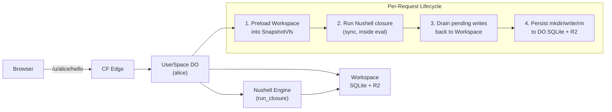

# CF Port Overview — What and Why

The `joeblew999` branch of ged's http-nu fork adds a complete Cloudflare Workers port that turns a desktop-only Nushell-scriptable HTTP server into a multi-target project (desktop + wasm32-unknown-unknown). The entire CF codebase lives under `src/cf/` — zero edits to upstream files, purely additive.

**The core idea is the same:** write a single Nushell closure that receives each request as a record and returns a response as a Nushell value. On CF, that closure runs inside a DurableObject isolate, with a per-user Workspace (SQLite + R2) replacing the filesystem.

**Version:** http-nu 0.16.1-dev, Nu 0.112.1, targeting `wasm32-unknown-unknown`

**Build commands:**
```bash
mise run cf:build       # worker-build --features cloudflare
mise run cf:dev         # wrangler dev
mise run cf:deploy      # wrangler deploy
```

**Feature gate:** All CF code is gated to `cfg(all(feature = "cloudflare", target_arch = "wasm32"))`. The `cloudflare` feature enables the `worker` crate and disables desktop-only dependencies (TLS, brotli, reverse proxy).

## Architecture at a Glance



**Aha:** The port uses a **Vfs trait abstraction** that both desktop and CF code share. Desktop defaults to `OsVfs` (thin `std::fs` wrapper); CF installs `SnapshotVfs` (in-memory preload of Workspace) per request. Upstream code like `src/commands.rs` and `src/response.rs` call `with_vfs(|v| ...)` without any `#[cfg]` gates — the same code runs on both targets.

## Key Differences from Desktop at a Glance

| Feature | Desktop | CF |
|---------|---------|-----|
| Runtime | Tokio async | Workers sync (Nu commands are sync) |
| Filesystem | `std::fs` via `OsVfs` | Workspace (SQLite + R2) via `SnapshotVfs` |
| TLS | rustls supported | Not supported (Workers handles TLS) |
| Reverse proxy | `hyper::Client` | Not supported |
| `sleep` | Blocks thread | NO-OP with budget cap (64 calls/request) |
| Hot reload | `--watch` (inotify) | Workspace `onChange` listener |
| Isolation | Single process | DurableObject per user (`/u/<user>/`) |
| Static serving | `tower-http::ServeDir` | Workspace snapshot via `SnapshotVfs` |

## Per-User Routing

URLs follow `/u/<user_id>/...` for per-user DurableObject isolation. Everything else routes to the `"default"` DO. The `strip_user_prefix()` function (`src/cf/mod.rs:417-428`) strips the prefix so Nushell closures see root-mounted paths identical to desktop:

```
/u/alice/hello    -> /hello   (alice's DO)
/u/bob/api/data   -> /api/data  (bob's DO)
/datastar@1.0.1.js -> /datastar@1.0.1.js  (default DO, no strip)
```

**Aha:** Closures never see the user prefix. Debug routes (`/_workspace/*`) and admin handlers (`/admin/handler`) are handled by `cf::mod.rs::fetch` BEFORE the closure runs, so path stripping is only applied to real handler invocations.

## Source Files

All CF code lives under `src/cf/`:

| File | Lines | Purpose |
|------|-------|---------|
| `src/cf/mod.rs` | 458 | `#[event(fetch)]` entry, `UserSpace` DurableObject, engine cache |
| `src/cf/handler.rs` | 309 | Request handler, Datastar JS, admin swap, static serving |
| `src/cf/request.rs` | 58 | `worker::Request` → `crate::request::Request` adapter |
| `src/cf/response.rs` | 111 | `PipelineData` → `worker::Response` (streaming support) |
| `src/cf/snapshot_vfs.rs` | 259 | `SnapshotVfs` — Workspace-backed Vfs impl |
| `src/cf/nu/mod.rs` | 17 | Nu shadow command entry point |
| `src/cf/nu/nu_command/` | ~900 | 11 shadow commands (filesystem, path, platform) |
| `src/vfs.rs` | 222 | Shared Vfs trait + OsVfs desktop impl |

[Next → CF Architecture](01-cf-architecture.md)
