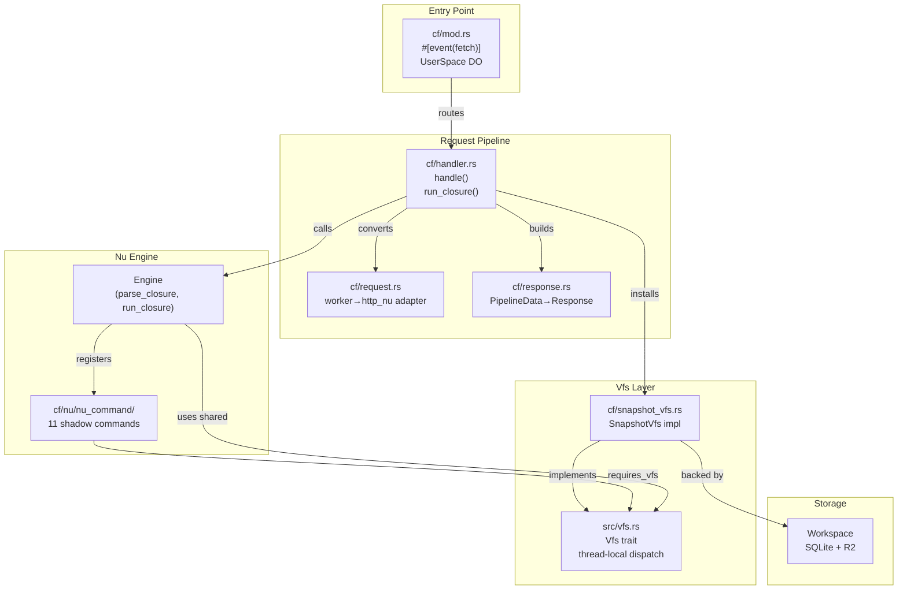

# CF Architecture — Module Map and Data Flow

The CF port is structured as a set of modules under `src/cf/`, each mirroring a desktop counterpart. The design principle is **additive and parallel** — CF code never touches upstream files.

## Module Dependency Graph



## The UserSpace DurableObject

**Source:** `src/cf/mod.rs:158-241`

Each user gets their own DurableObject instance (`UserSpace`). The DO holds:
- A `worker::State` (provides `storage().sql()` for SQLite)
- An `Env` (provides access to the `WORKSPACE_FILES` R2 bucket)

```rust
#[durable_object]
pub struct UserSpace {
    state: State,
    env: Env,
}
```

The `fetch` method implements the per-request lifecycle:

1. **Hot-reload check** — if `HANDLER_RELOAD_PENDING` is set, re-parse the engine
2. **Debug route check** — `/_workspace/*` routes bypass Nu, hit Workspace directly
3. **Reset sleep budget** — clears the per-request sleep call counter
4. **Preload snapshot** — `SnapshotVfs::load_from_workspace(&ws, 4, 1_500_000)` walks Workspace to depth 4, inlining files up to 1.5MB
5. **Install Vfs** — `crate::vfs::install_vfs(Box::new(snapshot.clone()))`
6. **Run handler** — `handler::handle(&mut req).await`
7. **Drain and persist** — flush mkdir ops, then writes, then rm ops back to Workspace
8. **Drop Vfs** — `crate::vfs::drop_vfs()`

**Aha:** The drain order (mkdir → writes → rm) matters. A Nushell script that does `mkdir /out | "hello" | save /out/hello.txt | rm /tmp/old` leaves a consistent state because directories exist before files are written, and removals happen last.

## Engine Caching

**Source:** `src/cf/mod.rs:95-146`

The engine is cached in a `OnceLock<Mutex<Engine>>` per isolate:

```rust
static ENGINE: OnceLock<Mutex<Engine>> = OnceLock::new();
```

Initialization:
1. `Engine::new()` — base engine with shell + CLI contexts, stdlib
2. `add_custom_commands()` — http-nu's `.static`, `.mj`, `.bus`, etc.
3. `add_commands([...])` — 11 shadow commands registered AFTER custom commands so they win name lookup
4. `set_http_nu_const()` — sets `$HTTP_NU` const for stdlib modules
5. `parse_closure(HANDLER_SCRIPT, None)` — parses the embedded handler script

Init can fail (bad demo script, missing commands). Rather than panic the wasm isolate, `engine()` returns `Err(message)` and each request retries. The failure is deterministic (same embedded handler), so cheap to retry.

## Workspace `onChange` Hot-Reload

**Source:** `src/cf/mod.rs:247-318`

Every `Workspace` instance carries an `onChange` listener:

```rust
fn handler_reload_listener(event: WorkspaceChangeEvent) {
    if event.path == HANDLER_SCRIPT_PATH && matches!(event.kind, Create | Update) {
        HANDLER_RELOAD_PENDING.store(true, Ordering::SeqCst);
    }
}
```

This fires when any write path touches `/serve.nu` — the Nu shadow `save`, debug PUT route, or future admin handler swap. The flag is checked at the top of each fetch, and if set, the engine re-parses the handler before serving the request. This is the CF equivalent of desktop `--watch` mode.

**Aha:** The listener is installed on every Workspace the DO mints, so ALL write paths funnel through the same hot-reload signal. No dedicated reload endpoint needed — any mechanism that writes `/serve.nu` triggers a reload on the next request.

## Debug Routes

**Source:** `src/cf/mod.rs:320-397`

`/_workspace/*` routes provide direct Workspace access for development and verification:

| Route | Method | Purpose |
|-------|--------|---------|
| `/_workspace/ls?path=...` | GET | List directory entries as JSON |
| `/_workspace/stat?path=...` | GET | Get file stat (kind, size, modified_at, mime_type) |
| `/_workspace/cat?path=...` | GET | Read file bytes |
| `/_workspace/put?path=...` | PUT | Write file bytes (honors Content-Type) |
| `/_workspace/rm?path=...` | POST | Remove path (recursive, force) |
| `/_workspace/mkdir?path=...` | POST | Create directory (recursive) |
| `/_workspace/conformance` | GET | Run Workspace conformance test suite |

These routes bypass the Nushell engine entirely and hit the Workspace directly. Useful for curl-based verification during development.

## Handler Swap

**Source:** `src/cf/handler.rs:72-97`

`PUT /u/<user>/admin/handler` accepts a Nu closure as request body and hot-swaps it into the cached engine for that user's isolate:

```rust
fn swap_handler(script: &str) -> std::result::Result<Response, String> {
    let mut engine = super::engine()?.lock()?;
    engine.parse_closure(script, None)?;
    Response::ok("ok")
}
```

Each `UserSpace` DO has its own wasm isolate + `ENGINE` `OnceLock`, so the swap stays scoped to that user. New warm isolates restart from the compiled-in `HANDLER_SCRIPT`.

[← Back to Overview](00-cf-overview.md) | [Next → Vfs Abstraction](02-vfs.md)
