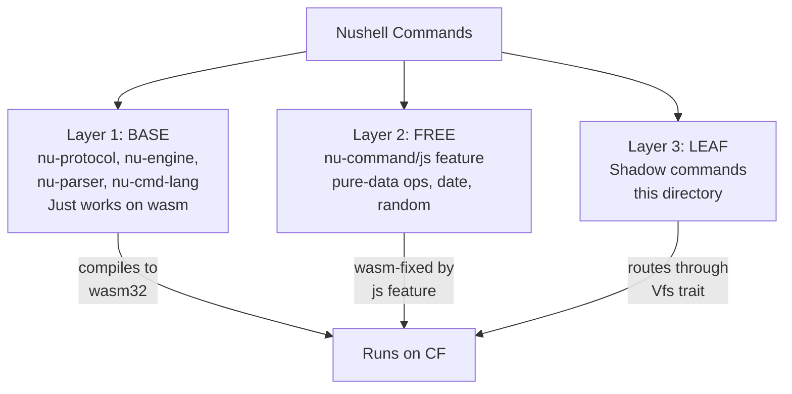

# Shadow Commands — The Layer 1/2/3 Strategy

Nushell has hundreds of commands, many of which touch `std::fs` or other OS primitives that don't exist on wasm32. Rather than port all of them, ged uses a **Layer 1/2/3 strategy** that minimizes maintenance burden.

**Source:** `src/cf/nu/nu_command/` (~900 lines across 11 command files + supporting docs)

## The Three-Layer Model



| Layer | What | Why it works on CF |
|-------|------|-------------------|
| **BASE** (Layer 1) | `nu-protocol`, `nu-engine`, `nu-parser`, `nu-cmd-lang`, `nu-cmd-extra`, `nu-std`, `nu-utils` | Compiles to wasm32; no OS dependencies |
| **FREE** (Layer 2) | `date`, `random`, path utils, pure-data ops via `nu-command/js` feature | `js` feature wasm-fixes commands without code from us |
| **LEAF** (Layer 3) | OS-touching commands (`ls`, `open`, `save`, etc.) | Shadowed to route through `Vfs` trait |

**Aha:** This is what makes the demand map short (~11 commands). The `nu-command/js` feature already provides wasm-compatible implementations for pure-data commands. We only own the bottom layer — commands that touch the OS.

## Shadow Command Rules

The working rules (from `src/cf/nu/nu_command/CLAUDE.md`) enforce strict discipline:

1. **Gate:** A shadow goes in only if (a) a specific example demands it, AND (b) it has a structural reason (vfs, wasm, or cpu)
2. **File layout:** Mirrors `nu-command/src/<category>/<name>.rs` path-for-path
3. **Provenance:** Every shadow's module doc cites the upstream file it mirrors
4. **Vfs only:** No `std::fs::*` — all filesystem ops route through `require_vfs`
5. **Registration:** Shadows are added AFTER `add_custom_commands` so they win name lookup
6. **Divergence tracking:** Each shadow documents every stock flag it drops in its module doc

## All 11 Shadow Commands

### Filesystem Commands (8)

| Command | Shadow Type | Used By | Key Divergence |
|---------|-------------|---------|----------------|
| `ls` | `VfsLs` | `examples/cf-workspace-browser/` | No `--all`/`--long`; returns table with name/type/size only |
| `open` | `VfsOpen` | `cf-workspace-browser/`, `tao/`, `cargo-docs/` | Only auto-parses `.json`; stock does yaml/toml/csv too |
| `save` | `VfsSave` | `cf-workspace-browser/` | Only `--force` switch; no `--stderr`, `--raw`, `--append`, `--progress` |
| `mkdir` | `VfsMkdir` | `cf-workspace-browser/` | `--verbose` parsed but ignored |
| `rm` | `VfsRm` | `cf-workspace-browser/` | No `--verbose`, `--interactive`, `--trash`; multi-path supported |
| `cp` | `VfsCp` | `cf-workspace-browser/` | Only `--recursive`; no `--verbose`, `--interactive`, `--progress`, `--force` |
| `mv` | `VfsMv` | `cf-workspace-browser/` | Read-then-write (no atomic rename); no `--verbose`, `--interactive` |
| `glob` | `VfsGlob` | `cf-workspace-browser/` | Custom recursive glob matcher; no `--exclude`, `--depth` |

### Path Commands (2)

| Command | Shadow Type | Used By | Key Divergence |
|---------|-------------|---------|----------------|
| `path exists` | `VfsPathExists` | Common pattern | Routes through `Vfs::exists`; `--no-symlink` not yet verified |
| `path self` | `VfsPathSelf` | `examples/mermaid-editor/` | **WASM FIX:** Stock calls `Path::is_absolute()` which always returns false on wasm32. Shadow returns workspace-rooted `/handler.nu`. Marked `is_const = true` |

### Platform Commands (1)

| Command | Shadow Type | Used By | Key Divergence |
|---------|-------------|---------|----------------|
| `sleep` | `Sleep` | `examples/basic/`, `examples/2048/` | **NO-OP** with budget cap (64 calls/request); errors after to break runaway loops |

## Shared Helpers

**Source:** `src/cf/nu/nu_command/shared.rs`

```rust
/// Normalise input: "."/""/"./" -> "/", bare names get leading "/"
pub fn normalise_input(p: &str) -> String { ... }

/// Standard ShellError for Vfs operations
pub fn vfs_err(span: Span, msg: impl Into<String>, error: impl Into<String>) -> ShellError { ... }

/// Canonical "Workspace not loaded" error
pub fn no_vfs(span: Span) -> ShellError { ... }

/// Run f against active Vfs, returning ShellError if none installed
pub fn require_vfs<R>(span: Span, f: impl FnOnce(&dyn Vfs) -> Result<R, ShellError>) -> Result<R, ShellError> { ... }
```

All filesystem shadows use these helpers for consistent error handling and path normalization.

## The Sleep Budget

**Source:** `src/cf/nu/nu_command/platform/sleep.rs:33-101`

```rust
thread_local! {
    static SLEEP_CALLS: Cell<u32> = const { Cell::new(0) };
}
const MAX_CALLS_PER_REQUEST: u32 = 64;
```

The sleep shadow is a NO-OP (Workers has no sync sleep). But scripts that loop with `sleep` (like `generate { sleep 1sec ... } true`) would spin indefinitely, burning the Workers CPU budget. The solution: count calls per request, error after 64.

**Aha:** Only the first 3 warnings are logged; subsequent calls are silent to avoid flooding wrangler logs on streaming generators. This is a deliberate UX choice — the script author sees the problem, but the logs don't explode.

## `path self` — The WASM Fix

**Source:** `src/cf/nu/nu_command/path/self_.rs`

Stock `path self` calls `engine_state.cwd()` → `AbsolutePathBuf::try_from($env.PWD)` → `Path::is_absolute()`. On `wasm32-unknown-unknown`, `is_absolute()` always returns false, causing a parse-time error.

The shadow returns a workspace-rooted path instead:

```rust
fn run_const(&self, working_set: &StateWorkingSet, call: &Call, _input: PipelineData) -> Result<PipelineData, ShellError> {
    let extra: Option<String> = call.opt_const(working_set, 0)?;
    let result = match extra {
        Some(p) if p.starts_with('/') => p,
        Some(p) => format!("/{p}"),
        None => "/handler.nu".to_string(),
    };
    Ok(Value::string(result, span).into_pipeline_data())
}
```

Marked `is_const = true` so it works inside `const x = path self` same as stock.

## Reserved but Not Implemented

### `stor` — Future

**Source:** `src/cf/nu/nu_command/stor/README.md`

The `stor *` family needs a SQLite backend. Two options exist:
- **DO SQLite** (`worker::SqlStorage`) — sync API, per-DO scope, persists across requests
- **D1** (`worker::D1Database`) — async-only, global scope

Recommendation: DO SQLite for the first port (sync API fits Nu's `Command::run`). Requires implementing a Nu `CustomValue` trait (~10 methods) for the `stor open` custom value type.

### `fetch` / `http get` — Blocked

These require async HTTP, which Nu commands don't support. Same blocker as `stor` with D1.

## PORT_STATUS.md — The Running Ledger

**Source:** `src/cf/nu/nu_command/PORT_STATUS.md`

Documents:
- **Demand map table** — which example demands each shadow
- **Shadow table** — 11 commands with upstream paths, registration sites, divergence notes
- **Working without shadow** — commands that work via `nu-command/js` feature
- **Not shadowed targets** — `stor` (needs backend choice), `fetch` (async blocked)
- **Intentionally never shadowed** — `nu-cli`, `nu-plugin*`, `nu-table`, `nu-explore`

[← Back to SnapshotVfs](03-snapshot-vfs.md) | [Next → Request Lifecycle](05-cf-request-lifecycle.md)
