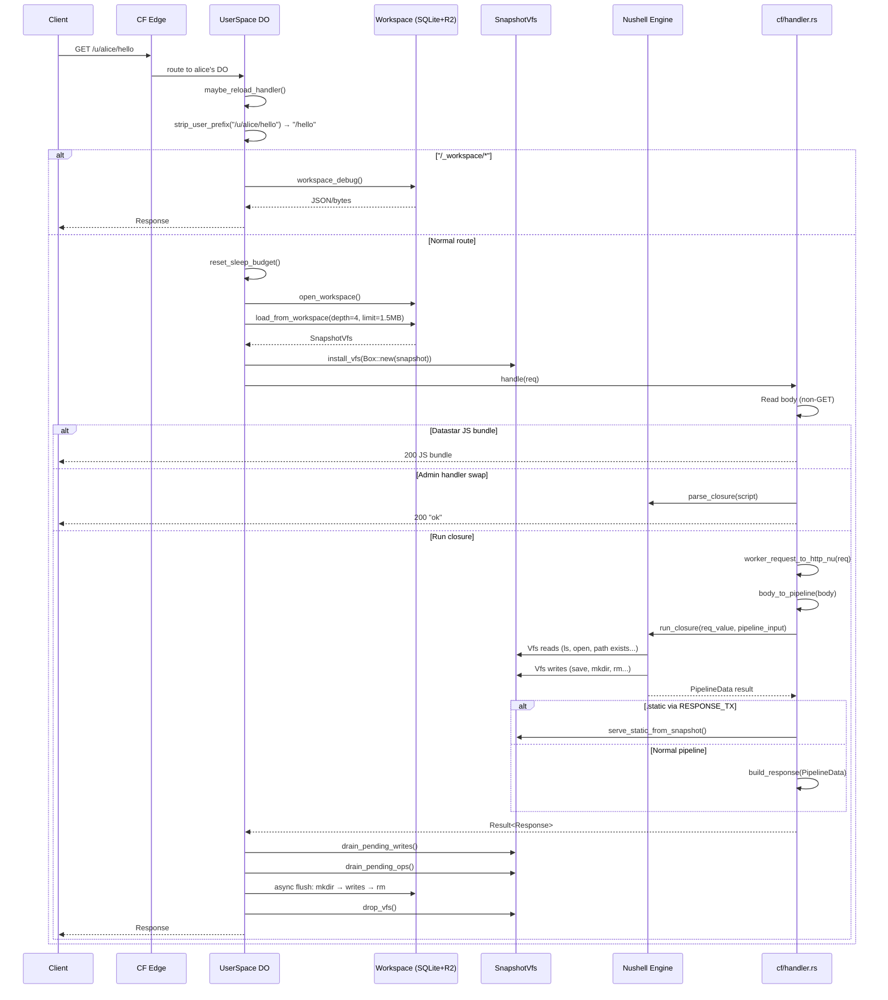

# CF Request Lifecycle — Preload, Eval, Drain, Persist

Every HTTP request to a CF user's DurableObject follows a four-phase lifecycle that bridges the async Workers runtime with sync Nushell execution.

**Source:** `src/cf/mod.rs:169-241` (`UserSpace::fetch`) and `src/cf/handler.rs:56-179` (`handle`, `run_closure`)

## Full Request Flow



## Phase 1: Hot-Reload Check

**Source:** `src/cf/mod.rs:170-173`

```rust
self.maybe_reload_handler().await;
```

If the previous request's Nu commands wrote to `/serve.nu` (or a debug PUT did), the `HANDLER_RELOAD_PENDING` flag is set. This phase re-reads and re-parses the handler script before serving. If not set, this is a no-op (the common case).

## Phase 2: Preload

**Source:** `src/cf/mod.rs:192-194`

```rust
let ws = self.open_workspace()?;
let snapshot = SnapshotVfs::load_from_workspace(&ws, 4, 1_500_000).await?;
crate::vfs::install_vfs(Box::new(snapshot.clone()));
```

Three steps:
1. Open Workspace with DO SQLite + R2 bucket
2. Recursively walk Workspace tree (depth ≤ 4, files ≤ 1.5MB inlined)
3. Install the snapshot in the thread-local Vfs slot

The `snapshot.clone()` is cheap — just an `Rc` increment. Both the handler and the fetch method share the same `SnapshotInner`.

## Phase 3: Evaluate

**Source:** `src/cf/handler.rs:107-179`

The handler runs the Nushell closure:

```rust
let pd_result = {
    let engine = super::engine()?.lock()?;
    let req_struct = worker_request_to_http_nu(req)?;
    let req_value = request_to_value(&req_struct, Span::unknown());
    let pipeline_input = body_to_pipeline(body, &engine);
    engine.run_closure(req_value, pipeline_input)
};
```

During eval, Nu commands reach the Vfs through `with_vfs`:
- `ls /` → `VfsLs` → `with_vfs(|v| v.read_dir(...))` → returns preloaded directory
- `save /out` → `VfsSave` → `with_vfs(|v| v.write(...))` → queues to `pending_writes`
- `path exists /foo` → `VfsPathExists` → `with_vfs(|v| v.exists(...))` → checks all maps

The `RESPONSE_TX` oneshot channel allows `.static` to short-circuit the normal body pipeline (same as desktop).

## Response Building

**Source:** `src/cf/response.rs:53-111`

After eval, `build_response()` converts `PipelineData` to a `worker::Response`:

| PipelineData | Response Shape |
|-------------|---------------|
| `Empty` / `Value::Nothing` | Empty body (204) |
| `Value` | One-shot bytes |
| `ListStream` | Streamed response (peeks first value for JSONL detection) |
| `ByteStream` | Streamed via `Response::from_stream` with 8KB chunks |

For `.static` responses (via `RESPONSE_TX`), `build_early_response()` serves from the snapshot:

```rust
fn serve_static_from_snapshot(root, request_path, fallback) -> Result<Vec<u8>, String> {
    // Try primary path
    // If directory-like, try index.html
    // If fallback provided, try that
    // Return error if nothing found
}
```

Content-Type is inferred from file extension via `content_type_for()` (covers html, css, js, json, md, png, jpg, gif, webp, wasm, woff, etc.).

## Phase 4: Drain and Persist

**Source:** `src/cf/mod.rs:202-238`

After the handler returns, pending changes are flushed back to Workspace:

```rust
let writes = snapshot.drain_pending_writes();
let ops = snapshot.drain_pending_ops();

// Order matters: mkdir → writes → rm
for op in &ops {
    if let PendingOp::Mkdir(path) = op {
        ws.mkdir(&path, MkdirOptions { recursive: true }).await?;
    }
}
for (path, bytes) in writes {
    ws.write_file_bytes(&path, &bytes, None).await?;
}
for op in ops {
    if let PendingOp::Rm(path) = op {
        ws.rm(&path, RmOptions { recursive: true, force: true }).await?;
    }
}
crate::vfs::drop_vfs();
```

**Aha:** Even if the handler returned an error, pending writes are still flushed. This ensures partial results persist — a script that does `save /a; save /b; panic` still leaves both files in the Workspace. The flush is best-effort; failures are logged but don't error the request.

[← Back to Shadow Commands](04-shadow-commands.md) | [Next → Desktop vs CF](06-desktop-vs-cf.md)
