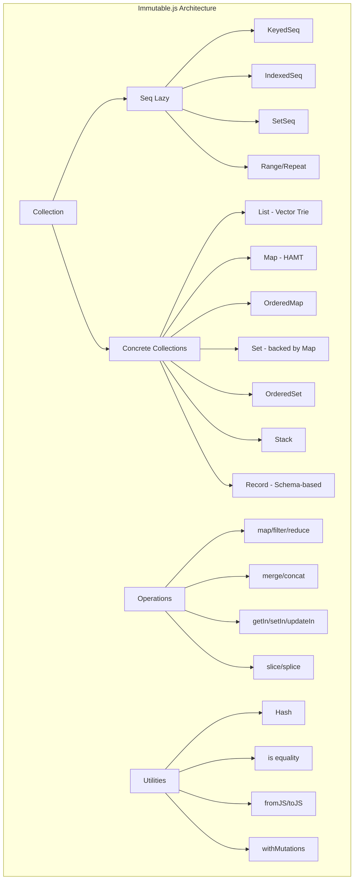
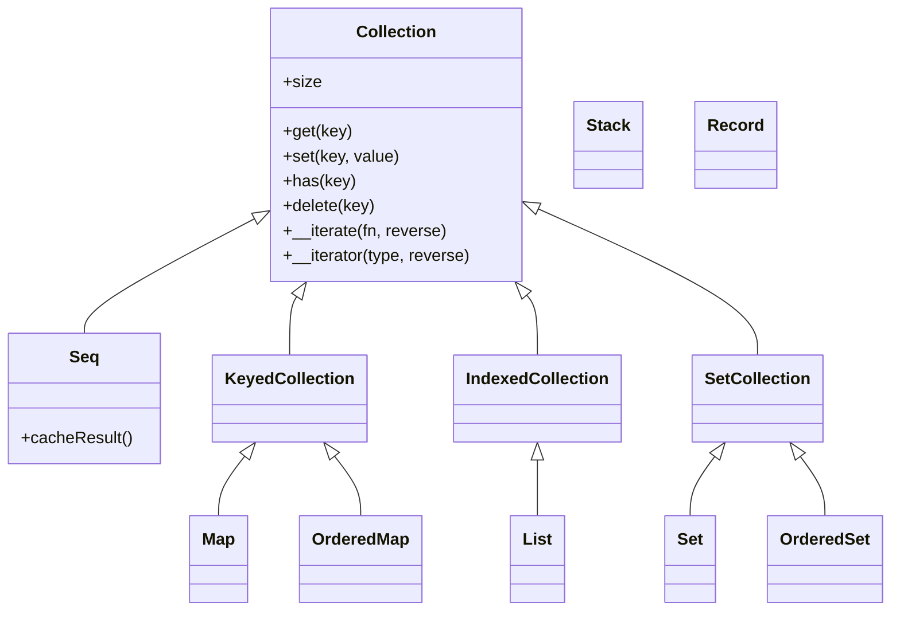

# Project Exploration: Immutable.js - Immutable Data Collections

## Overview

Immutable.js is a library providing persistent immutable data structures for JavaScript. It implements highly efficient immutable collections using structural sharing via hash array mapped tries (HAMT) and vector tries, as popularized by Clojure and Scala. The library allows developers to treat collections as values rather than objects, enabling advanced memoization, change detection, and simpler application development by eliminating defensive copying.

The repository explored also contains a Go port (`immutable/`) by benbjohnson which provides similar immutable collection types for Go, loosely ported from the JavaScript implementation.

## Directory Structure

```
/home/darkvoid/Boxxed/@formulas/src.immutableDS/
├── immutable-js/              # Main Immutable.js library (JavaScript)
│   ├── src/                   # Source code
│   │   ├── Collection.js      # Base collection classes
│   │   ├── CollectionImpl.js  # Collection method implementations
│   │   ├── Immutable.js       # Main entry point, exports all collections
│   │   ├── List.js            # Persistent vector (indexed collection)
│   │   ├── Map.js             # Hash Array Mapped Trie implementation
│   │   ├── OrderedMap.js      # Insertion-order preserving Map
│   │   ├── Set.js             # Set implementation (backed by Map)
│   │   ├── OrderedSet.js      # Insertion-order preserving Set
│   │   ├── Stack.js           # LIFO collection
│   │   ├── Record.js          # Schema-based typed Map-like structure
│   │   ├── Seq.js             # Lazy sequences for efficient chaining
│   │   ├── Range.js           # Lazy sequence of number ranges
│   │   ├── Repeat.js          # Lazy sequence of repeated values
│   │   ├── Hash.js            # Hash code generation
│   │   ├── TrieUtils.js       # Trie constants and utilities
│   │   ├── Iterator.js        # Iterator protocol implementation
│   │   ├── Operations.js      # Seq operations (map, filter, slice, etc.)
│   │   ├── is.js              # Value equality checking
│   │   ├── fromJS.js          # Deep conversion from JS objects
│   │   ├── toJS.js            # Conversion to plain JS objects
│   │   ├── functional/        # Functional API (get, set, update, etc.)
│   │   ├── methods/           # Method implementations (setIn, merge, etc.)
│   │   ├── predicates/        # Type checking predicates
│   │   └── utils/             # Utility functions
│   ├── __tests__/             # Comprehensive test suite
│   ├── perf/                  # Performance benchmarks
│   ├── type-definitions/      # TypeScript and Flow type definitions
│   ├── package.json
│   ├── README.md
│   └── CHANGELOG.md
└── immutable/                 # Go port by benbjohnson
    ├── immutable.go           # Main implementation (List, Map, Set, etc.)
    ├── immutable_test.go      # Go tests
    ├── sets.go                # Set implementations
    ├── sets_test.go           # Set tests
    ├── README.md
    └── go.mod
```

## Architecture

### High-Level Diagram



### Collection Hierarchy



## Core Collections

### 1. List - Persistent Vector

**Implementation:** 32-ary Vector Trie (branching factor of 32)

The `List` is an immutable sorted collection of values, similar to an array. It uses a vector trie structure for efficient updates.

```javascript
// Key constants from TrieUtils.js
const SHIFT = 5;           // log2(32) = 5
const SIZE = 1 << SHIFT;   // 32 entries per node
const MASK = SIZE - 1;     // 0x1F, for masking index
```

**Structure:**
- Elements are stored in leaf nodes (arrays of up to 32 elements)
- Internal nodes are arrays of child references
- The trie depth grows logarithmically with size
- A separate "tail" vector stores the last 0-31 elements for efficient append

**Key Operations:**
- `get(index)` - O(log32 N) tree traversal
- `set(index, value)` - O(log32 N), creates new path with structural sharing
- `push(value)` - O(1) amortized (uses tail), O(log32 N) worst case
- `pop()` - O(1) amortized
- `slice(begin, end)` - O(log32 N) with bounds adjustment

**Example from List.js:**
```javascript
function updateList(list, index, value) {
  index = wrapIndex(list, index);
  index += list._origin;

  let newTail = list._tail;
  let newRoot = list._root;
  const didAlter = MakeRef();

  if (index >= getTailOffset(list._capacity)) {
    newTail = updateVNode(newTail, list.__ownerID, 0, index, value, didAlter);
  } else {
    newRoot = updateVNode(newRoot, list.__ownerID, list._level, index, value, didAlter);
  }

  // Returns new list only if altered
  if (!didAlter.value) return list;
  return makeList(list._origin, list._capacity, list._level, newRoot, newTail);
}
```

### 2. Map - Hash Array Mapped Trie (HAMT)

**Implementation:** HAMT with branching factor of 32

The `Map` is an immutable collection of key-value pairs implemented as a Hash Array Mapped Trie, which provides efficient lookups and updates.

**Node Types:**

1. **ArrayMapNode** - Small maps stored as flat arrays (up to SIZE/4 = 8 entries)
2. **BitmapIndexedNode** - Uses bitmap to track which child slots are occupied
3. **HashArrayMapNode** - Full 32-element array of children
4. **HashCollisionNode** - Handles hash collisions with linear chaining
5. **ValueNode** - Leaf node containing a single key-value pair

**Hash Function:**
```javascript
// From Hash.js
function hash(o) {
  if (typeof o.hashCode === 'function') {
    return smi(o.hashCode(o));  // Use custom hashCode if available
  }
  // Default hashing based on type
  switch (typeof v) {
    case 'string': return hashString(v);  // JVM-style string hash
    case 'number': return hashNumber(v);
    case 'object': return hashJSObj(v);   // Uses WeakMap or UID property
    // ... etc
  }
}
```

**Key Operations:**
- `get(key)` - O(log32 N) average, follows hash bits down the trie
- `set(key, value)` - O(log32 N) average, creates new path with structural sharing
- `delete(key)` - O(log32 N), may collapse nodes

**Bitmap Indexing:**
```javascript
// From Map.js - BitmapIndexedNode.get()
const bit = 1 << ((shift === 0 ? keyHash : keyHash >>> shift) & MASK);
const bitmap = this.bitmap;
return (bitmap & bit) === 0
  ? notSetValue
  : this.nodes[popCount(bitmap & (bit - 1))].get(shift + SHIFT, keyHash, key, notSetValue);
```

The bitmap efficiently encodes which child slots are occupied. `popCount(bitmap & (bit-1))` gives the array index.

### 3. Set and OrderedSet

**Implementation:** Set is a thin wrapper around Map

```javascript
// From Set.js
export class Set extends SetCollection {
  has(value) {
    return this._map.has(value);
  }

  add(value) {
    return updateSet(this, this._map.set(value, value));
  }

  remove(value) {
    return updateSet(this, this._map.remove(value));
  }
}
```

Set stores values as both key and value in the underlying Map.

### 4. Record - Schema-based Typed Map

**Implementation:** Class factory creating typed record constructors

```javascript
// From Record.js
const RecordType = function Record(values) {
  if (!(this instanceof RecordType)) {
    return new RecordType(values);
  }
  // Initialize with fixed schema
  this._values = List().withMutations(l => {
    l.setSize(this._keys.length);
    KeyedCollection(values).forEach((v, k) => {
      l.set(this._indices[k], v === this._defaultValues[k] ? undefined : v);
    });
  });
};
```

Records have:
- Fixed schema defined at creation time
- Default values for all fields
- Property accessor methods (e.g., `record.fieldName`)
- Cannot add or remove keys, only update values

### 5. Stack

**Implementation:** Linked list structure

A LIFO (Last-In-First-Out) collection with O(1) push/pop operations.

### 6. Seq - Lazy Sequences

**Implementation:** Deferred computation wrappers

Seq provides lazy evaluation for efficient chaining of operations:

```javascript
// From Seq.js
export class Seq extends Collection {
  cacheResult() {
    if (!this._cache && this.__iterateUncached) {
      this._cache = this.entrySeq().toArray();
      this.size = this._cache.length;
    }
    return this;
  }
}
```

**Special Seq types:**
- `Range(start, end, step)` - Lazy sequence of numbers
- `Repeat(value, times)` - Lazy sequence of repeated values
- Various transformation Seq (FilterSeq, MapSeq, SliceSeq, etc.)

**Lazy Operations from Operations.js:**
```javascript
export function mapFactory(collection, mapper, context) {
  const mappedSequence = makeSequence(collection);
  mappedSequence.__iterateUncached = function (fn, reverse) {
    return collection.__iterate(
      (v, k, c) => fn(mapper.call(context, v, k, c), k, this) !== false,
      reverse
    );
  };
  // Only computes when iterated
  return mappedSequence;
}
```

## Structural Sharing

### How It Works

Structural sharing is the key to Immutable.js performance. When updating a collection, only the path from root to the modified element is recreated. All other branches are shared between the old and new versions.

### List Structural Sharing

```
Before: update index 5
        Root (level 10)
        /    |    \
      [0-31][32-63][64-95]
                |
              [32-63] (level 5)
              /  |  \
           ... [4-7] ...
                 |
               [4,5,6,7]

After: update index 5
        Root' (NEW)
        /    |    \
      [0-31][32-63]'[64-95]  <-- shared
                |
              [32-63]' (NEW)
              /  |  \
           ... [4-7]' ...   <-- shared
                 |
               [4,NEW,6,7] (NEW)
```

Only nodes on the path to index 5 are recreated. Sibling nodes are shared.

### Map Structural Sharing (HAMT)

```
Before: set key "foo"
        Root (BitmapIndexed)
        /    \
    slot 0   slot 1 (points to leaf with "foo")

After: set key "foo" = "bar"
        Root' (NEW)
        /    \
    slot 0   slot 1' (NEW leaf with "foo":"bar")
    (shared)
```

The bitmap allows very compact representation. Only nodes containing the modified key are recreated.

### Code Example from Map.js

```javascript
function updateNode(node, ownerID, shift, keyHash, key, value, didChangeSize, didAlter) {
  if (!node) {
    // Create new ValueNode
    SetRef(didAlter);
    SetRef(didChangeSize);
    return new ValueNode(ownerID, keyHash, [key, value]);
  }
  // Delegate to node's update method
  return node.update(ownerID, shift, keyHash, key, value, didChangeSize, didAlter);
}

// In BitmapIndexedNode.update():
const isEditable = ownerID && ownerID === this.ownerID;
const newNodes = exists
  ? newNode
    ? setAt(nodes, idx, newNode, isEditable)  // Copy only if not editable
    : spliceOut(nodes, idx, isEditable)
  : spliceIn(nodes, idx, newNode, isEditable);

if (isEditable) {
  this.bitmap = newBitmap;
  this.nodes = newNodes;
  return this;  // Mutate in place for transient updates
}
return new BitmapIndexedNode(ownerID, newBitmap, newNodes);  // New node
```

### Transient Mutations with withMutations

For batch operations, Immutable.js uses "transient" mutations:

```javascript
// From List.js
push(/*...values*/) {
  const values = arguments;
  const oldSize = this.size;
  return this.withMutations(list => {
    setListBounds(list, 0, oldSize + values.length);
    for (let ii = 0; ii < values.length; ii++) {
      list.set(oldSize + ii, values[ii]);
    }
  });
}
```

```javascript
// Pattern from withMutations.js
list.withMutations(fn => {
  const mutable = list.asMutable();  // Get transient mutable copy
  fn(mutable);                       // Apply mutations in-place
  return mutable.asImmutable();      // Convert back to persistent
});
```

This allows O(1) amortized operations for bulk changes.

## Performance Characteristics

| Collection | Operation    | Time Complexity      | Notes                          |
|------------|--------------|----------------------|--------------------------------|
| List       | get          | O(log32 N)          | ~O(1) for N < 32               |
| List       | set          | O(log32 N)          | Structural sharing             |
| List       | push/pop     | O(1) amortized      | Uses tail vector               |
| List       | concat       | O(log32 N + M)      | M = number of collections      |
| Map        | get          | O(log32 N) average  | HAMT lookup                    |
| Map        | set          | O(log32 N) average  | Structural sharing             |
| Map        | delete       | O(log32 N) average  | May collapse nodes             |
| Set        | add/has      | O(log32 N)          | Backed by Map                  |
| Stack      | push/pop     | O(1)                | Linked list                    |
| Record     | get/set      | O(1)                | Fixed schema, array-backed     |
| Seq        | map/filter   | O(1) lazy           | Computed on iteration          |

### Memory Efficiency

- **Empty collections** are singletons (shared across all instances)
- **Structural sharing** means most of the tree is shared after updates
- **Copy-on-write** only allocates what changes

Example memory cost for List with 1000 elements:
- Root + ~2 levels of trie nodes
- Each set() creates ~2-3 new nodes (path from root to leaf)
- Remaining ~30+ nodes are shared

## Value Equality and Hashing

### The `is()` Function

Immutable.js extends JavaScript's "same-value" equality:

```javascript
// From is.js
export function is(valueA, valueB) {
  if (valueA === valueB || (valueA !== valueA && valueB !== valueB)) {
    return true;  // Handle NaN
  }
  if (!valueA || !valueB) return false;

  // Check valueOf for primitives
  if (typeof valueA.valueOf === 'function' && typeof valueB.valueOf === 'function') {
    valueA = valueA.valueOf();
    valueB = valueB.valueOf();
    if (valueA === valueB || (valueA !== valueA && valueB !== valueB)) {
      return true;
    }
  }

  // Check equals() for Value Objects
  return !!(
    isValueObject(valueA) &&
    isValueObject(valueB) &&
    valueA.equals(valueB)
  );
}
```

### Hash Code Generation

```javascript
// From Hash.js
function hashString(string) {
  // JVM-style hash: s[0]*31^(n-1) + s[1]*31^(n-2) + ... + s[n-1]
  let hashed = 0;
  for (let ii = 0; ii < string.length; ii++) {
    hashed = (31 * hashed + string.charCodeAt(ii)) | 0;
  }
  return smi(hashed);
}

function hashJSObj(obj) {
  // Use WeakMap if available, otherwise hijack property
  if (usingWeakMap) {
    hashed = weakMap.get(obj);
    if (hashed !== undefined) return hashed;
  }
  // ... fallback strategies
}
```

Collections implement `equals()` and `hashCode()` methods, satisfying:
```
if (a.equals(b)) => a.hashCode() === b.hashCode()
```

## Key Insights

### 1. Persistent Data Structures

Immutable.js implements **persistent data structures** - data structures that preserve previous versions when modified. Every operation returns a new collection while the old one remains valid and unchanged.

### 2. Structural Sharing via Tries

The use of **Hash Array Mapped Tries (HAMT)** for Maps and **Vector Tries** for Lists enables:
- Logarithmic time complexity for access/modification
- Minimal memory overhead through sharing
- Efficient copy-on-write semantics

### 3. Lazy Evaluation with Seq

**Seq** provides lazy evaluation, allowing efficient chaining of operations without creating intermediate collections:

```javascript
const result = Seq([1, 2, 3, 4, 5, 6, 7, 8])
  .filter(x => x % 2 !== 0)  // No computation yet
  .map(x => x * x)            // Still lazy
  .first();                   // Now computes only what's needed
```

### 4. Value Semantics

Collections are treated as **values** rather than **objects**:
- Two collections with same contents are "value equal" via `.equals()`
- Reference equality (`===`) only works for the same instance
- Immutable.js optimizes by returning the same reference for no-op changes

### 5. Transient Mutations

The `withMutations()` pattern allows efficient batch operations by temporarily treating persistent collections as mutable:

```javascript
const list1 = List([1, 2, 3]);
const list2 = list1.withMutations(list => {
  list.push(4).push(5).push(6);  // Mutates in-place
});
// Only 1 new List created, not 3
```

### 6. OwnerID Pattern

The `OwnerID` mechanism tracks transient mutations:

```javascript
// From TrieUtils.js
export function OwnerID() {}  // Empty constructor, identity matters

// Nodes check ownerID to decide whether to mutate or copy
if (ownerID && ownerID === this.ownerID) {
  return this;  // Safe to mutate
}
return new VNode(this.array.slice(), ownerID);  // Must copy
```

## Related Project: Go Implementation

The `immutable/` directory contains a Go port by benbjohnson:

**Key Differences:**
- Uses Go generics (`List[T]`, `Map[K,V]`)
- Similar trie-based implementations
- Includes `SortedMap` and `SortedSet` (B+ tree implementation)
- Builder pattern for efficient bulk operations
- Mimics Go's standard library API conventions

**Example Go usage:**
```go
l := immutable.NewList[string]()
l = l.Append("foo")
l = l.Set(2, "bar")

m := immutable.NewMap[string,int](nil)
m = m.Set("key", 100)
```

## References

- [Immutable.js Documentation](https://immutable-js.github.io/immutable-js/)
- [Hash Array Mapped Trie (Phil Bagwell)](https://lampwww.epfl.ch/papers/idealhashtrees.pdf)
- [Understanding Persistent Vector (Eli Bendersky)](https://hypirion.com/musings/understanding-persistent-vector-pt-1)
- [Immutable Data and React (YouTube)](https://youtu.be/I7IdS-PbEgI)
