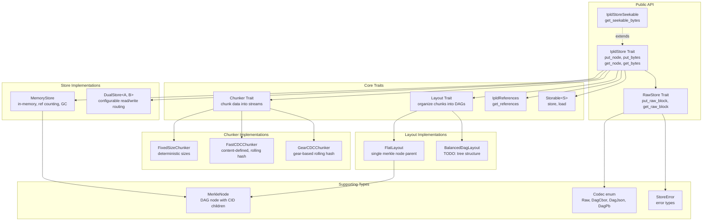
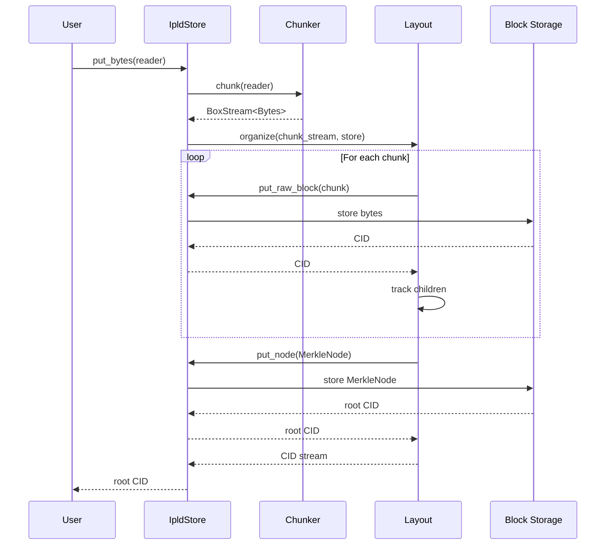
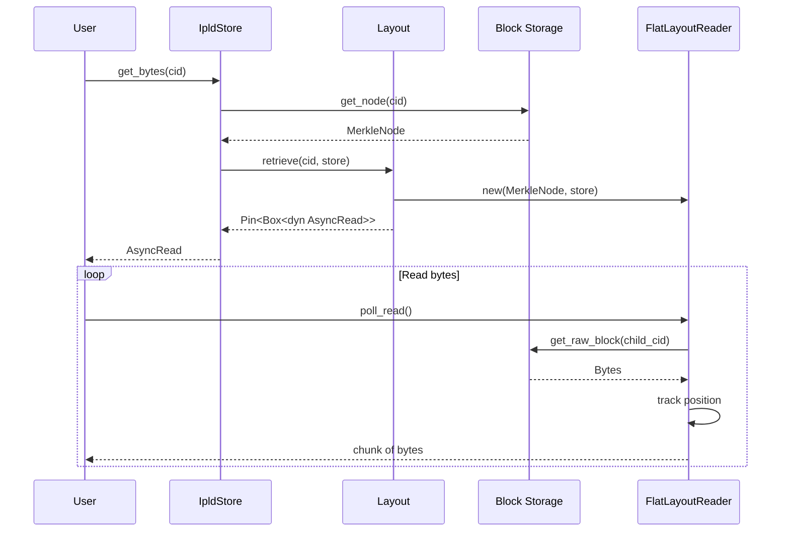
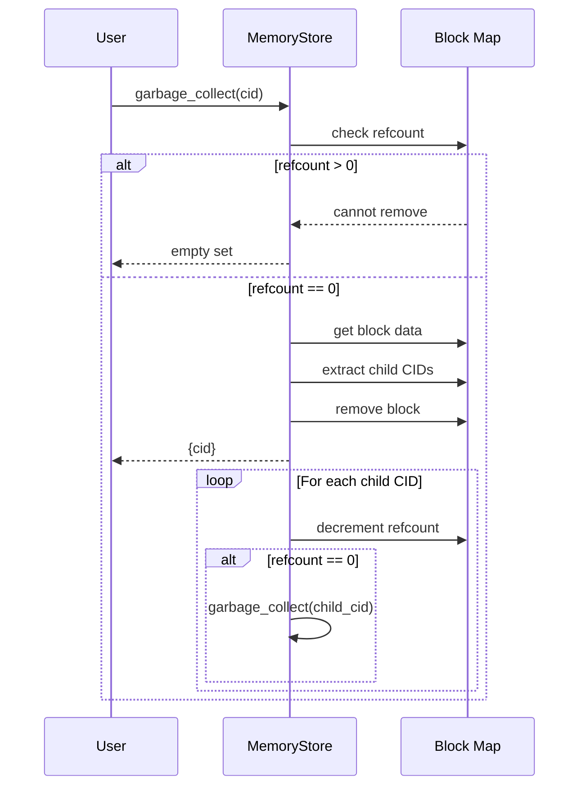

# Project Exploration: ipldstore

## Overview

`ipldstore` is a Rust library for working with IPLD (InterPlanetary Linked Data) content-addressed stores (CAS). The library provides a flexible, modular architecture for storing and retrieving both raw bytes and structured IPLD data using content identifiers (CIDs).

The core value proposition of ipldstore is its emphasis on the structured nature of IPLD data while providing automatic chunking, configurable layout strategies, and reference counting for garbage collection. It supports multiple chunking algorithms (FixedSize, FastCDC, GearCDC) and layout strategies (Flat, BalancedDag) to optimize storage patterns for different use cases.

Key features include:
- Content-addressed storage using CIDs with Blake3-256 hashing
- Automatic chunking of large data with configurable strategies
- Support for DAG-CBOR encoded IPLD nodes and raw bytes
- Reference counting for automatic garbage collection
- Composable store implementations including a DualStore for caching/migration patterns
- Async-first design using tokio runtime

## Repository

- **Location:** `/home/darkvoid/Boxxed/@formulas/src.rust/src.Containers/src.Microsandbox/ipldstore`
- **Remote:** `https://github.com/microsandbox/monobase`
- **Primary Language:** Rust
- **License:** Apache-2.0
- **Version:** 0.2.1

## Directory Structure

```
ipldstore/
├── Cargo.toml                    # Package manifest with dependencies
├── Cargo.lock                    # Locked dependency versions
├── README.md                     # Brief project description
├── CHANGELOG.md                  # Version history and changes
├── LICENSE                       # Apache-2.0 license
├── .gitignore                    # Git ignore patterns
└── lib/                          # Main library source
    ├── lib.rs                    # Library root, module exports, re-exports
    ├── chunker.rs                # Chunker trait definition
    ├── constants.rs              # Default chunk sizes, gear table for CDC
    ├── error.rs                  # StoreError, LayoutError, StoreResult types
    ├── layout.rs                 # Layout trait for organizing chunks into DAGs
    ├── merkle.rs                 # MerkleNode struct for DAG construction
    ├── references.rs             # IpldReferences trait for CID tracking
    ├── storable.rs               # Storable trait for persistent types
    ├── store.rs                  # IpldStore, RawStore traits (core API)
    ├── utils.rs                  # CID generation utilities
    └── implementations/          # Concrete implementations
        ├── mod.rs                # Re-exports implementations
        ├── chunkers/             # Chunking algorithm implementations
        │   ├── mod.rs
        │   ├── fixed.rs          # Fixed-size chunking
        │   ├── fastcdc.rs        # Fast Content-Defined Chunking
        │   └── gearcdc.rs        # Gear-based CDC with rolling hash
        ├── layouts/              # Data layout strategies
        │   ├── mod.rs
        │   ├── flat.rs           # Flat array layout with seekable reader
        │   └── balanceddag.rs    # Balanced DAG layout (TODO)
        └── stores/               # Store implementations
            ├── mod.rs
            ├── memstore.rs       # In-memory store with reference counting
            └── dualstore.rs      # Two-store combinator for caching/migration
```

## Architecture

### High-Level Diagram



### Component Breakdown

#### Core Traits

##### IpldStore
- **Location:** `lib/store.rs`
- **Purpose:** Main trait for content-addressed storage operations
- **Dependencies:** RawStore, Codec, IpldReferences, StoreResult
- **Dependents:** MemoryStore, DualStore, Storable
- **Key Methods:**
  - `put_node<T>(&self, node: &T)` - Store serializable IPLD data
  - `put_bytes(&self, reader)` - Store raw bytes with automatic chunking
  - `get_node<D>(&self, cid)` - Retrieve and deserialize IPLD data
  - `get_bytes(&self, cid)` - Get async reader for raw bytes
  - `garbage_collect(&self, cid)` - Remove unreferenced blocks

##### RawStore
- **Location:** `lib/store.rs`
- **Purpose:** Low-level trait for raw block operations
- **Dependencies:** Codec, StoreResult
- **Dependents:** IpldStore, MemoryStore, DualStore
- **Key Methods:**
  - `put_raw_block(&self, bytes)` - Store single block without chunking
  - `get_raw_block(&self, cid)` - Retrieve single block

##### Chunker
- **Location:** `lib/chunker.rs`
- **Purpose:** Split data into chunks for storage
- **Dependencies:** StoreResult, Bytes
- **Dependents:** IpldStore implementations
- **Key Methods:**
  - `chunk(&self, reader)` - Return stream of chunked bytes
  - `chunk_max_size(&self)` - Maximum chunk size constraint

##### Layout
- **Location:** `lib/layout.rs`
- **Purpose:** Organize chunks into IPLD DAG structures
- **Dependencies:** StoreResult, Cid, IpldStore
- **Dependents:** IpldStore implementations
- **Key Methods:**
  - `organize(&self, stream, store)` - Convert chunk stream to CID stream
  - `retrieve(&self, cid, store)` - Get async reader for stored data
  - `get_size(&self, cid, store)` - Get total byte size

#### Store Implementations

##### MemoryStore
- **Location:** `lib/implementations/stores/memstore.rs`
- **Purpose:** Thread-safe in-memory IPLD store
- **Dependencies:** Arc, RwLock, FastCDCChunker, FlatLayout
- **Dependents:** DualStore, application code
- **Key Features:**
  - Reference counting for automatic garbage collection
  - Configurable chunker and layout (generic parameters)
  - Default: `MemoryStore = MemoryStoreImpl<FastCDCChunker, FlatLayout>`
  - Supports `IpldStoreSeekable` for seekable reads

##### DualStore
- **Location:** `lib/implementations/stores/dualstore.rs`
- **Purpose:** Combine two stores with configurable read/write routing
- **Dependencies:** Two IpldStore implementations, DualStoreConfig
- **Dependents:** Application code
- **Use Cases:**
  - Caching layer (fast store for reads, slow store for writes)
  - Migration between storage backends
  - Hybrid storage strategies

#### Chunker Implementations

##### FixedSizeChunker
- **Location:** `lib/implementations/chunkers/fixed.rs`
- **Purpose:** Simple deterministic fixed-size chunking
- **Algorithm:** Reads exactly `chunk_size` bytes per chunk

##### FastCDCChunker
- **Location:** `lib/implementations/chunkers/fastcdc.rs`
- **Purpose:** Content-defined chunking with stable boundaries
- **Algorithm:** FastCDC with rolling hash and gear table
- **Key Features:**
  - Adjustable min/desired/max chunk sizes
  - Mask derivation for cut point probability
  - Position-sensitive rolling hash with 64-byte window

##### GearCDCChunker
- **Location:** `lib/implementations/chunkers/gearcdc.rs`
- **Purpose:** Gear-based content-defined chunking
- **Algorithm:** Rolling hash with high-bit feedback for pattern breaking
- **Key Features:**
  - Simpler mask calculation than FastCDC
  - High-bit feedback mechanism for repetitive data

#### Layout Implementations

##### FlatLayout
- **Location:** `lib/implementations/layouts/flat.rs`
- **Purpose:** Store chunks in flat array with single MerkleNode parent
- **Dependencies:** MerkleNode, IpldStore, AliasableBox
- **Key Features:**
  - `FlatLayoutReader` with seek support
  - Maintains byte_cursor, chunk_index, chunk_distance for seeking
  - Implements AsyncRead and AsyncSeek

##### BalancedDagLayout
- **Location:** `lib/implementations/layouts/balanceddag.rs`
- **Purpose:** Tree-structured DAG for better scalability (TODO)
- **Status:** Not implemented (all methods return `todo!()`)

#### Supporting Types

##### MerkleNode
- **Location:** `lib/merkle.rs`
- **Purpose:** DAG node containing CID references to children
- **Structure:** `size: usize`, `children: Vec<(Cid, usize)>`
- **Implements:** IpldReferences, Serialize, Deserialize

##### Codec
- **Location:** `lib/store.rs`
- **Purpose:** IPLD codec enumeration
- **Variants:** Raw, DagCbor, DagJson, DagPb, Unknown(u64)

## Entry Points

### Library Root
- **File:** `lib/lib.rs`
- **Description:** Module declarations and public re-exports
- **Flow:**
  1. Declares internal modules (chunker, layout, store, etc.)
  2. Re-exports all public types and traits
  3. Provides `ipld`, `multihash`, `codetable` re-export modules

### MemoryStore::new()
- **File:** `lib/implementations/stores/memstore.rs`
- **Description:** Create new in-memory store instance
- **Flow:**
  1. Initialize empty HashMap wrapped in Arc<RwLock>
  2. Create default chunker (FastCDCChunker)
  3. Create default layout (FlatLayout)
  4. Return MemoryStoreImpl with all components

### DualStore::new()
- **File:** `lib/implementations/stores/dualstore.rs`
- **Description:** Create dual store from two backing stores
- **Flow:**
  1. Accept store_a, store_b, and DualStoreConfig
  2. Store all three in DualStore struct
  3. Route operations based on config.read_from and config.write_to

## Data Flow

### Store Operation (put_bytes)



### Retrieve Operation (get_bytes)



### Garbage Collection Flow



## External Dependencies

| Dependency | Version | Purpose |
|------------|---------|---------|
| `anyhow` | 1.0 | Flexible error handling |
| `async-trait` | 0.1 | Async trait support |
| `async-stream` | 0.3 | Stream generation macros |
| `bytes` | 1.9 | Byte buffer management |
| `futures` | 0.3 | Async stream utilities |
| `hex` | 0.4 | Hex encoding/decoding |
| `ipld-core` | 0.4 | IPLD data model and CID handling |
| `multihash` | 0.19 | Multihash format support |
| `multihash-codetable` | 0.1 | Blake3 hashing |
| `serde` | 1.0 | Serialization framework |
| `serde_ipld_dagcbor` | 0.6 | DAG-CBOR codec |
| `thiserror` | 2.0 | Error type derivation |
| `tokio` | 1.42 | Async runtime |
| `tokio-util` | 0.7 | Tokio utilities |
| `tracing` | 0.1 | Instrumentation and logging |
| `typed-builder` | 0.21 | Builder pattern macros |
| `getset` | 0.1 | Getter/setter generation |
| `pretty-error-debug` | 0.3 | Enhanced error debugging |
| `aliasable` | 0.1.3 | Self-referential struct support |
| `microsandbox-utils` | git | SeekableReader trait |

## Configuration

### Chunk Size Constants (lib/constants.rs)

| Constant | Value | Description |
|----------|-------|-------------|
| `DEFAULT_DESIRED_CHUNK_SIZE` | 128 KiB | Target chunk size for CDC |
| `DEFAULT_MIN_CHUNK_SIZE` | 32 KiB | Minimum chunk size |
| `DEFAULT_MAX_CHUNK_SIZE` | 512 KiB | Maximum chunk size |
| `DEFAULT_MAX_NODE_BLOCK_SIZE` | 1 MiB | Maximum IPLD node size |

### Store Configuration

#### MemoryStore
Uses `TypedBuilder` pattern for configuration:
```rust
MemoryStore::builder()
    .chunker(custom_chunker)
    .layout(custom_layout)
    .build()
```

#### DualStore
Uses `DualStoreConfig`:
```rust
DualStoreConfig {
    read_from: Choice::A,  // or Choice::B
    write_to: Choice::B,   // or Choice::A
}
```

### Supported Codecs
- `Codec::Raw` (0x55) - Raw bytes
- `Codec::DagCbor` (0x71) - DAG-CBOR encoded IPLD
- `Codec::DagJson` (0x0129) - DAG-JSON encoded IPLD
- `Codec::DagPb` (0x70) - DAG-Protobuf

## Testing

### Test Organization
Tests are co-located with source files using `#[cfg(test)]` modules.

### Running Tests
```bash
cargo test
```

### Test Coverage Areas

#### MemoryStore Tests (`lib/implementations/stores/memstore.rs`)
- `test_memory_store_raw_block` - Basic raw block storage
- `test_memory_store_bytes` - Byte storage with automatic chunking
- `test_memory_store_node` - IPLD node storage and retrieval
- `test_memory_store_error_handling` - Error cases
- `test_memory_store_operations` - Metadata operations
- `test_memory_store_garbage_collect` - Single-level GC
- `test_memory_store_complex_garbage_collect` - Multi-level DAG GC

#### DualStore Tests (`lib/implementations/stores/dualstore.rs`)
- `test_dual_store_default_config` - Default routing behavior
- `test_dual_store_basic_operations` - Put/get operations
- `test_dual_store_read_fallback` - Fallback to secondary store
- `test_dual_store_different_configurations` - Various routing configs
- `test_dual_store_raw_operations` - Raw block operations
- `test_dual_store_bytes_operations` - Byte stream operations
- `test_dual_store_metadata` - Block count, empty checks

#### FastCDCChunker Tests (`lib/implementations/chunkers/fastcdc.rs`)
- `test_fastcdc_size_to_mask` - Mask bit calculation
- `test_fastcdc_valid_chunk_sizes` - Valid parameter combinations
- `test_fastcdc_invalid_chunk_sizes` - Invalid parameter rejection
- `test_fastcdc_basic_chunking` - Basic chunking functionality
- `test_fastcdc_empty_input` - Empty input handling
- `test_fastcdc_chunk_distribution` - Statistical chunk size analysis

#### FlatLayout Tests (`lib/implementations/layouts/flat.rs`)
- `test_flat_layout_organize_and_retrieve` - End-to-end organize/retrieve
- `test_flat_layout_seek` - Seeking operations (start, current, end)
- `test_flat_layout_sizes` - Size reporting
- `test_flat_layout_empty_stream` - Empty stream handling

## Key Insights

1. **Content-Addressed Foundation**: All data is addressed by CIDs generated using Blake3-256 hashing, ensuring content integrity and deduplication.

2. **Modular Design**: The separation of concerns between Chunker (how to split), Layout (how to organize), and Store (where to persist) enables flexible composition.

3. **Reference Counting GC**: MemoryStore uses reference counting instead of mark-and-sweep GC, which works efficiently because IPLD forms a DAG (no cycles possible).

4. **Seekable Reading**: FlatLayout implements a sophisticated reader that maintains three state variables (byte_cursor, chunk_index, chunk_distance) to enable efficient seeking across chunk boundaries.

5. **DualStore Flexibility**: The DualStore pattern enables powerful patterns like caching, migration, and hybrid storage without modifying underlying store implementations.

6. **FastCDC Algorithm**: The FastCDC implementation uses clever bit manipulation with size-derived masks to control cut point probability, achieving normalized chunk sizes around the target.

7. **Generic Store Implementation**: MemoryStore is generic over Chunker and Layout types, allowing compile-time selection of strategies.

8. **Incomplete Features**: BalancedDagLayout is declared but not implemented, indicating planned future work for tree-structured DAGs.

## Open Questions

1. **BalancedDagLayout Implementation**: What is the intended algorithm for the balanced DAG layout? What advantages does it provide over FlatLayout?

2. **Persistence**: The library currently only provides MemoryStore. Are there plans for persistent store implementations (e.g., filesystem, database backends)?

3. **IpldStoreSeekable**: Only MemoryStore with FlatLayout supports seekable reads. What is needed to extend this to other layout strategies?

4. **Garbage Collection Concurrency**: The current GC implementation uses RwLock. How does it handle concurrent access during collection?

5. **Streaming Performance**: For very large data, how does the streaming chunk->organize->store pipeline handle backpressure?

6. **DualStore Consistency**: When write_to and read_from differ, what guarantees exist for reading recently written data?

7. **Block Size Limits**: The 1 MiB default max node block size seems arbitrary. What benchmarks informed this choice?

8. **Codec Support**: While DagJson and DagPb are defined in the Codec enum, only DagCbor and Raw appear to have full implementation support. What is needed for complete codec support?
