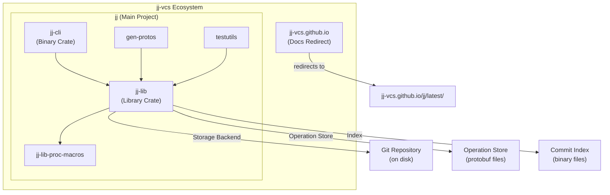
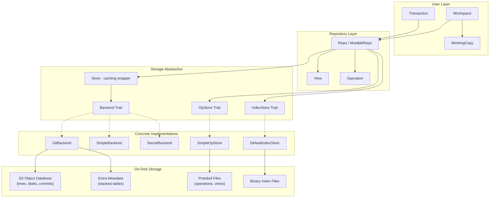

# Project Exploration: jj-vcs Ecosystem

## Overview

The jj-vcs ecosystem is centered around **Jujutsu (jj)**, an experimental version control system written in Rust. Jujutsu rethinks version control by separating the user-facing model from the underlying storage backend. Its default storage layer is Git, meaning it can operate on any existing Git repository while providing a fundamentally different user experience built around changes (not commits), an operation log for full undo support, and first-class conflict tracking.

The ecosystem consists of two sub-projects: the main `jj` repository (the VCS itself -- CLI + library) and `jj-vcs.github.io` (a simple GitHub Pages redirect to the project documentation). The core innovation lies in jj's layered architecture: a `Backend` trait that abstracts storage (with Git as the primary implementation), an operation log that records every mutation to the repository as an immutable DAG, and a change-based model where each logical change carries a stable `ChangeId` that survives rewrites.

This exploration focuses heavily on the storage architecture, change-tracking model, and how jj manages to provide Git-compatible storage while offering a superior user-level abstraction.

## Repository

- **Location:** `/home/darkvoid/Boxxed/@formulas/src.rust/src.jj-vcs`
- **Remote:** `https://github.com/jj-vcs/jj`
- **Primary Language:** Rust
- **License:** Apache-2.0
- **Version:** 0.28.2

## Sub-Projects

| Sub-Project | Location | Description |
|-------------|----------|-------------|
| jj | `jj/` | The main Jujutsu VCS -- CLI binary and core library |
| jj-vcs.github.io | `jj-vcs.github.io/` | GitHub Pages redirect to documentation site |

## Architecture

### High-Level Ecosystem Diagram

### Core Architecture (jj-lib)

## Key Concepts

### Change vs Commit

The most important conceptual difference from Git is jj's separation of **Change** and **Commit**:

- A **CommitId** is a content-addressed hash of the commit data (like Git). Rewriting a commit produces a new CommitId.
- A **ChangeId** is a stable, randomly-generated identifier that follows a logical change across rewrites. When you amend, rebase, or squash a commit, the ChangeId is preserved.
- Commits track their **predecessors** (the previous version of the same change), creating an evolution history.

### Operation Log

Every mutation to the repository is recorded as an **Operation** in an immutable DAG. Each operation points to a **View** (a snapshot of all refs, heads, and workspace states). This enables:
- Full undo of any operation
- Concurrent workspace support
- Debugging "what happened?" scenarios

### First-Class Conflicts

Conflicts are stored as structured data, not textual markers. A conflict is a `Merge<T>` -- an alternating sequence of adds and removes. This allows conflicts to propagate through rebases and resolve automatically when possible.

## Deep Dive Documents

For detailed analysis of specific subsystems, see:

- **[jj-exploration.md](./jj-exploration.md)** -- Detailed exploration of the main jj project
- **[jj-vcs.github.io-exploration.md](./jj-vcs.github.io-exploration.md)** -- The documentation site
- **[storage-deep-dive.md](./storage-deep-dive.md)** -- How jj stores data on disk
- **[change-tracking-deep-dive.md](./change-tracking-deep-dive.md)** -- How changes are tracked, the change/commit duality
- **[rust-revision.md](./rust-revision.md)** -- Rust crate breakdown and reproduction guide

## Key Insights

- jj uses Git as a storage backend by default, storing all trees, blobs, and commits in a standard Git object database. This makes it fully compatible with existing Git tooling.
- Non-Git metadata (ChangeId mappings, operation log) is stored separately using protobuf-serialized files and a custom stacked-table format for efficient lookups.
- The `Backend` trait is the central abstraction point -- `GitBackend`, `SimpleBackend`, and `SecretBackend` all implement it, making the system extensible to entirely different storage models (e.g., Google's cloud-based Piper/CitC).
- The diff algorithm operates on word-level and line-level ranges, using hash-based comparison for performance, similar to the patience/histogram diff family.
- Content hashing uses BLAKE2b-512 throughout (for operations, views, and the simple backend's content-addressed storage).
- The workspace model separates the "repo" (shared, immutable after each operation) from the "working copy" (per-workspace mutable state), enabling multiple workspaces per repository.
- Protobuf is used for serialization of operations, views, and backend objects in the simple backend; the Git backend stores jj-specific metadata in git commit headers and a sidecar stacked-table store.

## Open Questions

- The "native backend" (SimpleBackend) is described as experimental and primarily for testing -- it is unclear if there are plans to develop it into a production-ready alternative to the Git backend.
- The SubmoduleStore abstraction exists but appears minimal -- submodule support seems early-stage.
- Performance characteristics of the stacked-table metadata store under very large repositories (millions of commits) are not documented.
