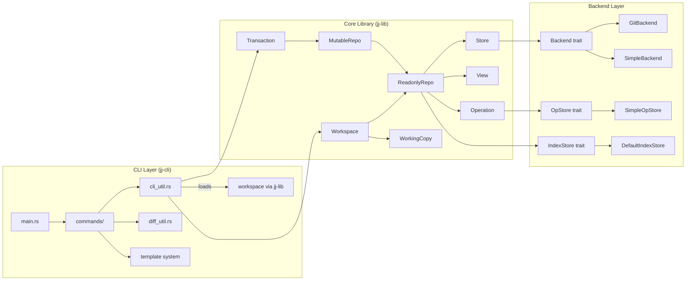
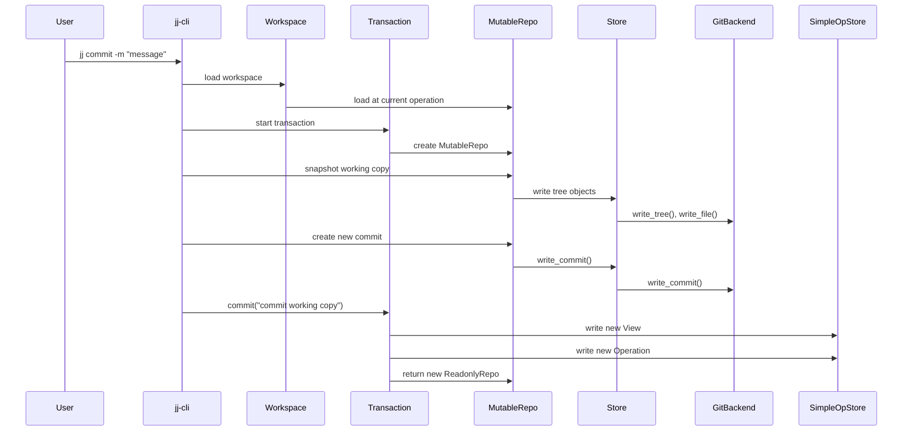
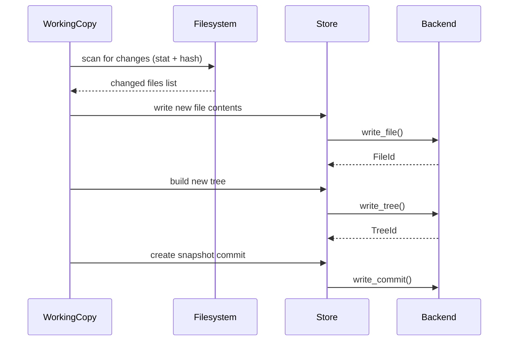

# Project Exploration: Jujutsu (jj)

## Overview

Jujutsu is an experimental version control system implemented in Rust. It provides a fundamentally different user experience from Git while using Git repositories as its default storage backend. The project is structured as a Cargo workspace with two primary crates: `jj-lib` (the core library containing all VCS logic) and `jj-cli` (the command-line interface). Supporting crates include `jj-lib-proc-macros` (derive macros for content hashing), `gen-protos` (protobuf code generation), and `testutils` (shared test infrastructure).

The system's architecture cleanly separates concerns: a `Backend` trait abstracts all object storage, an `OpStore` trait manages the operation log, and an `IndexStore` trait provides commit graph indexing. The CLI is a thin layer over the library, using clap for argument parsing, a custom template language for output formatting, and Sapling's renderdag for graph visualization.

## Repository

- **Location:** `/home/darkvoid/Boxxed/@formulas/src.rust/src.jj-vcs/jj`
- **Remote:** `https://github.com/jj-vcs/jj`
- **Primary Language:** Rust (100%)
- **License:** Apache-2.0
- **Version:** 0.28.2
- **MSRV:** Rust 1.84

## Directory Structure

```
jj/
  Cargo.toml              # Workspace root -- defines all members and shared deps
  Cargo.lock              # Pinned dependency versions
  cli/                    # jj-cli binary crate
    Cargo.toml
    src/
      main.rs             # Binary entry point
      lib.rs              # CLI library (for testing)
      cli_util.rs         # Core CLI utilities, workspace loading
      command_error.rs    # Error types for CLI
      commands/           # One module per jj subcommand
        mod.rs            # Command dispatch
        abandon.rs        # jj abandon
        absorb.rs         # jj absorb
        bookmark/         # jj bookmark (create, delete, list, etc.)
        commit.rs         # jj commit
        config/           # jj config (get, set, list, etc.)
        debug/            # jj debug (internal debugging commands)
        diff.rs           # jj diff
        git/              # jj git (clone, push, fetch, etc.)
        log.rs            # jj log
        new.rs            # jj new
        operation/        # jj operation (log, undo, restore)
        rebase.rs         # jj rebase
        split.rs          # jj split
        squash.rs         # jj squash
        status.rs         # jj status
        ...               # ~40+ command modules
      config/             # Config handling modules
      config-schema.json  # JSON Schema for jj config
      merge_tools/        # External merge tool integration
      formatter.rs        # Output formatting (color, plain, etc.)
      graphlog.rs         # Graph rendering for log output
      template_builder.rs # Template language compilation
      template_parser.rs  # Template language parsing
      template.pest       # PEG grammar for template language
      templater.rs        # Template evaluation
      ui.rs               # Terminal UI abstraction
      diff_util.rs        # Diff display utilities
      git_util.rs         # Git-specific CLI utilities
    testing/              # Fake editor/formatter binaries for tests
    tests/                # Integration tests (snapshot-based with insta)
    docs/                 # CLI documentation generation
    examples/             # Example configurations
  lib/                    # jj-lib core library
    Cargo.toml
    src/
      lib.rs              # Library root -- re-exports all modules
      backend.rs          # Backend trait + core types (CommitId, ChangeId, Tree, etc.)
      store.rs            # Store -- caching wrapper around Backend
      commit.rs           # High-level Commit type
      commit_builder.rs   # Builder pattern for creating commits
      repo.rs             # ReadonlyRepo, MutableRepo, RepoLoader
      transaction.rs      # Transaction -- atomic repo mutations
      operation.rs        # Operation wrapper type
      op_store.rs         # OpStore trait + View, Operation data types
      simple_op_store.rs  # Protobuf-based OpStore implementation
      op_heads_store.rs   # Tracks current operation head(s)
      op_walk.rs          # Walking/resolving the operation DAG
      view.rs             # View -- snapshot of all refs at a point in time
      workspace.rs        # Workspace -- ties repo + working copy together
      working_copy.rs     # WorkingCopy trait
      local_working_copy.rs # Default filesystem working copy
      git_backend.rs      # GitBackend -- stores objects in Git ODB
      simple_backend.rs   # SimpleBackend -- native protobuf-based storage
      secret_backend.rs   # SecretBackend -- filters access to secret paths
      git.rs              # Git import/export operations
      git_subprocess.rs   # Git subprocess management
      merge.rs            # Merge<T> -- first-class conflict representation
      merged_tree.rs      # MergedTree -- lazily merged set of trees
      diff.rs             # Diff algorithm (word-level, line-level)
      conflicts.rs        # Conflict materialization/parsing
      rewrite.rs          # Commit rewriting (rebase, merge trees)
      revset.rs           # Revset language for selecting commits
      revset_parser.rs    # Revset expression parser
      revset.pest         # PEG grammar for revset language
      fileset.rs          # Fileset language for path matching
      fileset_parser.rs   # Fileset parser
      fileset.pest        # PEG grammar for fileset
      index.rs            # Index trait (commit graph index)
      default_index/      # Default on-disk commit index
        mod.rs            # Module root
        composite.rs      # CompositeIndex -- stacked readonly segments
        entry.rs          # IndexEntry, IndexPosition types
        mutable.rs        # MutableIndexSegment -- in-memory index building
        readonly.rs       # ReadonlyIndexSegment -- memory-mapped on-disk
        store.rs          # DefaultIndexStore
        rev_walk.rs       # Efficient DAG walking using index
        revset_engine.rs  # Revset evaluation engine
        revset_graph_iterator.rs
      content_hash.rs     # ContentHash trait + BLAKE2b-512 hashing
      stacked_table.rs    # Persistent key-value table with parent chaining
      object_id.rs        # ObjectId trait, id_type! macro
      repo_path.rs        # Repository-relative path types
      ref_name.rs         # Ref name types (bookmark, remote, workspace)
      refs.rs             # Ref merging logic
      dag_walk.rs         # Generic DAG walking algorithms
      graph.rs            # Graph node types for rendering
      matchers.rs         # Path matchers for tree diffing
      tree.rs             # Tree operations, conflict resolution
      tree_builder.rs     # TreeBuilder for constructing trees
      files.rs            # File-level merge operations
      settings.rs         # UserSettings, GitSettings
      config.rs           # Configuration parsing
      config_resolver.rs  # Config layering (system, user, repo)
      signing.rs          # Commit signing abstraction
      gpg_signing.rs      # GPG signing implementation
      ssh_signing.rs      # SSH signing implementation
      copies.rs           # Copy/rename tracking
      annotate.rs         # File annotation (blame)
      absorb.rs           # Absorb (apply hunks to matching commits)
      fix.rs              # Fix (run formatters on files)
      protos/             # Protobuf definitions and generated code
        op_store.proto    # Operation + View schema
        simple_store.proto # SimpleBackend object schema
        git_store.proto   # GitBackend extra metadata schema
        working_copy.proto # Working copy state schema
      lock/               # File locking utilities
      config/             # Config schema definitions
    gen-protos/           # Protobuf code generation build crate
    proc-macros/          # ContentHash derive macro
    testutils/            # Shared test infrastructure
    tests/                # Library integration tests
    benches/              # Benchmarks (diff benchmarks)
  docs/                   # MkDocs documentation source
  demos/                  # Demo scripts
  flake.nix               # Nix flake for development
  deny.toml               # cargo-deny configuration
  rustfmt.toml            # Formatting configuration
  mkdocs.yml              # Documentation build config
```

## Architecture

### Component Relationship Diagram



### Component Breakdown

#### Backend (`lib/src/backend.rs`)
- **Location:** `lib/src/backend.rs`
- **Purpose:** Defines the `Backend` trait and all core data types (CommitId, ChangeId, TreeId, FileId, Tree, Commit, Conflict, TreeValue, MergedTreeId). This is the foundation of all storage.
- **Dependencies:** `content_hash`, `merge`, `object_id`, `repo_path`
- **Dependents:** Every other module -- this is the type system root.

#### Store (`lib/src/store.rs`)
- **Location:** `lib/src/store.rs`
- **Purpose:** Wraps a `Backend` with LRU caches for commits (100 entries) and trees (1000 entries). Provides ergonomic methods returning high-level types.
- **Dependencies:** `backend`, `commit`, `tree`, `signing`
- **Dependents:** `repo`, `workspace`, `commit`, `tree_builder`

#### GitBackend (`lib/src/git_backend.rs`)
- **Location:** `lib/src/git_backend.rs`
- **Purpose:** Implements `Backend` using a Git repository (via the `gix` crate). Stores trees, blobs, and commits as native Git objects. Stores jj-specific metadata (ChangeId-to-CommitId mappings) in a sidecar stacked-table store under `store/extra/`.
- **Dependencies:** `gix`, `prost`, `stacked_table`, `backend`
- **Dependents:** `repo` (via Backend trait)

#### SimpleBackend (`lib/src/simple_backend.rs`)
- **Location:** `lib/src/simple_backend.rs`
- **Purpose:** A pure jj backend that stores objects as protobuf-serialized files, content-addressed by BLAKE2b-512 hash. Primarily used for testing.
- **Dependencies:** `blake2`, `prost`, `backend`
- **Dependents:** `repo` (via Backend trait)

#### Repo (`lib/src/repo.rs`)
- **Location:** `lib/src/repo.rs`
- **Purpose:** `ReadonlyRepo` is an immutable view of the repository at a specific operation. `MutableRepo` allows in-memory modifications that are committed via `Transaction`. `RepoLoader` handles loading from disk.
- **Dependencies:** Nearly everything in jj-lib
- **Dependents:** `workspace`, `transaction`, CLI commands

#### Transaction (`lib/src/transaction.rs`)
- **Location:** `lib/src/transaction.rs`
- **Purpose:** Wraps a `MutableRepo` and produces a new `Operation` when committed. Provides atomic mutation semantics -- changes are invisible until commit.
- **Dependencies:** `repo`, `op_store`, `operation`, `view`
- **Dependents:** CLI commands (all state-modifying operations)

#### Operation & OpStore (`lib/src/operation.rs`, `lib/src/op_store.rs`)
- **Location:** `lib/src/operation.rs`, `lib/src/op_store.rs`
- **Purpose:** Defines the operation log data model. Each `Operation` has parent operations, a `ViewId`, and metadata (timestamps, hostname, username, description). The `View` captures all heads, bookmarks, tags, remote refs, and workspace commit IDs.
- **Dependencies:** `backend` (for CommitId), `content_hash`, `merge`
- **Dependents:** `repo`, `transaction`, `workspace`

#### Default Index (`lib/src/default_index/`)
- **Location:** `lib/src/default_index/`
- **Purpose:** On-disk commit graph index using stacked binary segments. Enables O(1) commit lookup by position, efficient ancestor queries, and revset evaluation. Each segment has a parent segment, forming a chain that can be compacted.
- **Dependencies:** `backend`, `index`, `object_id`
- **Dependents:** `repo`, revset evaluation

#### Merge (`lib/src/merge.rs`)
- **Location:** `lib/src/merge.rs`
- **Purpose:** The `Merge<T>` type represents a value with possible conflicts as alternating adds and removes. A resolved merge has a single add. A 3-way conflict has [add0, remove, add1]. This is the foundation of first-class conflict support.
- **Dependencies:** `backend`, `content_hash`
- **Dependents:** `merged_tree`, `op_store`, `conflicts`, `rewrite`

#### Diff (`lib/src/diff.rs`)
- **Location:** `lib/src/diff.rs`
- **Purpose:** Word-level and line-level diff algorithm. Uses hash-based comparison with configurable whitespace handling. Splits input into ranges (words, lines, or non-word characters) and finds common subsequences using a patience-like algorithm with a hash table.
- **Dependencies:** `bstr`, `hashbrown`, `smallvec`
- **Dependents:** `conflicts`, CLI diff display

#### Revset (`lib/src/revset.rs`)
- **Location:** `lib/src/revset.rs`
- **Purpose:** A domain-specific language for selecting sets of commits, inspired by Mercurial's revsets. Supports expressions like `ancestors(main)`, `bookmarks()`, `author(pattern)`, etc. Parsed via PEG grammar, compiled to an AST, and evaluated against the index.
- **Dependencies:** `backend`, `index`, `repo`
- **Dependents:** CLI commands (log, rebase, etc.)

#### Content Hash (`lib/src/content_hash.rs`)
- **Location:** `lib/src/content_hash.rs`
- **Purpose:** Defines the `ContentHash` trait for portable, stable hashing. Uses BLAKE2b-512. Provides a derive macro via `jj-lib-proc-macros`. All content-addressed types implement this trait.
- **Dependencies:** `blake2`, `digest`
- **Dependents:** All content-addressed types (Commit, Tree, Operation, View, etc.)

#### Stacked Table (`lib/src/stacked_table.rs`)
- **Location:** `lib/src/stacked_table.rs`
- **Purpose:** A persistent, append-only key-value store with parent chaining. Used by GitBackend to map Git commit hashes to jj ChangeIds. Each table segment stores sorted fixed-size keys with variable-size values, and can reference a parent segment.
- **Dependencies:** `blake2`, file locking
- **Dependents:** `git_backend`

## Entry Points

### CLI Binary (`cli/src/main.rs`)
- **File:** `cli/src/main.rs`
- **Description:** The `jj` binary entry point. Initializes logging, parses arguments, and dispatches to command handlers.
- **Flow:** `main()` -> `cli_util::CliRunner::init()` -> argument parsing -> command dispatch -> `Transaction::commit()` -> new `Operation` written

### Library (`lib/src/lib.rs`)
- **File:** `lib/src/lib.rs`
- **Description:** Re-exports all library modules. External consumers use `jj_lib::*`.

## Data Flow

### Typical Command Execution



### Working Copy Snapshot



## External Dependencies

| Dependency | Version | Purpose |
|------------|---------|---------|
| gix | 0.71.0 | Git repository operations (primary backend) |
| git2 | 0.20.1 | Git operations (legacy, being phased out) |
| clap | 4.5.37 | CLI argument parsing |
| prost | 0.13.5 | Protocol buffer serialization |
| blake2 | 0.10.6 | BLAKE2b-512 content hashing |
| serde / serde_json | 1.0 | Configuration serialization |
| toml_edit | 0.22.25 | TOML config file editing |
| pest | 2.8.0 | PEG parser for revset, fileset, template grammars |
| itertools | 0.14.0 | Iterator combinators (used extensively) |
| smallvec | 1.14.0 | Stack-allocated small vectors for index entries |
| hashbrown | 0.15.2 | High-performance hash table (diff algorithm) |
| rayon | 1.10.0 | Parallel iteration |
| thiserror | 2.0.12 | Error type derivation |
| tracing | 0.1.41 | Structured logging / tracing |
| futures | 0.3.31 | Async stream abstractions |
| pollster | 0.4.0 | Block on async in sync context |
| clru | 0.6.2 | LRU cache for Store |
| sapling-renderdag | 0.1.0 | DAG graph rendering (from Meta's Sapling) |
| sapling-streampager | 0.11.0 | Terminal pager |
| scm-record | 0.8.0 | Interactive hunk selection |
| crossterm | 0.28 | Terminal control |
| tempfile | 3.19.1 | Temporary file creation |
| chrono | 0.4.40 | Timestamp handling |

## Configuration

Jujutsu uses a layered TOML configuration system:

1. **System config** (`/etc/jj/config.toml`)
2. **User config** (`~/.jjconfig.toml` or `$XDG_CONFIG_HOME/jj/config.toml`)
3. **Repository config** (`.jj/repo/config.toml`)
4. **Command-line overrides** (`--config 'key=value'`)

Key configuration areas:
- `user.name` / `user.email` -- author identity
- `ui.default-command` -- what `jj` with no args does
- `ui.pager` -- terminal pager
- `ui.diff.format` -- diff display format
- `template-aliases` -- custom template definitions
- `revset-aliases` -- custom revset aliases
- `signing` -- commit signing configuration (GPG/SSH)

A JSON Schema is provided at `cli/src/config-schema.json`.

## Testing

- **Framework:** Uses Rust's built-in `#[test]` framework with `insta` for snapshot testing.
- **CLI tests:** Snapshot-based integration tests using `assert_cmd` that invoke the `jj` binary and compare output.
- **Library tests:** Unit tests in each module + integration tests in `lib/tests/`.
- **Test utilities:** `testutils` crate provides `TestRepo`, `TestWorkspace`, and helpers for creating test repositories.
- **Benchmarks:** `lib/benches/diff_bench.rs` benchmarks the diff algorithm using `criterion`.
- **Fake binaries:** `cli/testing/` contains fake editor, diff-editor, and formatter binaries for testing interactive workflows.

## Key Insights

- The codebase is exceptionally well-structured with clear trait boundaries. The `Backend` / `OpStore` / `IndexStore` / `WorkingCopy` traits make the system highly pluggable.
- `Merge<T>` as a first-class type permeates the entire codebase -- trees, refs, and values can all be in a conflicted state, and the system handles this uniformly.
- The GitBackend stores jj's ChangeId in a custom git commit header (`change-id`), making it possible for the metadata to live inside the git object itself (when `write_change_id_header` is enabled).
- The operation log is a DAG (not a linear log) because concurrent operations from multiple workspaces can create divergent heads that are later merged.
- The `Store` caching layer is notably simple -- just two LRU caches (100 commits, 1000 trees) behind Mutexes. This is adequate because most operations are sequential.
- `pollster::FutureExt::block_on()` is used throughout to bridge async backend methods into sync code, indicating the async support is primarily for future backend implementations that may be truly async (e.g., network backends).
- The revset and template languages use PEG grammars (pest) for parsing, giving them well-defined, composable syntax.
- The codebase uses `SmallVec` extensively in the index for stack-allocated small vectors, avoiding heap allocation for common cases (e.g., commits with 1-2 parents).

## Open Questions

- The relationship between `git2` and `gix` is in transition -- both are currently used, with `gix` being the primary and `git2` as a legacy fallback. The eventual removal of `git2` would simplify the dependency tree.
- The `SecretBackend` is interesting but minimally documented -- it wraps another backend and restricts access to certain paths, potentially for use in environments with mixed-sensitivity repositories.
- The async architecture (using `pollster` to block on async methods) suggests future plans for truly async backends, but the current design is effectively synchronous.
