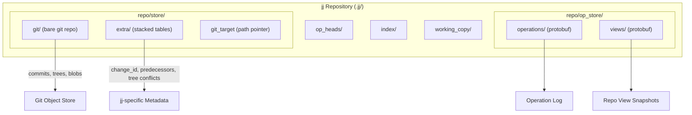
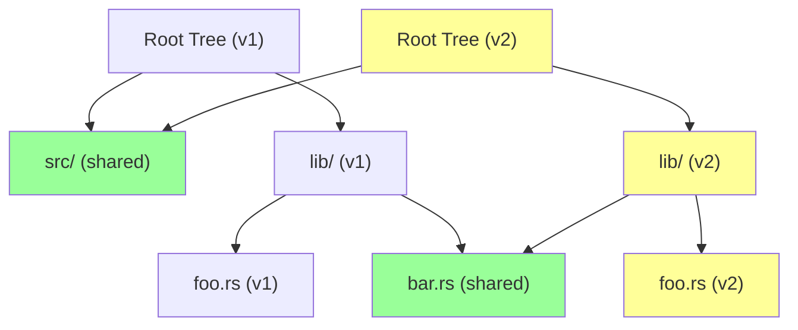
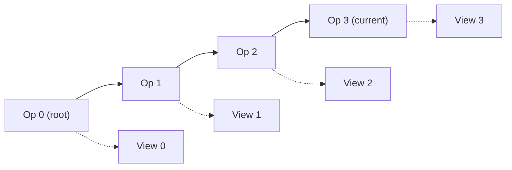
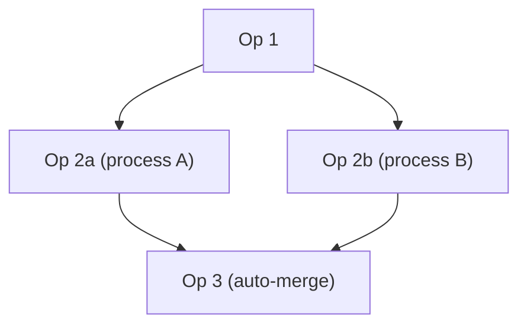

# jj-vcs Storage and Diff Mechanisms: Deep Dive

> Source: `/home/darkvoid/Boxxed/@formulas/src.rust/src.jj-vcs/jj/lib/src/`
> Date: 2026-03-23

---

## Table of Contents

1. [Storage Architecture Overview](#1-storage-architecture-overview)
2. [Commit Storage Model](#2-commit-storage-model)
3. [Diff Algorithm Deep Dive](#3-diff-algorithm-deep-dive)
4. [Tree Storage and Change Tracking](#4-tree-storage-and-change-tracking)
5. [Operation Log](#5-operation-log)
6. [Merge Algorithm](#6-merge-algorithm)
7. [Applying Changes / Rebasing](#7-applying-changes--rebasing)
8. [Efficiency Analysis](#8-efficiency-analysis)
9. [Key Data Structures](#9-key-data-structures)

---

## 1. Storage Architecture Overview

### On-Disk Directory Layout

A jj repository lives inside a `.jj/` directory at the workspace root. The layout is:

```
.jj/
  repo/
    store/
      backend          # Text file: "git" or "Simple"
      git_target       # Path to the git repo (if git backend)
      git/             # Bare git repo (if internal git backend)
      extra/           # Stacked table store for jj-specific metadata
        <hash>.table   # Stacked table segments
    op_store/
      operations/      # Content-addressed operation objects
      views/           # Content-addressed view objects
      type              # "simple_op_store"
    op_heads/
      heads/           # One file per current op head
    index/             # Commit graph index segments
  working_copy/
    checkout           # Protobuf: operation_id + workspace_name
    tree_state         # Protobuf: tree_ids + file_states + sparse_patterns
```

For the **SimpleBackend** (native/non-git), the store directory contains:

```
store/
  commits/    # Protobuf-serialized commit objects, named by BLAKE2b-512 hash
  trees/      # Protobuf-serialized tree objects
  files/      # Raw file contents
  symlinks/   # Symlink targets as raw text
  conflicts/  # Protobuf-serialized conflict objects
```

### Two Backend Implementations

jj defines a `Backend` trait (in `backend.rs`) with two primary implementations:

| Property | **GitBackend** (`git_backend.rs`) | **SimpleBackend** (`simple_backend.rs`) |
|---|---|---|
| Hash algorithm | SHA-1 (20 bytes) via git objects | BLAKE2b-512 (64 bytes) |
| Object storage | Git object store (via `gix` crate) | Flat files in `store/{type}/{hash}` |
| Serialization | Git native format + protobuf extras | Protobuf (via `prost`) |
| Commit ID length | 20 bytes | 64 bytes |
| Change ID length | 16 bytes | 16 bytes |
| Concurrency hint | 1 (local I/O) | 1 (local I/O) |
| Production use | Yes (default) | Testing/reference impl |

The `GitBackend` is the real workhorse. It stores standard git objects (commits, trees, blobs) in git's object database and uses a **stacked table store** (`extra/`) for jj-specific metadata that git cannot represent (change IDs, predecessors, tree conflict states).

### Object Types

From `backend.rs`, jj recognizes five object types via `TreeValue`:

```rust
pub enum TreeValue {
    File { id: FileId, executable: bool },
    Symlink(SymlinkId),
    Tree(TreeId),
    GitSubmodule(CommitId),
    Conflict(ConflictId),  // Legacy path-level conflicts
}
```

Each type has a corresponding ID type (`FileId`, `TreeId`, etc.) which wraps a byte vector. These are all content-addressed -- the ID is the hash of the content.

### Relationship Between jj's Storage and Git



When using the git backend:
- **Standard git data** (commit graph, tree structure, file blobs, signatures) goes directly into the git object store
- **jj-specific data** (change IDs, predecessor chains, tree conflict states) goes into a separate stacked table keyed by commit hash
- The two are linked at read time: `read_commit()` first reads the git commit, then overlays data from the extras table

---

## 2. Commit Storage Model

### The Commit Struct

From `backend.rs`:

```rust
pub struct Commit {
    pub parents: Vec<CommitId>,
    pub predecessors: Vec<CommitId>,
    pub root_tree: MergedTreeId,
    pub change_id: ChangeId,
    pub description: String,
    pub author: Signature,
    pub committer: Signature,
    pub secure_sig: Option<SecureSig>,
}
```

Key fields beyond standard git:

- **`predecessors`**: Links to the previous version(s) of this commit before it was rewritten. This is how jj tracks the evolution of changes. When you amend or rebase, the new commit records the old commit as a predecessor.
- **`root_tree: MergedTreeId`**: Can be either a single `TreeId` (resolved) or a `Merge<TreeId>` (conflicted -- see section 6).
- **`change_id`**: A stable identity that follows a commit through rewrites.

### Change IDs vs Commit IDs

This is one of jj's most important design decisions:

| Property | **CommitId** | **ChangeId** |
|---|---|---|
| What determines it | Hash of commit content | Randomly generated, persisted |
| Changes on rewrite | Yes (new hash) | No (preserved) |
| Display format | Hex (`0-9a-f`) | Reverse hex (`z-k` mapping) |
| Length | 20 bytes (git) / 64 bytes (simple) | 16 bytes |
| Purpose | Content integrity, deduplication | Track logical changes across rewrites |

The reverse hex encoding for ChangeId uses a `z-k` alphabet instead of `0-9a-f`. This is done deliberately so that a hex prefix is **never ambiguous** between a commit ID and a change ID -- they use completely different character sets.

When reading a git commit that has no jj metadata, the `ChangeId` is derived deterministically:

```rust
// From git_backend.rs commit_from_git_without_root_parent()
ChangeId::new(
    id.as_bytes()[4..HASH_LENGTH]
        .iter()
        .rev()
        .map(|b| b.reverse_bits())
        .collect(),
)
```

The bits of the commit ID are reversed to prevent any accidental correlation between the two IDs.

When jj itself creates commits, it can write the change ID as a git commit header (`change-id`) so it survives round-tripping through standard git tools. This is controlled by `write_change_id_header` in `GitSettings`.

### How the Git Backend Stores Extra Metadata

The git backend stores jj-specific data in a **stacked table** (`extra/`). The protobuf schema (`git_store.proto`):

```protobuf
message Commit {
  repeated bytes predecessors = 2;
  bytes change_id = 4;
  repeated bytes root_tree = 1;  // Alternating +/- terms for conflicts
  bool uses_tree_conflict_format = 10;
}
```

The stacked table (`stacked_table.rs`) is a persistent key-value store where:
- Keys are fixed-size (commit hash bytes)
- Values are variable-size (protobuf-encoded extras)
- Tables form an append-only chain: child segments reference a parent segment
- Lookups walk from newest to oldest segment
- Compaction merges segments when needed

This design means jj metadata is stored alongside but **separate from** the git object store, enabling:
- Clean separation of concerns
- Standard git tools still work
- No corruption of git's object integrity

### The Root Commit

Every jj repository has a virtual root commit that serves as the parent of all root-level commits:

```rust
pub fn make_root_commit(root_change_id: ChangeId, empty_tree_id: TreeId) -> Commit {
    Commit {
        parents: vec![],
        predecessors: vec![],
        root_tree: MergedTreeId::resolved(empty_tree_id),
        change_id: root_change_id,
        description: String::new(),
        author: /* zero timestamp */,
        committer: /* zero timestamp */,
        secure_sig: None,
    }
}
```

The root commit has all-zero bytes for its ID. It points to the empty tree and has no parents. This ensures every commit always has at least one parent, simplifying graph algorithms.

### Parent Relationships

Commits support:
- **Single parent**: Standard linear history
- **Multiple parents**: Merge commits (including octopus merges with N > 2 parents)
- **Zero parents**: Only the virtual root commit

The common ancestor computation for merges uses `index.common_ancestors()`, which operates on the persistent commit graph index rather than walking the object store.

---

## 3. Diff Algorithm Deep Dive

### Algorithm: Histogram-Based LCS with Recursive Refinement

jj uses a **custom histogram-based diff algorithm** implemented in `diff.rs`. It is not a direct implementation of Myers, Patience, or git's Histogram diff -- it is a unique approach that borrows ideas from histogram diff.

The core algorithm works as follows:

1. **Tokenize** the input into ranges (lines, words, or individual non-word characters)
2. **Build a histogram** of word/token occurrences in one side
3. **Find uncommon shared words** -- tokens that appear in both sides with the fewest occurrences
4. **Use these as anchors** to compute an LCS (Longest Common Subsequence)
5. **Recursively refine** the regions between anchors

### The Histogram Structure

```rust
struct Histogram<'input> {
    word_to_positions: HashTable<HistogramEntry<'input>>,
}

type HistogramEntry<'input> = (HashedWord<'input>, SmallVec<[LocalWordPosition; 2]>);
```

The histogram maps each unique token to its list of positions. The `SmallVec<[LocalWordPosition; 2]>` inlines up to 2 positions (16 bytes on 64-bit), avoiding heap allocation for the common case of unique tokens.

### Core LCS Algorithm

From `collect_unchanged_words_lcs()`:

```rust
fn collect_unchanged_words_lcs<C: CompareBytes, S: BuildHasher>(
    found_positions: &mut Vec<(WordPosition, WordPosition)>,
    left: &LocalDiffSource,
    right: &LocalDiffSource,
    comp: &WordComparator<C, S>,
) {
    let max_occurrences = 100;
    let left_histogram = Histogram::calculate(left, comp, max_occurrences);
    // ...
    // Find words with fewest occurrences in left that also exist in right
    // with the SAME count. These become LCS anchors.
    let uncommon_shared_word_positions = left_count_to_entries
        .values()
        .find_map(|left_entries| {
            // Filter to entries where left count == right count
            // ...
        });
    // Compute LCS of these anchor positions
    let lcs = find_lcs(&left_index_by_right_index);
    // Recursively diff between anchors
    for (left_index, right_index) in lcs {
        collect_unchanged_words(/* recurse into gap */);
        found_positions.push(/* anchor position */);
    }
}
```

Key design decisions:

- **`max_occurrences = 100`**: If a token appears more than 100 times, it is discarded as an anchor candidate. This prevents quadratic blowup on highly repetitive content.
- **Equal-count filtering**: Only tokens with the **same count** in both sides are used as anchors. This is a strong heuristic: if a token appears 3 times in left and 3 times in right, the positions can be matched 1:1.
- **Fallback to leading/trailing match**: If the LCS-based approach finds nothing (all tokens are too common), it falls back to simple prefix/suffix matching.

### The find_lcs Function

The LCS function in `diff.rs` uses a **patience-style approach** with a quadratic inner loop:

```rust
fn find_lcs(input: &[usize]) -> Vec<(usize, usize)> {
    let mut chain = vec![(0, 0, 0); input.len()];
    let mut global_longest = 0;
    let mut global_longest_right_pos = 0;
    for (right_pos, &left_pos) in input.iter().enumerate() {
        let mut longest_from_here = 1;
        let mut previous_right_pos = usize::MAX;
        for i in (0..right_pos).rev() {
            let (previous_len, previous_left_pos, _) = chain[i];
            if previous_left_pos < left_pos {
                let len = previous_len + 1;
                if len > longest_from_here {
                    longest_from_here = len;
                    previous_right_pos = i;
                    if len > global_longest {
                        global_longest = len;
                        global_longest_right_pos = right_pos;
                        break;  // Early termination
                    }
                }
            }
        }
        chain[right_pos] = (longest_from_here, left_pos, previous_right_pos);
    }
    // Trace back to reconstruct the LCS
}
```

This is O(n^2) in the worst case but benefits from:
- The early `break` when extending the globally longest chain
- Operating only on the filtered set of uncommon shared tokens (typically small)
- Recursive decomposition that narrows the problem space

### Multi-Level Diffing

jj supports multiple granularities:

```rust
impl<'input> Diff<'input> {
    // Coarse: entire input as one token
    pub fn unrefined(inputs) -> Self {
        Diff::for_tokenizer(inputs, |_| vec![], CompareBytesExactly)
    }

    // Line-level diff
    pub fn by_line(inputs) -> Self {
        Diff::for_tokenizer(inputs, find_line_ranges, CompareBytesExactly)
    }

    // Word-level diff (used to refine line diffs)
    pub fn by_word(inputs) -> Self {
        let mut diff = Diff::for_tokenizer(inputs, find_word_ranges, CompareBytesExactly);
        diff.refine_changed_regions(find_nonword_ranges, CompareBytesExactly);
        diff
    }
}
```

The tokenizers:

- **`find_line_ranges`**: Splits on `\n` (inclusive), producing `Vec<Range<usize>>`
- **`find_word_ranges`**: Splits on word boundaries where word bytes are `[A-Za-z0-9_\x80-\xFF]`. Multi-byte UTF-8 sequences stay intact since `0x80..0xFF` are word bytes.
- **`find_nonword_ranges`**: Each non-word byte becomes its own token (for refining within changed regions)

### Whitespace Comparison Modes

```rust
pub struct CompareBytesExactly;        // Literal comparison
pub struct CompareBytesIgnoreAllWhitespace;     // Strip all whitespace
pub struct CompareBytesIgnoreWhitespaceAmount;  // Collapse runs of whitespace
```

These implement `CompareBytes` trait which provides custom `eq()` and `hash()` for the histogram.

### Multi-Input Diff

The `Diff` struct supports diffing **any number of inputs** against a base, not just pairs. This is essential for jj's N-way conflict handling:

```rust
pub struct Diff<'input> {
    base_input: &'input BStr,
    other_inputs: SmallVec<[&'input BStr; 1]>,
    unchanged_regions: Vec<UnchangedRange>,
}
```

For multi-input diffs:
1. Diff each "other" input against the base independently
2. **Intersect** the unchanged regions across all diffs
3. Only regions unchanged in ALL inputs are marked as matching

### Binary File Handling

jj treats all files as byte sequences. There is no explicit "binary file" detection in the diff layer. The diff algorithm operates on `&[u8]` and `BStr` throughout. For display purposes, higher-level code may detect binary content, but the storage and diff layers are encoding-agnostic.

### Performance Characteristics

| Aspect | Characteristic |
|---|---|
| Best case | O(n) for identical inputs (all tokens match) |
| Typical case | O(n + k * m) where k = unique anchor tokens, m = avg positions per token |
| Worst case | O(n^2) in LCS computation, but bounded by `max_occurrences=100` filter |
| Memory | O(n) for histograms + O(anchors^2) for LCS chain |
| Recursive depth | Bounded by number of anchor matches (typically log-like) |

### Algorithm Comparison

| Algorithm | Time Complexity | Strength | Weakness | jj's Approach |
|---|---|---|---|---|
| **Myers** | O(ND), D=edit distance | Minimal edit script | Slow on large diffs | Not used |
| **Patience** | O(N log N) on unique lines | Clean, readable diffs | Misses repeated patterns | Inspiration for anchor selection |
| **Histogram** (git) | ~O(N) average | Handles repeated lines well | Complex implementation | Direct inspiration |
| **jj Custom** | O(N) avg, O(N^2) worst | Multi-input, recursive refinement, word-level | More complex | Current implementation |

jj's approach is closest to histogram diff but differs in:
1. Supporting N-way diffs natively (not just pairwise)
2. Recursive refinement between anchors
3. Equal-count filtering rather than lowest-count selection
4. Native word/nonword level tokenization built into the same framework

---

## 4. Tree Storage and Change Tracking

### Tree Object Structure

From `backend.rs`:

```rust
#[derive(ContentHash, Default, PartialEq, Eq, Debug, Clone)]
pub struct Tree {
    entries: BTreeMap<RepoPathComponentBuf, TreeValue>,
}
```

A `Tree` is simply a sorted map from path component names to `TreeValue`s. The `BTreeMap` provides:
- Deterministic iteration order (essential for content-addressing)
- O(log n) lookups
- Natural merge-join for tree diffing

### Protobuf Serialization (SimpleBackend)

```protobuf
message Tree {
  message Entry {
    string name = 1;
    TreeValue value = 2;
  }
  repeated Entry entries = 1;
}
```

For the git backend, trees are stored as standard git tree objects using git's native format.

### Content-Addressed Storage

Both backends use content-addressing:

- **SimpleBackend**: `BLAKE2b-512(protobuf_bytes)` -> file at `store/trees/{hex_hash}`
- **GitBackend**: `SHA-1(git_tree_format)` -> git object store

Benefits:
- **Automatic deduplication**: Identical directory structures share tree objects
- **Immutability**: Objects never change once written
- **Integrity**: Hash verifies content hasn't been corrupted
- **Structural sharing**: If only one file in a deeply nested path changes, only the tree nodes on the path from root to that file are rewritten. All sibling trees are shared.

### Change Propagation Through Trees



When `lib/foo.rs` changes:
1. New `FileId` for `foo.rs` content
2. New `TreeId` for `lib/` (because an entry changed)
3. New `TreeId` for root (because `lib/` entry changed)
4. `src/` and `bar.rs` are **shared** -- same IDs reused

### Tree Diffing

Tree diffs are computed by the `merged_tree_entry_diff()` function which does a sorted merge-join on entry names:

```rust
fn merged_tree_entry_diff<'a>(
    trees1: &'a Merge<Tree>,
    trees2: &'a Merge<Tree>,
) -> impl Iterator<Item = (&'a RepoPathComponent, MergedTreeVal<'a>, MergedTreeVal<'a>)> {
    itertools::merge_join_by(
        all_tree_entries(trees1),
        all_tree_entries(trees2),
        |(name1, _), (name2, _)| name1.cmp(name2),
    )
    .filter(|(_, value1, value2)| value1 != value2)
}
```

This is O(n+m) where n,m are entry counts -- linear in tree size.

### Copy/Rename Tracking

jj supports explicit copy tracking through the `CopyRecord` struct:

```rust
pub struct CopyRecord {
    pub target: RepoPathBuf,           // Destination path
    pub target_commit: CommitId,       // Commit where copy happened
    pub source: RepoPathBuf,           // Source path
    pub source_file: FileId,           // Source content hash
    pub source_commit: CommitId,       // Source commit (for integration)
}
```

Copy records are retrieved via `Backend::get_copy_records()` which returns a stream in reverse-topological order. The `CopyRecords` collection (`copies.rs`) indexes these by source and target path for efficient lookup.

Unlike git (which infers renames heuristically), jj's copy tracking is **explicit** -- backends store actual copy records. The git backend can retrieve them from `gix::diff::blob::Platform`.

---

## 5. Operation Log

### Design Philosophy

The operation log is jj's mechanism for **safe concurrent access** and **undo**. Every mutation to the repository is recorded as an `Operation` that references a `View` (the complete state of refs, heads, working copies).



### Operation Object

From `op_store.rs`:

```rust
pub struct Operation {
    pub view_id: ViewId,
    pub parents: Vec<OperationId>,
    pub metadata: OperationMetadata,
}

pub struct OperationMetadata {
    pub start_time: Timestamp,
    pub end_time: Timestamp,
    pub description: String,
    pub hostname: String,
    pub username: String,
    pub is_snapshot: bool,
    pub tags: HashMap<String, String>,
}
```

Protobuf on disk (`op_store.proto`):

```protobuf
message Operation {
  bytes view_id = 1;
  repeated bytes parents = 2;
  OperationMetadata metadata = 3;
}
```

### View Object

The View captures the **complete state** of the repository at a point in time:

```rust
pub struct View {
    pub head_ids: HashSet<CommitId>,
    pub local_bookmarks: BTreeMap<RefNameBuf, RefTarget>,
    pub tags: BTreeMap<RefNameBuf, RefTarget>,
    pub remote_views: BTreeMap<RemoteNameBuf, RemoteView>,
    pub git_refs: BTreeMap<GitRefNameBuf, RefTarget>,
    pub git_head: RefTarget,
    pub wc_commit_ids: BTreeMap<WorkspaceNameBuf, CommitId>,
}
```

Each `RefTarget` can itself be a `Merge<Option<CommitId>>` -- meaning refs can be in a conflicted state when concurrent operations disagree about where a bookmark points.

### Storage Format

Operations and views are stored as content-addressed protobuf files:
- `op_store/operations/{BLAKE2b-512_hex}` -- serialized `Operation` protobuf
- `op_store/views/{BLAKE2b-512_hex}` -- serialized `View` protobuf

The operation heads are tracked in `op_heads/heads/` as empty files named by operation ID hex.

### Concurrent Access Safety

The operation log enables safe concurrent access through this protocol:

1. **Start transaction**: Read current operation head
2. **Make changes**: Build new View in memory
3. **Commit transaction**:
   a. Write new View to op_store
   b. Write new Operation (parent = the op head we read in step 1)
   c. Atomically update op_heads
4. **Conflict detection**: If another process committed between steps 1 and 3, the op log will have a **fork** (two heads). The next reader will detect this and merge the operations.



The merge of concurrent operations uses the same merge machinery as commit merges -- refs that were changed by both operations become conflicted refs.

### Undo Mechanism

Undo is trivial with the operation log: simply create a new operation whose View is a copy of any previous operation's View. The operation log preserves the full history, so no data is lost.

---

## 6. Merge Algorithm

### First-Class Conflict Objects

jj's most distinctive storage feature is its handling of conflicts as **first-class objects** rather than text markers. A conflict is represented algebraically:

```rust
pub struct Merge<T> {
    /// Alternates between positive and negative terms, starting with positive.
    values: SmallVec<[T; 1]>,
}
```

For a 3-way merge of sides B and C with base A, the conflict is:

```
Merge { values: [B, A, C] }  // [add0, remove0, add1]
```

Interpretation: start with B (first add), subtract A (first remove), add C (second add). The result is: `B - A + C`.

### Invariant

There is always exactly one more "add" term than "remove" terms. For N-way merges:
- 3-way: `[add, remove, add]` (3 values)
- 5-way: `[add, remove, add, remove, add]` (5 values)
- Resolved: `[value]` (1 value)

### Trivial Resolution

From `merge.rs`:

```rust
pub fn trivial_merge<T>(values: &[T]) -> Option<&T>
where T: Eq + Hash {
    // Optimized 3-way case
    if let [add0, remove, add1] = values {
        if add0 == add1 { return Some(add0); }      // Both sides same
        else if add0 == remove { return Some(add1); } // Only right changed
        else if add1 == remove { return Some(add0); } // Only left changed
        else { return None; }                          // Real conflict
    }
    // General N-way case: count occurrences, cancel matching +/-
    let mut counts: HashMap<&T, i32> = HashMap::new();
    for (value, n) in zip(values, [1, -1].into_iter().cycle()) {
        counts.entry(value).and_modify(|e| *e += n).or_insert(n);
    }
    counts.retain(|_, count| *count != 0);
    // If single value with count 1 remains, that's the resolution
}
```

### Tree-Level Merges

The `MergedTree` struct represents a merge of complete trees:

```rust
pub struct MergedTree {
    trees: Merge<Tree>,
}
```

The merge operation is elegant -- it creates a nested merge and then flattens:

```rust
pub fn merge_no_resolve(&self, base: &MergedTree, other: &MergedTree) -> MergedTree {
    let nested = Merge::from_vec(vec![
        self.trees.clone(),   // +
        base.trees.clone(),   // -
        other.trees.clone(),  // +
    ]);
    MergedTree {
        trees: nested.flatten().simplify(),
    }
}
```

The `flatten()` operation handles nested Merges (when inputs are themselves conflicted), and `simplify()` cancels out matching add/remove pairs.

### File-Level Conflict Resolution

For file conflicts, jj attempts automatic resolution in `try_resolve_file_conflict()` (`tree.rs`):

1. Check all terms are files (not tree/symlink/absent)
2. Try trivial resolution on file IDs
3. Try trivial resolution on executable bits
4. If file IDs still conflict, **read all file contents** and attempt content merge
5. Content merge uses `files::try_merge()` which:
   - Computes a line-level diff of all removes and adds
   - For each hunk, tries trivial resolution
   - If all hunks resolve, the merge succeeds
   - If any hunk is unresolvable, returns `None` (conflict persists)

```rust
fn merge_inner<'input, T: AsRef<[u8]>, B: FromMergeHunks<'input>>(
    inputs: &'input Merge<T>,
) -> B {
    let num_diffs = inputs.removes().len();
    let diff = Diff::by_line(inputs.removes().chain(inputs.adds()));
    let hunks = resolve_diff_hunks(&diff, num_diffs);
    B::from_hunks(hunks)
}
```

The diff is computed with removes first, then adds. Each hunk is individually resolved:

```rust
fn resolve_diff_hunks(diff, num_diffs) -> impl Iterator<Item = Merge<&BStr>> {
    diff.hunks().map(|hunk| match hunk.kind {
        DiffHunkKind::Matching => Merge::resolved(hunk.contents[0]),
        DiffHunkKind::Different => {
            let merge = Merge::from_removes_adds(
                hunk.contents[..num_diffs],  // remove sides
                hunk.contents[num_diffs..],  // add sides
            );
            merge.resolve_trivial().map_or(merge, |c| Merge::resolved(*c))
        }
    })
}
```

### Conflict Storage on Disk

**Legacy format**: Conflicts stored as separate `Conflict` objects in the tree, referenced by `ConflictId`. Each tree entry would be `TreeValue::Conflict(id)`.

**Modern format (tree-level conflicts)**: Instead of storing conflict markers in a single tree, jj stores **multiple complete trees** as the `root_tree` of a commit:

```rust
pub enum MergedTreeId {
    Legacy(TreeId),
    Merge(Merge<TreeId>),  // e.g., [tree_B, tree_A, tree_C]
}
```

In the git backend, conflicted trees are stored as a `jj:trees` header in the git commit:

```rust
fn root_tree_from_header(git_commit: &CommitRef) -> Result<Option<MergedTreeId>, ()> {
    for (key, value) in &git_commit.extra_headers {
        if *key == JJ_TREES_COMMIT_HEADER {
            // Parse space-separated hex tree IDs
            // Must be odd count > 1 (otherwise invalid)
        }
    }
}
```

This is a significant advantage: **conflicts are carried through the commit graph** rather than being markers in files. You can rebase a conflicted commit, and the conflict algebra composes correctly.

### The "Rebased" Conflict Model

When a conflicted commit is rebased onto new parents, the merge algebra composes:

```
Original conflict: B - A + C
Rebase onto D (which was rebased from A to D):

New conflict: (B - A + C) - A + D
           = B - A + C - A + D

After simplification (if A appears in both + and -):
           = B + C - A + D    (simplified)
```

The `Merge::simplify()` method handles this by identifying matching add/remove pairs and canceling them.

---

## 7. Applying Changes / Rebasing

### The Rebase Process

From `rewrite.rs`, the core rebase logic in `CommitRewriter::rebase_with_empty_behavior()`:

```rust
let (was_empty, new_tree_id) = if new_parent_trees == old_parent_trees {
    // Optimization: parents unchanged, skip merge
    (true, self.old_commit.tree_id().clone())
} else {
    let old_base_tree = merge_commit_trees(self.mut_repo, &old_parents)?;
    let new_base_tree = merge_commit_trees(self.mut_repo, &new_parents)?;
    let old_tree = self.old_commit.tree()?;
    (
        old_base_tree.id() == *self.old_commit.tree_id(),
        new_base_tree.merge(&old_base_tree, &old_tree)?.id(),
    )
};
```

The formula is: `new_tree = new_base.merge(old_base, old_tree)`

In merge algebra: `new_tree = new_base - old_base + old_tree`

This means: "take the new base, remove what the old base contributed, add what the old commit contributed." This correctly applies the commit's changes on top of the new base.

### Conflict During Rebase

If the merge doesn't fully resolve, the result is a `MergedTreeId::Merge(...)` with multiple tree IDs. The commit is stored with this conflicted tree state. The conflict is **not** written as markers into files -- it remains a first-class algebraic object.

The user can later resolve the conflict by editing the working copy (where conflict markers are materialized for display) and creating a new snapshot.

### Working Copy Snapshot Mechanism

The working copy state is tracked in `working_copy/tree_state` (protobuf):

```protobuf
message TreeState {
  repeated bytes tree_ids = 5;           // Current tree (may be conflicted)
  repeated FileStateEntry file_states = 2; // Tracked file metadata
  SparsePatterns sparse_patterns = 3;
  WatchmanClock watchman_clock = 4;
}

message FileState {
  int64 mtime_millis_since_epoch = 1;
  uint64 size = 2;
  FileType file_type = 3;
  MaterializedConflictData materialized_conflict_data = 5;
}
```

The snapshot process (`local_working_copy.rs`):
1. Compare file metadata (mtime, size) against stored `FileState`
2. For changed files, read content and hash it
3. Write new tree objects for changed directories
4. Create new commit representing the working copy state

This uses `rayon` for parallel file I/O and optionally integrates with `watchman` for filesystem monitoring to speed up change detection.

### Conflict Materialization

When checking out a conflicted tree, jj materializes conflict markers into the working copy files. The `MaterializedConflictData` tracks the marker length so it can be parsed back:

```rust
pub const MIN_CONFLICT_MARKER_LEN: usize = 7;
const CONFLICT_MARKER_LEN_INCREMENT: usize = 4;
```

If existing file content already contains sequences that look like conflict markers of length N, jj uses markers of length N+4 to avoid ambiguity.

---

## 8. Efficiency Analysis

### Comparison with Git's Packfile Format

| Aspect | jj (Git Backend) | Git Native |
|---|---|---|
| Loose objects | Same (git object store) | Same |
| Packed objects | Same (via git gc) | Same |
| Delta compression | Yes (via git pack) | Yes |
| Object format | SHA-1 addressed | SHA-1 addressed |
| Extra metadata | Stacked tables (separate) | N/A |
| Operation log | Protobuf files | Reflog (limited) |
| Index | Custom binary format | commit-graph, multi-pack-index |

Since the git backend stores data in a real git repo, it benefits from all of git's space efficiency features (packfiles, delta compression, etc.). The jj-specific metadata in the stacked table store is relatively small (16 bytes change ID + few predecessor IDs per commit).

### Space Efficiency

**SimpleBackend**: No packing or delta compression. Every object is a separate file. This is inefficient for production use -- it's a reference implementation.

**GitBackend**: Leverages git's packfile format via `git gc`. jj's `Backend::gc()` implementation calls out to `git gc`:

```rust
fn run_git_gc(program: &OsStr, git_dir: &Path) -> Result<(), GitGcError> {
    let mut git = Command::new(program);
    git.arg("--git-dir=.").arg("gc");
    git.current_dir(git_dir);
    git.status()
}
```

The stacked table store does NOT do delta compression but the data is small (kilobytes per commit) so this isn't a concern.

### Read/Write Performance

| Operation | Performance Characteristics |
|---|---|
| Read commit | Single git object read + table lookup (cached) |
| Write commit | Git object write + table append |
| Read tree | Single git object read + parse |
| Tree diff | O(n+m) merge-join on sorted entries |
| File diff | O(N) average with histogram approach |
| Rebase | 1 tree merge + N tree/file reads + writes |
| Snapshot | Parallel file stat (rayon) + content hash for changed |
| Index lookup | O(log n) binary search on commit graph segments |

### Large Repository Handling

jj's architecture has several features for large repos:

1. **Sparse checkout**: `SparsePatterns` in working copy state means only specified subtrees are materialized
2. **Async backend trait**: `async fn read_file()`, `async fn read_tree()` -- designed for cloud backends with high latency
3. **Configurable concurrency**: `Backend::concurrency()` hint for parallel fetching
4. **Streaming copy records**: `get_copy_records()` returns a `BoxStream` rather than loading all records into memory
5. **Filesystem monitoring**: Optional watchman integration for O(changed files) rather than O(all files) snapshot
6. **Segmented index**: The commit graph index uses stacked segments that can be loaded incrementally

### Memory Usage

- **Tree operations**: Trees are loaded on-demand per directory level. A deep tree walk loads only the directories on the traversal path.
- **Diff computation**: The histogram allocates O(tokens) for the hash table. The `SmallVec<[LocalWordPosition; 2]>` optimization means most entries avoid heap allocation.
- **Merge**: The `Merge<T>` struct uses `SmallVec<[T; 1]>`, so resolved values (the common case) are inline -- no heap allocation.
- **Index**: Loaded as memory-mapped segments. The index can be large for repos with millions of commits but doesn't require loading the entire thing.

---

## 9. Key Data Structures

### The Backend Trait

```rust
#[async_trait]
pub trait Backend: Send + Sync + Debug {
    fn name(&self) -> &str;
    fn commit_id_length(&self) -> usize;
    fn change_id_length(&self) -> usize;
    fn root_commit_id(&self) -> &CommitId;
    fn root_change_id(&self) -> &ChangeId;
    fn empty_tree_id(&self) -> &TreeId;
    fn concurrency(&self) -> usize;

    async fn read_file(&self, path: &RepoPath, id: &FileId) -> BackendResult<Box<dyn Read>>;
    async fn write_file(&self, path: &RepoPath, contents: &mut (dyn Read + Send)) -> BackendResult<FileId>;
    async fn read_symlink(&self, path: &RepoPath, id: &SymlinkId) -> BackendResult<String>;
    async fn write_symlink(&self, path: &RepoPath, target: &str) -> BackendResult<SymlinkId>;
    async fn read_tree(&self, path: &RepoPath, id: &TreeId) -> BackendResult<Tree>;
    async fn write_tree(&self, path: &RepoPath, contents: &Tree) -> BackendResult<TreeId>;
    fn read_conflict(&self, path: &RepoPath, id: &ConflictId) -> BackendResult<Conflict>;
    fn write_conflict(&self, path: &RepoPath, contents: &Conflict) -> BackendResult<ConflictId>;
    async fn read_commit(&self, id: &CommitId) -> BackendResult<Commit>;
    async fn write_commit(&self, contents: Commit, sign_with: Option<&mut SigningFn>) -> BackendResult<(CommitId, Commit)>;
    fn get_copy_records(&self, paths: Option<&[RepoPathBuf]>, root: &CommitId, head: &CommitId) -> BackendResult<BoxStream<BackendResult<CopyRecord>>>;
    fn gc(&self, index: &dyn Index, keep_newer: SystemTime) -> BackendResult<()>;
}
```

Note that `read_conflict`/`write_conflict` are sync (not async) because they're only used for legacy repos.

### The Commit Struct

```rust
pub struct Commit {
    pub parents: Vec<CommitId>,          // Parent commits (1+ for merges)
    pub predecessors: Vec<CommitId>,     // Previous versions of this change
    pub root_tree: MergedTreeId,         // Tree (possibly conflicted)
    pub change_id: ChangeId,            // Stable change identity
    pub description: String,             // Commit message
    pub author: Signature,               // Author info + timestamp
    pub committer: Signature,            // Committer info + timestamp
    pub secure_sig: Option<SecureSig>,   // Cryptographic signature
}
```

### The Merge<T> Generic Container

```rust
pub struct Merge<T> {
    values: SmallVec<[T; 1]>,
    // Invariant: len() is always odd
    // Layout: [add0, remove0, add1, remove1, ..., addN]
}

impl<T> Merge<T> {
    pub fn resolved(value: T) -> Self;              // Single value (no conflict)
    pub fn from_removes_adds(removes, adds) -> Self; // From explicit sides
    pub fn removes(&self) -> impl Iterator<Item = &T>;
    pub fn adds(&self) -> impl Iterator<Item = &T>;
    pub fn is_resolved(&self) -> bool;               // len() == 1
    pub fn resolve_trivial(&self) -> Option<&T>;     // Try cancel matching pairs
    pub fn simplify(&self) -> Self;                  // Remove redundant pairs
    pub fn map<U>(&self, f: impl FnMut(&T) -> U) -> Merge<U>;
    pub fn flatten(self) -> Merge<T::Item>;          // For Merge<Merge<T>>
}
```

The `SmallVec<[T; 1]>` optimization means resolved merges (the overwhelmingly common case) require zero heap allocation.

### The Diff Struct

```rust
pub struct Diff<'input> {
    base_input: &'input BStr,
    other_inputs: SmallVec<[&'input BStr; 1]>,
    unchanged_regions: Vec<UnchangedRange>,
}

struct UnchangedRange {
    base: Range<usize>,
    others: SmallVec<[Range<usize>; 1]>,
}

pub struct DiffHunk<'input> {
    pub kind: DiffHunkKind,
    pub contents: SmallVec<[&'input BStr; 2]>,
}

pub enum DiffHunkKind {
    Matching,
    Different,
}
```

### The Operation Log Types

```rust
pub struct Operation {
    pub view_id: ViewId,
    pub parents: Vec<OperationId>,
    pub metadata: OperationMetadata,
}

pub struct View {
    pub head_ids: HashSet<CommitId>,
    pub local_bookmarks: BTreeMap<RefNameBuf, RefTarget>,
    pub tags: BTreeMap<RefNameBuf, RefTarget>,
    pub remote_views: BTreeMap<RemoteNameBuf, RemoteView>,
    pub git_refs: BTreeMap<GitRefNameBuf, RefTarget>,
    pub git_head: RefTarget,
    pub wc_commit_ids: BTreeMap<WorkspaceNameBuf, CommitId>,
}

// RefTarget can itself be conflicted!
pub struct RefTarget {
    merge: Merge<Option<CommitId>>,
}
```

### Content Hashing

```rust
pub trait ContentHash {
    fn hash(&self, state: &mut impl DigestUpdate);
}

pub fn blake2b_hash(x: &(impl ContentHash + ?Sized)) -> digest::Output<Blake2b512> {
    let mut hasher = Blake2b512::default();
    x.hash(&mut hasher);
    hasher.finalize()
}
```

The `#[derive(ContentHash)]` proc macro auto-generates hashing for structs by hashing each field in order. Variable-length sequences hash their length first (as `u64` LE), then elements. Enums hash a `u32` LE variant ordinal first.

### GitBackend Internal Structure

```rust
pub struct GitBackend {
    base_repo: gix::ThreadSafeRepository,
    repo: Mutex<gix::Repository>,          // Thread-local cached access
    root_commit_id: CommitId,              // All-zero bytes
    root_change_id: ChangeId,             // All-zero bytes
    empty_tree_id: TreeId,                // Git's well-known empty tree
    extra_metadata_store: TableStore,      // Stacked table for jj metadata
    cached_extra_metadata: Mutex<Option<Arc<ReadonlyTable>>>,
    git_executable: PathBuf,               // For gc
    write_change_id_header: bool,          // Write change-id to git commit
}
```

---

## Summary

jj's storage architecture is a thoughtful layering on top of git's proven object model. The key innovations are:

1. **Algebraic conflict representation** (`Merge<T>`) that composes through rebases without losing information
2. **Change IDs** that provide stable identity across rewrites
3. **Operation log** that enables undo, concurrent access, and complete auditability
4. **Histogram-based N-way diff** that naturally supports multi-party conflict resolution
5. **Pluggable backend trait** that separates the logical model from physical storage

The git backend leverages git's mature, efficient storage while adding jj-specific metadata in a separate stacked table store. This means jj repositories are fully interoperable with standard git tools while providing a strictly more powerful change model.
