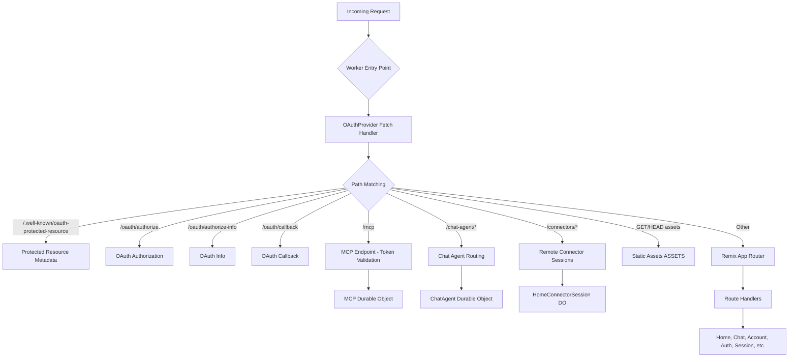
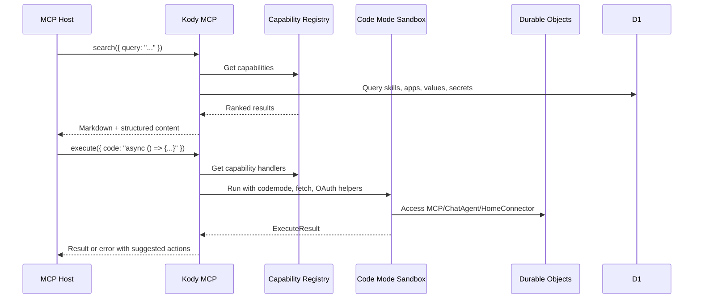
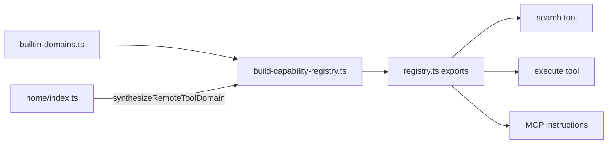
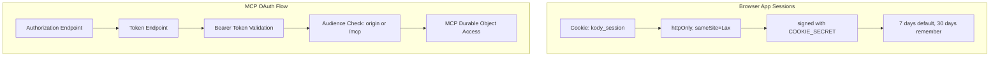
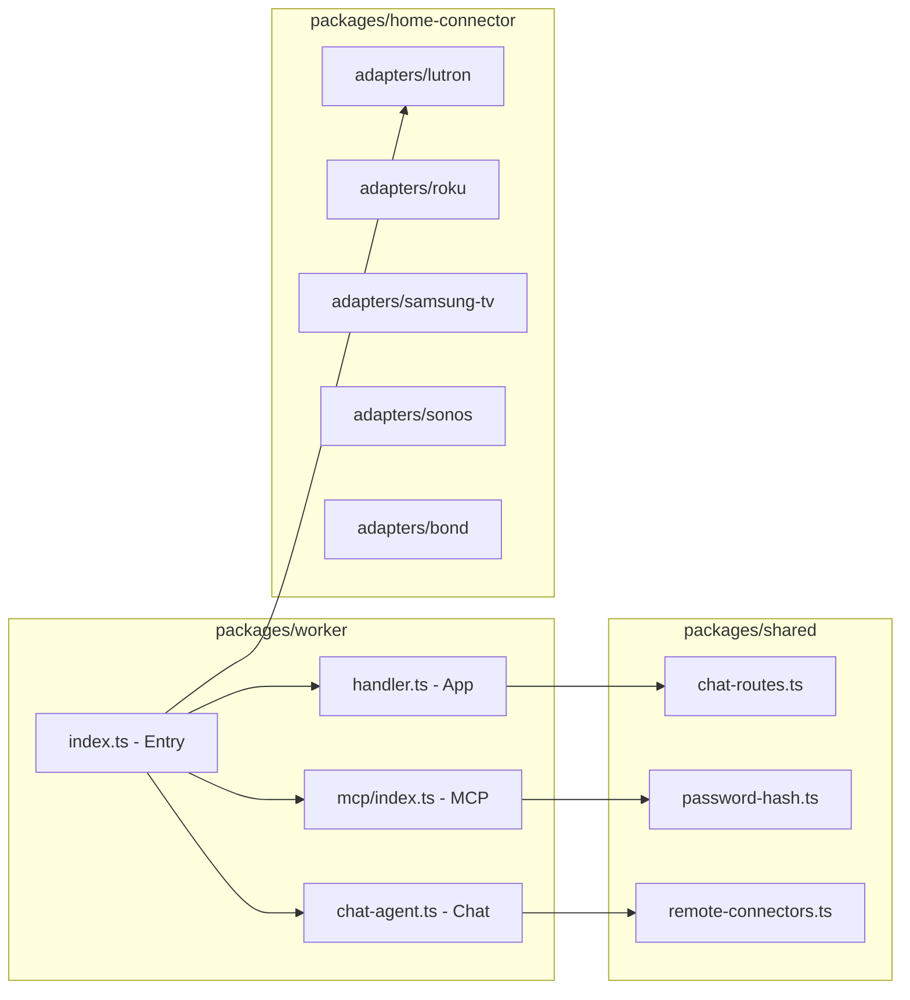
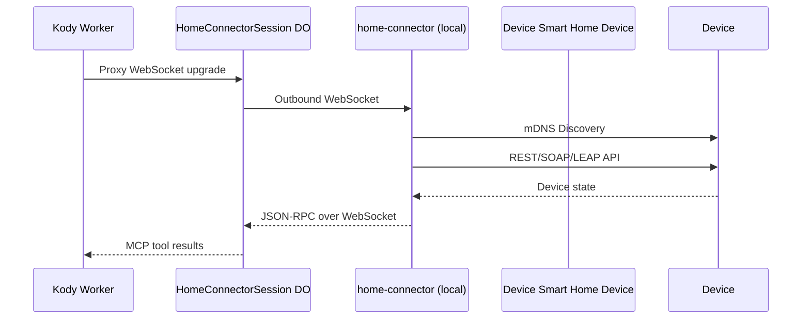

# Kody Repository Exploration

**Project:** kody  
**Source:** `/home/darkvoid/Boxxed/@formulas/src.rust/src.llamacpp/src.AIResearch/kody`  
**Date:** 2026-04-12  
**Branch:** main (up to date with origin)

---

## 1. Project Overview

### Purpose

Kody is an **experimental personal assistant platform** built on Cloudflare Workers and the Model Context Protocol (MCP). It provides:

- A Remix 3 (alpha) UI running on Cloudflare Workers
- OAuth-protected MCP endpoints for AI agent integration
- A compact MCP tool surface (`search`, `execute`, `open_generated_ui`)
- capability-driven architecture with extensible domains

### Key Characteristics

| Attribute | Value |
|-----------|-------|
| **Runtime** | Cloudflare Workers |
| **UI Framework** | Remix 3.0.0-alpha.3 |
| **Package Manager** | npm 11.11.1 (Node 24.x) |
| **Workspace** | Nx monorepo + npm workspaces |
| **Database** | Cloudflare D1 (SQLite) |
| **Session/OAuth** | Cloudflare KV |
| **MCP State** | Durable Objects |
| **Primary User** | `me@kentcdodds.com` (single-user) |

### Repository Structure

```
kody/
├── packages/
│   ├── worker/          # Main application (256 TypeScript files)
│   ├── shared/          # Cross-package utilities
│   ├── home-connector/  # Smart home device adapters
│   └── mock-servers/    # Test fixtures (AI, Cloudflare mocks)
├── docs/
│   ├── contributing/    # Developer documentation (~16 files)
│   ├── use/             # End-user MCP usage docs (~11 files)
│   ├── guides/          # Integration guides
│   └── talks/           # Slidev presentations
├── e2e/                 # Playwright end-to-end tests
├── tools/               # Build/deploy utilities
├── cli.ts               # CLI entrypoint (450+ lines)
├── package.json         # Root workspace config
├── nx.json              # Nx monorepo config
└── wrangler-env.ts      # Wrangler environment wrapper
```

---

## 2. Git Repository Information

### Remote & Branch Status

```
Remote: git@github.com:kentcdodds/kody.git
Current Branch: main (up to date with origin/main)
```

### Recent Commits

```
8104ec5 feat(home-connector): add Bond bridges, MCP tools, and admin setup
49599d5 Generic remote connectors (multi-session, routing, secrets) (#155)
11280bb fix(home-connector): Samsung TV mDNS discovery and device-info URLs
017738d Fallback search memory context to query (#154)
b76f885 fix: trim meta_memory_verify response payload (#153)
43e0ab0 docs: add raw content blocks guide (#151)
565a35f Support raw MCP content from execute (#149)
33472e2 fix: stop invalid preview workflow validation (#147)
1aed561 fix: use oxc instead of esbuild
eaa8587 delete preview envs
```

---

## 3. Architecture Breakdown

### Request Lifecycle



### Entry Points

| File | Purpose | Lines |
|------|---------|-------|
| `packages/worker/src/index.ts` | Main Worker entry, OAuth routing, MCP dispatch | 292 |
| `packages/worker/src/app/handler.ts` | Remix app handler with env validation | 15 |
| `packages/worker/src/app/router.ts` | Remix fetch router with route mapping | 121 |
| `packages/worker/src/app/routes.ts` | Route path definitions | 34 |
| `packages/worker/src/mcp/index.ts` | MCP Durable Object server | 73 |
| `packages/worker/src/chat-agent.ts` | Chat Agent Durable Object | 434 |

### Core Worker Files (packages/worker/src/)

```
src/
├── index.ts                    # Worker entry point
├── handler.ts                  # App request handler
├── router.ts                   # Remix router setup
├── routes.ts                   # Route definitions
├── oauth-handlers.ts           # OAuth authorization logic
├── mcp-auth.ts                 # MCP token validation
├── chat-agent.ts               # Chat Agent DO implementation
├── chat-agent-routing.ts       # Chat endpoint routing
├── d1-data-table-adapter.ts    # D1 database adapter
├── db.ts                       # Database helpers
├── env-schema.ts               # Environment validation
├── sentry-options.ts           # Sentry configuration
├── utils.ts                    # Shared utilities
├── user-id.ts                  # User ID generation
├── capability-maintenance.ts   # Capability reindex endpoint
├── memory-maintenance.ts       # Memory reindex endpoint
├── skill-maintenance.ts        # Skill reindex endpoint
├── ui-artifact-maintenance.ts  # UI artifact reindex
├── ui-artifact-urls.ts         # Saved UI URL builder
├── mcp/                        # MCP server implementation
│   ├── index.ts                # MCP Durable Object
│   ├── context.ts              # MCP caller context
│   ├── server-instructions.ts  # MCP server instructions
│   ├── register-tools.ts       # Tool registration
│   ├── register-resources.ts   # Resource registration
│   ├── executor.ts             # Code Mode executor
│   ├── fetch-gateway.ts        # Outbound fetch gateway
│   ├── observability.ts        # MCP event logging
│   ├── capabilities/           # Capability domains
│   ├── tools/                  # MCP tool implementations
│   └── secrets/                # Secret management
├── app/                        # Remix app layer
│   ├── handlers/               # Route handlers
│   └── ...
└── home/                       # Home connector integration
```

---

## 4. MCP Architecture

### Compact Tool Surface

Kody exposes only **3 MCP tools** to keep the host context compact:

| Tool | Purpose | ReadOnly |
|------|---------|----------|
| `search` | Discover capabilities, skills, apps, values, connectors, secrets | Yes |
| `execute` | Run capabilities via Code Mode sandbox | No |
| `open_generated_ui` | Launch saved MCP App artifacts | Yes |

### Execution Flow



### Capability Domains

Capabilities are organized into **domains** that group related functionality:

| Domain | Description | Capabilities |
|--------|-------------|--------------|
| `apps` | Generated MCP App artifacts | `ui_save_app`, `ui_get_app`, `ui_list_apps`, `ui_load_app_source`, `ui_delete_app` |
| `coding` | Software work & guides | `page_to_markdown`, `kody_official_guide` |
| `meta` | Skills, memory, MCP config | `meta_save_skill`, `meta_run_skill`, `meta_memory_*`, `meta_get_mcp_server_instructions` |
| `secrets` | Server-side secret references | `secret_list`, `secret_set`, `secret_delete` |
| `values` | Non-secret persisted config | `value_set`, `value_get`, `value_list`, `value_delete`, `connector_*` |
| `home` | Home automation (discovered) | Lutron, Roku, Samsung TV, Sonos, Bond adapters |

### Capability Registry Flow



---

## 5. Authentication Architecture

### Two Authentication Models



### OAuth Endpoints

| Endpoint | Path | Purpose |
|----------|------|---------|
| Authorization | `/oauth/authorize` | User login & consent |
| Authorization Info | `/oauth/authorize-info` | Client & scope info |
| Token | `/oauth/token` | Token exchange (provider) |
| Registration | `/oauth/register` | Client registration (provider) |
| Callback | `/oauth/callback` | OAuth redirect handler |

### MCP Token Validation

The `/mcp` endpoint requires:
- `Authorization: Bearer <token>`
- Token audience must match origin or `<origin>/mcp`
- Invalid requests return `401` with `WWW-Authenticate` header

---

## 6. Data Storage

### Storage Systems

| System | Binding | Purpose |
|--------|---------|---------|
| **D1** | `APP_DB` | Users, password_resets, chat_threads, skills, UI artifacts, values, connectors |
| **KV** | `OAUTH_KV` | OAuth provider state (clients, tokens) |
| **Durable Objects** | `MCP_OBJECT` | MCP server stateful execution |
| **Durable Objects** | `ChatAgent` | Per-thread chat conversations |
| **Durable Objects** | `HOME_CONNECTOR_SESSION` | Outbound WebSocket to home-connector |
| **Durable Objects** | `HOME_MCP_OBJECT` | Home MCP bridge for chat agent |
| **Vectorize** | `CAPABILITY_VECTOR_INDEX` | Capability search embeddings |

### Database Tables (D1)

```sql
-- users: login identity
CREATE TABLE users (
    id TEXT PRIMARY KEY,
    email TEXT UNIQUE NOT NULL,
    password_hash TEXT NOT NULL,
    created_at TEXT NOT NULL
);

-- password_resets: hashed tokens
CREATE TABLE password_resets (
    id TEXT PRIMARY KEY,
    user_id TEXT NOT NULL REFERENCES users(id),
    token_hash TEXT NOT NULL,
    expires_at TEXT NOT NULL
);

-- chat_threads: per-user threads
CREATE TABLE chat_threads (
    id TEXT PRIMARY KEY,
    user_id TEXT NOT NULL REFERENCES users(id),
    title TEXT,
    created_at TEXT NOT NULL
);

-- mcp_skills: saved codemode skills
CREATE TABLE mcp_skills (
    id TEXT PRIMARY KEY,
    user_id TEXT NOT NULL,
    name TEXT NOT NULL,
    collection TEXT,
    code TEXT NOT NULL,
    created_at TEXT NOT NULL,
    updated_at TEXT NOT NULL
);

-- ui_artifacts: saved MCP apps
-- values: non-secret config
-- connectors: OAuth connector configs
-- memories: long-term user memories
```

---

## 7. Configuration & Environment

### Wrangler Configuration (wrangler.jsonc)

```jsonc
{
  "name": "kody",
  "compatibility_date": "2026-01-31",
  "compatibility_flags": ["nodejs_compat", "global_fetch_strictly_public"],
  "main": "./src/index.ts",
  "upload_source_maps": true,
  "migrations": [
    { "tag": "v1", "new_sqlite_classes": ["MCP"] },
    { "tag": "v2", "new_sqlite_classes": ["ChatAgent"] },
    { "tag": "v3", "new_sqlite_classes": ["HomeConnectorSession", "HomeMCP"] }
  ],
  "durable_objects": {
    "bindings": [
      { "class_name": "MCP", "name": "MCP_OBJECT" },
      { "class_name": "ChatAgent", "name": "ChatAgent" },
      { "class_name": "HomeConnectorSession", "name": "HOME_CONNECTOR_SESSION" },
      { "class_name": "HomeMCP", "name": "HOME_MCP_OBJECT" }
    ]
  },
  "environments": {
    "production": { /* prod bindings */ },
    "preview": { /* preview bindings */ },
    "test": { /* local test bindings */ }
  }
}
```

### Key Environment Variables

| Variable | Purpose | Required |
|----------|---------|----------|
| `COOKIE_SECRET` | Session cookie signing (min 32 chars) | Yes |
| `APP_DB` | D1 database binding | Yes |
| `OAUTH_KV` | KV namespace binding | Yes |
| `MCP_OBJECT` | MCP Durable Object binding | Yes |
| `ASSETS` | Static assets binding | Yes |
| `LOADER` | Worker Loader for Code Mode | Yes |
| `SENTRY_DSN` | Sentry error tracking | No |
| `AI_MODE` | `remote` or `mock` | Yes |
| `AI_MODEL` | Workers AI model | Yes |

---

## 8. Key Components & Relationships

### Component Dependencies



### MCP Server Registration

The MCP server registers tools and resources on initialization:

```typescript
// packages/worker/src/mcp/index.ts
class MCPBase extends McpAgent<Env, State, Props> {
  async init() {
    this.server = new McpServer(serverImplementation, {
      instructions: buildMcpServerInstructions(overlay),
      jsonSchemaValidator: new CfWorkerJsonSchemaValidator(),
    })
    await registerResources(this)
    await registerTools(this)  // search, execute, open_generated_ui
  }
}
```

### Tool Registration Flow

```typescript
// packages/worker/src/mcp/register-tools.ts
export async function registerTools(agent: McpRegistrationAgent) {
  await registerSearchTool(agent)
  await registerExecuteTool(agent)
  await registerOpenGeneratedUiTool(agent)
}
```

---

## 9. Testing Strategy

### Test File Conventions

| Suffix | Test Project | Purpose |
|--------|--------------|---------|
| `*.node.test.ts` | Node unit tests | Pure logic, no Workers |
| `*.workers.test.ts` | Workers unit tests | Cloudflare Workers runtime |
| `*.mcp-e2e.test.ts` | MCP E2E tests | Full MCP protocol testing |

### Test Configuration

| File | Purpose |
|------|---------|
| `vitest.config.ts` | Root Vitest config |
| `vitest.node.config.ts` | Node test project |
| `vitest.workers.config.ts` | Workers test project |
| `vitest.mcp-e2e.config.ts` | MCP E2E test project |
| `playwright.config.ts` | Playwright E2E config |

### Test Coverage Areas

1. **Registry invariants** - Duplicate detection, domain validation
2. **Capability handlers** - Input/output schema validation
3. **MCP tool behavior** - search, execute, open_generated_ui
4. **OAuth flows** - Authorization, token validation
5. **E2E scenarios** - Playwright browser tests

---

## 10. Home Connector Architecture

### Device Adapters

The home-connector package provides adapters for local smart home devices:

| Adapter | Protocol | Discovery |
|---------|----------|-----------|
| Lutron | LEAP | mDNS |
| Roku | ECP | mDNS |
| Samsung TV | WebSocket | mDNS |
| Sonos | SOAP | mDNS |
| Bond | REST API | mDNS |

### Connector Session Flow



### Remote Connectors

Generic outbound WebSocket protocol for extensible connectors:

- Session key: `kind:instanceId`
- URL pattern: `/connectors/:kind/:instanceId/*`
- MCP tools synthesized at runtime from remote connector snapshots

---

## 11. Build & Deploy

### NPM Scripts

| Script | Purpose |
|--------|---------|
| `npm run dev` | Run CLI with local env |
| `npm run dev:worker` | Start Worker dev server |
| `npm run dev:client` | Build client bundles with watch |
| `npm run build` | Full production build |
| `npm run deploy` | Build + deploy to Cloudflare |
| `npm run typecheck` | TypeScript validation |
| `npm run lint` | Oxlint validation |
| `npm run format` | Oxfmt formatting |
| `npm run test` | Run unit tests |
| `npm run test:e2e:run` | Run Playwright E2E |

### Deployment Flow

```bash
npm run deploy
# 1. Prepare E2E env (if preview/test)
# 2. Build client + worker
# 3. wrangler deploy --outdir .wrangler/sentry-bundle --upload-source-maps
```

---

## 12. Key Patterns

### Code Mode Execute Pattern

```typescript
// Execute sandbox provides:
// - codemode: capability calls
// - refreshAccessToken(providerName)
// - createAuthenticatedFetch(providerName)
// - fetch() with {{secret:name}} placeholder support

async () => {
  const page = await codemode.page_to_markdown({
    url: 'https://example.com'
  });
  return { source: page.source, preview: page.markdown.slice(0, 120) };
}
```

### Secret Input Schema

```typescript
import { markSecretInputFields } from '@kody-internal/shared/secret-input-schema.ts'

const inputSchema = markSecretInputFields({
  type: 'object',
  properties: {
    username: { type: 'string' },
    password: { type: 'string' },
  },
  required: ['username', 'password'],
}, ['username', 'password'])
// Adds x-kody-secret: true to marked fields
```

### Verify-First Memory Pattern

Memory writes require verification before modification:

```typescript
// 1. Verify existing memories
const memories = await meta_memory_verify({ query: '...' });

// 2. Decide: upsert, delete, or skip
if (needsUpdate) {
  await meta_memory_upsert({ memory_id: '...', content: '...' });
}
```

---

## 13. Observability

### Sentry Integration

- Worker: `Sentry.withSentry()` wrapper
- Durable Objects: `Sentry.instrumentDurableObjectWithSentry()`
- Source maps uploaded on deploy
- Release version from `APP_COMMIT_SHA`

### MCP Event Logging

```typescript
// packages/worker/src/mcp/observability.ts
logMcpEvent({
  category: 'mcp',
  tool: 'search' | 'execute',
  outcome: 'success' | 'failure',
  durationMs,
  hasUser,
  // ...structured context
})
```

---

## 14. File Inventory Summary

### packages/worker/ (256 TypeScript files)

| Directory | Files | Purpose |
|-----------|-------|---------|
| `src/` | ~22 | Core Worker logic |
| `src/mcp/` | ~40 | MCP server implementation |
| `src/mcp/capabilities/` | ~30 | Capability domains |
| `src/mcp/tools/` | ~12 | MCP tool implementations |
| `src/app/` | ~25 | Remix app handlers |
| `client/` | ~30 | Browser client code |
| `migrations/` | ~15 | D1 schema migrations |

### Total TypeScript Files: ~400 across all packages

---

## 15. Phase 1 Priority Files

Based on the task.md, Phase 1 (Core Worker) critical files:

| File | Lines | Status |
|------|-------|--------|
| `src/index.ts` | 292 | Analyzed |
| `src/app/handler.ts` | 15 | Analyzed |
| `src/app/router.ts` | 121 | Analyzed |
| `src/app/routes.ts` | 34 | Analyzed |
| `src/oauth-handlers.ts` | 350 | Analyzed |
| `src/mcp-auth.ts` | 121 | Analyzed |
| `src/mcp/capabilities/registry.ts` | 62 | Analyzed |
| `src/mcp/capabilities/builtin-domains.ts` | 21 | Analyzed |
| `src/mcp/capabilities/build-capability-registry.ts` | 151 | Analyzed |
| `wrangler.jsonc` | 200 | Analyzed |
| `worker-configuration.d.ts` | ~8000 | Generated types |

---

## 16. Key Findings

### Architecture Strengths

1. **Compact MCP surface** - Only 3 tools exposed, keeping host context lean
2. **Domain-driven capabilities** - Extensible registry pattern with clear ownership
3. **OAuth-first security** - Proper token validation with audience checks
4. **Durable Objects for state** - Stateful execution isolated per session
5. **Verify-first memory** - Prevents accidental memory corruption

### Notable Patterns

1. **Code Mode execute** - Sandboxed capability execution with host approval
2. **Secret placeholders** - `{{secret:name}}` in fetch URLs/headers/bodies
3. **Capability discovery** - Unified search across capabilities, skills, apps, values, secrets
4. **Remote connectors** - Dynamic capability synthesis from WebSocket connectors

### Single-User Design

The project explicitly targets a single user (`me@kentcdodds.com`), which means:
- No multi-tenant abstractions
- Fast iteration on personal workflows
- Simplified auth model (one admin)

---

## 17. References

### Documentation

- **Project Intent:** `docs/contributing/project-intent.md`
- **Architecture:** `docs/contributing/architecture/index.md`
- **Request Lifecycle:** `docs/contributing/architecture/request-lifecycle.md`
- **Authentication:** `docs/contributing/architecture/authentication.md`
- **Data Storage:** `docs/contributing/architecture/data-storage.md`
- **Adding Capabilities:** `docs/contributing/adding-capabilities.md`
- **MCP Usage:** `docs/use/index.md`

### Entry Points

- **Worker:** `packages/worker/src/index.ts`
- **MCP Server:** `packages/worker/src/mcp/index.ts`
- **Chat Agent:** `packages/worker/src/chat-agent.ts`
- **CLI:** `cli.ts`

---

**Exploration completed:** 2026-04-12  
**Scope:** Phase 1 (Core Worker) - Primary focus with comprehensive coverage of MCP architecture, authentication, storage, and configuration.
