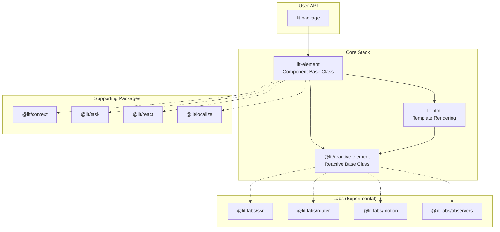
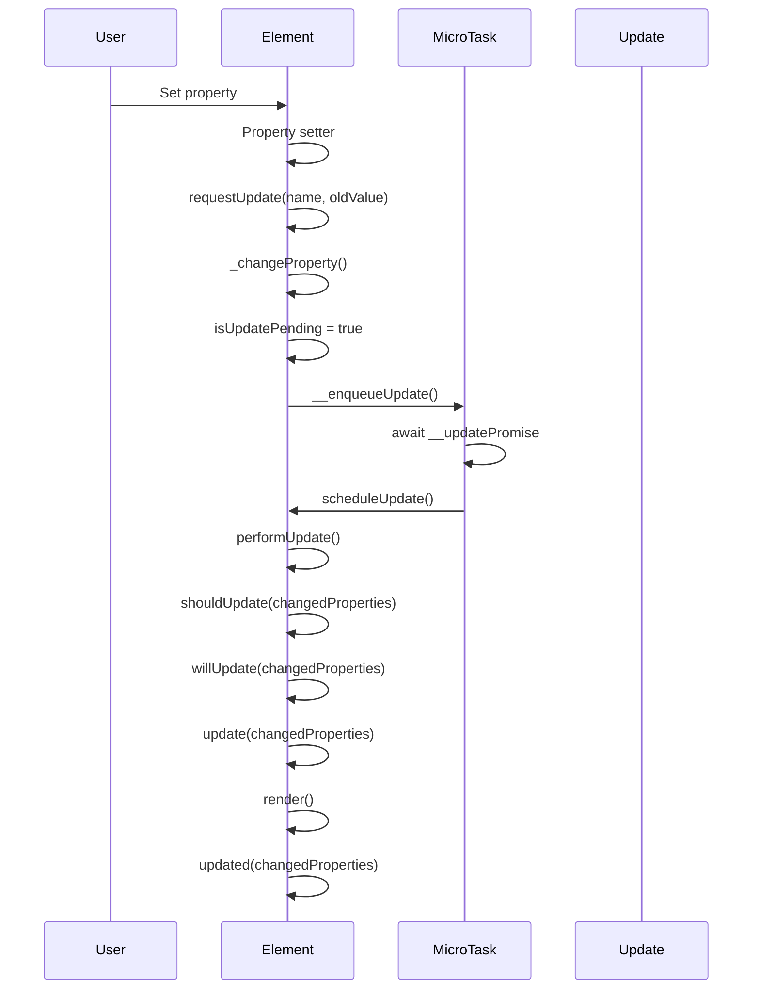

# Project Exploration: Lit - Web Components Library

## Overview

Lit is a simple, fast, and lightweight web components library developed by Google. At its core, Lit provides a boilerplate-killing component base class that offers reactive state, scoped styles, and a declarative template system that's tiny, fast, and expressive.

The current version is Lit 3.x (lit@3.3.2, lit-element@4.2.2, lit-html@3.3.2), which represents a significant evolution from the 2.x branch with improved performance, better TypeScript support, and standard decorator support.

## Directory Structure

```
lit/
├── packages/                    # Core monorepo packages
│   ├── lit/                     # Main user-facing package (re-exports everything)
│   ├── lit-element/             # Web component base class
│   ├── lit-html/                # Template rendering library
│   ├── reactive-element/        # Low-level reactive base class
│   ├── context/                 # Context protocol implementation
│   ├── react/                   # React component wrapper
│   ├── task/                    # Async task controller
│   ├── localize/                # Localization library
│   ├── localize-tools/          # Localization CLI tools
│   ├── labs/                    # Experimental/labs packages
│   │   ├── ssr/                 # Server-side rendering
│   │   ├── ssr-client/          # Client-side SSR hydration support
│   │   ├── ssr-dom-shim/        # DOM shim for SSR
│   │   ├── router/              # Router for Lit
│   │   ├── motion/              # Animation directives
│   │   ├── observers/           # Observer reactive controllers
│   │   ├── virtualizer/         # Virtual scrolling/virtualization
│   │   ├── compiler/            # Template compiler
│   │   ├── forms/               # Form utilities
│   │   └── ...
│   ├── tests/                   # Test infrastructure
│   ├── benchmarks/              # Performance benchmarks
│   └── internal-scripts/        # Build/internal utilities
├── examples/                    # Example projects (Next.js integrations, etc.)
├── playground/                  # Lit playground
├── dev-docs/                    # Developer documentation
└── scripts/                     # Build and release scripts
```

## Architecture

### High-Level Diagram



### Package Dependencies

The dependency chain flows as follows:

1. **`@lit/reactive-element`** - The foundation; provides reactive property system and lifecycle
2. **`lit-html`** - Builds on reactive-element; provides template rendering
3. **`lit-element`** - Combines reactive-element + lit-html; provides component base class
4. **`lit`** - Re-exports everything from the above in a single package

## lit-html Templating

### Tagged Template Literals

lit-html uses JavaScript tagged template literals to create templates. The `html` tag function processes template strings and expressions:

```typescript
const template = html`<h1>Hello, ${name}!</h1>`;
```

**How it works:**

1. **Template Strings Array**: When you use a tagged template literal, JavaScript passes a `TemplateStringsArray` (the static string parts) and the expression values to the tag function.

2. **Template Caching**: Templates are cached by their `TemplateStringsArray` identity. This means the same template expression is only parsed once.

3. **Marker Insertion**: During template preparation, lit-html scans the HTML string and inserts marker comments (`<!---->`) at expression locations:
   ```javascript
   // Input: html`<div>${value}</div>`
   // Generated HTML: "<div><!----></div>"
   ```

4. **Part Types**: lit-html identifies different binding types:
   - `CHILD_PART` (2) - Text content between tags
   - `ATTRIBUTE_PART` (1) - Attribute values
   - `PROPERTY_PART` (3) - Property bindings (`.prop`)
   - `BOOLEAN_ATTRIBUTE_PART` (4) - Boolean attributes (`?attr`)
   - `EVENT_PART` (5) - Event listeners (`@event`)
   - `ELEMENT_PART` (6) - Element references

### Template Preparation Flow

```
User Template → getTemplateHtml() → Template.createElement() → TemplateInstance
     ↓                ↓                    ↓                        ↓
html`...`     Parse & insert     Create <template>       Clone template,
              markers              element, walk          create Parts
                                   DOM with TreeWalker
```

### Key lit-html Concepts

**TemplateResult**: The return type of `html`` and `svg`` tags:
```typescript
interface TemplateResult {
  ['_$litType$']: ResultType;  // HTML, SVG, or MathML
  strings: TemplateStringsArray;
  values: unknown[];
}
```

**Parts**: Objects that manage individual bindings:
- `ChildPart` - Manages content between nodes
- `AttributePart` - Manages attribute bindings
- `PropertyPart` - Manages property bindings
- `EventPart` - Manages event listeners

**Render Function**:
```typescript
render(value: unknown, container: RenderRootNode, options?: RenderOptions): RootPart
```

## LitElement Base Class

LitElement extends `ReactiveElement` and integrates lit-html templating:

```typescript
export class LitElement extends ReactiveElement {
  protected render(): unknown {
    return noChange;
  }

  protected override update(changedProperties: PropertyValues) {
    const value = this.render();
    super.update(changedProperties);
    this.__childPart = render(value, this.renderRoot, this.renderOptions);
  }
}
```

### Lifecycle Methods

```
Constructor → connectedCallback → requestUpdate → scheduleUpdate → performUpdate
                  ↑                    ↓                              ↓
            addController            update()                    shouldUpdate()
                  ↓                    ↓                              ↓
          hostConnected()      willUpdate()                     update()
                  ↓                    ↓                              ↓
           disconnectedCallback   updated()                       render()
                  ↓                    ↓
          hostDisconnected()    firstUpdated()
```

### Key Lifecycle Methods:

| Method | Purpose |
|--------|---------|
| `constructor()` | Initialize component, set initial state |
| `connectedCallback()` | Component added to DOM |
| `disconnectedCallback()` | Component removed from DOM |
| `willUpdate(changedProperties)` | Compute derived state before render |
| `render()` | Return template to render |
| `updated(changedProperties)` | DOM updated, perform post-render tasks |
| `firstUpdated(changedProperties)` | Called once after first update |

## Reactive Properties

### Property Declaration

Properties can be declared using the static `properties` getter or decorators:

```typescript
// Using static properties
class MyElement extends LitElement {
  static properties = {
    name: {type: String},
    count: {type: Number, reflect: true},
    items: {type: Array},
  };
}

// Using decorators
class MyElement extends LitElement {
  @property() name: string = '';
  @property({type: Number, reflect: true}) count: number = 0;
  @state() private internal: number = 0;
}
```

### PropertyDeclaration Options

```typescript
interface PropertyDeclaration {
  state?: boolean;           // Internal state, no attribute
  attribute?: boolean|string;// Attribute name or false
  type?: TypeHint;           // Type for conversion
  converter?: AttributeConverter;
  reflect?: boolean;         // Reflect to attribute
  hasChanged?(value, old): boolean;
  noAccessor?: boolean;      // Skip accessor creation
  useDefault?: boolean;      // Use initial value as default
}
```

### Reactive Update Flow



### Default Converter

lit-html includes a default attribute converter:

```typescript
const defaultConverter = {
  toAttribute(value, type) {
    switch (type) {
      case Boolean: return value ? '' : null;
      case Object:
      case Array: return JSON.stringify(value);
      case Number: return isNaN(value) ? '' : value;
    }
    return value;
  },
  fromAttribute(value, type) {
    switch (type) {
      case Boolean: return value !== null;
      case Number: return value === null ? null : Number(value);
      case Object:
      case Array: return JSON.parse(value);
    }
    return value;
  }
};
```

## Directives

Directives are composable functions that customize rendering behavior:

```typescript
// Built-in directives
import {repeat, guard, cache, until, classMap, styleMap, ifDefined} from 'lit/directives';

html`
  <ul>
    ${repeat(items, item => item.id, item => html`<li>${item.name}</li>`)}
  </ul>
  <div class="${classMap({active: isActive, hidden: isHidden})}"></div>
`;
```

### Creating Custom Directives

```typescript
import {directive, Directive, html} from 'lit';

class MyDirective extends Directive {
  render(value: string) {
    return html`<span>${value}</span>`;
  }

  update(part: Part, [value]: [string]) {
    // Called on every update
    return this.render(value);
  }
}

export const myDirective = directive(MyDirective);
```

### AsyncDirective

For directives that need async behavior or cleanup:

```typescript
import {AsyncDirective} from 'lit/async-directive';

class AsyncDirective extends AsyncDirective {
  render(url: string) {
    return html`Loading...`;
  }

  async update(part: ChildPart, [url]: [string]) {
    const response = await fetch(url);
    return await response.text();
  }

  disconnected() {
    // Cleanup when directive is removed from DOM
  }

  reconnected() {
    // Called when directive is reconnected
  }
}
```

## Decorators

Lit provides decorators for common patterns:

| Decorator | Purpose |
|-----------|---------|
| `@customElement('tag-name')` | Register custom element |
| `@property(options)` | Declare reactive property |
| `@state()` | Declare internal reactive state |
| `@query(selector)` | Query DOM element |
| `@queryAll(selector)` | Query all matching elements |
| `@queryAsync(selector)` | Async query (waits for render) |
| `@queryAssignedNodes(slot)` | Query assigned nodes in slot |
| `@queryAssignedElements(slot)` | Query assigned elements in slot |
| `@eventOptions(options)` | Configure event listener |

## Web Components Standard Compliance

Lit fully embraces web standards:

### Custom Elements
- Uses `customElements.define()` for registration
- Extends `HTMLElement` via `ReactiveElement`
- Implements all custom element lifecycle callbacks

### Shadow DOM
- Creates shadow roots by default (`mode: 'open'`)
- Supports `shadowRootOptions` for customization
- Uses `adoptedStyleSheets` when available

### HTML Templates
- Uses `<template>` elements for efficient cloning
- Supports Declarative Shadow DOM for SSR

### Events
- Standard DOM event system
- Event options via `@eventOptions` decorator
- Supports custom events with `dispatchEvent()`

## SSR Support

The `@lit-labs/ssr` package provides server-side rendering:

### Key Features

1. **Streaming Rendering**: Render templates as streams for efficient memory usage
2. **Declarative Shadow DOM**: Uses `<template shadowrootmode>` for shadow root content
3. **Hydration**: Client-side `@lit-labs/ssr-client` rehydrates server-rendered content
4. **Node.js DOM Shim**: `@lit-labs/ssr-dom-shim` provides minimal DOM APIs

### Server Usage

```typescript
import {renderThunked} from '@lit-labs/ssr';
import {html} from 'lit';

const result = renderThunked(html`<div>Hello, ${name}!</div>`);
```

### Hydration

```typescript
import {hydrate} from '@lit-labs/ssr-client';
import {myTemplate} from './my-template.js';

hydrate(myTemplate(initialData), document.body);
render(myTemplate(data), document.body);
```

### Limitations

- Cannot access full DOM in server lifecycle callbacks
- Events work only on custom elements
- Requires `--experimental-vm-modules` for VM context rendering

## Key Insights

### 1. Performance by Design
- Template caching by `TemplateStringsArray` identity
- Efficient diffing using stable keys with `repeat` directive
- Minimal re-renders through fine-grained change detection

### 2. Progressive Enhancement
- Works without build tools
- Small core bundle size (~5KB min+gzip for lit-html)
- Optional features via separate packages

### 3. Standards-First Approach
- Built on Web Components standards
- No virtual DOM - updates real DOM directly
- Native shadow DOM and custom elements

### 4. TypeScript Integration
- Full TypeScript support with type-safe templates
- Standard decorator support (ES2022+)
- Type-safe property declarations

### 5. Reactive Architecture
- Property changes trigger batched updates
- Microtask-based update scheduling
- Fine-grained `changedProperties` tracking

### 6. Composable Directives
- Extend rendering behavior without modifying core
- Async directives with lifecycle callbacks
- Directive state preserved across updates

## File References

Core implementation files:

| File | Purpose |
|------|---------|
| `/packages/lit-html/src/lit-html.ts` | Core template rendering engine (79KB) |
| `/packages/lit-element/src/lit-element.ts` | Component base class (10KB) |
| `/packages/reactive-element/src/reactive-element.ts` | Reactive base class (48KB) |
| `/packages/lit-html/src/directives/repeat.ts` | Repeat directive with efficient diffing |
| `/packages/lit-html/src/directive.ts` | Directive base class |
| `/packages/lit-html/src/async-directive.ts` | Async directive support |
| `/packages/labs/ssr/` | Server-side rendering implementation |
| `/packages/lit-element/src/decorators/` | Decorator implementations |

## Additional Resources

- **Documentation**: https://lit.dev
- **Discord**: https://lit.dev/discord/
- **Playground**: https://lit.dev/playground/
- **SSR Documentation**: https://lit.dev/docs/ssr/overview/
