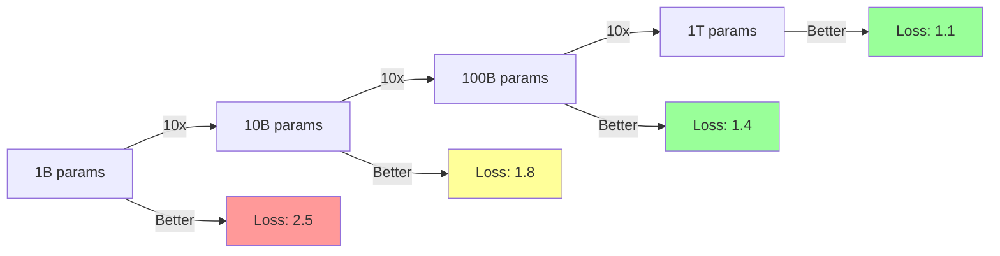
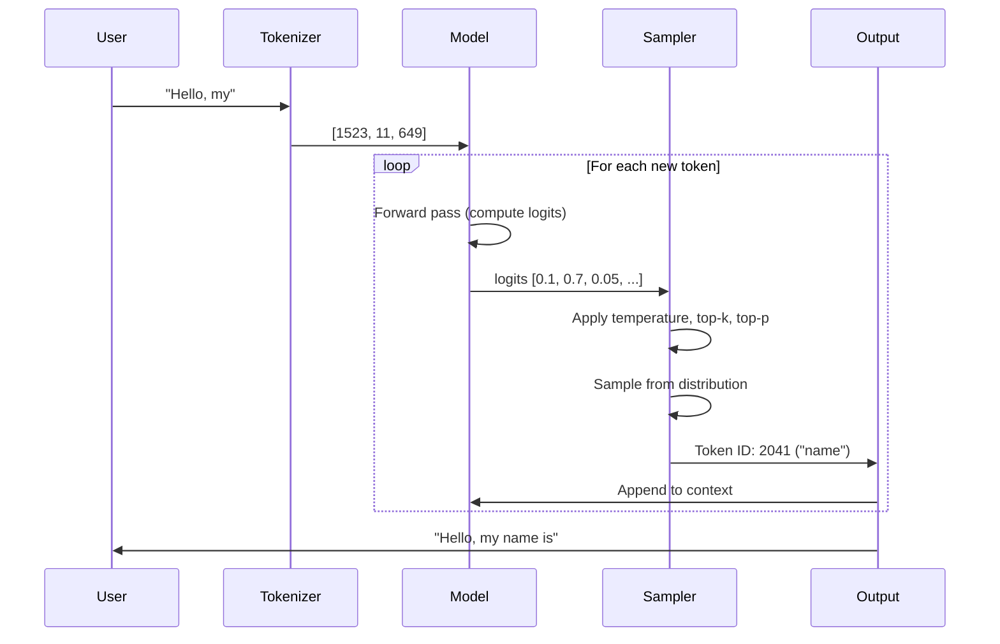
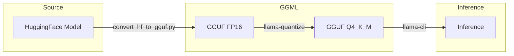

# Zero to LLM Engineer: First-Principles Guide

## Table of Contents

1. [What Are Large Language Models?](#1-what-are-large-language-models)
2. [Transformer Architecture Fundamentals](#2-transformer-architecture-fundamentals)
3. [Token Generation and Inference](#3-token-generation-and-inference)
4. [GGML and Quantization Basics](#4-ggml-and-quantization-basics)
5. [From PyTorch to GGUF](#5-from-pytorch-to-gguf)
6. [Valtron Executor Preview](#6-valtron-executor-preview)
7. [Your Learning Path](#7-your-learning-path)

---

## 1. What Are Large Language Models?

### 1.1 The Fundamental Question

**What is an LLM?**

A Large Language Model (LLM) is a neural network trained to predict the next token in a sequence. That's it. Everything else—chatbots, code generation, reasoning—emerges from this simple objective applied at scale.

```
┌─────────────────────────────────────────────────────────┐
│                    LLM (Simplified)                      │
│                                                          │
│  Input:  "The quick brown fox"                          │
│           └────────────────┬─────────────────┘           │
│                            │                             │
│                    ┌───────▼───────┐                    │
│                    │    LLM Model   │                    │
│                    │  (Parameters)  │                    │
│                    │   [Weights]    │                    │
│                    └───────┬───────┘                    │
│                            │                             │
│           ┌────────────────┴─────────────────┐           │
│           ▼                                  ▼          │
│  "The quick brown fox jumps"    "The quick brown fox runs"
│       P = 0.72                     P = 0.15             │
│                                                          │
└─────────────────────────────────────────────────────────┘
```

**Real-world analogy:**autocomplete at massive scale

| Aspect | Text Autocomplete | LLM |
|--------|------------------|-----|
| **Training** | Recent documents | Trillions of tokens |
| **Context** | Last few words | 32K-1M+ tokens |
| **Parameters** | N-gram counts | 1B-1T+ neural weights |
| **Output** | Word suggestions | Probability distribution |

### 1.2 The Training Objective

LLMs are trained to minimize **cross-entropy loss**:

```
Loss = -log(P(correct_token | context))

Where:
- context = all previous tokens [t₀, t₁, ..., tₙ₋₁]
- P = model's predicted probability
- correct_token = the actual next token tₙ

Training process:
1. Feed context into model
2. Model outputs probability distribution
3. Compare with actual next token
4. Adjust weights to increase P(correct_token)
5. Repeat trillions of times
```

### 1.3 Scaling Laws

LLM performance follows predictable scaling laws:

```
Loss ≈ A / N^α + B / D^β + C

Where:
- N = number of parameters
- D = dataset size (tokens)
- A, B, C, α, β = constants

Key insight: Bigger models + more data = predictably better
```



---

## 2. Transformer Architecture Fundamentals

### 2.1 The Transformer Block

All modern LLMs use the transformer architecture. Here's the basic block:

```
┌─────────────────────────────────────────────────────────┐
│                  Transformer Block                        │
│                                                          │
│  Input ──┬──────────────────────────┐                   │
│          │                          │                   │
│          ▼                          │                   │
│  ┌───────────────┐                  │                   │
│  │ Self-Attention │ ◄── Key Query   │                   │
│  │    (Attn)      │     Value      │                   │
│  └───────┬───────┘                  │                   │
│          │                          │                   │
│          ▼                          │                   │
│  ┌───────────────┐                  │                   │
│  │     Add &     │                  │                   │
│  │     Norm      │                  │                   │
│  └───────┬───────┘                  │                   │
│          │                          │                   │
│          ▼                          │                   │
│  ┌───────────────┐                  │                   │
│  │      FFN      │     (Feed Forward│                   │
│  │   (MLP)       │      Network)    │                   │
│  └───────┬───────┘                  │                   │
│          │                          │                   │
│          ▼                          │                   │
│  ┌───────────────┐                  │                   │
│  │     Add &     │◄─────────────────┘                   │
│  │     Norm      │     (Residual)                       │
│  └───────┬───────┘                                      │
│          │                                              │
│          ▼                                              │
│       Output                                           │
│                                                        │
└─────────────────────────────────────────────────────────┘
```

### 2.2 Self-Attention Explained

Self-attention computes relationships between all tokens:

```python
# Conceptual attention (what llama.cpp implements in C)
def attention(Q, K, V):
    # Q, K, V = Query, Key, Value matrices
    # Each has shape: [batch, seq_len, n_heads, head_dim]

    scores = Q @ K.transpose() / sqrt(head_dim)  # [batch, seq, seq]
    weights = softmax(scores)                     # Normalize to probabilities
    output = weights @ V                          # Weighted sum

    return output  # [batch, seq_len, head_dim]
```

**Visual:**

```
Tokens:  "The  quick  brown  fox  jumps"
          │     │      │     │     │
          ▼     ▼      ▼     ▼     ▼
    ┌─────────────────────────────────┐
    │     Attention Weight Matrix     │
    │                                 │
    │ The   │ 0.3  0.2  0.2  0.2  0.1 │
    │ quick │ 0.1  0.4  0.3  0.1  0.1 │
    │ brown │ 0.1  0.2  0.4  0.2  0.1 │
    │ fox   │ 0.1  0.1  0.2  0.5  0.1 │
    │ jumps │ 0.1  0.1  0.1  0.2  0.5 │
    │                                 │
    └─────────────────────────────────┘

    Each row shows what a token "attends to"
```

### 2.3 Multi-Head Attention

Multiple attention heads capture different relationships:

```
Single Head:
  All tokens → One attention pattern

Multi-Head (8 heads):
  Head 0: Subject-verb relationships
  Head 1: Pronoun references
  Head 2: Adjective-noun pairs
  Head 3: Long-range dependencies
  ...

GQA (Grouped Query Attention - LLaMA 2/3):
  Q: 8 heads (queries)
  K: 2 heads (keys shared across Q groups)
  V: 2 heads (values shared across Q groups)

  Benefit: 4x less KV cache memory!
```

### 2.4 Feed-Forward Network (FFN)

The FFN processes each token independently:

```
Standard FFN (LLaMA):
  x → Up projection → SiLU activation → Down projection → output

SwiGLU (used in LLaMA, Mistral):
  FFN(x) = (x @ W_up) ⊗ SiLU(x @ W_gate) @ W_down

  Where:
  - W_up, W_gate, W_down = weight matrices
  - ⊗ = element-wise multiplication
  - SiLU(x) = x * sigmoid(x)
```

---

## 3. Token Generation and Inference

### 3.1 The Inference Loop

```python
def generate(model, prompt, max_tokens=100):
    tokens = tokenize(prompt)

    for _ in range(max_tokens):
        # 1. Forward pass
        logits = model(tokens)  # [vocab_size]

        # 2. Sampling
        next_token = sample(logits, temperature=0.7)

        # 3. Append
        tokens.append(next_token)

        # 4. Check for end
        if next_token == EOS_TOKEN:
            break

    return decode(tokens)
```

### 3.2 Step-by-Step Inference



### 3.3 Logits to Probabilities

```
Raw logits:    [2.3, 1.1, -0.5, 4.2, -1.0, ...]
                    │
                    ▼ (apply temperature T=0.7)
Scaled logits: [3.29, 1.57, -0.71, 6.0, -1.43, ...]
                    │
                    ▼ (softmax)
Probabilities: [0.12, 0.04, 0.01, 0.78, 0.01, ...]
                    │
                    ▼ (sample)
Selected token: Index 3 → "is"
```

---

## 4. GGML and Quantization Basics

### 4.1 What is GGML?

**GGML** (Ggerganov's Generic Machine Learning Library) is a C library for tensor computation with:

- Custom tensor types (FP32, FP16, quantized)
- Computation graph optimization
- Backend support (CPU, CUDA, Metal, Vulkan)
- Zero external dependencies

```c
// Create a tensor
struct ggml_tensor * weights = ggml_new_tensor_2d(
    ctx,                    // Memory context
    GGML_TYPE_F16,          // Data type
    4096,                   // Width (ne[0])
    4096                    // Height (ne[1])
);

// Operations build a graph
struct ggml_tensor * result = ggml_mul_mat(ctx, weights, input);

// Compute
struct ggml_cgraph * graph = ggml_new_graph(ctx);
ggml_build_forward_expand(graph, result);
ggml_graph_compute(graph, n_threads);
```

### 4.2 Quantization Fundamentals

**Quantization** reduces model size by representing weights with fewer bits:

```
FP16 (16 bits):  0 11001 0110101010
                  │  │         │
                  │  │    Mantissa
                  │  Exponent
                  Sign

Q4_0 (4 bits):   Group of 32 FP16 values →
                 1 scale (FP16) + 32 quants (4 bits each)
                 = 16 + 128 = 144 bits for 32 values
                 = 4.5 bits per value (vs 16 bits)
```

### 4.3 GGML Quantization Types

| Type | Bits | Block Size | Use Case |
|------|------|------------|----------|
| Q2_K | 2.56 | 256 | Maximum compression |
| Q3_K | 3.44 | 256 | Low memory devices |
| Q4_0 | 4.5 | 32 | Fast, good quality |
| Q4_K_M | 4.56 | 256 | **Recommended default** |
| Q5_0 | 5.5 | 32 | Better accuracy |
| Q5_K_M | 5.69 | 256 | High quality |
| Q6_K | 6.56 | 256 | Near-lossless |
| Q8_0 | 8.5 | 32 | Virtually lossless |
| F16 | 16 | 1 | Reference (no quantization) |

### 4.4 Quantization in Practice

```c
// Q4_0 quantization (simplified)
// Process 32 FP16 values at a time

void quantize_q4_0(const float* input, void* output, int n) {
    for (int i = 0; i < n; i += 32) {
        // Find max absolute value in block
        float max_val = 0;
        for (int j = 0; j < 32; j++) {
            max_val = fmaxf(max_val, fabsf(input[i + j]));
        }

        // Compute scale factor
        float scale = max_val / 8.0f;  // Map to [-8, 8]

        // Quantize to 4-bit integers
        uint8_t* quants = (uint8_t*)output + 2;  // Skip scale
        for (int j = 0; j < 32; j++) {
            int8_t q = round(input[i + j] / scale);
            q = clamp(q, -8, 7);  // 4-bit signed
            quants[j / 2] |= (q + 8) << (j % 2 * 4);  // Pack 2 per byte
        }
    }
}
```

### 4.5 Quality vs Size Trade-offs

```mermaid
xychart-beta
    x "Bits per weight" [2.5, 3.5, 4.5, 5.5, 6.5, 8.5, 16]
    y "Quality (relative to FP16)" 0 --> 100
    line [65, 75, 85, 92, 96, 99, 100]
```

---

## 5. From PyTorch to GGUF

### 5.1 The GGUF Format

**GGUF** (GGML Universal File) is the standard format for llama.cpp models:

```
┌─────────────────────────────────────────┐
│            GGUF File Structure           │
├─────────────────────────────────────────┤
│  Header                                  │
│  ├── Magic: "GGUF" (0x46554747)         │
│  ├── Version: 3                          │
│  └── Tensor count                        │
├─────────────────────────────────────────┤
│  Metadata                                │
│  ├── general.architecture: "llama"      │
│  ├── llama.embedding_length: 4096       │
│  ├── llama.block_count: 32              │
│  └── ... (all hyperparameters)          │
├─────────────────────────────────────────┤
│  Tensor Info                             │
│  ├── Name, type, dimensions              │
│  └── Offset in file                      │
├─────────────────────────────────────────┤
│  Tensor Data (aligned)                   │
│  ├── Token embeddings                    │
│  ├── Layer weights (quantized)          │
│  └── Output weights                      │
└─────────────────────────────────────────┘
```

### 5.2 Conversion Pipeline



### 5.3 Python Conversion Script

```python
# Simplified conversion overview
from transformers import AutoModelForCausalLM
import struct

# Load PyTorch model
model = AutoModelForCausalLM.from_pretrained("meta-llama/Llama-3.2-1B")
state_dict = model.state_dict()

# Write GGUF
with open("model.gguf", "wb") as f:
    # Write header
    f.write(b"GGUF")  # Magic
    f.write(struct.pack("<I", 3))  # Version

    # Write metadata
    write_kv_string(f, "general.architecture", "llama")
    write_kv_int(f, "llama.embedding_length", 2048)

    # Write tensors
    for name, tensor in state_dict.items():
        write_tensor_info(f, name, tensor.shape, GGML_TYPE_F16)
        write_tensor_data(f, tensor.numpy())
```

---

## 6. Valtron Executor Preview

### 6.1 Why Valtron for LLM Inference?

Valtron provides deterministic, async-free execution—perfect for:

- **Lambda deployments** (no runtime initialization)
- **WASM inference** (browser-based LLMs)
- **Embedded systems** (predictable memory/CPU)

### 6.2 TaskIterator for Inference

```rust
// Traditional async (what we're replacing)
async fn generate_tokens(model: &Model, prompt: Vec<Token>) -> Vec<Token> {
    let mut tokens = prompt;
    for _ in 0..max_tokens {
        let logits = model.forward(&tokens).await?;
        let next = sample(logits);
        tokens.push(next);
    }
    Ok(tokens)
}

// Valtron TaskIterator pattern
struct TokenGeneration {
    model: Arc<Model>,
    tokens: Vec<Token>,
    remaining: usize,
    state: GenerateState,
}

enum GenerateState {
    ReadyToCompute,
    Computing,
    Sampling,
    Done,
}

impl TaskIterator for TokenGeneration {
    type Ready = Vec<Token>;
    type Pending = ComputeProgress;

    fn next_status(&mut self) -> Option<TaskStatus<Self::Ready, Self::Pending>> {
        match self.state {
            GenerateState::ReadyToCompute => {
                if self.remaining == 0 {
                    self.state = GenerateState::Done;
                    return None;
                }
                self.state = GenerateState::Computing;
                Some(TaskStatus::Pending(ComputeProgress::ForwardPass))
            }
            GenerateState::Computing => {
                let logits = self.model.forward(&self.tokens);
                self.state = GenerateState::Sampling;
                Some(TaskStatus::Pending(ComputeProgress::Sampling))
            }
            GenerateState::Sampling => {
                let next_token = sample(&logits, self.temperature);
                self.tokens.push(next_token);
                self.remaining -= 1;
                self.state = GenerateState::ReadyToCompute;
                Some(TaskStatus::Ready(self.tokens.clone()))
            }
            GenerateState::Done => None,
        }
    }
}
```

### 6.3 Single-Threaded Execution

```rust
// Initialize valtron executor
valtron::single::initialize_pool(seed);

// Create inference task
let task = TokenGeneration {
    model: load_model("model.gguf")?,
    tokens: tokenize("Hello, world!"),
    remaining: 100,
    state: GenerateState::ReadyToCompute,
};

// Execute to completion
let results = valtron::single::spawn()
    .with_task(task)
    .schedule_iter(Duration::from_millis(0))?;

valtron::single::run_until_complete();

// Get generated tokens
for tokens in results {
    println!("{}", decode(&tokens));
}
```

---

## 7. Your Learning Path

### Recommended Progression

1. **Week 1-2: LLM Fundamentals**
   - Read this document thoroughly
   - Understand transformers and attention
   - Experiment with HuggingFace models

2. **Week 3-4: GGML and Quantization**
   - Study [01-ggml-format-deep-dive.md](01-ggml-format-deep-dive.md)
   - Build llama.cpp from source
   - Run inference on your machine

3. **Week 5-6: Inference Optimization**
   - Read [02-inference-optimization-deep-dive.md](02-inference-optimization-deep-dive.md)
   - Profile inference performance
   - Experiment with KV cache sizes

4. **Week 7-8: Rust Implementation**
   - Study [rust-revision.md](rust-revision.md)
   - Implement basic GGML ops in Rust
   - Build valtron-based inference

### Hands-On Exercises

1. **Run llama.cpp**
   ```bash
   git clone https://github.com/ggml-org/llama.cpp
   cd llama.cpp && cmake -B build && cmake --build build -j
   ./build/bin/llama-cli -h
   ```

2. **Quantize a model**
   ```bash
   # Download FP16 model
   huggingface-cli download ggml-org/gemma-3-1b-it-GGUF gemma-3-1b-it-F16.gguf

   # Quantize to Q4_K_M
   ./build/bin/llama-quantize gemma-3-1b-it-F16.gguf \
       gemma-3-1b-it-Q4_K_M.gguf Q4_K_M
   ```

3. **Compare quality**
   ```bash
   # Run with different quantizations
   ./build/bin/llama-cli -m model-Q4_K_M.gguf -p "Explain quantum computing"
   ./build/bin/llama-cli -m model-F16.gguf -p "Explain quantum computing"

   # Compare outputs—notice the minimal difference!
   ```

### Next Steps

Continue to:
- [01-ggml-format-deep-dive.md](01-ggml-format-deep-dive.md) — GGML tensors and quantization
- [02-inference-optimization-deep-dive.md](02-inference-optimization-deep-dive.md) — KV caching and batching
- [rust-revision.md](rust-revision.md) — Rust implementation guide

---

*This guide is a living document. Revisit sections as concepts become clearer through implementation.*
