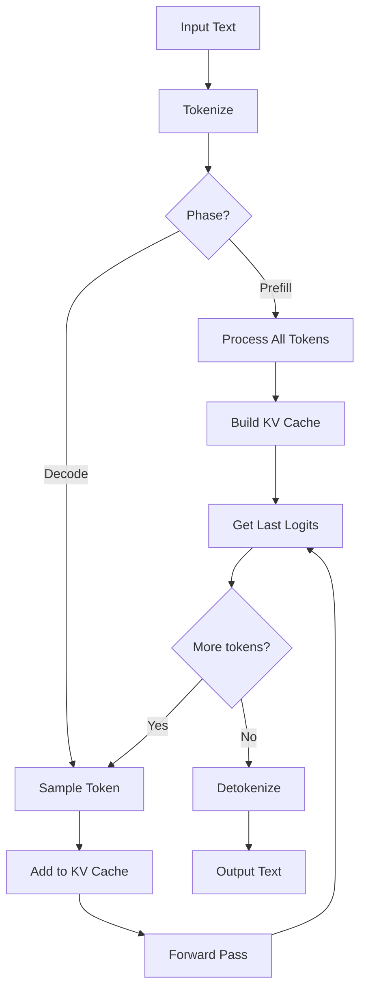

# Inference Optimization Deep Dive

## Table of Contents

1. [LLM Inference Pipeline Overview](#1-llm-inference-pipeline-overview)
2. [KV Cache Architecture](#2-kv-cache-architecture)
3. [Batched Inference](#3-batched-inference)
4. [Prompt Processing](#4-prompt-processing)
5. [Token Sampling Strategies](#5-token-sampling-strategies)
6. [Grammar-Based Sampling](#6-grammar-based-sampling)
7. [Performance Optimization](#7-performance-optimization)
8. [Rust Translation Patterns](#8-rust-translation-patterns)

---

## 1. LLM Inference Pipeline Overview

### 1.1 The Two Phases of Inference

LLM inference consists of two distinct phases:

```
┌─────────────────────────────────────────────────────────┐
│              LLM Inference Pipeline                      │
│                                                          │
│  Phase 1: Prompt Processing (Prefill)                   │
│  ┌────────────────────────────────────────────┐        │
│  │ Input: "Hello, my name is"                 │        │
│  │        └─┬─┘                               │        │
│  │          │ Tokenize                        │        │
│  │          ▼                                 │        │
│  │  [1523, 11, 649, 477]  ← All at once!     │        │
│  │          │                                 │        │
│  │          │ Forward pass (parallel)         │        │
│  │          ▼                                 │        │
│  │  Compute KV cache for all tokens          │        │
│  └────────────────────────────────────────────┘        │
│                     │                                   │
│                     ▼                                   │
│  Phase 2: Token Generation (Decode)                    │
│  ┌────────────────────────────────────────────┐        │
│  │  Loop:                                      │        │
│  │    1. Sample next token from logits         │        │
│  │    2. Update KV cache with new token        │        │
│  │    3. Forward pass (one token)              │        │
│  │    4. Repeat until EOS or max_tokens        │        │
│  └────────────────────────────────────────────┘        │
│                                                          │
└─────────────────────────────────────────────────────────┘
```

### 1.2 Performance Characteristics

| Phase | Computation | Memory | Latency |
|-------|-------------|--------|---------|
| **Prompt Processing** | O(n²) attention | O(n) KV cache | High (parallel) |
| **Token Generation** | O(1) per token | O(n) KV cache | Low (sequential) |

Where n = sequence length

### 1.3 llama.cpp Inference Flow



---

## 2. KV Cache Architecture

### 2.1 Why KV Caching?

Without KV caching, each token generation would recompute all previous keys and values:

```
Without KV Cache:
Token 1: Compute K1, V1 → Sample
Token 2: Compute K1, V1, K2, V2 → Sample  ← Wasteful!
Token 3: Compute K1, V1, K2, V2, K3, V3 → Sample  ← Even worse!

With KV Cache:
Token 1: Compute K1, V1 → Store → Sample
Token 2: Load K1, V1 → Compute K2, V2 → Store → Sample
Token 3: Load K1, V1, K2, V2 → Compute K3, V3 → Store → Sample
```

**Speedup:** 5-10x for long sequences

### 2.2 KV Cache Structure

```c
// llama.cpp KV cache structure
struct llama_kv_cell {
    llama_pos pos;        // Position in sequence
    llama_seq_id seq_id;  // Sequence ID (for multi-sequence)

    // Board position (for sliding window)
    llama_pos tail;
};

struct llama_kv_cache {
    // Per-layer cache
    struct layer {
        // Key cache: [n_layer, n_seq, n_head, n_embd/head]
        struct ggml_tensor * k;

        // Value cache: [n_layer, n_seq, n_head, n_embd/head]
        struct ggml_tensor * v;
    };

    // Cell metadata
    std::vector<llama_kv_cell> cells;

    // Size
    uint32_t n_seq_max;    // Maximum sequences
    uint32_t n_token_max;  // Maximum tokens
};
```

**Visual:**

```
KV Cache Layout (LLaMA 7B, 32 layers, 32 heads):

Layer 0                          Layer 31
┌─────────────────────────────┐   ┌─────────────────────────────┐
│ K cache [seq][pos][head]    │   │ K cache [seq][pos][head]    │
│ [1][2048][32][128]          │   │ [1][2048][32][128]          │
│ = 256 MB (FP16)             │   │ = 256 MB (FP16)             │
├─────────────────────────────┤   ├─────────────────────────────┤
│ V cache [seq][pos][head]    │   │ V cache [seq][pos][head]    │
│ [1][2048][32][128]          │   │ [1][2048][32][128]          │
│ = 256 MB (FP16)             │   │ = 256 MB (FP16)             │
└─────────────────────────────┘   └─────────────────────────────┘

Total: 32 layers × 512 MB = 16 GB for 2048 tokens

Optimization: Use quantized KV cache (Q4_0, Q8_0) to reduce by 50-75%
```

### 2.3 KV Cache Operations

```c
// llama.cpp KV cache operations

// Remove tokens from a sequence
void llama_kv_cache_seq_rm(
    struct llama_context * ctx,
    llama_seq_id seq_id,
    llama_pos p0,
    llama_pos p1
) {
    // Mark cells as free
    for (auto & cell : kv_cache.cells) {
        if (cell.seq_id == seq_id && cell.pos >= p0 && cell.pos < p1) {
            cell.seq_id = -1;  // Free
        }
    }
}

// Copy sequence (for beam search, speculative decoding)
void llama_kv_cache_seq_cp(
    struct llama_context * ctx,
    llama_seq_id seq_id_src,
    llama_seq_id seq_id_dst,
    llama_pos p0,
    llama_pos p1
) {
    // Duplicate KV values
    for (auto & cell : kv_cache.cells) {
        if (cell.seq_id == seq_id_src && cell.pos >= p0 && cell.pos < p1) {
            cell.seq_id = seq_id_dst;  // Copy with new ID
        }
    }
}

// Keep only specified sequence (garbage collection)
void llama_kv_cache_seq_keep(struct llama_context * ctx, llama_seq_id seq_id) {
    for (auto & cell : kv_cache.cells) {
        if (cell.seq_id != seq_id) {
            cell.seq_id = -1;  // Free all other sequences
        }
    }
}

// Shift positions (for sliding window)
void llama_kv_cache_seq_add(
    struct llama_context * ctx,
    llama_seq_id seq_id,
    llama_pos p0,
    llama_pos p1,
    llama_pos shift
) {
    for (auto & cell : kv_cache.cells) {
        if (cell.seq_id == seq_id && cell.pos >= p0 && cell.pos < p1) {
            cell.pos += shift;
            cell.tail += shift;
        }
    }
}
```

### 2.4 Sliding Window Attention (SWA)

For models with limited context (Mistral, LLaMA 3):

```c
// Sliding window cache management
struct llama_kv_cache_params {
    uint32_t n_ctx;        // Total context size
    uint32_t n_seq_max;    // Max sequences
    bool     swa_full;     // Full SWA cache
};

// Sliding window attention
// Only attend to recent tokens (e.g., last 512)
void llama_kv_cache_swa_attention(
    struct ggml_tensor * Q,
    struct ggml_tensor * K,
    struct ggml_tensor * V,
    int window_size
) {
    // Mask out tokens outside window
    for (int i = 0; i < seq_len; i++) {
        for (int j = 0; j < seq_len; j++) {
            if (i - j > window_size) {
                attention_mask[i][j] = -INFINITY;
            }
        }
    }

    // Compute attention with mask
    ggml_tensor * scores = ggml_mul_mat(ctx, Q, K);
    scores = ggml_add(ctx, scores, attention_mask);
    scores = ggml_soft_max(ctx, scores);

    ggml_tensor * output = ggml_mul_mat(ctx, scores, V);
}
```

### 2.5 GQA (Grouped Query Attention)

LLaMA 2/3 uses GQA to reduce KV cache size:

```
Standard Multi-Head Attention:
  Q: 32 heads
  K: 32 heads
  V: 32 heads
  → 32 independent KV caches

Grouped Query Attention (GQA):
  Q: 32 heads
  K: 8 heads  (shared across 4 Q groups)
  V: 8 heads  (shared across 4 Q groups)
  → 4x smaller KV cache!

Multi-Query Attention (MQA):
  Q: 32 heads
  K: 1 head   (shared across all Q)
  V: 1 head   (shared across all Q)
  → 32x smaller KV cache (but quality loss)
```

---

## 3. Batched Inference

### 3.1 Batching Strategies

llama.cpp supports multiple batching modes:

```c
// Batch structure
struct llama_batch {
    int32_t n_tokens;

    llama_token  * token;     // [n_tokens]
    llama_pos    * pos;       // [n_tokens]
    int32_t      * n_seq_id;  // [n_tokens]
    llama_seq_id ** seq_id;   // [n_tokens][max_seqs]
    int8_t       * logits;    // [n_tokens] - 1 if logits needed

    // Optional embeddings
    float * embd;
};
```

### 3.2 Prompt Batching

Process multiple prompts in parallel:

```
Batch of 4 prompts:

Prompt 1: "Hello"     → [1523, 11]
Prompt 2: "What is"   → [2041, 335]
Prompt 3: "The capital" → [477, 2842]
Prompt 4: "Write code" → [649, 3921]

Batch input:
token:   [1523, 11, 2041, 335, 477, 2842, 649, 3921]
pos:     [0, 1, 0, 1, 0, 1, 0, 1]
seq_id:  [0, 0, 1, 1, 2, 2, 3, 3]
logits:  [0, 1, 0, 1, 0, 1, 0, 1]  // Only compute logits for last token

Single forward pass processes all prompts!
```

### 3.3 Sequence Parallelism

```c
// llama.cpp batch processing
int32_t llama_decode(
    struct llama_context * ctx,
    struct llama_batch batch
) {
    // Allocate ubatch (micro-batch for processing)
    struct llama_ubatch ubatch = llama_batch_get_one(batch, n_ubatch);

    // Build compute graph
    struct ggml_cgraph * gf = llama_build_graph(ctx, ubatch);

    // Compute
    llama_graph_compute(ctx, gf);

    // Update KV cache
    llama_kv_cache_update(ctx, &ubatch);

    return 0;
}
```

### 3.4 Continuous Batching (In-Flight Batching)

Process sequences as they complete:

```
Time →

Seq 1: [Prompt][T1][T2][T3][EOS]──────
Seq 2: [Prompt][T1][T2][T3][T4][T5]──
Seq 3: ──────[Prompt][T1][T2][EOS]───
Seq 4: ──────────────[Prompt][T1][T2]

Instead of waiting for all sequences to complete,
immediately start new sequences when others finish!

Throughput improvement: 2-3x for variable-length requests
```

---

## 4. Prompt Processing

### 4.1 Efficient Prefill

```c
// Optimized prompt processing
int32_t llama_tokenize(
    struct llama_context * ctx,
    const char * text,
    size_t text_len,
    llama_token * tokens,
    int32_t n_tokens_max,
    bool add_special,
    bool parse_special
) {
    // Tokenize
    int32_t n_tokens = llama_tokenize_internal(
        ctx->vocab,
        text, text_len,
        tokens, n_tokens_max,
        add_special, parse_special
    );

    // Create batch
    struct llama_batch batch = llama_batch_get_one(tokens, n_tokens);
    batch.logits[n_tokens - 1] = 1;  // Only need last logits

    // Process entire prompt in one forward pass
    llama_decode(ctx, batch);

    // Get logits for last token
    float * logits = llama_get_logits(ctx);

    return n_tokens;
}
```

### 4.2 Chunked Prefill

For very long prompts:

```c
// Process prompt in chunks
void llama_process_prompt_chunked(
    struct llama_context * ctx,
    const llama_token * tokens,
    int32_t n_tokens,
    int32_t chunk_size
) {
    for (int32_t i = 0; i < n_tokens; i += chunk_size) {
        int32_t n_chunk = std::min(chunk_size, n_tokens - i);

        struct llama_batch batch = llama_batch_get_one(
            tokens + i, n_chunk
        );

        // Don't compute logits for intermediate chunks
        for (int32_t j = 0; j < n_chunk - 1; j++) {
            batch.logits[j] = 0;
        }
        batch.logits[n_chunk - 1] = 1;  // Last chunk needs logits

        llama_decode(ctx, batch);
    }
}
```

### 4.3 Memory Optimization

```
Prompt: 32K tokens
KV Cache: 32K × 32 layers × 2 (K+V) × 4096 dim × 2 bytes (FP16)
        = 32 GB!

Optimizations:

1. Quantized KV Cache (Q4_0):
   → 32 GB × 0.28 = 9 GB

2. Sliding Window (512 tokens):
   → 32 GB × (512/32768) = 512 MB

3. Layer-wise eviction:
   → Evict old KV from early layers first
   → Keep recent layers complete
```

---

## 5. Token Sampling Strategies

### 5.1 Sampling Pipeline

```c
// llama.cpp sampling chain
struct llama_sampler_chain {
    std::vector<llama_sampler *> samplers;

    // Apply samplers in order
    llama_token sample(struct llama_sampler_chain * chain,
                       struct llama_token_data_array * candidates) {
        for (auto * sampler : samplers) {
            sampler->apply(sampler, candidates);
        }

        // Final selection
        return llama_sample_token(candidates);
    }
};
```

### 5.2 Temperature Sampling

```c
// Temperature scales logits before softmax
void llama_sampler_temp_apply(
    struct llama_token_data_array * candidates,
    float temperature
) {
    for (int32_t i = 0; i < candidates->size; i++) {
        candidates->data[i].logit /= temperature;
    }
}

// Effect:
// T < 1.0 → More confident (peaky distribution)
// T = 1.0 → No change
// T > 1.0 → More random (flat distribution)
// T → 0   → Greedy (always pick highest)

// Visual:
// Original logits: [2.0, 1.0, 0.5, -0.5]
// T=0.5:  [4.0, 2.0, 1.0, -1.0]  → P=[0.73, 0.20, 0.05, 0.01]
// T=1.0:  [2.0, 1.0, 0.5, -0.5]  → P=[0.50, 0.18, 0.11, 0.04]
// T=2.0:  [1.0, 0.5, 0.25, -0.25] → P=[0.33, 0.20, 0.15, 0.09]
```

### 5.3 Top-K Sampling

```c
// Keep only K highest probability tokens
void llama_sampler_top_k(
    struct llama_token_data_array * candidates,
    int32_t k
) {
    // Sort by probability (descending)
    std::sort(candidates->data,
              candidates->data + candidates->size,
              [](const auto & a, const auto & b) {
                  return a.prob > b.prob;
              });

    // Zero out all but top K
    for (int32_t i = k; i < candidates->size; i++) {
        candidates->data[i].logit = -INFINITY;
    }

    // Renormalize
    llama_softmax(candidates);
}

// Effect:
// K = 1     → Greedy (always pick #1)
// K = 40    → Standard (good balance)
// K = 100   → Creative (more variety)
// K = vocab → No filtering
```

### 5.4 Top-P (Nucleus) Sampling

```c
// Keep tokens summing to P probability
void llama_sampler_top_p(
    struct llama_token_data_array * candidates,
    float p
) {
    // Sort by probability
    std::sort(...);

    // Find cutoff where cumulative prob exceeds p
    float cumulative = 0;
    int32_t cutoff = candidates->size;

    for (int32_t i = 0; i < candidates->size; i++) {
        cumulative += candidates->data[i].prob;
        if (cumulative > p) {
            cutoff = i + 1;
            break;
        }
    }

    // Zero out rest
    for (int32_t i = cutoff; i < candidates->size; i++) {
        candidates->data[i].logit = -INFINITY;
    }

    // Renormalize
    llama_softmax(candidates);
}

// Effect:
// P = 0.9   → Standard (90% probability mass)
// P = 0.95  → Creative
// P = 1.0   → No filtering
```

### 5.5 Combined Sampling

```c
// Typical sampling chain
void llama_sampler_chain_default(
    struct llama_sampler_chain * chain
) {
    // 1. Apply temperature
    chain->add(llama_sampler_temp_init(0.8f));

    // 2. Apply top-K
    chain->add(llama_sampler_top_k_init(40));

    // 3. Apply top-P
    chain->add(llama_sampler_top_p_init(0.9f));

    // 4. Penalize repetition
    chain->add(llama_sampler_penalty_init(
        0.0f,    // frequency penalty
        0.0f,    // presence penalty
        64,      // last N tokens
        1.0f     // penalty factor
    ));

    // 5. Final selection
    chain->add(llama_sampler_dist_init());
}

// Sampling order matters!
// Typical: temp → top-k → top-p → penalty → sample
```

### 5.6 DRY Sampling (Don't Repeat Yourself)

```c
// DRY penalizes sequences that repeat
void llama_sampler_dry_apply(
    struct llama_sampler * sampler,
    struct llama_token_data_array * candidates
) {
    struct llama_sampler_dry * ctx = (struct llama_sampler_dry *) sampler;

    // Check for suffix matches
    for (auto & token : candidates->data) {
        // Find longest suffix match in history
        int32_t match_len = find_longest_match(
            ctx->history,
            token.token
        );

        if (match_len >= ctx->min_length) {
            // Apply penalty
            float penalty = pow(ctx->base, match_len - ctx->min_length);
            token.logit *= penalty;
        }
    }
}
```

---

## 6. Grammar-Based Sampling

### 6.1 Grammar Constraints

```
Use case: Force output to match a pattern

Example 1: JSON output
grammar = {
    "root": "object",
    "object": "{" pair ("," pair)* "}",
    "pair": ":" string ":", value,
    "value": "number" | "string" | "true" | "false" | "null"
}

Example 2: SQL query
grammar = {
    "root": "select_stmt",
    "select_stmt": "SELECT" columns "FROM" table ("WHERE" condition)?,
    ...
}

Example 3: Code completion
grammar = {
    "root": "function",
    "function": "def" name "(" params ")" ":" body,
    ...
}
```

### 6.2 Grammar Implementation

```c
// GBNF (GGML BNF) grammar
struct llama_grammar {
    const std::vector<std::vector<llama_grammar_element>> rules;
    std::vector<std::vector<const llama_grammar_element *>> stacks;
};

// Grammar element types
enum llama_grammar_op_type {
    LLAMA_GRETYPE_CHAR          = 0,  // Literal character
    LLAMA_GRETYPE_CHAR_NOT      = 1,  // Negated character
    LLAMA_GRETYPE_CHAR_ALT      = 2,  // Alternative (|)
    LLAMA_GRETYPE_CHAR_RNG_UPPER = 3, // Range end
    LLAMA_GRETYPE_RULE_REF      = 4,  // Rule reference
    LLAMA_GRETYPE_RULE_END      = 5,  // End of rule
};

// Apply grammar constraint during sampling
void llama_sampler_grammar_apply(
    struct llama_sampler * sampler,
    struct llama_token_data_array * candidates
) {
    struct llama_grammar * grammar = sampler->ctx;

    // Get allowed tokens from grammar
    std::vector<llama_token> allowed = grammar_get_allowed_tokens(grammar);

    // Zero out disallowed tokens
    for (auto & token : candidates->data) {
        if (std::find(allowed.begin(), allowed.end(), token.token) == allowed.end()) {
            token.logit = -INFINITY;
        }
    }
}
```

### 6.3 GBNF Example

```bnf
# JSON grammar example

root ::= object

object ::=
  "{" ws (
    string ":" value
    ("," ws string ":" value)*
  )? "}" ws

array ::=
  "[" ws (
    value
    ("," ws value)*
  )? "]" ws

string ::=
  "\"" (
    [^"\\\x7F\x00-\x1F] |
    "\\" (["\\/bfnrt] | "u" [0-9a-fA-F] [0-9a-fA-F] [0-9a-fA-F] [0-9a-fA-F])
  )* "\"" ws

value ::= object | array | string | "true" | "false" | "null" | number

number ::= ("-"? ([0-9] | [1-9] [0-9]*)) ("." [0-9]+)? ([eE] [-+]? [0-9]+)? ws

ws ::= ([ \t\n] ws)?
```

---

## 7. Performance Optimization

### 7.1 Memory Bandwidth Optimization

```
LLM inference is memory-bound, not compute-bound!

LLaMA 7B at FP16:
- Model size: 14 GB
- Tokens/sec target: 20
- Required bandwidth: 14 GB × 20 = 280 GB/s

Solutions:

1. Quantization (Q4_K_M):
   - Model size: 4 GB
   - Required bandwidth: 4 GB × 20 = 80 GB/s ✓

2. Weight streaming:
   - Load weights layer-by-layer
   - Keep KV cache in fast memory

3. Kernel fusion:
   - Combine multiple ops (add + norm)
   - Reduce memory round-trips
```

### 7.2 Threading Strategy

```c
// Optimal thread count
int32_t llama_get_optimal_threads(void) {
    int32_t n_threads = ggml_get_num_phys_cores();

    // For small models (< 3B params): use fewer threads
    // For large models: use all physical cores

    // Avoid hyperthreading for inference
    // (increases cache contention)

    return n_threads;
}

// Thread affinity (Linux)
void llama_set_thread_affinity(int32_t thread_id) {
    cpu_set_t cpuset;
    CPU_ZERO(&cpuset);
    CPU_SET(thread_id % n_physical_cores, &cpuset);
    pthread_setaffinity_np(pthread_self(), sizeof(cpuset), &cpuset);
}
```

### 7.3 NUMA Awareness

```c
// For multi-socket systems
void llama_numa_init(enum ggml_numa_strategy strategy) {
    switch (strategy) {
        case GGML_NUMA_STRATEGY_DISTRIBUTE:
            // Distribute layers across NUMA nodes
            break;
        case GGML_NUMA_STRATEGY_ISOLATE:
            // Isolate threads to specific NUMA node
            break;
        case GGML_NUMA_STRATEGY_MIRROR:
            // Mirror weights on all NUMA nodes
            break;
    }
}
```

### 7.4 Profiling and Metrics

```c
// Built-in profiling
struct llama_timing {
    int64_t t_start_us;   // Start time
    int64_t t_sample_us;  // Sampling time
    int64_t t_eval_us;    // Evaluation time

    int32_t n_sample;     // Number of samples
    int32_t n_eval;       // Number of evaluations
};

// Usage
struct llama_timing timing;
llama_timing_start(&timing);

// Run inference
llama_decode(ctx, batch);

llama_timing_stop(&timing);

printf("Eval time: %.2f ms/token\n",
       timing.t_eval_us / 1000.0 / timing.n_eval);
printf("Sample time: %.2f ms/token\n",
       timing.t_sample_us / 1000.0 / timing.n_sample);
```

---

## 8. Rust Translation Patterns

### 8.1 KV Cache in Rust

```rust
use std::sync::Arc;

pub struct KvCache {
    // Per-layer KV tensors
    layers: Vec<KvLayer>,

    // Cell metadata
    cells: Vec<KvCell>,

    // Configuration
    n_ctx: u32,
    n_seq_max: u32,
}

struct KvLayer {
    k_cache: Arc<GgmlTensor>,
    v_cache: Arc<GgmlTensor>,
}

struct KvCell {
    pos: i32,
    seq_id: i32,
    tail: i32,
}

impl KvCache {
    pub fn new(n_layers: u32, n_ctx: u32, n_embd: u32, n_heads: u32) -> Self {
        let head_dim = n_embd / n_heads;
        let kv_size = (n_ctx * n_heads * head_dim * 2) as usize;  // FP16

        let mut layers = Vec::with_capacity(n_layers as usize);
        for _ in 0..n_layers {
            layers.push(KvLayer {
                k_cache: allocate_tensor(kv_size),
                v_cache: allocate_tensor(kv_size),
            });
        }

        KvCache {
            layers,
            cells: vec![KvCell { pos: -1, seq_id: -1, tail: -1 }; n_ctx as usize],
            n_ctx,
            n_seq_max: 1,
        }
    }

    pub fn seq_rm(&mut self, seq_id: i32, p0: i32, p1: i32) {
        for cell in &mut self.cells {
            if cell.seq_id == seq_id && cell.pos >= p0 && cell.pos < p1 {
                cell.seq_id = -1;  // Free
            }
        }
    }

    pub fn update(&mut self, batch: &Batch, output: &GgmlTensor) {
        // Copy new KV values from output to cache
        // ...
    }
}
```

### 8.2 Valtron Sampling Task

```rust
use valtron::{TaskIterator, TaskStatus};

pub struct SamplingTask {
    logits: Vec<f32>,
    temperature: f32,
    top_k: i32,
    top_p: f32,
    grammar: Option<Arc<Grammar>>,
    state: SamplingState,
}

enum SamplingState {
    Init,
    ApplyingTemperature,
    ApplyingTopK,
    ApplyingTopP,
    ApplyingGrammar,
    Sampling,
    Done,
}

impl TaskIterator for SamplingTask {
    type Ready = TokenId;
    type Pending = ();

    fn next_status(&mut self) -> Option<TaskStatus<Self::Ready, Self::Pending>> {
        match self.state {
            SamplingState::Init => {
                apply_temperature(&mut self.logits, self.temperature);
                self.state = SamplingState::ApplyingTopK;
                Some(TaskStatus::Pending(()))
            }
            SamplingState::ApplyingTopK => {
                apply_top_k(&mut self.logits, self.top_k);
                self.state = SamplingState::ApplyingTopP;
                Some(TaskStatus::Pending(()))
            }
            SamplingState::ApplyingTopP => {
                apply_top_p(&mut self.logits, self.top_p);
                self.state = SamplingState::ApplyingGrammar;
                Some(TaskStatus::Pending(()))
            }
            SamplingState::ApplyingGrammar => {
                if let Some(grammar) = &self.grammar {
                    apply_grammar(&mut self.logits, grammar);
                }
                self.state = SamplingState::Sampling;
                Some(TaskStatus::Pending(()))
            }
            SamplingState::Sampling => {
                let token = sample_from_logits(&self.logits);
                self.state = SamplingState::Done;
                Some(TaskStatus::Ready(token))
            }
            SamplingState::Done => None,
        }
    }
}
```

### 8.3 Batch Processing with Valtron

```rust
pub struct BatchInference {
    model: Arc<LlamaModel>,
    batches: Vec<Batch>,
    current_batch: usize,
    results: Vec<TokenSequence>,
    state: BatchState,
}

enum BatchState {
    ProcessingBatch(usize),
    Sampling(usize),
    Done,
}

impl TaskIterator for BatchInference {
    type Ready = Vec<TokenSequence>;
    type Pending = ComputeProgress;

    fn next_status(&mut self) -> Option<TaskStatus<Self::Ready, Self::Pending>> {
        match self.state {
            BatchState::ProcessingBatch(idx) => {
                if idx >= self.batches.len() {
                    self.state = BatchState::Done;
                    return None;
                }

                let batch = &self.batches[idx];
                let output = self.model.forward(batch);

                self.state = BatchState::Sampling(idx);
                Some(TaskStatus::Pending(ComputeProgress::ForwardPass))
            }
            BatchState::Sampling(idx) => {
                // Sample tokens for this batch
                let tokens = sample_batch(&self.batches[idx]);
                self.results.push(tokens);

                self.current_batch = idx + 1;
                self.state = BatchState::ProcessingBatch(idx + 1);
                Some(TaskStatus::Pending(ComputeProgress::Sampling))
            }
            BatchState::Done => {
                Some(TaskStatus::Ready(self.results.clone()))
            }
        }
    }
}
```

---

## Summary

### Key Takeaways

1. **KV caching** is essential for efficient token generation (5-10x speedup)
2. **GQA** reduces KV cache size by sharing K/V heads across Q groups
3. **Batched inference** processes multiple sequences in parallel
4. **Sampling strategies** (temp, top-k, top-p) control output randomness
5. **Grammar constraints** enable structured output generation
6. **Memory bandwidth** is the bottleneck—quantization helps significantly

### Next Steps

Continue to:
- [03-model-architecture-deep-dive.md](03-model-architecture-deep-dive.md) — LLaMA, Mistral, MoE architectures
- [rust-revision.md](rust-revision.md) — Complete Rust translation guide

---

*This document complements the official llama.cpp documentation. Refer to the source code for authoritative implementation details.*
