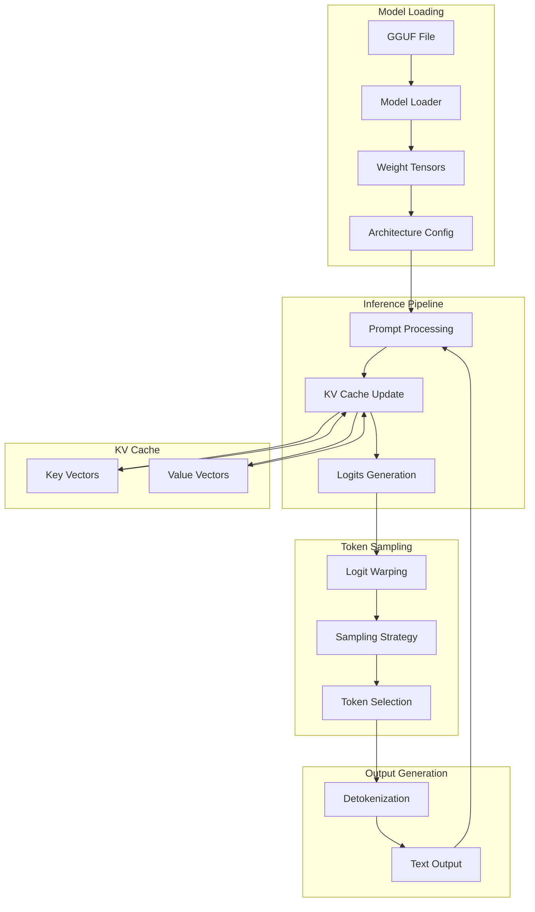

# llamacpp AIResearch: Complete Exploration

## Overview

**llama.cpp** is the definitive C/C++ implementation for efficient LLM inference, featuring the GGML tensor library and quantization formats that have become the industry standard for running large language models on consumer hardware.

### Why This Exploration Exists

This is a **complete textbook** that takes you from zero LLM knowledge to understanding how to build and deploy production LLM inference systems with Rust/valtron replication for the ewe_platform.

### Key Characteristics

| Aspect | llama.cpp |
|--------|-----------|
| **Core Innovation** | GGML tensor library with efficient quantization |
| **Dependencies** | None (pure C/C++), optional CUDA/Metal/Vulkan |
| **Lines of Code** | ~50,000 (core + ggml) |
| **Purpose** | LLM inference on consumer hardware |
| **Architecture** | GGML computation graphs, KV caching, batched inference |
| **Runtime** | CPU, GPU (CUDA, Metal, Vulkan, SYCL, OpenCL) |
| **Rust Equivalent** | ggml-rs + valtron executor |

---

## Complete Table of Contents

This exploration consists of multiple deep-dive documents. Read them in order for complete understanding:

### Part 1: Foundations
1. **[Zero to LLM Engineer](00-zero-to-llm-engineer.md)** - Start here if new to LLMs
   - What are Large Language Models?
   - Transformer architecture fundamentals
   - Token generation and inference
   - GGML and quantization basics
   - From PyTorch to GGUF

### Part 2: Core Implementation
2. **[GGML Format Deep Dive](01-ggml-format-deep-dive.md)**
   - GGML tensor library architecture
   - Computation graphs
   - GGUF file format specification
   - Quantization types (Q2_K through Q8_0)
   - Memory layout and strides

3. **[Inference Optimization Deep Dive](02-inference-optimization-deep-dive.md)**
   - KV cache architecture
   - Batched inference
   - Prompt processing vs token generation
   - Sampling strategies (temperature, top-k, top-p)
   - Grammar-based sampling

4. **[Model Architecture Deep Dive](03-model-architecture-deep-dive.md)**
   - LLaMA architecture
   - Mistral and Mixtral MoE
   - Gemma, Qwen, Phi architectures
   - Attention mechanisms (GQA, MQA, SWA)
   - Feed-forward networks (SwiGLU, GeGLU)

### Part 3: Rust Replication
5. **[Rust Revision](rust-revision.md)**
   - Complete Rust translation guide
   - ggml-rs and whisper-rs patterns
   - Type system design for tensors
   - Ownership and borrowing strategy
   - Valtron integration for inference

### Part 4: Production
6. **[Production-Grade](production-grade.md)**
   - Performance optimizations
   - Memory management
   - Multi-GPU inference
   - Serving infrastructure (llama-server)
   - Monitoring and observability

7. **[Valtron Integration](05-valtron-integration.md)**
   - Lambda deployment for LLM inference
   - HTTP API compatibility
   - Request/response types
   - Production deployment without async/await

---

## Quick Reference: llama.cpp Architecture

### High-Level Flow



### Component Summary

| Component | Lines | Purpose | Deep Dive |
|-----------|-------|---------|-----------|
| GGML Core | 15,000 | Tensor operations, computation graphs | [GGML Format](01-ggml-format-deep-dive.md) |
| Quantization | 3,000 | Q2_K through Q8_0 types | [GGML Format](01-ggml-format-deep-dive.md) |
| KV Cache | 2,500 | Key-value cache management | [Inference Optimization](02-inference-optimization-deep-dive.md) |
| Sampling | 2,000 | Temperature, top-k, top-p, grammar | [Inference Optimization](02-inference-optimization-deep-dive.md) |
| Model Arch | 8,000 | LLaMA, Mistral, Gemma support | [Model Architecture](03-model-architecture-deep-dive.md) |
| Server | 5,000 | HTTP API, OpenAI compatibility | [Production-Grade](production-grade.md) |
| Valtron Integration | 200 | Rust executor patterns | [Valtron Integration](05-valtron-integration.md) |

---

## File Structure

```
llamacpp/AIResearch/
├── exploration.md                      # This file (index)
├── 00-zero-to-llm-engineer.md          # START HERE: LLM foundations
├── 01-ggml-format-deep-dive.md         # GGML tensors, GGUF, quantization
├── 02-inference-optimization-deep-dive.md  # KV cache, batching, sampling
├── 03-model-architecture-deep-dive.md  # LLaMA, Mistral, MoE architectures
├── rust-revision.md                    # Rust translation guide
├── production-grade.md                 # Production deployment
└── 05-valtron-integration.md           # Lambda deployment for inference
```

### Source Structure (llama.cpp)

```
llama.cpp/
├── ggml/
│   ├── include/
│   │   └── ggml.h                      # GGML API definition
│   └── src/
│       ├── ggml.c                      # Core tensor operations
│       ├── ggml-quants.c               # Quantization implementations
│       ├── ggml-cuda/                  # CUDA backend
│       ├── ggml-metal/                 # Metal backend
│       └── ggml-vulkan/                # Vulkan backend
│
├── src/
│   ├── llama.cpp                       # Main inference implementation
│   ├── llama-model.cpp                 # Model loading
│   ├── llama-sampling.cpp              # Token sampling
│   ├── llama-kv-cache.cpp              # KV cache management
│   ├── llama-grammar.cpp               # Grammar-based sampling
│   └── llama-quant.cpp                 # Quantization utilities
│
├── examples/
│   ├── simple/                         # Minimal examples
│   ├── llm/                            # Full LLM examples
│   └── server/                         # Server examples
│
├── tools/
│   ├── server/                         # llama-server (HTTP API)
│   ├── quantize/                       # Model quantization
│   └── export-lora/                    # LoRA export
│
├── convert_hf_to_gguf.py               # HuggingFace to GGUF conversion
├── convert_llama_ggml_to_gguf.py       # Legacy GGML to GGUF
└── README.md
```

---

## How to Use This Exploration

### For Complete Beginners (Zero LLM Experience)

1. Start with **[00-zero-to-llm-engineer.md](00-zero-to-llm-engineer.md)**
2. Read each section carefully, work through examples
3. Continue through all deep dives in order
4. Install llama.cpp and run basic inference
5. Finish with production-grade and valtron integration

**Time estimate:** 30-60 hours for complete understanding

### For Experienced ML Engineers

1. Skim [00-zero-to-llm-engineer.md](00-zero-to-llm-engineer.md) for context
2. Deep dive into GGML format and quantization
3. Study inference optimization techniques
4. Review [rust-revision.md](rust-revision.md) for Rust translation patterns
5. Check [production-grade.md](production-grade.md) for deployment considerations

### For Rust Developers

1. Review [llama.cpp source](src/) directly
2. Use [rust-revision.md](rust-revision.md) as primary guide
3. Study whisper-rs and ggml-rs patterns
4. Implement valtron-based inference pipeline
5. Compare with tokio-based alternatives

---

## Running llama.cpp

```bash
# Clone the repository
git clone https://github.com/ggml-org/llama.cpp
cd llama.cpp

# Build (CPU only)
cmake -B build
cmake --build build --config Release

# Build with CUDA support
cmake -B build -DGGML_CUDA=ON
cmake --build build --config Release

# Run inference
./build/bin/llama-cli -m models/llama-3.2-1b-instruct.q4_k_m.gguf \
    -p "Hello, my name is" -n 128

# Start server (OpenAI-compatible API)
./build/bin/llama-server -m models/llama-3.2-1b-instruct.q4_k_m.gguf \
    --port 8080 --host 0.0.0.0
```

### Model Conversion

```bash
# Download model from HuggingFace
huggingface-cli download ggml-org/gemma-3-1b-it-GGUF

# Or convert from HuggingFace format
python convert_hf_to_gguf.py \
    --outfile models/mymodel.gguf \
    models/mymodel-hf/

# Quantize to Q4_K_M
./build/bin/llama-quantize \
    models/mymodel-f16.gguf \
    models/mymodel-q4_k_m.gguf \
    Q4_K_M
```

---

## Key Insights

### 1. GGML Computation Graphs

GGML builds computation graphs that are evaluated lazily:

```c
// Define computation: f = a * x^2 + b
struct ggml_tensor * x = ggml_new_tensor_1d(ctx, GGML_TYPE_F32, 1);
struct ggml_tensor * a = ggml_new_tensor_1d(ctx, GGML_TYPE_F32, 1);
struct ggml_tensor * b = ggml_new_tensor_1d(ctx, GGML_TYPE_F32, 1);

struct ggml_tensor * x2 = ggml_mul(ctx, x, x);
struct ggml_tensor * ax2 = ggml_mul(ctx, a, x2);
struct ggml_tensor * f = ggml_add(ctx, ax2, b);

// Build and compute
struct ggml_cgraph * gf = ggml_new_graph(ctx);
ggml_build_forward_expand(gf, f);
ggml_graph_compute_with_ctx(ctx, gf, n_threads);
```

### 2. Quantization Types

| Type | Bits/Weight | Size vs FP16 | Quality |
|------|-------------|--------------|---------|
| Q2_K | 2.56 | 15.6% | Acceptable for casual use |
| Q3_K | 3.44 | 21.5% | Good balance |
| Q4_K_M | 4.56 | 28.5% | Recommended default |
| Q5_K_M | 5.69 | 35.6% | High quality |
| Q6_K | 6.56 | 41% | Near-FP16 quality |
| Q8_0 | 8.5 | 53% | Virtually lossless |
| FP16 | 16 | 100% | Reference |

### 3. KV Cache Architecture

```
KV Cache Structure:
┌─────────────────────────────────────────────┐
│  Layer 0  │  Layer 1  │  ...  │  Layer N   │
├───────────┼───────────┼───────┼────────────┤
│  K cache  │  K cache  │  ...  │  K cache   │
│  [seq][pos][head][dim]                        │
├───────────┼───────────┼───────┼────────────┤
│  V cache  │  V cache  │  ...  │  V cache   │
│  [seq][pos][head][dim]                        │
└─────────────────────────────────────────────┘

Memory optimization:
- Sliding window attention (SWA): Only keep recent tokens
- GQA (Grouped Query Attention): Share K/V across heads
- Quantized KV: Use Q4_0/Q8_0 for cache storage
```

### 4. Sampling Pipeline

```
Logits -> [Temperature] -> [Top-K] -> [Top-P] -> [Grammar] -> Token

1. Temperature: Scale logits by 1/T
2. Top-K: Keep only K highest probability tokens
3. Top-P (nucleus): Keep tokens summing to P probability
4. Grammar: Filter tokens matching grammar rules
5. Sample: Random selection from remaining distribution
```

### 5. Valtron for Rust Inference

```rust
// TypeScript/Python async style (what we're replacing):
async fn generate_token(prompt: &[Token]) -> Token {
    let logits = model.forward(prompt).await?;
    sample(logits)
}

// Valtron TaskIterator pattern:
struct GenerateToken {
    model: Arc<Model>,
    tokens: Vec<Token>,
    state: GenerateState,
}

impl TaskIterator for GenerateToken {
    type Ready = Token;
    type Pending = ComputeState;

    fn next_status(&mut self) -> Option<TaskStatus<Self::Ready, Self::Pending>> {
        match self.state {
            GenerateState::Init => {
                self.state = GenerateState::Computing;
                Some(TaskStatus::Pending(ComputeState::Running))
            }
            GenerateState::Computing => {
                let logits = self.model.forward(&self.tokens);
                let token = sample(logits);
                Some(TaskStatus::Ready(token))
            }
            GenerateState::Done => None,
        }
    }
}
```

---

## From llama.cpp to Production LLM Systems

| Aspect | llama.cpp | Production LLM Systems |
|--------|-----------|----------------------|
| **Model Loading** | GGUF file loading | Model registry, versioning |
| **Inference** | Single batch | Continuous batching, in-flight batching |
| **KV Cache** | Per-context cache | Shared prefix caching, PagedAttention |
| **Sampling** | CPU sampling | GPU sampling, speculative decoding |
| **Serving** | llama-server | Kubernetes, autoscaling |
| **Monitoring** | Basic logging | Prometheus, distributed tracing |

**Key takeaway:** The core algorithms (GGML ops, KV caching, sampling) remain the same; production systems add infrastructure for scale, reliability, and multi-tenancy.

---

## Your Path Forward

### To Build LLM Inference Systems

1. **Implement GGML tensor ops in Rust** (start with matmul, layer norm)
2. **Build GGUF loader** (parse headers, load quantized tensors)
3. **Implement KV cache** (with sliding window support)
4. **Add sampling strategies** (temperature, top-k, top-p, grammar)
5. **Integrate with valtron** (TaskIterator for inference steps)
6. **Build HTTP server** (OpenAI-compatible API)

### Recommended Resources

- [llama.cpp GitHub](https://github.com/ggml-org/llama.cpp)
- [GGML Documentation](https://github.com/ggml-org/ggml)
- [GGUF Specification](https://github.com/ggml-org/ggml/blob/master/docs/gguf.md)
- [Whisper-rs](https://codeberg.org/tazz4843/whisper-rs)
- [Valtron README](/home/darkvoid/Boxxed/@dev/ewe_platform/backends/foundation_core/src/valtron/README.md)

---

## Document History

| Date | Change |
|------|--------|
| 2026-03-27 | Initial exploration created |
| 2026-03-27 | Deep dives 00-05 and rust-revision outlined |

---

*This exploration is a living document. Revisit sections as concepts become clearer through implementation.*
