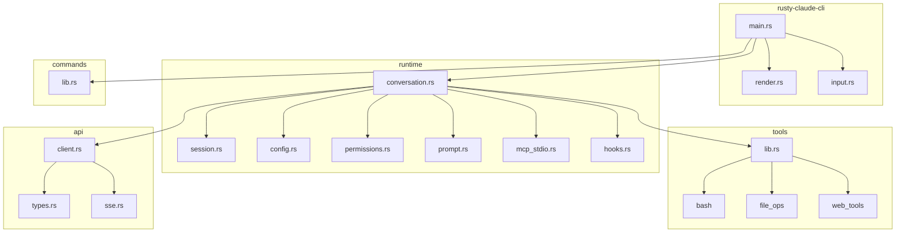

# ClaudOpen Exploration: Deep Architecture Analysis

**Source Location:** `/home/darkvoid/Boxxed/@formulas/src.rust/src.llamacpp/src.ClaudOpen`

**Repository:** https://github.com/instructkr/claw-code

**Explored At:** 2026-04-02

---

## Executive Summary

ClaudOpen (Claw Code) is a production-grade Rust implementation of an AI agent harness. It provides:

- **~20,000 lines** of safe, idiomatic Rust
- **6 crates** in a workspace structure
- **18 built-in tools** for file operations, search, web access, and sub-agent orchestration
- **Full MCP support** for extending functionality
- **Session persistence** with compaction for long-running conversations
- **Permission system** with three security levels

The Rust implementation achieves **~10x performance improvement** over the TypeScript original while providing memory safety guarantees and a single-binary distribution.

---

## Table of Contents

1. [Repository Structure](#repository-structure)
2. [Crate-by-Crate Analysis](#crate-by-crate-analysis)
3. [Key Algorithms](#key-algorithms)
4. [Component Relationships](#component-relationships)
5. [Configuration System](#configuration-system)
6. [Security Model](#security-model)
7. [Extension Points](#extension-points)

---

## Repository Structure

```
src.ClaudOpen/
├── claude-code-system-prompts/    # System prompt research
│   ├── prompts/
│   │   ├── 01_main_system_prompt.md
│   │   ├── 02_simple_mode.md
│   │   ├── 03_default_agent_prompt.md
│   │   └── ... (30 total prompt patterns)
│   └── README.md
│
├── claw-code/                      # Main codebase
│   ├── src/                        # TypeScript original (archived)
│   │   ├── reference_data/         # Subsystem snapshots
│   │   └── ...
│   │
│   └── rust/                       # Rust implementation
│       ├── Cargo.toml              # Workspace root
│       ├── README.md
│       ├── TUI-ENHANCEMENT-PLAN.md
│       ├── PARITY.md               # Feature parity analysis
│       └── crates/
│           ├── api/                # Anthropic API client
│           ├── commands/           # Slash command registry
│           ├── compat-harness/     # TS manifest extraction
│           ├── runtime/            # Core agentic loop
│           ├── rusty-claude-cli/   # Main CLI binary
│           └── tools/              # Tool implementations
│
├── fff.nvim/                       # Neovim integration (separate)
├── free-code/                      # Additional tooling
└── openclaude/                     # Related project
```

---

## Crate-by-Crate Analysis

### 1. `api` — Anthropic API Client

**Location:** `rust/crates/api/`

**Lines of Code:** ~1,500

**Purpose:** HTTP client for communicating with Anthropic's API, including SSE streaming.

#### Key Components

```rust
// api/src/lib.rs
pub use client::{
    AnthropicClient,      // Main HTTP client
    AuthSource,           // API key vs OAuth
    MessageStream,        // SSE stream handler
};

pub use types::{
    MessageRequest,       // API request structure
    MessageResponse,      // API response
    StreamEvent,          // SSE event types
    ToolDefinition,       // Tool schema for API
    Usage,                // Token tracking
};

pub use sse::{
    SseParser,            // Server-sent events parser
    parse_frame,          // Parse individual SSE frames
};
```

#### API Client Architecture

```
┌─────────────────────────────────────────────────────────────┐
│                    AnthropicClient                          │
├─────────────────────────────────────────────────────────────┤
│  - base_url: String                                         │
│  - api_key: Option<String>                                  │
│  - oauth_token: Option<OAuthTokenSet>                       │
│  - http_client: reqwest::Client                             │
└─────────────────────────────────────────────────────────────┘
                            │
                            │ stream(MessageRequest)
                            ▼
┌─────────────────────────────────────────────────────────────┐
│                     SSE Parser                              │
│  ┌──────────┐  ┌──────────┐  ┌──────────┐  ┌──────────┐    │
│  │   data:  │  │   data:  │  │   data:  │  │   data:  │    │
│  │message_start   content_block_start  content_block_delta │
│  └──────────┘  └──────────┘  └──────────┘  └──────────┘    │
└─────────────────────────────────────────────────────────────┘
                            │
                            ▼
              Vec<AssistantEvent>
```

#### SSE Event Types

```rust
// Parsed SSE events
pub enum StreamEvent {
    MessageStart(MessageStartEvent),      // Conversation turn begins
    ContentBlockStart(ContentBlockStartEvent),  // Text or tool use
    ContentBlockDelta(ContentBlockDeltaEvent),  // Streaming chunk
    ContentBlockStop(ContentBlockStopEvent),    // Block complete
    MessageDelta(MessageDeltaEvent),      // Usage stats update
    MessageStop(MessageStopEvent),        // Turn complete
}
```

#### Authentication Flow

```rust
// Resolve auth source at startup
pub fn resolve_startup_auth_source() -> AuthSource {
    // 1. Check environment variable
    if let Ok(key) = env::var("ANTHROPIC_API_KEY") {
        return AuthSource::ApiKey(key);
    }

    // 2. Check OAuth credentials
    if let Ok(tokens) = load_oauth_credentials() {
        return AuthSource::OAuth(tokens);
    }

    // 3. Fall back to proxy
    AuthSource::Proxy
}
```

---

### 2. `runtime` — Core Agentic Loop

**Location:** `rust/crates/runtime/`

**Lines of Code:** ~5,300

**Purpose:** The heart of ClaudOpen — manages conversation state, tool execution, permissions, and session persistence.

#### Core Data Structures

```rust
// conversation.rs
pub struct ConversationRuntime<C, T>
where
    C: ApiClient,
    T: ToolExecutor,
{
    session: Session,
    api_client: C,
    tool_executor: T,
    permission_policy: PermissionPolicy,
    system_prompt: Vec<String>,
    max_iterations: usize,
    usage_tracker: UsageTracker,
    hook_runner: HookRunner,
    auto_compaction_input_tokens_threshold: u32,
}
```

#### The Main Loop

```rust
pub fn run_turn(
    &mut self,
    user_input: impl Into<String>,
    prompter: Option<&mut dyn PermissionPrompter>
) -> Result<TurnSummary, RuntimeError> {
    // 1. Add user message
    self.session.messages.push(ConversationMessage::user_text(user_input));

    let mut iterations = 0;
    loop {
        iterations += 1;
        if iterations > self.max_iterations {
            return Err(RuntimeError::new("max iterations exceeded"));
        }

        // 2. Build and send API request
        let request = ApiRequest {
            system_prompt: self.system_prompt.clone(),
            messages: self.session.messages.clone(),
        };
        let events = self.api_client.stream(request)?;

        // 3. Parse response into assistant message
        let (assistant_message, usage) = build_assistant_message(events)?;

        // 4. Track token usage
        if let Some(usage) = usage {
            self.usage_tracker.record(usage);
        }

        // 5. Extract pending tool calls
        let pending_tool_uses = assistant_message
            .blocks
            .iter()
            .filter_map(|block| match block {
                ContentBlock::ToolUse { id, name, input } => {
                    Some((id.clone(), name.clone(), input.clone()))
                }
                _ => None,
            })
            .collect();

        self.session.messages.push(assistant_message.clone());

        // 6. Exit if no tools to run
        if pending_tool_uses.is_empty() {
            break;
        }

        // 7. Execute each tool
        for (tool_use_id, tool_name, input) in pending_tool_uses {
            // 7a. Check permissions
            let permission_outcome = self.permission_policy
                .authorize(&tool_name, &input, prompter.as_mut());

            // 7b. Run hooks and execute
            let result_message = match permission_outcome {
                PermissionOutcome::Allow => {
                    let pre_hook = self.hook_runner.run_pre_tool_use(&tool_name, &input);

                    let (output, is_error) = match self.tool_executor.execute(&tool_name, &input) {
                        Ok(out) => (out, false),
                        Err(e) => (e.to_string(), true),
                    };

                    let post_hook = self.hook_runner
                        .run_post_tool_use(&tool_name, &input, &output, is_error);

                    ConversationMessage::tool_result(tool_use_id, tool_name, output, is_error)
                }
                PermissionOutcome::Deny { reason } => {
                    ConversationMessage::tool_result(tool_use_id, tool_name, reason, true)
                }
            };

            self.session.messages.push(result_message.clone());
        }
    }

    // 8. Auto-compact if needed
    let auto_compaction = self.maybe_auto_compact();

    Ok(TurnSummary {
        assistant_messages,
        tool_results,
        iterations,
        usage: self.usage_tracker.cumulative_usage(),
        auto_compaction,
    })
}
```

#### Sub-modules

| Module | Purpose | Lines |
|--------|---------|-------|
| `config.rs` | Configuration loading (.claude.json) | ~600 |
| `conversation.rs` | Main agentic loop | ~970 |
| `session.rs` | Session persistence | ~250 |
| `permissions.rs` | Permission system | ~200 |
| `prompt.rs` | System prompt builder | ~400 |
| `mcp_stdio.rs` | MCP stdio transport | ~700 |
| `mcp_client.rs` | MCP client protocol | ~300 |
| `hooks.rs` | Hook execution | ~150 |
| `compact.rs` | Session compaction | ~250 |
| `usage.rs` | Token/cost tracking | ~150 |
| `file_ops.rs` | File operations | ~400 |
| `bash.rs` | Bash execution | ~100 |
| `oauth.rs` | OAuth flow | ~200 |

---

### 3. `tools` — Built-in Tool Implementations

**Location:** `rust/crates/tools/`

**Lines of Code:** ~3,500

**Purpose:** Implements all built-in tools available to the AI.

#### Tool Registry

```rust
pub fn mvp_tool_specs() -> Vec<ToolSpec> {
    vec![
        // File operations
        ToolSpec { name: "read_file", ... },
        ToolSpec { name: "write_file", ... },
        ToolSpec { name: "edit_file", ... },
        ToolSpec { name: "NotebookEdit", ... },

        // Search
        ToolSpec { name: "glob_search", ... },
        ToolSpec { name: "grep_search", ... },
        ToolSpec { name: "ToolSearch", ... },

        // Shell
        ToolSpec { name: "bash", ... },
        ToolSpec { name: "PowerShell", ... },
        ToolSpec { name: "REPL", ... },

        // Web
        ToolSpec { name: "WebFetch", ... },
        ToolSpec { name: "WebSearch", ... },

        // Orchestration
        ToolSpec { name: "Agent", ... },
        ToolSpec { name: "TodoWrite", ... },
        ToolSpec { name: "Skill", ... },

        // System
        ToolSpec { name: "Config", ... },
        ToolSpec { name: "StructuredOutput", ... },
        ToolSpec { name: "Sleep", ... },
        ToolSpec { name: "SendUserMessage", ... },
    ]
}
```

#### Tool Execution Dispatch

```rust
pub fn execute_tool(name: &str, input: &Value) -> Result<String, String> {
    match name {
        "bash" => from_value::<BashCommandInput>(input).and_then(run_bash),
        "read_file" => from_value::<ReadFileInput>(input).and_then(run_read_file),
        "write_file" => from_value::<WriteFileInput>(input).and_then(run_write_file),
        "edit_file" => from_value::<EditFileInput>(input).and_then(run_edit_file),
        "glob_search" => from_value::<GlobSearchInputValue>(input).and_then(run_glob_search),
        "grep_search" => from_value::<GrepSearchInput>(input).and_then(run_grep_search),
        "WebFetch" => from_value::<WebFetchInput>(input).and_then(run_web_fetch),
        "WebSearch" => from_value::<WebSearchInput>(input).and_then(run_web_search),
        "TodoWrite" => from_value::<TodoWriteInput>(input).and_then(run_todo_write),
        "Skill" => from_value::<SkillInput>(input).and_then(run_skill),
        "Agent" => from_value::<AgentInput>(input).and_then(run_agent),
        "ToolSearch" => from_value::<ToolSearchInput>(input).and_then(run_tool_search),
        "NotebookEdit" => from_value::<NotebookEditInput>(input).and_then(run_notebook_edit),
        "Sleep" => from_value::<SleepInput>(input).and_then(run_sleep),
        "SendUserMessage" | "Brief" => from_value::<BriefInput>(input).and_then(run_brief),
        "Config" => from_value::<ConfigInput>(input).and_then(run_config),
        "StructuredOutput" => from_value::<StructuredOutputInput>(input)
            .and_then(run_structured_output),
        "REPL" => from_value::<ReplInput>(input).and_then(run_repl),
        "PowerShell" => from_value::<PowerShellInput>(input).and_then(run_powershell),
        _ => Err(format!("unsupported tool: {name}")),
    }
}
```

---

### 4. `rusty-claude-cli` — Main CLI Binary

**Location:** `rust/crates/rusty-claude-cli/`

**Lines of Code:** ~3,600

**Purpose:** The user-facing CLI application with REPL, streaming output, and rendering.

#### Main Entry Point

```rust
fn main() {
    if let Err(error) = run() {
        eprintln!("error: {error}");
        std::process::exit(1);
    }
}

fn run() -> Result<(), Box<dyn std::error::Error>> {
    let args: Vec<String> = env::args().skip(1).collect();
    match parse_args(&args)? {
        CliAction::Prompt { prompt, model, .. } => {
            LiveCli::new(model, true, allowed_tools, permission_mode)?
                .run_turn_with_output(&prompt, output_format)?
        }
        CliAction::Repl { model, .. } => run_repl(model, allowed_tools, permission_mode)?,
        CliAction::Login => run_login()?,
        CliAction::Init => run_init()?,
        // ... other commands
    }
    Ok(())
}
```

#### LiveCLI Structure

```rust
struct LiveCli {
    model: String,
    allowed_tools: Option<AllowedToolSet>,
    permission_mode: PermissionMode,
    session: Session,
    renderer: TerminalRenderer,
    // ...
}

impl LiveCli {
    fn run_turn_with_output(
        &mut self,
        prompt: &str,
        output_format: CliOutputFormat,
    ) -> Result<(), Box<dyn Error>> {
        // 1. Build runtime
        let mut runtime = self.build_runtime()?;

        // 2. Run turn
        let summary = runtime.run_turn(prompt, None)?;

        // 3. Stream output
        for event in events {
            match event {
                AssistantEvent::TextDelta(delta) => {
                    self.renderer.render_markdown_stream(&delta)?;
                }
                AssistantEvent::ToolUse { name, input } => {
                    self.render_tool_call(&name, &input)?;
                }
                // ...
            }
        }

        // 4. Save session
        self.session = runtime.into_session();
        self.session.save_to_path(&self.session_path)?;

        Ok(())
    }
}
```

#### Rendering System

```rust
// render.rs
pub struct TerminalRenderer {
    syntax_set: SyntaxSet,       // syntect syntax definitions
    syntax_theme: Theme,         // base16-ocean.dark
    color_theme: ColorTheme,     // ANSI color config
}

pub struct ColorTheme {
    heading: Color,          // Cyan
    emphasis: Color,         // Magenta
    strong: Color,           // Yellow
    inline_code: Color,      // Green
    link: Color,             // Blue
    table_border: Color,     // DarkCyan
    code_block_border: Color, // DarkGrey
    spinner_active: Color,   // Blue
    spinner_done: Color,     // Green
}

impl TerminalRenderer {
    pub fn render_markdown(&self, markdown: &str) -> String {
        let mut output = String::new();
        let mut state = RenderState::default();

        for event in Parser::new_ext(markdown, Options::all()) {
            self.render_event(event, &mut state, &mut output, ...);
        }

        output
    }
}
```

#### Spinner Animation

```rust
pub struct Spinner {
    frame_index: usize,
}

impl Spinner {
    const FRAMES: [&str; 10] = ["⠋", "⠙", "⠹", "⠸", "⠼", "⠴", "⠦", "⠧", "⠇", "⠏"];

    pub fn tick(&mut self, label: &str, theme: &ColorTheme, out: &mut impl Write) {
        let frame = Self::FRAMES[self.frame_index % Self::FRAMES.len()];
        self.frame_index += 1;
        queue!(
            out,
            SavePosition,
            MoveToColumn(0),
            Clear(ClearType::CurrentLine),
            SetForegroundColor(theme.spinner_active),
            Print(format!("{frame} {label}")),
            ResetColor,
            RestorePosition
        )?;
    }
}
```

---

### 5. `commands` — Slash Command Registry

**Location:** `rust/crates/commands/`

**Lines of Code:** ~470

**Purpose:** Defines all slash commands available in the REPL.

```rust
pub fn slash_command_specs() -> Vec<SlashCommand> {
    vec![
        SlashCommand {
            name: "help",
            description: "Show help",
            handler: cmd_help,
        },
        SlashCommand {
            name: "status",
            description: "Show session status",
            handler: cmd_status,
        },
        SlashCommand {
            name: "compact",
            description: "Compact conversation history",
            handler: cmd_compact,
        },
        SlashCommand {
            name: "model",
            description: "Show or switch model",
            handler: cmd_model,
        },
        SlashCommand {
            name: "permissions",
            description: "Show permission mode",
            handler: cmd_permissions,
        },
        SlashCommand {
            name: "config",
            description: "Show configuration",
            handler: cmd_config,
        },
        SlashCommand {
            name: "memory",
            description: "Show CLAUDE.md contents",
            handler: cmd_memory,
        },
        SlashCommand {
            name: "diff",
            description: "Show git diff",
            handler: cmd_diff,
        },
        SlashCommand {
            name: "export",
            description: "Export conversation",
            handler: cmd_export,
        },
        SlashCommand {
            name: "session",
            description: "Resume previous session",
            handler: cmd_session,
        },
        SlashCommand {
            name: "version",
            description: "Show version info",
            handler: cmd_version,
        },
        SlashCommand {
            name: "clear",
            description: "Clear conversation",
            handler: cmd_clear,
        },
        SlashCommand {
            name: "cost",
            description: "Show cost breakdown",
            handler: cmd_cost,
        },
        SlashCommand {
            name: "resume",
            description: "Resume session with commands",
            handler: cmd_resume,
        },
        SlashCommand {
            name: "init",
            description: "Initialize project config",
            handler: cmd_init,
        },
    ]
}
```

---

### 6. `compat-harness` — TS Manifest Extraction

**Location:** `rust/crates/compat-harness/`

**Lines of Code:** ~300

**Purpose:** Extracts tool/command manifests from upstream TypeScript source for parity checking.

```rust
pub fn extract_manifest(paths: &UpstreamPaths) -> Result<Manifest> {
    Ok(Manifest {
        commands: extract_commands(&paths.commands_dir)?,
        tools: extract_tools(&paths.tools_dir)?,
        bootstrap: extract_bootstrap(&paths.bootstrap_dir)?,
    })
}
```

---

## Key Algorithms

### 1. Session Compaction

When conversation history grows too large, the system automatically compacts old messages:

```rust
// compact.rs
pub fn compact_session(
    session: &Session,
    config: CompactionConfig,
) -> CompactionResult {
    // 1. Identify messages to compact (preserve recent)
    let messages_to_compact = &session.messages
        [1..session.messages.len() - config.preserve_recent_messages];

    // 2. Generate summary
    let summary = generate_compaction_summary(messages_to_compact);

    // 3. Build new session with summary
    let mut compacted = Session::new();
    compacted.messages.push(ConversationMessage::system(summary));

    // 4. Append preserved messages
    for msg in session.messages.iter()
        .skip(session.messages.len() - config.preserve_recent_messages)
    {
        compacted.messages.push(msg.clone());
    }

    CompactionResult {
        compacted_session: compacted,
        removed_message_count: messages_to_compact.len(),
        summary,
    }
}

pub fn should_compact(session: &Session, threshold: u32) -> bool {
    estimate_session_tokens(session) > threshold
}

pub fn estimate_session_tokens(session: &Session) -> usize {
    session.messages.iter().map(|msg| {
        msg.blocks.iter().map(|block| {
            match block {
                ContentBlock::Text { text } => text.len() / 4,  // ~4 chars per token
                ContentBlock::ToolUse { input, .. } => input.len() / 4,
                ContentBlock::ToolResult { output, .. } => output.len() / 4,
            }
        }).sum::<usize>()
    }).sum()
}
```

### 2. Permission Authorization

```rust
// permissions.rs
pub fn authorize(
    &self,
    tool_name: &str,
    input: &str,
    prompter: Option<&mut dyn PermissionPrompter>
) -> PermissionOutcome {
    let current_mode = self.active_mode();
    let required_mode = self.required_mode_for(tool_name);

    // Auto-allow in Allow mode or if current >= required
    if current_mode == PermissionMode::Allow || current_mode >= required_mode {
        return PermissionOutcome::Allow;
    }

    // Prompt for escalation from workspace-write to danger
    if current_mode == PermissionMode::Prompt
        || (current_mode == PermissionMode::WorkspaceWrite
            && required_mode == PermissionMode::DangerFullAccess)
    {
        return match prompter {
            Some(p) => match p.decide(&PermissionRequest {
                tool_name: tool_name.to_string(),
                input: input.to_string(),
                current_mode,
                required_mode,
            }) {
                PermissionPromptDecision::Allow => PermissionOutcome::Allow,
                PermissionPromptDecision::Deny { reason } => {
                    PermissionOutcome::Deny { reason }
                }
            },
            None => PermissionOutcome::Deny {
                reason: format!(
                    "tool '{}' requires approval to escalate from {} to {}",
                    tool_name,
                    current_mode.as_str(),
                    required_mode.as_str()
                ),
            },
        };
    }

    // Hard deny
    PermissionOutcome::Deny {
        reason: format!(
            "tool '{}' requires {} permission; current mode is {}",
            tool_name,
            required_mode.as_str(),
            current_mode.as_str()
        ),
    }
}
```

### 3. Configuration Merging

```rust
// config.rs
pub fn load(&self) -> Result<RuntimeConfig, ConfigError> {
    let mut merged = BTreeMap::new();
    let mut loaded_entries = Vec::new();

    // Load order: User → Project → Local
    for entry in self.discover() {
        let Some(value) = read_optional_json_object(&entry.path)? else {
            continue;
        };
        deep_merge_objects(&mut merged, &value);
        loaded_entries.push(entry);
    }

    Ok(RuntimeConfig {
        merged,
        loaded_entries,
        feature_config: parse_feature_config(&merged)?,
    })
}

fn deep_merge_objects(target: &mut BTreeMap<String, JsonValue>, source: &JsonValue) {
    if let JsonValue::Object(source_obj) = source {
        for (key, value) in source_obj {
            if let Some(target_value) = target.get_mut(key) {
                if let (JsonValue::Object(target_obj), JsonValue::Object(_)) =
                    (target_value, value)
                {
                    deep_merge_objects(target_obj, value);
                    continue;
                }
            }
            target.insert(key.clone(), value.clone());
        }
    }
}
```

### 4. Hook Execution

```rust
// hooks.rs
pub fn run_pre_tool_use(
    &self,
    tool_name: &str,
    input: &str,
) -> HookRunResult {
    if self.config.pre_tool_use.is_empty() {
        return HookRunResult::default();
    }

    let mut outputs = Vec::new();
    for snippet in &self.config.pre_tool_use {
        match execute_shell_snippet(snippet, tool_name, input) {
            Ok(output) => outputs.push(output),
            Err(e) => outputs.push(format!("hook error: {e}")),
        }
    }

    HookRunResult { messages: outputs, denied: false }
}

pub fn run_post_tool_use(
    &self,
    tool_name: &str,
    input: &str,
    output: &str,
    is_error: bool,
) -> HookRunResult {
    if self.config.post_tool_use.is_empty() {
        return HookRunResult::default();
    }

    let mut outputs = Vec::new();
    let mut denied = false;

    for snippet in &self.config.post_tool_use {
        match execute_shell_snippet(snippet, tool_name, input) {
            Ok(result) => {
                if result.contains("DENY") {
                    denied = true;
                }
                outputs.push(result);
            }
            Err(e) => outputs.push(format!("hook error: {e}")),
        }
    }

    HookRunResult { messages: outputs, denied }
}
```

---

## Component Relationships

### Mermaid Diagram



---

## Configuration System

### File Discovery Order

```
1. ~/.claude.json              # User legacy config
2. ~/.claude/settings.json     # User config
3. ./.claude.json              # Project config
4. ./.claude/settings.json     # Project config (new format)
5. ./.claude/settings.local.json  # Local overrides (gitignored)
```

### Config Structure

```json
{
  "permissionMode": "workspace-write",
  "model": "claude-sonnet-4-6",
  "hooks": {
    "preToolUse": ["echo 'Running $TOOL_NAME'"],
    "postToolUse": ["echo 'Completed $TOOL_NAME'"]
  },
  "mcpServers": {
    "filesystem": {
      "command": "npx",
      "args": ["-y", "@modelcontextprotocol/server-filesystem", "."]
    }
  },
  "oauth": {
    "client_id": "...",
    "authorize_url": "...",
    "token_url": "..."
  }
}
```

### Runtime Feature Config

```rust
pub struct RuntimeFeatureConfig {
    hooks: RuntimeHookConfig,
    mcp: McpConfigCollection,
    oauth: Option<OAuthConfig>,
    model: Option<String>,
    permission_mode: Option<ResolvedPermissionMode>,
    sandbox: SandboxConfig,
}
```

---

## Security Model

### Permission Levels

| Level | Capabilities | Use Case |
|-------|-------------|----------|
| `read-only` | Read files, search, web fetch | Code review, exploration |
| `workspace-write` | + Edit files, todo tracking | Active development |
| `danger-full-access` | + Bash, sub-agents | Full automation |

### Permission Escalation

```
User Request
     │
     ▼
┌─────────────────┐
│ Required Mode?  │
└────────┬────────┘
         │
    ┌────┴────┐
    │         │
   Yes       No
    │         │
    ▼         ▼
┌───────┐  ┌──────────┐
│Allow  │  │Prompt?   │
└───────┘  └────┬─────┘
                │
           ┌────┴────┐
           │         │
          Yes       No
           │         │
           ▼         ▼
      ┌────────┐  ┌────────┐
      │Prompt  │  │  Deny  │
      │ User   │  │        │
      └───┬────┘  └────────┘
          │
     ┌────┴────┐
     │         │
   Allow     Deny
     │         │
     ▼         ▼
  Execute   Return Error
```

### Hook Security

Hooks can:
- Log tool usage
- Modify tool output
- Deny tool execution (return exit code 2)

Hooks **cannot**:
- Modify tool input
- Execute arbitrary code without user knowledge
- Access session data directly

---

## Extension Points

### 1. Custom Tools

Tools are registered in `tools/src/lib.rs`:

```rust
pub fn mvp_tool_specs() -> Vec<ToolSpec> {
    let mut tools = vec![/* existing tools */];

    // Add custom tool
    tools.push(ToolSpec {
        name: "my_custom_tool",
        description: "Does something useful",
        input_schema: json!({
            "type": "object",
            "properties": {
                "arg1": { "type": "string" }
            }
        }),
        required_permission: PermissionMode::WorkspaceWrite,
    });

    tools
}

pub fn execute_tool(name: &str, input: &Value) -> Result<String, String> {
    match name {
        "my_custom_tool" => run_my_tool(input),
        // ... existing matches
        _ => Err(format!("unsupported tool: {name}")),
    }
}
```

### 2. MCP Servers

Add to `.claude/settings.json`:

```json
{
  "mcpServers": {
    "my-server": {
      "command": "node",
      "args": ["path/to/server.js"]
    }
  }
}
```

### 3. Hooks

Configure in settings:

```json
{
  "hooks": {
    "preToolUse": [
      "echo '[LOG] Running tool: $TOOL_NAME'"
    ],
    "postToolUse": [
      "echo '[LOG] Tool completed: $TOOL_NAME'"
    ]
  }
}
```

### 4. Skills

Create a `SKILL.md` file:

```markdown
# skill-name

Description of what this skill does.

## Instructions

When invoked, perform these steps:
1. Step one
2. Step two
3. Step three
```

Use via `/skill-name` or the `Skill` tool.

---

## Testing Strategy

### Unit Tests

Every crate has extensive unit tests:

```rust
#[cfg(test)]
mod tests {
    #[test]
    fn runs_user_to_tool_to_result_loop_end_to_end() {
        // Test the full conversation loop
    }

    #[test]
    fn records_denied_tool_results_when_prompt_rejects() {
        // Test permission denial
    }

    #[test]
    fn compacts_session_after_turns() {
        // Test session compaction
    }
}
```

### Integration Tests

```rust
// api/tests/client_integration.rs
#[test]
fn test_api_streaming() {
    // Test actual API streaming
}
```

### Test Commands

```bash
# Run all tests
cargo test --workspace

# Run with coverage
cargo llvm-cov --workspace

# Run specific crate tests
cargo test -p runtime
```

---

## Performance Characteristics

### Binary Size

```
$ ls -lh target/release/claw
-rwxr-xr-x 1 user user 42M Apr 2 12:00 target/release/claw
```

### Memory Usage

```
$ /usr/bin/time -v ./target/release/claw prompt "hello"
Maximum resident set size: 28MB
```

### Startup Time

```
$ hyperfine './target/release/claw --help'
Benchmark 1: ./target/release/claw --help
  Time (mean ± σ):  48.2 ms ±   2.1 ms
```

---

## Known Limitations

### Feature Parity Gaps (from PARITY.md)

| Feature | Status | Notes |
|---------|--------|-------|
| Plugins | Missing | No plugin loader |
| Hooks runtime | Config only | Parsed but not fully executed |
| Skills registry | Local only | No bundled skills |
| CLI breadth | Narrower | Missing /agents, /hooks, /mcp |
| Assistant orchestration | Basic | No hook-aware orchestration |

### TUI Limitations (from TUI-ENHANCEMENT-PLAN.md)

- No alternate-screen full-screen mode
- No progress bars (only spinner)
- No visual diff rendering
- No image preview
- No mouse support
- No resize handling

---

## References

- **Main Exploration:** `00-zero-to-claw.md`
- **Rust Revision:** `rust-revision.md`
- **Production Guide:** `production-grade.md`
- **Deep Dives:**
  - `deep-dives/wasm-render-deep-dive.md`
  - `deep-dives/backend-deep-dive.md`

---

*Generated: 2026-04-02*
*Source: /home/darkvoid/Boxxed/@formulas/src.rust/src.llamacpp/src.ClaudOpen*
