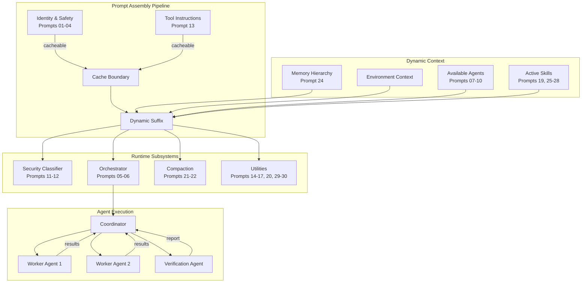
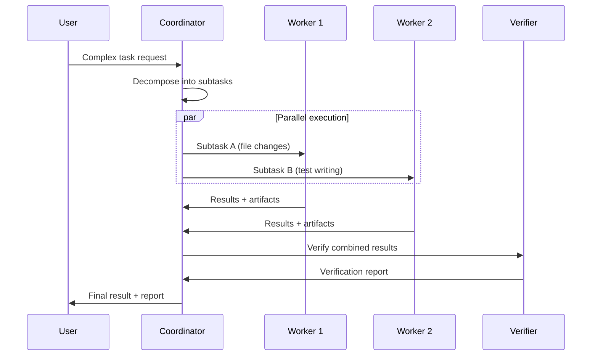
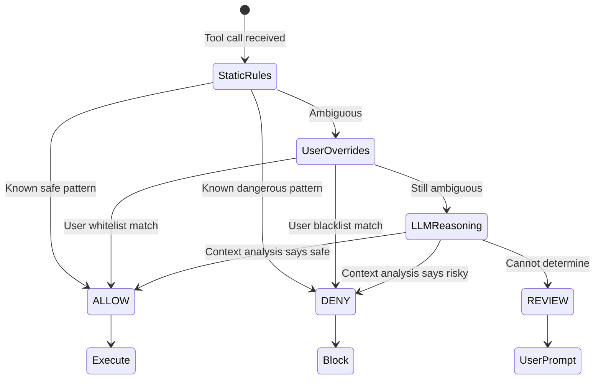
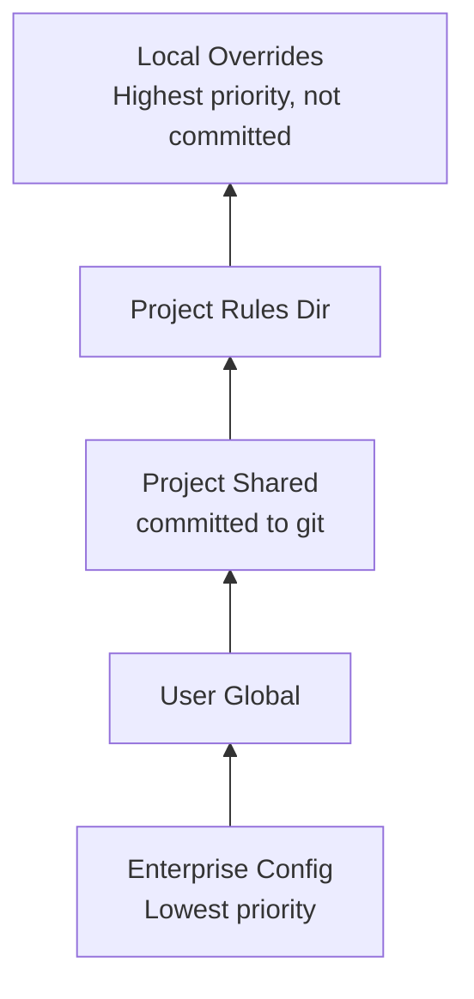
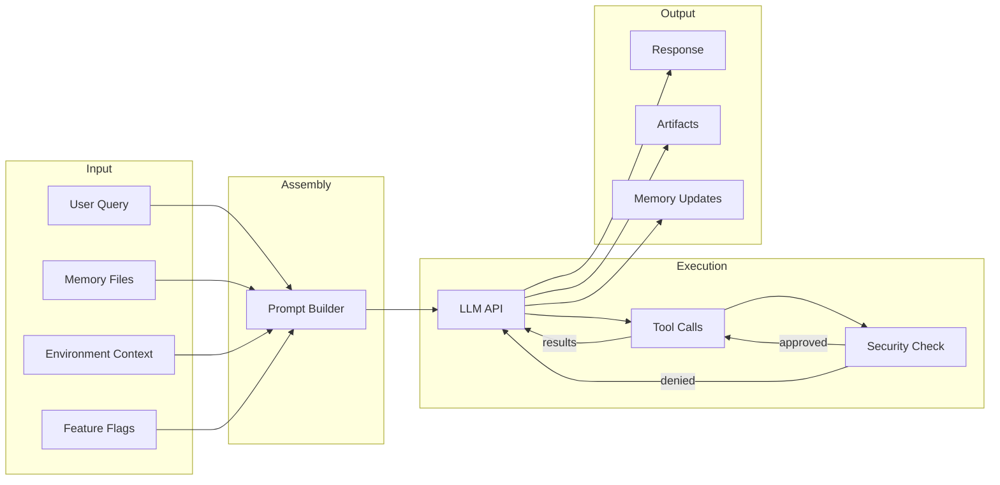

# Deep Architecture Exploration: Claude Code System Prompts

## Overview

This repository contains 30 reconstructed prompt documents that together form the prompt architecture of Claude Code. The documents are organized in the `prompts/` directory with numerical prefixes that roughly correspond to their conceptual grouping, not their execution order.

## Repository Structure

```
claude-code-system-prompts/
  README.md                              # Project overview and catalog
  prompts/
    01_main_system_prompt.md             # Master dynamic prompt
    02_simple_mode.md                    # Lightweight variant
    03_default_agent_prompt.md           # Sub-agent base
    04_cyber_risk_instruction.md         # Security boundaries
    05_coordinator_system_prompt.md      # Multi-agent orchestration
    06_teammate_prompt_addendum.md       # Agent communication protocols
    07_verification_agent.md             # Adversarial testing
    08_explore_agent.md                  # Read-only exploration
    09_agent_creation_architect.md       # Meta-agent for creating agents
    10_statusline_setup_agent.md         # Terminal status line config
    11_permission_explainer.md           # Risk assessment
    12_yolo_auto_mode_classifier.md      # Autonomous execution classifier
    13_tool_prompts.md                   # Tool self-descriptions
    14_tool_use_summary.md               # Tool batch labels
    15_session_search.md                 # Cross-session search
    16_memory_selection.md               # Memory file selection
    17_auto_mode_critique.md             # Rule review
    18_proactive_mode.md                 # Autonomous background operation
    19_simplify_skill.md                 # Code review skill
    20_session_title.md                  # Title generation
    21_compact_service.md                # Context compaction
    22_away_summary.md                   # Session recap
    23_chrome_browser_automation.md      # Browser integration
    24_memory_instruction.md             # Memory loading semantics
    25_skillify.md                       # Skill creation
    26_stuck_skill.md                    # Diagnostic recovery
    27_remember_skill.md                 # Memory organization
    28_update_config_skill.md            # Config management
    29_agent_summary.md                  # Agent progress updates
    30_prompt_suggestion.md              # Follow-up prediction
```

## Architecture Diagram



## Component Breakdown

### Component: Prompt Assembly Engine

- **Location:** Conceptual -- represented by Prompt 01
- **Purpose:** Dynamically constructs the system prompt from modular sections
- **Dependencies:** Feature flags, environment context, permission mode, memory files
- **Dependents:** Every other component (all agents receive an assembled prompt)

The assembly engine is the foundation. It determines what the model knows about itself, its tools, its constraints, and its context. The key architectural decision is the **cache boundary** -- a split point that separates stable instructions (identity, safety, tool usage) from volatile context (memory, environment, session state).

### Component: Multi-Agent Orchestration

- **Location:** Prompts 05, 06
- **Purpose:** Coordinates multiple worker agents to complete complex tasks
- **Dependencies:** Default Agent Prompt (03), individual agent prompts
- **Dependents:** Task completion pipeline

The orchestration model follows a **coordinator-worker pattern**:



### Component: Security Classification

- **Location:** Prompts 11, 12, 04
- **Purpose:** Determines whether tool calls should be auto-approved, require review, or be blocked
- **Dependencies:** Permission mode, user overrides, tool call context
- **Dependents:** Tool execution pipeline

The classifier operates in three stages:



### Component: Memory Hierarchy

- **Location:** Prompts 16, 24, 27
- **Purpose:** Loads, selects, and manages persistent context across sessions
- **Dependencies:** Filesystem (CLAUDE.md files), user configuration
- **Dependents:** Prompt assembly, session continuity

The hierarchy implements cascading overrides:



Memory selection (Prompt 16) is query-aware -- not all memory files are injected for every turn. The system selects relevant memories based on the current query context, reducing token waste.

### Component: Context Window Management

- **Location:** Prompts 21, 22
- **Purpose:** Prevents context window overflow through intelligent compaction
- **Dependencies:** Token counting, session history
- **Dependents:** Long-running session viability

The compaction service faces a fundamental tension: **compression vs. fidelity**. Aggressive compaction saves tokens but loses critical context. Conservative compaction preserves context but wastes tokens.

The strategy prioritizes preserving:
1. Decisions and their rationale
2. File paths and code references that may be needed later
3. Unresolved questions and pending tasks
4. Tool results that inform future actions

And aggressively summarizes:
1. Intermediate reasoning steps
2. Failed approaches (summarized as "tried X, failed because Y")
3. Verbose tool outputs (file contents already written to disk)

### Component: Skill System

- **Location:** Prompts 19, 25-28
- **Purpose:** Reusable prompt templates for specialized workflows
- **Dependencies:** Prompt assembly, tool system
- **Dependents:** User-facing slash commands

Skills are essentially **parameterized prompt macros**. When a user invokes `/simplify`, the skill system:
1. Loads the skill's prompt template
2. Injects the current context (files, diff, etc.)
3. May spawn sub-agents (simplify uses parallel code review)
4. Returns structured results

## Data Flow



## External Dependencies

| Dependency | Purpose |
|------------|---------|
| Anthropic Messages API | LLM inference with streaming |
| MCP Protocol | External tool provider integration |
| Filesystem | Memory files, CLAUDE.md, project rules |
| Git | Repository state for context injection |
| Shell | Environment detection, tool execution |

## Key Insights

- **30 prompts** form a complete agentic coding assistant architecture
- The **cache boundary** optimization is critical for API cost management -- stable prefix is cached, dynamic suffix changes per turn
- **Multi-agent orchestration** uses coordinator-worker pattern with adversarial verification
- **Security classification** is three-tier: static rules, user overrides, LLM reasoning
- **Memory hierarchy** mirrors CSS cascading with enterprise < user < project < local priority
- **Context compaction** must preserve decision context while aggressively summarizing intermediate steps
- **Skills** are parameterized prompt macros that can spawn sub-agents
- The Anthropic-internal build includes engineering discipline prompts (verify before reporting, report outcomes faithfully) that represent production best practices

## Production-Grade Rust Implementation

A production implementation of this prompt architecture in Rust would be structured as:

```rust
// Crate structure
// prompt-engine/
//   src/
//     assembly.rs      -- PromptBuilder with cache-aware segmentation
//     sections/        -- Individual prompt section loaders
//     memory.rs        -- Hierarchical memory with cascading overrides
//     classifier.rs    -- Multi-stage security classifier
//     compaction.rs    -- Context compaction with priority preservation
//     skills.rs        -- Skill registry and parameterized execution
//     agents.rs        -- Agent configuration and orchestration
//     cache.rs         -- Prompt cache key computation and management
```

Key design decisions for Rust:
- Use `Arc<str>` for prompt sections that are shared across agent instances
- Implement `tokio`-based async for memory file loading and environment detection
- Use `tiktoken-rs` or equivalent for accurate token counting
- Implement the security classifier as a `tower::Layer` in the tool execution pipeline
- Use `serde` for serializing/deserializing memory files and skill configurations
- Use `dashmap` for concurrent access to the prompt cache from multiple agent threads

The memory hierarchy would use a `ConfigLoader` pattern:

```rust
struct MemoryHierarchy {
    layers: Vec<MemoryLayer>,
}

impl MemoryHierarchy {
    fn resolve(&self, key: &str) -> Option<&str> {
        // Later layers override earlier ones
        self.layers.iter().rev()
            .find_map(|layer| layer.get(key))
    }

    fn all_for_context(&self, query: &str) -> Vec<&MemoryEntry> {
        // Query-aware selection -- not all memories are relevant
        self.layers.iter()
            .flat_map(|layer| layer.entries())
            .filter(|entry| entry.is_relevant_to(query))
            .collect()
    }
}
```
